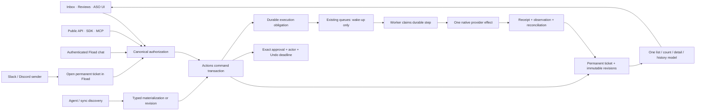

# Fload Actions — entrypoint and ownership plan

**Decision:** one durable Actions domain owns every proposed commitment, revision, decision and execution obligation. UI, APIs, chat, agents and queues are entry points into it. They do not own competing approval/status records.

**Source baseline:** [`f0b1af5fc5925d818be7d9b02b42b1fc54556ecc`](https://github.com/fload-ai/fload-platform/tree/f0b1af5fc5925d818be7d9b02b42b1fc54556ecc). Investigation was refreshed after the earlier audit of `63275b2f5`. The repository also contains an **uncommitted prototype** created during this investigation. Implementation is paused: the current deliverable is the complete architecture artifact. No prototype behavior below should be presented as deployed or as a completed release.

Status labels used below:

- **Proven prototype:** named local synthetic tests exercised the stated behavior, not a production rollout.
- **Written prototype:** candidate code exists; final integrated validation is incomplete.
- **Plan / closure required:** required design or remaining work, not a completion claim.

## The boundary in one picture

A queue job can disappear or be delivered twice without changing what was authorized. An incoming review or newly discovered locale can create work, but cannot silently join an approval that already exists.

## Ownership: which component is authoritative?

| Fact | Owner | Explicit non-owner |
|---|---|---|
| Ticket identity, structural parent, creator/source links | Actions | Inbox render/grouping code |
| Exact proposed fields/text/media and operation | Immutable Actions revision, with typed provider content | Mutable review draft, latest generated file, current provider listing |
| Selected batch membership | Immutable parent revision → child ticket + child revision links | A query for whatever is pending now |
| Approval, rejection, snooze, assignment, archive, external resolution | Organization-shared Actions commands/history | Per-user overlay or browser timer |
| Read/unread | Personal read watermark | Shared decision/execution state |
| Who acted, as whom, through which channel | Canonical authorization and immutable command attribution | Caller-supplied actor ID, Slack sender string, integration installer |
| Permission to auto-approve future eligible work | Explicit current policy revision | `agentMode`, scheduler configuration, “full agentic” UI text |
| Computation and generation runs | Existing Agents/runtime domain | A fabricated completed agent run used as a ticket parent |
| Durable dispatch, claim, retry/readback obligation | Actions execution/step/attempt | Redis job presence or browser memory |
| External credentials and one native I/O operation | Existing provider adapters | Core Actions or generic JSON payload dispatcher |
| Provider result and observed state | Native receipt + sealed typed observation | “Approved”, “queued”, HTTP timeout, unknown status |
| Measurement and business effect | Existing analytics/experiment domain, linked to the execution | A successful write acknowledgement |

## Current work-family crosswalk

The active design follows capabilities present in the source baseline. Historical ads/product vocabulary is migration evidence, not a reason to add new executors.

| Existing work | Final typed content and durable identity | Approval / completion meaning |
|---|---|---|
| Single review reply or replacement (`post_reply`) | `review_reply`; exact store/account/app/review; immutable customer-review snapshot and reply text; replacement pins baseline response identity | `perform` approval of this revision; success requires the requested review-response surface |
| Review batch (`post_batch`) | `collection`; permanent parent with immutable selected child revision membership; each reply remains a full ticket | Parent approval cannot authorize unseen replies; child outcomes remain individually visible |
| Listing edits, promotional text, descriptions, short descriptions, `create_locale` | `listing`; concrete ASC/Play targets and supplied/empty/unspecified field states | Approval authorizes exact fields for exact target; editable and live evidence remain distinct |
| `revert_experiment`, `aso_revert_listing` | A new listing/collection proposal containing frozen intended restoration values | New effect and new approval; never resolve “latest snapshot” at dispatch |
| `generate_locale`, `generate_listing` | `request`; explicit store/locale/input scope; same child identity can advance request → generated listing revision | `generate` approval permits drafting only; generated listing revision starts unapproved |
| `review_catch_up_30d` | Collection-domain ticket whose request revision pins window/store; output revision explicitly names generated child replies | Generation produces draft proposals; zero eligible reviews is an explicit no-work result, not a vanished batch |
| `generate_review_analysis` | `request`, linked to the actual `review_analysis` result | Completion proves a saved analysis artifact; no reply was posted |
| `wake_agent` | `request` / `run_agent`, with exact requested agent identity | Completion links the intended run, not any run on the same app; no publication authority follows from waking an agent |
| ASA: pause/enable campaign, change campaign budget, change keyword bid, create keyword, add/delete negative keyword | Seven closed `ads` operation variants; native account/campaign/ad-group/keyword scope and money/currency explicit | Exact revision approval; account resource fence; native acknowledgement and advertising-resource readback |
| Bid changes across several keywords | `collection` of individually typed ASA child proposals | Same exact membership rule as other packages; no generic bulk payload |
| Agent attention, connect-source, store-access-lost, ASO review-needed, onboarding recommendation, other supported advisory prose | `advisory` with finite subtype and named fields; source incident keeps its identity | Acknowledge/resolve prerequisite; never “approve” to imply provider execution |
| Fio experiment proposal | Existing experiment record + attributable creation/provenance | Internal proposal creation is not a store write or an invented generation executor |
| Screenshot recommendations | Current advisory behavior; any concrete generated asset stays linked to the real producing domain | No standalone `generate_media` executor is invented. Actual ASC App Clip media remains explicit typed listing content |
| Historical/retired types | Explicit migration classification and receipt/link preservation | Do not alias a retired name into modern ASA or infer old approval from an `executed` label |

## Entrypoint and closure matrix

Rows group entry points sharing the same authoritative boundary. Grouping does not permit a second mutation implementation.

| Entry point | Current source/caller surface | Final command/read ownership | Status and closure acceptance |
|---|---|---|---|
| Inbox page, keyboard actions, bulk selection, mission-control card, sidebar badge | `apps/web` inbox components; existing inbox/pending-actions routes | Canonical list/count/detail/history; strict Commands; server Undo | **Written prototype** by the main workstream. Close when browser reload/tab close before dispatch, stale bulk selection and keyboard flows all exercise the same server transaction; no delayed acceptance timer remains |
| Personal read/unread | Inbox/open-detail/notification interactions | Personal watermark keyed by member + ticket/attention version | **Written prototype.** Close with tests proving shared ticket version, decision, approval, snooze and parent membership do not change |
| Review page generation | `routes/assets/reviews.ts`, typed client, review hooks | Owned source read → durable proposal materialization; generation never publishes | **Proven prototype** for producer identity/CAS. Initial UI generation and metadata reuse still require end-to-end validation |
| Review edit, regenerate, reject, individual approval | Review page hooks and client | `revise(edit/iterate)`, `reject`, `approve`; exact displayed pin | **Written prototype**, with backend producer/approval proofs. Close with web checks and stale edit/approve concurrency tests through the UI |
| Review send-all/batch UI | Previous mutable draft ID list | Persist collection revision; submit exact selected child pins | Old duplicate HTTP doors removed in prototype. **Closure required:** every surviving bulk consumer must use a durable package, not asset ID or current draft query |
| Published review replacement | Review editor and public reply route | A new proposal pins baseline response ID and exact replacement text; separate perform approval | **Written prototype.** Close with existing-response drift and external-edit fixture tests |
| Public review respond URL | Published compatibility URL | Strict Actions approval adapter only; old text-only request refused | **Proven prototype:** missing pins/forged actor/stale version/foreign target rejected; replay and server Undo persisted |
| Review catch-up picker | Review UI and source-specific route callers | Create request; explicit generate approval; later parent revision lists unapproved replies | **Written prototype.** Close when every caller receives permanent action references and no old catch-up queue function can authorize publication |
| Initial sync/readiness catch-up seeder | Review sync, agent activation/readiness, backlog source | Deterministic occurrence materialization; source actor is system; no fake agent run | **Proven prototype:** unchanged request remains unchanged as new reviews arrive; declined occurrence retained; readiness/tenant gates |
| Review agent normal run | `agents/implementations/review-agent.ts` | Agent-run-attributed create/revise; optional exact policy approval | **Proven producer primitive**, broader run wiring written. Old action-mode dispatcher now refuses pinless legacy dispatch |
| Review scraping/sync draft helpers | `worker/scraping/helpers/draft-helpers.ts`; review processing | Stable review identity; changed source revision only when admissible; external observations retained | **Proven prototype** for changed source/policy/external resolution. Full worker/notification convergence remains to close |
| Old review reply drain/queued jobs | Existing scraping/queue paths | Resolve migrated alias to canonical execution; wake it; never create authority from a mutable draft | Runtime workstream has prototype cutover. Close with legacy queued job replay, missing-alias blocking and no duplicate provider effect |
| ASO apply / restore / locale endpoints | `routes/assets/aso*`, listing work staging | Typed create/revise/approve with exact native targets; restore is a new proposal | **Written prototype** in ASO workstream. Close with all route callers, generated drafts, media preparation and stale source tests |
| ASO scheduled and directed generation | ASO agent, locale hypothesis/change services, locale expansion worker | Typed request/package creation; run attribution; atomic adoption of generated output | **Written prototype.** Close when old request upserts cannot overwrite shown content and every requested locale has retained outcome/identity |
| Report/audit/recommendation → work | Backlog conversion, reports, audit recommendations, task catalog | Explicit immutable source version + create/revise command | **Plan / closure required** across remaining producers. A report revision is provenance, not publication authority |
| ASA provider-write routes | `routes/apple-search-ads/write-pipeline.ts` and routes | Exact typed proposals/collections; canonical approval | **Written prototype** in ASA workstream; native account fanout mapping and fixtures remain to close |
| Fload chat review/ASO/ASA proposal tools | `chat/tools/parity-tools.ts`, ASO/ASA factories | Carry established canonical authority; same producer boundary as HTTP | **Written prototype.** No actor reconstructed from organization or installer; tool result must distinguish proposed, accepted, refused and verified |
| Fload chat generic approve/reject | `chat/tool-registry.ts` | Exact strict Commands + canonical authority; no ID-only legacy service | **Written after last checkpoint, unvalidated.** Close with direct tool and MCP bridge regression coverage |
| Fload chat list/task ledger/detail | `getPendingActions`, `getTaskLedger`, `getAction` | Shared Actions read model, keyset cursor, exact current pins | **Written after last checkpoint, unvalidated.** Close by replacing old capped-ledger tests and proving oldest-page reachability |
| Public npm MCP tools | `packages/fload-mcp/src/tools/actions.ts`, `reviews.ts` | Same canonical API command contract; no text-only approval or client-side app filtering | **Written prototype**; public Actions tool tests belong to main workstream. Release/migration communication for older installed clients remains required |
| In-process OAuth MCP | `/mcp`, chat-tool bridge | Verified token/member context; preserve scopes through service calls; exact command schema validation | **Written prototype.** Session identity binds organization and scopes as well as user/client; final bridge tests remain required |
| Slack/Discord chat | Chat services using signed integration context | Read tools remain available; unavailable member authority returns explicit Fload link for writes | **Written prototype**, no installer impersonation. A verified account-link feature is outside current scope |
| Slack/Discord approve/reject/skip buttons | Signed webhook handlers | No workflow mutation; ephemeral permanent-ticket link for member authorization in Fload | **Proven prototype:** six signed callback tests. Do not claim “approved”, “rejected”, or “skipped” on transport acknowledgement |
| Agent health / source discovery / store access / ASO advisory producers | Agent attention, connect-source/report findings, store access sync, ASO discovery | Source-bounded advisory create/revise/acknowledge/restore | **Written prototype.** Repeated incident and recovery semantics require source-specific tests; no fabricated run parent |
| Agent activation, pause/resume, schedule preference and explicit manual run | Agents APIs, generic agent chat tools, scheduler | Existing Agents domain owns activation intent and actual run. If proposed as inbox work, use exact `run_agent` request ticket; never fabricate a run to provide parent identity | **Boundary to finish.** Record canonical initiating actor for direct commands; prove direct run controls cannot execute an unrelated proposed provider action |
| Blocked preparation and automatic unblocking | Agent-request unblock service, backlog stage blockers, readiness reconcilers | Recheck typed dependency facts; resume only the existing authorized obligation or materialize a new unapproved proposal | **Plan / closure required.** Recovery cannot manufacture a new approval, mutate the approved target or treat an unknown historical request kind as executable |
| Admin/managed task/catalog/backlog tools | Admin or impersonated contexts, source preparation | Same Commands, with actual administrator and acting-for identity recorded | **Plan / closure required** for remaining admin/batch shortcuts. Administrative access never relaxes content pins or provider uncertainty |
| Worker retry / operator recovery | Existing queue administration and worker lifecycle | Durable execution claim, retry/reconcile command, exact attempt evidence | **Written prototype.** Queue resubmission cannot mint approval or clear uncertainty; bounded crash/lease tests required |
| Journal, notifications, review metrics, history links | Activity feeds, draft-ready notices, latency/uplift, report/experiment links | Read Actions decision/execution history and retained aliases | **Incomplete.** Stats projection was just written; draft-ready notification still has legacy draft reads. Final migration must preserve historical references and remove stale status readers |
| Translating text, reports, memory, pricing/metric reads, unrelated external tools | Existing domain utilities | Keep their own domain API/authorization; link resulting committed work when appropriate | **Unchanged by this plan.** Not every utility call becomes a ticket or a new inbox count |

Baseline source references: [inbox composition](https://github.com/fload-ai/fload-platform/blob/f0b1af5fc5925d818be7d9b02b42b1fc54556ecc/apps/api/src/services/inbox.service.ts), [review routes](https://github.com/fload-ai/fload-platform/blob/f0b1af5fc5925d818be7d9b02b42b1fc54556ecc/apps/api/src/routes/assets/reviews.ts), [chat registry](https://github.com/fload-ai/fload-platform/blob/f0b1af5fc5925d818be7d9b02b42b1fc54556ecc/apps/api/src/chat/tool-registry.ts), [ASO generation](https://github.com/fload-ai/fload-platform/blob/f0b1af5fc5925d818be7d9b02b42b1fc54556ecc/apps/api/src/services/aso/locale-expansion.ts), [ASA staging](https://github.com/fload-ai/fload-platform/blob/f0b1af5fc5925d818be7d9b02b42b1fc54556ecc/apps/api/src/chat/tools/asa-work-staging.ts), [canonical authorization](https://github.com/fload-ai/fload-platform/blob/f0b1af5fc5925d818be7d9b02b42b1fc54556ecc/apps/api/src/plugins/auth.ts). These links show the baseline, **not unpublished prototype changes**.

## Exact command and permission contract

All mutations use a UUID idempotency key and server-derived principal. Mutating an existing ticket additionally requires `actionId`, `expectedVersion` and `expectedRevisionId`. Versions travel as canonical decimal integer strings; JavaScript numbers cannot safely represent database bigint counters. Same key + same canonical request replays the original receipt. Same key + changed content/pins is a conflict.

| Command | Additional exact input | Required authority / transition | Durable result |
|---|---|---|---|
| `create` / trusted materialize | Occurrence `creationKey`, asset/domain/parent, named typed revision and source references | Current domain write authority, or narrowly scoped internal producer; owned asset and source verified | Permanent identity + sealed first revision + command; equal producer replay retains identity |
| `approve` | Scope `generate` or `perform`; required evidence surface; optional explicit selected child pins | Current member/credential authority, open current proposal, no conflicting execution; parent selected membership exact | Approval revision/actor + durable execution + server deadline in one transaction |
| `undo` | Exact approval ID, or exact selected child pins each with approval ID | Same domain authority; database time before deadline; current approval; execution not started and no unresolved write | Revocation + cancelled execution + open decision; original approval/history retained |
| `revise` / `edit` | Full typed new draft | Open current proposal; no unsettled/unresolved effect; target continuity | New sealed revision on same ticket; no inherited approval |
| `revise` / `iterate` | Durable nonempty instructions | Same current pin and permitted generation capability | Explicit revise-scope approval/execution; output adoption does not inherit publication authority |
| `reject` | Optional reason | Open proposal; no in-flight/uncertain write | Shared declined decision; content and identity remain |
| `acknowledge` | Optional reason | Open advisory only | Shared acknowledged decision; no provider effect |
| `snooze` / `unsnooze` | Future server-validated timestamp for snooze | Same domain authority; eligible shared lifecycle | Shared visibility deadline and history; personal read untouched |
| `assign` | Member ID or null | Same domain authority; target is a current member of the same organization | Shared owner history; does not change creator/approver |
| `archive` | Exact ticket pin | Same domain authority | Shared placement fact; cannot erase unresolved execution or permanent history |
| `restore` | Exact ticket pin | Allowed closed/archived placement transition only; no unsettled/uncertain effect | Explicit reopen/unarchive, never implicit reapproval |
| `supersede` | Exact successor ticket ID and optional reason | Same-organization successor; eligible transition; no hidden unresolved effect | Persistent successor link and history |
| `retry` | Exact execution ID | Existing exact unrevoked approval; known retryable safe state; uncertain writes refuse blind retry | Reschedules existing obligation, not a new approval |
| `reconcile` | Exact execution ID | Existing exact approval; reconcilable state | Schedules provider readback, preserving uncertainty until evidence resolves it |
| `grant_policy` | Exact expected active policy revision (including null), asset, finite rules/version | Organization manager; machine credential requires policy-management and affected-domain scopes; owned live asset | Attributable grant; replacement revocation + grant atomic |
| `revoke_policy` | Exact policy revision ID | Same policy-management authority | One-way revocation marker with actor/command; no max-revision inference |
| `resolve_external` (internal only) | Exact sealed evidence revision ID | Trusted source/adapter; same ticket/target; authoritative observation; no prior approval/active execution | Handled-externally with evidence, no invented approval |
| Mark read/unread (separate personal operation) | Observed attention version and personal intention | Canonical individual member only | Personal watermark; no lifecycle/version/approval mutation |

**Domain scopes:** reviews and review batch/catch-up/analysis use `write:reviews`; listings/localization/restoration use `write:aso`; the seven ASA effects and their collections use `write:ads`; generic agent requests and advisories use `write:agents`. Any-scope admission to the generic command route is only an initial gate: the transaction must still resolve and enforce the actual target's domain. A `write:agents` key does not thereby gain review/listing/ads authority.

**Reads:** the prototype deliberately keeps full cross-domain Actions reads under `read:agents`. Domain-specific review reads can return review ticket pins under `read:reviews`. Either document that scope contract for clients or implement a tested domain-filtered Actions read scope; do not admit any one read scope and expose every domain. Mixed-scope child collections must be checked per selected child.

**Identified permission closure:** prototype policy management currently checks manager + `write:agents`, while subsequent policy execution also checks the affected domain scope. Final grant validation must enforce both at grant time as well, so an unusable authorization is not reported as a usable automatic policy. Admin impersonation revocation, OAuth scope handling and asset soft-deletion visibility also need end-to-end closure tests; a schema constraint cannot authenticate a caller by itself.

## Attribution and history: never merge these roles

| Actor/source | Required recorded identity | What it may mean |
|---|---|---|
| Member session | Actual user FK, name snapshot, organization, web/chat channel | Human command, within current membership |
| Fload API key | API-key FK + owning user FK + subject/name snapshot + API channel | Credential-attributed command; key expiry/revocation/scope rechecked |
| OAuth MCP | Verified delegated user + MCP channel + current granted scope context | Same user authority through MCP; never organization-only fallback |
| Administrator acting for someone | Actual administrator plus distinct `actingForUserId` | Do not replace approver with impersonated user |
| Agent | Exact agent-run FK and agent channel | Proposal/generation provenance; publication only through an explicit allowed policy |
| Policy | Exact policy revision, plus immutable human/credential grant command | Bounded delegated approval, rechecked before effect |
| System discovery/recovery | Closed source label/subject, worker channel, relevant typed source/evidence | Discovery or reconciliation, not guessed human consent |
| Slack/Discord | Verified integration + external sender as origin only | Current product has no member mapping: no approval authority |
| Historical unknown actor | Explicit unresolved historical attribution in migration record | Never invent a user FK or grant based on an old free-form string |

History retains command outcome, actor/channel, before/after ticket snapshot, requested/current pins, selected membership, approval/revocation, attempt/receipt/observation links and parent/successor relationships. “Created by”, “assigned to”, “approved by”, “executed by”, and blocker responsibility are independent facts. User erasure must have an explicit FK/snapshot-scrubbing policy; history cannot accidentally become a second undeletable personal-data store.

## Provider and queue ownership

- Core owns decisions, ordering and claims; it cannot import provider SDKs or know provider payload bags.
- The compiler consumes a sealed approved revision and emits finite native steps. Provider-specific fields are named columns and closed contracts. The queue carries an execution identity/wakeup, not a second source of content authority.
- The native adapter resolves the exact frozen connector/account target, prepares authentication, then rechecks the durable claim immediately before the single target I/O. A session refresh that outlives its claim must not allow a stale send.
- ASC app-info, editable-version, live/editable promotional text and App Clip operations are separate native steps when the provider makes them separate effects. App Clip source bytes, checksum/storage identity and reserved upload operations are frozen; chunk ranges are not invented.
- Play updates send PATCH only for approved supplied fields. Creating a locale requires the complete supported field set. Edit creation, listing write, commit, inspection-edit creation/readback and cleanup have explicit durable identities. Editable verification is not a live-storefront claim.
- ASA uses exact native account/campaign/ad-group/keyword scope; campaign account fanout is mapped explicitly, not guessed from connector defaults.
- Provider acknowledgement before receipt persistence is an uncertain outcome. Recovery reads back the exact target and content before retrying. Late evidence is appended under its original attempt identity; it does not rewrite a previous uncertain record.
- Queue/process maintenance stays in the existing worker lifecycle under its distributed coordination. No polling loop is added to horizontally replicated Fastify API startup.

## Completion gates and unresolved leftovers

| Gate | Required closure evidence | Current state |
|---|---|---|
| Source census | Re-run mechanical writer/caller search after final cut; classify every remaining old writer/read consumer and every supported operation | Baseline census exists; prototype changed many paths, so final closure census is pending |
| Rejection migration | Import exact rejection snapshots/attribution into declined tickets; unchanged source stays suppressed; changed source can produce explicit new revision | **Open.** Existing rejection-only receipts are migration blockers; current suppression read must remain until mapped |
| Historical receipts and links | Fixture round-trip for each observed supported shape, old synthetic batch aliases, published replies, failures and unknown outcomes | Partial prototype mappings; not a complete production-data proof |
| Retained obligation visibility | Ticket stays addressable within its organization after connector loss, entitlement loss, age threshold or asset soft-deletion; blocked permissions remain explicit | **Open:** prototype `actionVisible` currently filters soft-deleted assets. Final read policy must retain authorized ticket/history access without restoring access to the deleted asset itself |
| UI permission projection | Displayed command affordances incorporate principal/domain permission as well as lifecycle; final transaction still rechecks both | **Open:** current summary derives allowed commands mainly from lifecycle. Server refusal is authoritative, but UI permission hints need completion |
| Notifications and metrics | Draft-ready notifications, review metrics, journal/report links read permanent work/evidence; no stale mutable draft dependency | Notification read remains; new stats projection unvalidated |
| Generated output handoff | Same identity from request → draft; all-or-nothing child/revision/membership adoption; failed/empty child retained | Several isolated proofs exist in runtime workstream; all producer handoffs not yet certified |
| Settings policy | Grant/revoke CAS/retry and manager/domain permission tests; old full-agentic flag cannot grant publication | UI/API prototype exists; final settings tests pending |
| UI/browser behavior | Real reload/tab-close, Undo expiry, stale approval, edit-vs-approve, bulk handoff and accessibility tests | Backend behavior has focused proofs; final browser verification pending |
| Native boundary compatibility | Exact fixture tests for current ASC/Play/ASA request/response forms; claims after auth preparation; upload/native receipt crash cases | Focused native tests exist; no live provider validation claimed |
| Public contract migration | SDK/MCP versioned release notes and explicit behavior for old ID/text-only callers | Pending; compatibility cannot silently infer unseen approval pins |
| Final release quality | Complete API/web typechecks, repository lint/tests, migration gates, reviewed PR | Not complete; implementation paused; no deployment authorized |

## What has actually been proven

The entrypoint workstream's last completed checkpoint passed **92 focused unit tests** and **21 isolated integration tests**. The unit set includes canonical authorization, review contracts/compiler behavior and six signed Slack/Discord button cases. The integration set covers concurrent durable review creation, source-change revisions, policy criteria/replay/revocation effects, external resolution evidence, exact HTTP approval/Undo/idempotency, and catch-up identity/readiness behavior.

Those numbers overlap earlier targeted runs and are **not a repository-wide pass**. The last narrow typecheck predated the most recent generic chat/read/stat edits and still had two unrelated ASO unused-import errors. No final integrated API/web typecheck, complete migration certification, browser end-to-end run or production deployment is claimed.

The plan is ready to review as an architectural boundary proposal. The unfinished prototype remains an explicitly separate implementation appendix; it should resume only after the user authorizes implementation.
