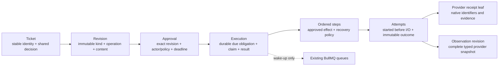
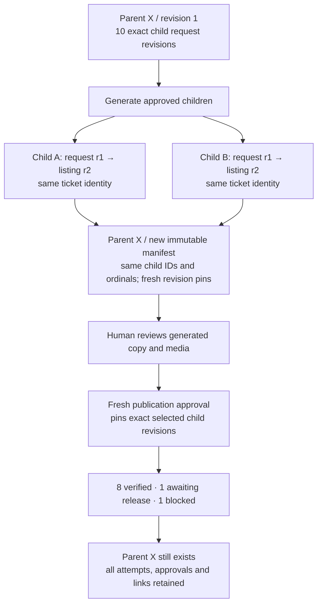
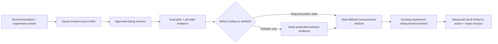

# Execution, providers, generation, and cutover

**Documentation status — 16 September 2026.** This is the recommended end state, with an explicit account of the partial implementation used to test the design. Repository baseline: `f0b1af5fc5925d818be7d9b02b42b1fc54556ecc` in `fload-ai/fload-platform`. The prototype is uncommitted, not deployed, and is not a completed platform cutover. Work on that prototype has paused. No live provider writes were used for validation.

The design keeps one permanent ticket, one immutable description of each proposed change, and one exact approval. Its execution record is a durable obligation to complete or reconcile that approval. BullMQ wakes workers; it does not decide what was approved or whether it succeeded.

## 1. Where control stops

| Fact | Fload controls | Provider controls or must be observed |
|---|---|---|
| Proposal | Exact target, immutable copy/media, author, baseline, content revision | Current store/account facts captured when preparing the proposal |
| Approval | Authorized actor or policy, exact revision and member selection, Undo deadline | Nothing: approval alone does not change a provider |
| Dispatch | Committed attempt, current authorization, resource exclusion, one admitted request | Whether a request arrives or is applied |
| Acknowledgement | Preserving the exact response and native identifiers | Response semantics, asynchronous processing, publication rules |
| Verification | Complete readback, target equality, comparison algorithm, recorded evidence | Editable state, public state, release timing |
| Measurement | Scheduling analysis, preserving the observation window and methodology | Traffic, ranking, conversions, reporting lag and external changes |

“Generated,” “provider acknowledged,” “verified editable,” “verified live,” and “measured” are different facts. A Google Play edit read can prove editable listing content; it cannot establish that the public listing is live. A successful Apple metadata update can still require an app release. Missing or unknown provider states must never mean success.

A complete matching observation after a definitive rejection can establish **handled externally**. It must not manufacture a claim that Fload performed the write. An uncertain write followed by a mismatch remains uncertain: an earlier request might still arrive.

## 2. The normalized execution model

The core model has fixed responsibilities. Provider columns belong to provider-specific contracts and receipt leaves, not a general payload bag.



| Record | Fields that matter to execution | Why it exists |
|---|---|---|
| `action` | organization, asset, parent, current revision, current approval, decision, owner, version, attention version, snooze, archive | One stable object and organization-shared lifecycle |
| `action_revision` | action, kind, operation, purpose, revision number, baseline, generated-from revision, authoring command, digest, seal | Immutable exact subject of review; a request can become listing content on the same ticket |
| `action_membership` | parent revision, child action, child revision, ordinal | Permanent selected membership; each parent revision pins the exact child content |
| `action_approval` | revision, actor/policy attribution, authorization scope, required surface, creation time, Undo deadline | What was authorized, by whom, and when work may start |
| `action_execution` | approval, phase, next run, next step, schedule generation, claim generation/token/expiry, resource guard, plan completeness, writes-closed time, hold reason, result, settlement time | Recoverable obligation after request acceptance |
| `action_execution_step` | execution, ordinal, exact content revision, closed step kind, adapter version, required surface, verification timing, recovery mode/version, retry limits and delays | Individually accountable effect or internal generation |
| `action_execution_attempt` | step, ledger number, kind, claim fence, start/finish, exact subject attempt, bound transport/run, result and evidence/output references | Proves admission occurred before I/O; keeps every attempt and late result |
| `action_resource_guard` | closed scope, provider, canonical remote application or advertising account, holder execution | Serializes conflicting writes independently of connector aliases |
| `action_command` + targets | idempotency, actor, channel, accepted/refused outcome, expected and resulting state | Attributable history and replay-safe commands |
| `action_read` | user, action, read attention version | Personal attention only; never approval, snooze, iteration, or execution |

The provider-neutral TypeScript execution contract is in `packages/core/src/actions/execution.ts`. The current prototype schema is `packages/database/src/schema-actions.ts`, with generated migrations `0146_durable_actions.sql` and `0147_action_progress.sql`. These are paused draft implementation sources. The published current SQL now bundles those exact migrations; the field catalog was exported from their isolated test-database application. Neither represents a production migration or completed cutover.

### Closed execution states

- Phase: `ready | claimed | verification_due | uncertain | blocked | settled | cancelled`.
- Result: `generated | verified_live | verified_editable | handled_externally | acknowledged_only | failed | cancelled`.
- Required evidence surface: `provider_response | editable_listing | live_listing | review_response | advertising_resource | internal_artifact`.
- Write outcome: `acknowledged | known_not_applied | uncertain`.
- Readback outcome: `matched | matched_external | mismatch | unreadable | known_not_applied`.
- Internal output: exact revision, review analysis, agent run, or the closed catch-up no-work reason `no_eligible_reviews`.

Failure/retry facts are explicit. `known_not_applied` distinguishes failure before dispatch, provider rejection, terminal non-application evidence, and an expired uncommitted edit. `uncertain` distinguishes lost transport, expired claim, and invalid response. Unknown adapter versions or unsupported native states fail closed.

## 3. Acceptance, execution, and recovery

```mermaid
sequenceDiagram
  participant UI as Client
  participant DB as Actions transaction
  participant Q as BullMQ
  participant W as Worker
  participant P as Provider
  UI->>DB: Approve exact revision + idempotency key
  DB->>DB: Lock targets; verify scope; persist approval + execution + due time
  DB-->>UI: Accepted; exact server Undo deadline
  DB-->>Q: Best-effort wake-up after commit
  Q->>W: organization ID + execution ID + schedule generation
  W->>DB: Lock actions then execution; validate deadline and permission
  DB->>DB: Acquire resource; persist claim and started attempt
  DB-->>W: Exact immutable dispatch grant
  W->>P: One native effect
  P-->>W: Native response, or uncertain transport
  W->>DB: Atomic receipt + outcome + next durable obligation
  W->>P: Read back exact target when needed
  W->>DB: Persist complete observation and truthful result
```

The recommended lock order is command idempotency lock, all involved action IDs in lexical order, then executions and provider resources. A worker first resolves scope without a lock and then acquires the same ordered action locks. Structural parents and selected children are included when generation can change a parent manifest.

A claim lease is a fence for Fload's state transitions, not a claim that an external HTTP request was cancelled. A stale worker can append immutable evidence. It cannot change a newer ticket, install generated content, extend a current plan, or claim settlement.

### Recovery matrix

| Situation | Required next action | Must not happen |
|---|---|---|
| API commits approval; Redis enqueue fails | SQL recovery finds the still-due execution and enqueues it | Lose work because the request returned |
| Duplicate queue delivery | One worker admits the effect; others observe current claim or stale generation | Duplicate physical write |
| Worker dies before I/O after attempt commit | Treat expired attempt as uncertain; inspect exact provider target | Assume the write never began |
| Provider applies write; confirmation transaction fails | Recover by provider readback and persist evidence | Blindly repeat the write |
| Provider response is malformed or incomplete | Persist uncertainty; perform supported readback | Treat HTTP success as verified content |
| Readback mismatches an uncertain request | Keep uncertainty or require conclusive native non-application evidence | Infer safe retry from a current mismatch |
| Provider definitively rejects request | Record exact rejection and retry disposition | Spend retries on permanent rejection |
| Explicit reconcile command | Schedule readback of prior effects | Authorize a fresh write |
| Explicit retry command | Require current pinned approval, definitive non-application, retryable disposition; extend bounded budget | Reopen a terminal execution or replay successful steps |
| Late successful worker response | Append evidence; current claim decides adoption | Overwrite a newer outcome |
| Permission or policy revoked | Block new effects; allow observation of already-issued effects | Lose accountability for an earlier request |
| Some batch children succeed | Retain parent and every child; retry only eligible failed children | Recreate batch identity or resend successful children |
| Internal generation output committed before crash | Recover exact sealed output from durable run lineage | Run the model a second time merely because acknowledgement was lost |

### Resource exclusion

Store writes use a global canonical `(provider, remoteApplicationId)` key. The account field is absent from this key so an API issuer and a browser connector cannot bypass each other when writing the same app. The approved content still pins a provider account, and dispatch must validate that account binding.

Advertising writes use `(provider, providerAccountId)`. This intentionally starts with coarse account serialization. Narrower campaign/resource locking requires a separate correctness review of provider-wide mutations and overlapping operations; it should not be guessed from a local connector ID.

The guard remains held while any admitted write could still be in flight. It can be released once effects are conclusively closed even when public verification is pending. Definitively blocked executions with no unresolved I/O may release it without claiming success.

## 4. BullMQ stays; the proposed generic job table is withdrawn

The earlier `action_job` design combined obligation, queue transport and attempts. It is withdrawn. The audited repository does **not** contain a standalone SQL `job` table to delete. The cleanup targets are actual pending-action dispatch fields, duplicate capability receipts/authority, per-user overlays and old delivery paths. Existing `agent_run` computation and domain accounting remain owned by Agents.

The current source declares 15 central queues in `services/queue.ts` plus `agent-execution` in `agents/scheduler.ts`. The relevant ownership inventory is:

| Existing lane | Keep / change for Actions |
|---|---|
| `inboxIteration` (`inbox-iteration`) | Reuse the worker pool for canonical execution wake-ups. Replace old mutable inbox-iteration payload authority with durable references. |
| `sync` | Reuse repeatable recovery and existing domain verification/measurement scheduling; remove competing inbox lifecycle updates. |
| `scraping` | Preserve account groups, global capacity and browser/session locking. A readback or reply attempt must not bypass this capacity boundary. |
| `agent-execution` | Keep actual agent computation and `agent_run` identity; Actions links the authorized run and generated output. |
| `reviewSync` (`review-sync`) | Existing scheduler/event compatibility queue has no dedicated worker. It is not a new reply execution owner. |
| `setup`, `syncReports`, `valuation` | Keep their current setup, sync-report and valuation domains. No inbox lifecycle storage is moved into them. |
| `report`, `apptweakReport`, `reportPdf` | Keep generation, provider report work and PDF capacity separation. Generated recommendations use the canonical work producer boundary. |
| `apptweak`, `apptweakScheduler` | Keep market-data throughput and scheduling ownership. A queue completion does not approve a proposed listing. |
| `email`, `alerts`, `support` | Keep communications and support work. Notification delivery is not provider publication evidence. |

Queue names and capacity are implementation facts to recheck before release, not a fixed architecture quota. Preserve the existing BullMQ grouped-job orphan fix; recovery must use supported queue APIs, never repair Redis internals or assume an unknown queue state proves non-application.

The end state uses the existing `inboxIteration` worker pool for `action-execution` wake-ups and the existing `sync` pool for a repeatable `action-execution-recovery` sweep. The prototype registers a 60-second recovery job and a startup recovery pass in the worker, not the API process.

The complete delivery envelope is:

```ts
type ActionExecutionWakeup = {
  organizationId: string;
  executionId: string;
  scheduleGeneration: number;
};
```

No copy, provider target, approval, browser session, or mutable business command travels in that job. Workers reload the authoritative records.

The due scan uses keyset pagination over exact database timestamps and execution IDs. Reading or enqueueing a due row never consumes the obligation. It remains due until a transactional state transition changes it. Queue job IDs include schedule generation; completed/failed delivery IDs cannot permanently suppress SQL recovery.

Source: `services/actions/dispatcher.ts`, `queue-dispatch.ts`, `execution-repository.ts`, `services/worker/process-action-execution-job.ts`, and `worker.ts` in the API package.

## 5. Provider recipes and adapter ownership

Core decides whether an effect may run and what evidence is sufficient. A provider adapter owns native request construction, exact response parsing, native target binding, and readback semantics. Provider packages own native endpoints and transport details. No adapter can silently run a second mutation as a fallback.

| Capability | Explicit effects and evidence |
|---|---|
| ASC listing metadata | Separate app-info localization and version-localization upserts. Editable and live promotional-text surfaces have separate pinned target pairs. Readback compares every approved field on the appropriate surface. |
| ASC review reply | Exact review/source snapshot and send/update intent. One supported API or browser mutation; updates must not hide a delete/create pair. Known locally changed source review prevents dispatch. Readback verifies exact response text/state/target. |
| Google Play review reply | One reply mutation with exact review and account. Readback must be complete and strictly parsed. |
| Google Play listing | Create owned edit → PATCH exact existing listing fields or PUT complete new locale → commit with `ERROR_IF_IN_REVIEW` → create separate inspection edit → read exact listing and persist observation → delete inspection edit. Inspection is never committed. It proves editable state only. |
| ASC App Clip | Freeze experience/version/localization, exact subtitle if creating, immutable image bytes and digests before approval. Optional exact incomplete-header deletion → localization creation if needed → reserve header → persist exact returned upload manifest → individually durable byte chunks → commit. Final readback verifies the approved media/target. |
| Apple Search Ads | Separate campaign status/budget, keyword bid/create, and negative-keyword create/delete effects. Decimal values remain exact strings. Complete native pagination is required; a mixed success/error result is not blanket success. |
| Meta Ads | Existing read integration is not a supported Actions write capability. Unused package write methods do not establish a tested publication path. |

The prototype has 26 closed step kinds: ten ASC, six Google Play, six Apple Search Ads, and four internal steps. Pause and activate are two approved operations implemented by one closed campaign-status step kind. This enum is a dispatch vocabulary, not a configurable workflow engine.

### App Clip dynamic-plan rule

A reservation response supplies dynamic upload operations. Planning must not fabricate future URLs, headers, offsets, or lengths.

1. The approval contains exact immutable bytes, digests, target, and requested result.
2. The reserve attempt is committed before its request.
3. Its receipt, recognized upload manifest, chunk steps, and reserve outcome are persisted in one transaction.
4. Supported chunks are an explicit bounded contract: encrypted signed URL, PUT method, recognized image content type, byte offset/length, and originating reservation attempt.
5. The complete chunk sequence must cover the exact bytes contiguously before commit is allowed.
6. `planComplete` remains false until all mandatory effects exist. Reserve acknowledgement alone cannot settle or release the resource.
7. If that transaction is lost, recovery must reconstruct the exact reservation from supported readback evidence. If the provider cannot supply it, the item remains visibly blocked/uncertain; no guessed upload or second reservation is authorized.

Unknown upload methods or headers are unsupported before I/O. Signed URLs are not exposed as public ticket content.

### Adding another provider

A new provider should add its closed typed content/target leaf where the approved facts differ, native receipt/step contracts where needed, transport binding, request/readback adapter, and a finite compiler mapping. It must supply tests for target identity, native response ambiguity, retries, publication semantics, and account/resource conflicts.

It should not add provider branches to ticket identity, personal read state, command idempotency, revision history, generic claim logic, or queue infrastructure. Adding an effect without conclusive readback is permitted only with an explicit manual-reconciliation outcome, not invented success.

## 6. Localization: one identity through every stage



A generation approval does not authorize publication. Generation binds an exact input revision and a durable agent run before model work. Output is staged as an immutable revision with exact lineage. Its provider baseline and proposal must commit together.

For individual child generation, the attempt captures the structural parent's input revision under the parent lock. Successful adoption creates an attributed parent manifest revision that replaces only that child's pin while retaining the same IDs and ordinals. Compatible sibling generation can rebase; a manual parent change or active parent generation conflicts. Old sibling approvals remain attached to their original content.

For a parent iteration, all generated child revisions and the replacement parent membership are staged first. Adoption is atomic only if every original child is still current and unapproved, the parent is unchanged, and no conflicting execution exists. One concurrent edit prevents the entire staged batch from becoming current. Staged outputs remain inspectable.

A new locale opportunity creates new work or an explicit new manifest revision. It cannot silently join an earlier approval.

### Proposal preparation

The partial ASO producer prepares exact field changes and fresh provider targets before materialization. ASC proposals pin the app-info and version localization resources, including separate promotional-text surfaces where relevant. Unknown baseline fields remain unreadable; they are not converted to empty strings.

App Clip preparation is read-only: determine the exact target, verify source and header states, download only a recognized image source, validate bounded bytes/dimensions, persist content-addressed immutable storage, then expose approvable content. Existing absent headers and exact incomplete headers have distinct repair semantics. Deletion requires the exact approved incomplete resource.

Generated listing copy retains the existing keyword-removal authority check. An operator's explicit instruction to remove a term must remain distinguishable from unintended model omission.

## 7. Measurement and experiments

This is a required end-state flow; the new execution path has not completed the existing ASO experiment handoff.



Execution should not report lift or experiment success. The domain handoff needs an idempotent projection from verified execution evidence to existing experiment records, with exact recommendation, variant, baseline, applied field set, timestamps and receipt provenance. The first moment an edit becomes measurable must be specified per provider and experiment type.

Acceptance must cover delayed release, partial locale success, externally handled work, manual provider edits, revert identity, duplicate verification, and a crash between verification and measurement handoff. Existing experiment schedulers remain the transport. Do not introduce a second generic job engine to fill this gap.

## 8. What exists, what is tested, what remains

| Area | Prototype status | Required before completion |
|---|---|---|
| Core execution and SQL adapter | Implemented and tested on focused cases | Full repository checks and independent integration review |
| Durable SQL due scan and existing queues | Implemented; queue adapter tests and real DB due-obligation checks | Worker restart/Redis loss operational drill and complete producer census |
| Review native effect/readback | Implemented; source-change, crash and concurrency cases passed | Complete legacy-test migration and provider fixture coverage review |
| Listing/ASA native adapters and compiler | Implemented by parallel work; tests exist | Final integrated validation and provider completeness review |
| App Clip read-only preparation | Implemented; strict source/media unit cases passed | Real adapter/session fixture review; current preparation support must match every promised connector path |
| Stable ASO listing packages | Implemented; three real DB package/approval/request cases passed | Producer alias convergence, partial-package retry behavior, all old-path parity tests |
| Generation baseline/output recovery | Implemented; generation and parent/child DB cases passed in earlier focused runs | Credit attribution, field-selection semantics, remaining producer cutover |
| Catalog/backlog/report locale requests | **Still on old generation path** | Replace old request rows and ASOLocaleExpansion producer with typed Actions without losing consent, billing or routing |
| ASO experiments/measurement | **Incomplete handoff** | Attributable idempotent projection from verified Actions to experiment measurement |
| Legacy data and queued work | Migration/alias mechanisms in the paused prototype | Full dry-run/rehearsal, blockers resolved, old writer removal, receipt/link reconciliation |
| Deployment | None | Separate reviewed rollout; not authorized by this document |

### Concrete remaining contract and producer work

The old catalog localization path carries more than a locale list. Its replacement must preserve:

- Selected and excluded metadata fields.
- Routing between immediate metadata updates and full locale creation.
- Explicit overwrite acknowledgement for existing locales.
- The exact catalog card/definition and origin: chat, catalog, backlog or report.
- Durable stage-agent/run provenance.
- Credit affordability checks immediately before admission and actual token billing attributed to the correct origin.
- Source availability, capability readiness, locale validation and exact idempotency.

The current `createLocaleGenerationWork` prototype carries store, locales, operator instructions and generation-only approval. It is not yet a complete catalog replacement. Premium entitlement gating alone does not establish equivalent credit accounting. A closed field-selection/routing contract is needed; do not restore the old open params object.

System/report discovery may create attributed requests. It must not forge a human grant from `createdBy: null`. Automatic generation requires an explicit current policy or separately justified internal authority, with durable scope and provenance.

Current source locations requiring cutover:

- `services/capability-catalog.service.ts`: `createLocalizeTask`, `createLocalizeRequestRow`, `startLocaleGeneration`, `startBacklogGenerationRequest`.
- `services/backlog/stage-on-completion.ts`: report-to-generation handoff.
- `services/backlog/convert-locale-candidates.ts`: derived opportunity/request identity.
- `services/worker/process-aso-locale-expansion.ts`: old generation worker.
- Related experiment revert/measurement and pending-action producer/consumer references found by the final writer census.

### Additional correctness items to close

1. **Migration/producers must converge.** Stable new creation keys must resolve existing migrated aliases and source links. Re-discovery after migration cannot create a second ticket for the same work.
2. **Partial package recovery is explicit.** A producer retry that discovers some already-materialized members must either recover the exact existing package or append a separately attributed new manifest. It cannot silently replace membership.
3. **Play creation must observe existence.** The new locale generation path needs fresh complete evidence about an existing editable locale and explicit overwrite scope; it must not infer absence from a requested operation.
4. **Field states survive generation.** Verify that omitted, dismissed, unchanged and unreadable fields keep their intended semantics when converting generated copy.
5. **API result language stays truthful.** Queued means a durable accepted execution, not published. Refused approval must not be returned as an accepted publication.
6. **Retired entry points cannot bypass Actions.** Existing queue jobs only wake an alias-mapped approved execution. An unmapped job is a migration blocker, never a source of synthesized approval.
7. **Blockers are durable and visible.** A failed legacy delivery log or queue TTL is not sufficient accounting. Preflight must enumerate unresolved jobs and records before writer retirement.
8. **Complete the old test migration.** Tests that previously expected inline provider writes must assert durable acceptance, exact approval, no bypass, and eventual evidence through the worker.

## 9. Validation evidence and release acceptance

The last active validation completed after implementation paused: **9 of 9 real PostgreSQL integration tests passed** across `actions-execution.test.ts` and `actions-listing-work.test.ts`. These used isolated test databases created from the complete migration chain and controlled provider ports.

Covered in that run:

- A known source-review edit causes zero provider requests.
- Native review response/readback evidence survives a confirmation crash.
- Two workers cannot issue the same admitted effect.
- A provider success followed by database failure recovers by readback.
- Late evidence does not rewrite a newer settlement.
- Listing due obligations does not consume them.
- Concurrent listing discovery creates one stable parent and stable children with immutable baselines.
- Batch approval pins exact content and rejects stale changes.
- Locale request retries preserve identity and authorize generation only.

Earlier focused runs also passed:

- Five parent/collection generation integration cases, including ten-locale concurrent sibling completion, manual parent conflict, and all-or-nothing child adoption.
- Three generation integration cases, including atomic baseline/proposal staging and recovery after committed output.
- App Clip preparation, target parsing, execution codec and retired listing writer unit suites.
- Core execution tests for exact Undo boundaries, stale delivery/claims, unsupported readback, definitive non-application, dynamic plan completeness and external completion.

These are bounded results. They do not mean the complete repository suite, migration of live data, every provider capability, or end-to-end product cutover has passed. No live publication test was performed. The active full API typecheck was owned separately and should be reported from its actual result.

### Required final acceptance

| Scenario | Required assertion |
|---|---|
| Retry every accepted command | Same identity and result; no duplicate approval/run/write |
| Concurrent approval, iteration, revoke, Undo | Exactly one valid state transition; stale caller sees current state |
| Redis unavailable or lost | Accepted SQL obligations remain visible and are re-enqueued after recovery |
| Crash at each boundary | Before attempt, after attempt, after provider acceptance, before receipt commit, after output staging, before adoption: no lost work or blind replay |
| Unknown/partial provider response | Explicit uncertainty or blocked state, never approved/succeeded fallback |
| App Clip reserve transaction lost | Recover exact native reservation or remain uncertain; no guessed chunk plan |
| Play inspection flow | Commit and inspection are separate; readback precedes cleanup; public-live claims require separate evidence |
| New review arrives during approved batch | New work does not join old selection; parent identity remains |
| Ten localization children partially complete | Stable membership, truthful partial progress, fresh approval for generated content |
| Existing locale/source changes | Reprepare/reapprove or record external handling with complete evidence |
| Provider account/connector changes | Exact account binding retained; canonical resource fence cannot be bypassed |
| Migration replay | Same stable IDs and aliases; all historic receipts/links preserved; incompatible records become explicit blockers |
| Legacy queued job after cutover | Wake existing authorized execution only; otherwise durable migration refusal |
| Verification-to-measurement crash | Exactly one attributable handoff; no false measurement start |
| Full product routes | Web, API, chat, MCP, policies and notifications use the same commands and evidence |
| List/count/read | Shared predicates, unbounded traversal through pagination, personal read cannot change lifecycle |

## 10. Cleanup sequence

1. Finish and review the explicit field/routing/billing contracts and the catalog/report/system authority map.
2. Complete provider recipe/readback parity and measurement handoff.
3. Rehearse migrations on an isolated copy; reconcile identities, links, receipt provenance and unresolved executions.
4. Stop admitting old-format work at every producer.
5. Convert or explicitly block queued old jobs without inventing approval.
6. Verify the old direct-write census is empty for supported capabilities.
7. Replace obsolete inline-write tests with durable end-to-end regression coverage, run required repository checks, and prepare the PR.
8. Plan a separately authorized rollout with migration evidence, recovery observability and rollback constraints.

Compatibility during a bounded migration is not the target architecture. The final application must have one Actions authority, typed provider leaves, the existing domain measurement records, and the existing queue transport. Retired pending-action overlays, browser approval timers, reconstructed batch identities, and duplicate direct writers must be removed once their data has been accounted for.

## Source reference

The inspected baseline is [fload-ai/fload-platform at f0b1af5fc](https://github.com/fload-ai/fload-platform/tree/f0b1af5fc5925d818be7d9b02b42b1fc54556ecc). New prototype source names above refer to uncommitted work and are listed for reviewability; they are not claims that those files exist on the baseline or have been merged.

