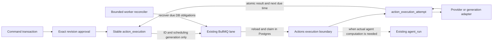

# Fload inbox: normalization and queue ownership review

15 September 2026 · FLO-1355 · Architecture investigation, not implementation

**Recommendation: withdraw the six-table ceiling and the combined `action_job` design. Keep BullMQ. Model one durable execution separately from the attempts to perform or verify it. Rework existing capability receipts into that attempt history instead of maintaining a second execution log.**

This review supersedes the table-count and job-ownership decisions in the earlier proposal. The earlier field explorer and SQL remain available as a clearly labeled historical candidate. They are not the normalized target schema or a migration ready to run. The replacement execution fields below are a review draft; the complete normalized DDL still requires the content, authorization, and migration work described here.

## What changed from the previous version

These are changes to the architecture plan, not changes shipped to Fload.

1. **Updated the investigation against latest main.** Pulled `63275b2f5`, rechecked affected paths, and identified recent fixes that the overhaul must preserve.
2. **Removed the table-count target.** Keys, dependencies and ownership now determine the relations. Neither six nor fourteen tables is the goal; the previous SQL is explicitly superseded.
3. **Replaced the combined job proposal.** Propose one durable `action_execution` per approved unit and separate attempt history by evolving existing capability receipts. BullMQ remains the queue; `agent_run` remains the agent computation record.
4. **Made the queue cleanup and field decisions concrete.** Added 15 execution fields, 25 attempt fields, a disposition for all 27 earlier job fields, and an inventory of 15 central queues plus `agent-execution`.
5. **Expanded the failure and migration plan.** Added review-edit/drain conflicts, claim fencing, provider uncertainty, lost verification wakeups, and preservation of existing receipts and recent queue fixes. Complete normalized DDL, multi-step provider modeling and runtime/migration tests remain explicit implementation gates.

## What was checked

The original investigation used `0c8372db2824770f7dac088a8a893a0c74b512a4`. This review inspected the intervening changes through **`63275b2f51ac5b5a151a9a6683c813423e682785`**, verified as GitHub `main` during this review. The existing feature worktree was then fast-forwarded with `git pull --ff-only origin main`, as requested, and the affected code rechecked there. The pull brought in 249 changed files. No implementation edits, queue mutations, database migrations, or production settings changes were made.

Evidence below is source inspection, not an observed production failure rate or a new runtime reproduction. Existing fixes are credited explicitly. The original 136 passing unit tests remain baseline evidence only. No new database migration or concurrency suite has run. Browser and document checks validate the artifact, not the proposed execution guarantees.

## 1. Normalize facts, not table counts

Normalization asks which key determines each fact and prevents insert, update, and deletion anomalies. Adding an `id` does not remove dependencies between other columns. A six-table design can be less normalized than a larger design, but a large number of tables is not proof of normalization either. [Reference: database normalization](https://en.wikipedia.org/wiki/Database_normalization).

Use 3NF as the review baseline, inspect BCNF where alternate keys matter, and document each deliberate exception. Check constraints, authorization, concurrency, and recovery are additional requirements; normal forms alone do not guarantee them.

| Fact | Determinant / natural identity | Authoritative home | What must not become a second authority |
| --- | --- | --- | --- |
| Ticket owner and current shared decision | Ticket ID | Actions ticket | Personal read row, draft flags, queue status |
| Proposed text and target preconditions | Ticket ID + revision number | Immutable revision and typed content | Current mutable draft, Redis payload |
| A batch's exact membership | Parent revision + child ticket | Membership relation, pinning child revision | Query of whatever is pending today |
| One accepted user command | Organization + authenticated principal + idempotency key | Command receipt with a request digest | Browser timer or random queue ID |
| Who authorized an exact unit | Approval ID | Typed approval referencing its event and revision | Worker identity or current content |
| One intended execution | Approval ID for one selected child / unit | Stable execution record | A new logical execution on every retry |
| One actual attempt | Execution ID + attempt number | Attempt history | BullMQ `attemptsMade`, overwritten draft counters |
| Provider evidence | Attempt / observation identity | Persisted attempt evidence | Latest log row for a ticket |
| Teammate's attention | Organization + user + ticket | Personal read state | Shared lifecycle |
| Agent computation and usage | Agent run ID | Agents domain | A generic Actions job pretending to be an agent run |

Historical snapshots are different facts: the name shown at approval time is not the person's current name. Before-values needed to explain or reverse an approved change are not replaceable by a join to today's provider state.

## 2. Scrutiny of every proposed table

| Earlier candidate | Finding | Decision |
| --- | --- | --- |
| `action` | Shared lifecycle is the correct responsibility. `blocked_by_action_id` duplicates the proposed dependency links. Execution/recovery dates can compete with job dates. Parent totals and execution outcomes are projections. | Keep ticket identity, owner, priority, snooze and decision. Make dependency rows authoritative. Remove the single-blocker pointer or make it a read projection. Keep execution timing in execution, prerequisite-check timing in its explicitly owned process. |
| `action_revision` | `action_id → operation` under the proposal's immutable-capability rule, and operation determines content family. Repeating these facts is not made normalized by adding checks. `target_locales` is a set hidden in an array. Token totals may duplicate arithmetic. The 78-column width is not itself a normal-form violation. | Store ticket operation once. Relational locale targets. Common revision identity plus concrete review, listing, ads and request content relations where their different keys/constraints justify them. Remove computed totals unless they mean a separately reported provider fact. No generic field/value table. |
| `action_link` | Membership, dependency, derivation and supersession have different keys, cardinalities and time semantics. A universal relation type hides those differences. | Separate revision membership from ticket dependencies/derivation when their constraints differ. Parents and children remain ordinary tickets. A read view can combine relationships for the UI. |
| `action_event` | A 50-column union currently mixes commands, approval grants, attribution, provider evidence and migration diagnostics. An FK to an arbitrary event does not prove it is an approval. | Retain an append-only, attributable timeline. Give commands and approvals typed relational identities; use those identities in FKs. Link provider attempts into the timeline instead of copying evidence into both records. |
| `action_job` | Its natural retry key is `(organization, effect_key, attempt_number)`, but effect-wide authorization, revision, provider and policy are repeated on every attempt. It mixes intention, transport, attempt, verification, resource exclusion and final result. | Replace, do not extend as-is. One stable execution, many attempts. No SQL replica of BullMQ states and no new generic queue engine. |
| `action_read` | A separate per-person key correctly separates attention from work. Seen revision and seen event sequence answer distinct questions. Tenant repetition is a security/constraint choice. | Keep. Define unread as a projection of the read marker and visible events/revisions. Shared commands cannot be implemented as read-state writes. |

### Deliberate exceptions must be named

* **Tenant keys:** carrying `organization_id` on child rows can support RLS and composite FKs. It is redundant when a globally unique parent ID determines the tenant. Retain it only with enforcing constraints and call it deliberate denormalization; do not call the result pure BCNF.
* **Current ticket state:** keep the current row for commands and efficient reads, with history written in the same transaction. History describes past transitions; it is not a second writable current-state API. Any cached counters must be rebuildable and versioned.
* **Digests:** a content digest is a deterministic integrity/indexing aid over retained immutable fields. It must be computed canonically, not accepted as a free client assertion or used as a substitute for content.
* **Contract versions:** versions identify interpretation at the time. Adding a new capability must involve an exhaustive typed registry change, schema/contract checks and migration where needed. It must not mean inserting arbitrary handler names or unvalidated payloads.

## 3. Existing queue and persistence topology

The newer source declares **15 queues in `services/queue.ts`, plus `agent-execution` in `agents/scheduler.ts`**. One declared queue, `review-sync`, has no dedicated worker. The updated repository guidance now documents the 15 central queues; the earlier 13-queue inventory is obsolete. Queue count is not a design target either.

| Surface | Current durable facts / route | Current scheduling | Ownership decision |
| --- | --- | --- | --- |
| Approved agent-backed action | Core approval and pending `agent_run` are inserted in one DB unit of work; then enqueue | `agent-execution` | Preserve transactional dispatch and the real agent run. Replace copied execution params with references to the approved revision. |
| Platform / ASA action | Approval is stored; provider execution then runs in the approval request; confirmation follows | No dispatch queue on this path | Move accepted work behind the same durable execution protocol, using a bounded API-capable worker lane. Return accepted, not completed, from approval. |
| Localization hypothesis | Approve request → insert run → insert activity → enqueue; separate awaits | `agent-execution` | Make the request-to-run handoff durable and idempotent. Generation authorization does not authorize unseen output. |
| Locale generation / apply | Separate generation/apply job families; generation IDs have a new suffix | `sync` generation/apply; provider-specific downstream work | Keep domain generation logic; feed it durable input references and atomically persist generated child identities. Review lane placement separately from table design. |
| Inbox iteration | Personal overlay set → enqueue; catch compensates; no deterministic job ID here | `inbox-iteration` | Keep bounded LLM capacity initially. Replace overlay authority and payload snapshots with a shared command plus immutable input reference. |
| Review reply / batch | Mutable `review_draft_reply`: `pendingSendAt`, `sentAt`, `sendAttempts`, booking stamp | Immediate `send_replies` and 30-minute review-sync backstop, both through scraping | Move delivery intent and attempts out of the draft. Scraping can reuse a browser to process individually approved executions. Batch identity never comes from the drain query. |
| Provider verification | `capability_execution`, plus attempt/previous verdict/params in queued payload | `work-verification` on `sync` or `scraping` | Reuse comparison adapters; persist each check and its next due time. Queue retention cannot decide the outcome. |
| Managed alerts | DB outbox committed with subscription state; fenced delivery and sweeper | `alerts` | Keep Notifications ownership. Reuse architectural lessons, not its business rows or duplicate-send policy. |
| Organization deletion | DB outbox, next attempt date, fenced claim and retained-job recovery | `alerts` | Keep its own cleanup contract. A useful example of DB intent surviving queue loss. |
| Dormant `review-sync` queue | Declaration, event/diagnostic/cleanup references | No dedicated worker | Retirement candidate: prove no live producers, drain/inspect remaining Redis jobs, remove all references and update inventory. Do not remove review syncing itself. |
| Other lanes | Setup, sync reports, reports/PDF/preflight, valuation, email, support, AppTweak and its scheduler | Existing workers | Keep unless a measured coupling requires a change. Unrelated queue rewrites are not prerequisites for inbox normalization. |

The recent AppTweak scheduler split is a useful warning: a reconciliation job can be starved by the backlog it is supposed to repair. Keep Actions recovery on a short, bounded control path with an independent watchdog; do not put provider I/O or LLM work inside it.

## 4. Concrete findings and existing protections

### Q1 — Existing transactional dispatch is worth keeping

`createDrizzlePendingActionUnitOfWork` inserts `agent_run` in the approval transaction. The subsequent enqueue is not atomic with Postgres, but the durable row is a sound foundation. The ordinary approval catch can still mark work failed after enqueue or later bookkeeping errors; the explicit recovery path preserves the intent. These should become one durable acceptance contract, not two error policies. [Approval unit of work](https://github.com/fload-ai/fload-platform/blob/63275b2f51ac5b5a151a9a6683c813423e682785/apps/api/src/services/pending-actions/drizzle-pending-action-unit-of-work.ts), [approval service](https://github.com/fload-ai/fload-platform/blob/63275b2f51ac5b5a151a9a6683c813423e682785/apps/api/src/services/pending-action.service.ts).

**Credit newer fixes:** cancellation now clears the old result run ID before reapproval, and agent retries preserve approval while another queue attempt remains. Do not re-report these exact old behaviors as still unfixed. They do not yet establish permanent revision approval or uniform execution identity. [Core change](https://github.com/fload-ai/fload-platform/blob/63275b2f51ac5b5a151a9a6683c813423e682785/packages/core/src/actions/pending-action-service.ts), [agent retry handling](https://github.com/fload-ai/fload-platform/blob/63275b2f51ac5b5a151a9a6683c813423e682785/apps/api/src/agents/base-agent.ts).

### Q2 — The capability log is not yet a recovery ledger

It is written after work, deliberately catches database failures, uses non-FK correlation IDs, and anchors verification to the newest matching row. A later verification updates that row. This is useful calibration data, but does not prove a durable intention existed before a provider request. Evolve its responsibility and readers explicitly; merely pointing `action_job` at it leaves competing execution models. [Schema](https://github.com/fload-ai/fload-platform/blob/63275b2f51ac5b5a151a9a6683c813423e682785/packages/database/src/schema.ts#L7966), [execution log](https://github.com/fload-ai/fload-platform/blob/63275b2f51ac5b5a151a9a6683c813423e682785/apps/api/src/services/work-execution/execution-log.ts).

### Q3 — Queue IDs are temporary deduplication, not permanent idempotency

Most non-blocking jobs use five-minute completed/failed retention, with overrides for particular jobs. Agent enqueue uses a stable run-based ID when a run exists; iteration does not specify one. BullMQ ignores duplicate IDs only while the original job is retained. Stalled jobs may run again. Business idempotency must therefore survive job cleanup and Redis loss. [Retention source](https://github.com/fload-ai/fload-platform/blob/63275b2f51ac5b5a151a9a6683c813423e682785/apps/api/src/services/worker/sync-timeouts.ts#L3), [BullMQ removal semantics](https://docs.bullmq.io/guide/queues/auto-removal-of-jobs), [stalled jobs](https://docs.bullmq.io/guide/jobs/stalled).

### Q4 — Review drafts are both content and a queue

`pendingSendAt` means both ready-at and an active lease expiration. Claims are conditional, but `markDraftSent` and `markDraftFailed` update by draft ID without matching the claim token, revision, or old lease. A stale worker can settle a newer incarnation of the same draft. Retry counts belong to the draft across later edits. [Claim and completion helpers](https://github.com/fload-ai/fload-platform/blob/63275b2f51ac5b5a151a9a6683c813423e682785/apps/api/src/services/worker/scraping/helpers/reply-helpers.ts).

### Q5 — An approved edit loses its operation at the drain boundary

`queueApprovedReply(mode: update)` requires an existing developer response, writes the new text and reopens the draft. The drain sees that response and takes the “already handled” branch, calling `markDraftSent(..., 'no_store_write')`. The draft carries no persisted send-versus-update operation for the drain to distinguish. This is a concrete code-path conflict; reproduce it end-to-end before implementing the fix. [Queue approval](https://github.com/fload-ai/fload-platform/blob/63275b2f51ac5b5a151a9a6683c813423e682785/apps/api/src/services/reviews/queue-approved-reply.ts), [drain](https://github.com/fload-ai/fload-platform/blob/63275b2f51ac5b5a151a9a6683c813423e682785/apps/api/src/services/worker/scraping/executors/reviews/agent-processing.ts#L868).

The same drain can delete a review and its draft when the provider reports it missing. A ticket must instead retain its history and record a sourced “target removed” outcome.

### Q6 — Verification mixes transport facts with provider facts

The verifier carries approved params and `previousOutcome` in Redis, schedules the next check after the current one, and can proceed if transport lookup fails or the job is missing. Review booking writes a stamp before queueing and clears it on caught failures. A process crash bypasses such compensation. Existing delivery-time booking and backfill helpers mitigate particular gaps, but do not supply a universal durable next-check obligation. Persist that obligation and tie every observation to its exact execution and revision. [Verification](https://github.com/fload-ai/fload-platform/blob/63275b2f51ac5b5a151a9a6683c813423e682785/apps/api/src/services/work-execution/applied-verification.ts), [review booking](https://github.com/fload-ai/fload-platform/blob/63275b2f51ac5b5a151a9a6683c813423e682785/apps/api/src/services/reviews/reply-readback-scheduling.ts).

Browser readbacks on `scraping` currently lack the account group used by normal scraping jobs; ASC fallback can launch a browser from `sync`. Resolve the actual connector/transport before enqueueing the provider-specific attempt so browser work obeys the account and global resource limits. A provider readback is not an excuse to bypass capacity safeguards. [Queue routing](https://github.com/fload-ai/fload-platform/blob/63275b2f51ac5b5a151a9a6683c813423e682785/apps/api/src/services/queue.ts).

### Q7 — Some repair state is embedded in domain JSON

Housekeeping queries `agentRequest.blockerContext.unblockFinalization`, including pending state, retry count and next due time. This is another execution/recovery protocol, not merely explanatory metadata. Move the Actions handoff obligation into its typed owner; retain Agents request progression in Agents. Do not leave this JSON protocol as a second scheduler. [Housekeeping](https://github.com/fload-ai/fload-platform/blob/63275b2f51ac5b5a151a9a6683c813423e682785/apps/api/src/services/inbox-housekeeping.service.ts).

### Q8 — Existing outboxes teach both what to reuse and what not to copy

Managed alerts commit an outbox row with the triggering transaction and fence completion. Its comments explicitly accept duplicate external delivery after a crash. That policy is inappropriate for arbitrary provider writes. Organization deletion also handles retained terminal BullMQ jobs so they do not block recovery. Reuse these mechanisms where justified; keep their business policies separate. [Managed alerts](https://github.com/fload-ai/fload-platform/blob/63275b2f51ac5b5a151a9a6683c813423e682785/apps/api/src/services/managed-alert-outbox.service.ts), [organization deletion](https://github.com/fload-ai/fload-platform/blob/63275b2f51ac5b5a151a9a6683c813423e682785/apps/api/src/services/organization-deletion-outbox.service.ts).

### Q9 — Queue cleanup must respect BullMQ's ownership

Latest main removed `cleanupStaleGroups` from worker startup/hourly housekeeping. The regression demonstrated loss of grouped prioritized job indexes even while job hashes survived. The runbook specifically warns that global waiting-job reads are not a complete census of Pro groups and that an unknown job state does not prove a store write never happened. Preserve this fix. Actions reconciliation must restore its own DB obligations through supported queue APIs, not edit Redis internals or blindly replay orphan hashes. [Runbook and real-Redis regression description](https://github.com/fload-ai/fload-platform/blob/63275b2f51ac5b5a151a9a6683c813423e682785/docs/runbooks/bullmq-group-orphans.md).

### Q10 — Newer staging and generation protections must survive normalization

* **Blocker cards:** `backlog_opportunity` now means either historical proposal or a live stage-blocker, distinguished by a marker. Latest main refuses placeholder dispatch and re-stages through the backlog delivery boundary. The normalized model needs an explicit prerequisite/preparation ticket type and a persistent link to the generated approval ticket; it must not treat every `backlog_opportunity` as obsolete history. [Stage blocker resume](https://github.com/fload-ai/fload-platform/blob/63275b2f51ac5b5a151a9a6683c813423e682785/apps/api/src/services/backlog/stage-blocker-resume.ts).
* **Locale request conversion:** report-ranked locale opportunities now convert to generation requests, with report-version/locale idempotency and the shared catalog start path. Preserve this handoff and the per-locale refusal results. [Conversion](https://github.com/fload-ai/fload-platform/blob/63275b2f51ac5b5a151a9a6683c813423e682785/apps/api/src/services/backlog/convert-locale-candidates.ts).
* **Human edits and collisions:** the localize path holds scoped transaction locks and distinguishes model-generated copy from later human edits. Newer code protects human edit/dismissal markers and indexed listing terms. Revision authorship and input-version checks must replace these markers without losing their safeguards. Generation liveness still relies in part on backlog request markers and a batch-size-dependent age window; migrate the obligation into explicit execution state. [Localize submission](https://github.com/fload-ai/fload-platform/blob/63275b2f51ac5b5a151a9a6683c813423e682785/apps/api/src/services/capability-catalog/localize-submission.ts), [indexed listing guard](https://github.com/fload-ai/fload-platform/blob/63275b2f51ac5b5a151a9a6683c813423e682785/apps/api/src/services/aso/indexed-listing-guard.ts).
* **Review UI:** latest main removed optimistic “published” content after approve/edit and reloads server delivery facts instead. Keep this correction; the separate browser-timer inbox acceptance problem and backend delivery handoff still need their own fixes. [Review actions hook](https://github.com/fload-ai/fload-platform/blob/63275b2f51ac5b5a151a9a6683c813423e682785/apps/web/src/app/%28app%29/reviews/%5BassetId%5D/hooks/use-review-actions.ts).
* **Screenshot localization:** this route produces R2 assets and updates an ASO recommendation/variant; latest main preserves saved listing fields when merging screenshot proposal data. Include the media generation and manifest/DB handoff in the producer census. A generated screenshot is not a store publication. If surfaced as work, its immutable revision must pin the exact asset version, digest, target locale and relationship to the listing proposal. The earlier text-only revision candidate does not cover that content. [Screenshot route](https://github.com/fload-ai/fload-platform/blob/63275b2f51ac5b5a151a9a6683c813423e682785/apps/api/src/routes/assets/aso-screenshot-localize.ts).

## 5. Replacement for `action_job`

### One logical execution; many physical attempts

**`action_execution` replaces the proposed `action_job`. `capability_execution` is the migration starting point for `action_execution_attempt`, preserving existing receipt IDs.** This avoids keeping a best-effort capability log beside a new authoritative attempt log. It requires migrating all relevant capability-log writers and readers, including calibration, direct tools, policy publication and inbox verification; it is not a rename-only migration.

An approval authorizes one selected child revision. Group approval creates per-child approvals and executions in the same command transaction; there is no second batch provider write that repeats the children. A browser session may process many executions efficiently without changing their identity or authorization.

The execution row itself is the durable outbox for that effect: phase plus next due time tell recovery what remains owed. A separate generic outbox table is not needed just to copy that fact. Audit events are not scanned as the scheduler. BullMQ still owns waiting lists, worker assignment, rate limiting, delayed wakeups and transport locks.

### Proposed execution fields

These are concrete active-flow fields for the replacement review, not executable DDL. `action_approval` denotes a typed approval relation, not a generic event FK. Its full schema belongs in the normalized authorization revision.

| Field | SQL type / nullability | Responsibility |
| --- | --- | --- |
| `id` | `text PRIMARY KEY` | Stable execution ID across retries. |
| `organization_id` | `text NOT NULL` | Tenant boundary; composite FK to approval. Explicit security denormalization. |
| `approval_id` | `text NOT NULL UNIQUE` | One approved child revision; includes actor attribution and Undo deadline through the approval relation. |
| `phase` | closed enum NOT NULL | `ready`, `running`, `awaiting_verification`, `uncertain`, `blocked`, `succeeded`, `failed`, `cancelled`. Business progress, not BullMQ status. |
| `next_run_at` | `timestamptz NULL` | Durable next execution/reconciliation/check time. Required for automatically recoverable phases; NULL for terminal/manual-blocked phases. |
| `schedule_generation` | `bigint NOT NULL` | Monotonic identity of one scheduled step; queue deliveries for older generations cannot start new work. |
| `claim_generation` | `bigint NOT NULL` | Monotonic database fence for state transitions. |
| `claim_token` | `uuid NULL` | Current owner token; paired with claim expiry. |
| `claim_expires_at` | `timestamptz NULL` | Lease expiry triggers inspection/reconciliation, never automatic permission to resend. |
| `recovery_mode` | closed enum NOT NULL | `native_idempotency`, `readback_before_retry`, `manual_reconciliation`, `internal_atomic`. Selected for this execution from supported provider behavior. |
| `recovery_policy_version` | `integer NOT NULL` | Frozen implementation of the selected recovery/verification policy. |
| `provider_idempotency_key` | `text NULL` | Exact native key, when supported. Stable across retries of this execution. |
| `hold_reason` | closed enum NULL | `permission`, `provider_conflict`, `uncertain_write`, `target_changed`, `retry_exhausted`, `unsupported_readback`, `generation_conflict`. |
| `created_at` | `timestamptz NOT NULL` | Creation in the acceptance transaction. |
| `settled_at` | `timestamptz NULL` | Set only with a terminal phase. |

No duplicated content, operation name, revision, actor, provider identity or arbitrary resource string: those are resolved through the typed approval and immutable target. Actual connector/request facts used by one attempt belong to that attempt. Ticket-level lifecycle remains a projection of shared decisions and child executions, not a mirror of every queue transition.

### Proposed attempt fields and historical receipts

| Field | SQL type / nullability | Responsibility |
| --- | --- | --- |
| `id` | `text PRIMARY KEY` | Permanent attempt/receipt identity; keep existing capability receipt IDs. |
| `organization_id` | `text NOT NULL` | Tenant-safe scoped references. |
| `execution_id` | `text NULL` | Required for new apply/verify/generate attempts. Historical observations may lack provable authorization. |
| `historical_action_id` | `text NULL` | Known ticket link only for an imported observation without an execution. Never dispatch authority. |
| `kind` | closed enum NOT NULL | `apply`, `verify`, `generate`, `historical_observation`. The last variant has no executable handler. |
| `attempt_number` | `integer NULL` | Required and positive for new attempts; unique within execution. Do not invent attempt ordering for old receipts that cannot prove it. |
| `claim_generation` | `bigint NULL` | Required for new attempts; fence under which the attempt began. |
| `subject_attempt_id` | `text NULL` | A verification points to the exact apply/generation attempt being checked; scoped FK within the same execution. |
| `agent_run_id` | `text NULL` | Actual Agents run involved, when applicable. Not every provider call is an agent run. |
| `connector_id` | `text NULL` | Connector actually used by this attempt; tenant checked. |
| `started_at` | `timestamptz NULL` | Required and committed before new provider I/O. Unknown historical start times remain unknown. |
| `finished_at` | `timestamptz NULL` | Result recorded for this attempt; finished rows are immutable. |
| `result` | closed enum NULL | `acknowledged`, `known_not_applied`, `uncertain`, `matched`, `mismatch`, `unreadable`, `generated`, `discarded`. Kind-specific checks; NULL until a new attempt settles. |
| `historical_result` | closed enum NULL | `reported_executed`, `reported_failed`, `reported_partial`; required only for imported observations. No inference of a live, verified write. |
| `provider_request_id` | `text NULL` | Provider-issued request correlation if supplied. |
| `provider_resource_id` | `text NULL` | Resource identity returned or observed; not a generic handler argument. |
| `provider_version` | `text NULL` | Version / ETag actually returned or observed. |
| `observation_surface` | closed enum NULL | `provider_response`, `editable_listing`, `live_listing`, `review_response`, `advertising_resource`, `internal_artifact`. |
| `observation_availability` | closed enum NULL | `complete`, `partial`, `unavailable`. A partial read cannot produce `matched`. |
| `expected_digest` | `char(64) NULL` | Canonical expected value for this check, tied to the approved revision. |
| `observed_digest` | `char(64) NULL` | Canonical observed value when available. |
| `comparison_version` | `integer NULL` | Version of the closed provider comparison rule. |
| `provider_error_code` | `text NULL` | Provider-reported diagnostic only; cannot select retry behavior without classification. |
| `failure_class` | closed enum NULL | `permission`, `rate_limit`, `transport`, `target_changed`, `provider_rejected`, `persistence`, `unsupported_readback`. |
| `recorded_at` | `timestamptz NOT NULL` | When this fact entered Fload; preserve the original receipt timestamp when importing. |

A digest alone is insufficient when the UI needs the actual observed content. Add a concrete review/listing/ads observation relation for those required values, or reuse an immutable, strictly typed domain observation with a real FK. Do not put an arbitrary provider response in JSONB or serialized text. The final field mapping must decide this per capability before DDL is called complete.

**Multi-step operations are another explicit schema gate.** A listing change can span more than one provider endpoint. Those separate effects are not retries of each other. The final model must name each allowed provider step, retain its result, and scope native idempotency to that exact step; a retry cannot repeat already-confirmed steps or reuse one key for different request bodies. Decide from the provider adapter census whether these are fixed typed steps within one execution or independently approved child executions. The active-flow field draft above does not yet fully represent this, so it must not be implemented as a complete generic executor. Do not solve it with an arbitrary workflow JSON document.

An in-flight attempt may be finalized exactly once; finalized attempts cannot be overwritten. Verification adds another attempt rather than updating the write's verdict. Late provider evidence must be retained even if its worker lost the lease: route it through a named, deduplicated evidence command. It cannot mutate current execution state without reconciliation. An unresolved previous I/O attempt must block another non-idempotent write, regardless of how many worker claims have expired.

### Disposition of all 27 old job fields

| Earlier `action_job` field | Replacement |
| --- | --- |
| `id` | Separate stable execution ID and attempt ID. |
| `organization_id` | Scoped on both records, with enforcing composite FKs. |
| `action_id` | Derive via approval → revision → ticket; old receipt links preserved through migration. |
| `revision_id` | Approval owns this exact immutable reference. |
| `authorization_event_id` | Execution references a typed approval; approval references the attributable event. |
| `caused_by_event_id` | Command/approval lineage, not repeated on every retry. |
| `kind` | Attempt kind; domain operation remains on the ticket/typed content contract. |
| `effect_key` | Stable execution ID plus unique approval; no arbitrary string convention. |
| `attempt_number` | Attempt history only. |
| `previous_job_id` | Remove; attempt ordering is queryable. Explicit verification subject remains. |
| `verifies_job_id` | Attempt `subject_attempt_id`, within the same execution. |
| `state` | Execution business phase; transport state remains in BullMQ. |
| `outcome` | Attempt result; execution terminal phase is atomically maintained. |
| `available_at` | Execution `next_run_at`; worker also enforces approval `undo_until`. |
| `lease_owner` | Execution claim token plus optional non-authoritative diagnostics. |
| `lease_epoch` | Execution claim generation; attempt records its starting generation. |
| `lease_until` | Execution claim expiry. |
| `dispatch_started_at` | Attempt start marker, committed immediately before the provider boundary. |
| `provider` | Approved typed target; actual transport facts recorded on attempt. |
| `connector_id` | Actual connector on attempt, validated against the approved account/resource. |
| `provider_resource_key` | Remove generic stored key; derive conservative conflict scopes from concrete provider account/app/review/listing/ads identifiers. |
| `operation_digest` | Approved revision digest; per-check comparison digests only when their meaning differs. |
| `provider_idempotency_key` | Execution; reused across safe retries. |
| `recovery_policy` | Execution's selected closed recovery mode. |
| `recovery_policy_version` | Execution; not duplicated independently on every attempt. |
| `created_at` | Execution creation; attempt start/recording times are different facts. |
| `completed_at` | Execution settlement and attempt finish are distinct timestamps. |

## 6. One owner for each kind of retry

**Actions decides whether a business effect may run again and when. BullMQ transports the next permitted attempt.** Do not let queue backoff, a database sweeper and a provider helper each spend independent write-attempt budgets.

For migrated Actions handlers, use one transport attempt per scheduled generation by default. BullMQ stall recovery may still redeliver, and transport failure may still prevent processing; the database claim makes such delivery harmless. A provider or generation result commits its attempt evidence and the next business due time in one transaction. The reconciler restores a missing wakeup. Normal unrelated jobs retain their existing retry behavior.

Use a closed queue envelope containing only a wire version, execution ID and schedule generation. Resolve approved content from Postgres. JSON serialization on the network is normal; it is not permission for open JSONB storage, `Record<string, unknown>` contracts or arbitrary handler payloads.

Queue IDs can include the execution ID and scheduling generation for efficient transient deduplication. Retained completed/failed jobs must be explicitly handled when they block a still-due generation. Missing jobs, flushed Redis, job retention and queue migration must all converge from DB state. A stale envelope is a no-op. Two workers claiming the same generation must not start two attempts.

**Do not transplant the alert outbox's timing policy unchanged:** that implementation lets BullMQ own backoff and its sweeper fill orphan jobs. Actions needs durable, provider-aware business retry and verification timing because uncertainty is not a normal failed-job retry.

## 7. Transaction and crash contract

| Boundary / race | Required result |
| --- | --- |
| Approve vs revise | Both lock/CAS the same ticket version. Exactly one wins; loser receives current state. No provider I/O before approval commits. |
| Client loses the approval response | Same principal/key/digest returns the same command receipt, approval and executions. Changed digest with same key is rejected. |
| Approval accepted, browser closes | Server acceptance and Undo deadline already exist. The browser is not the delivery mechanism. |
| Undo vs dispatch | Server time and the same execution lock decide. Undo requires an unstarted execution and a still-open deadline. After expiration it is not Undo, even if a queue is slow. |
| DB commit before queue add / Redis outage | Execution remains due. A bounded, monitored reconciler re-enqueues; no new approval required. |
| Queue retained / lost / duplicated / old generation | Reload DB. Terminal/stale envelopes no-op. A due obligation is recoverable without changing business identity. |
| Crash before any I/O marker | Reclaim after expiry and retry under the same execution. No evidence of possible provider write. |
| Crash after I/O marker, before result commit | Mark/retain uncertainty. Inspect provider or use the same documented native idempotency key. Do not classify timeout as known failure. |
| Provider succeeded, DB unavailable | The durable pre-write record exposes unfinished work. Recovery readback can record the result later; do not return a fabricated durable confirmation. |
| Worker lease expires during provider request | Fence subsequent state writes. Do not send a replacement write merely because the lease expired. A local token cannot revoke a request already accepted by an external provider. |
| Readback sees old value immediately | Respect propagation and incomplete reads. A negative read is not proof an in-flight write will never land. Unsupported proof stays uncertain/manual. |
| Late provider evidence arrives | Store it against its exact attempt, deduplicated; current-state reconciliation determines its effect. Never drop useful evidence because a lease is stale. |
| New approved edit while old public verification is pending | Old verification is about the old revision. A later authorized write can supersede that target; do not flag the new content as an unexplained mismatch. Uncertain old writes require a stronger conflict gate. |
| API-to-browser fallback after ambiguous response | Fallback is another provider attempt, not a harmless catch branch. Reconcile the first request before authorizing it. |
| Two different tickets target the same provider resource | Serialize conservative typed conflict scopes, including overlapping operations. Account/browser concurrency limits are not business conflict locks. |

Conflict handling must be atomic across all write entrypoints. Initially serialize writes conservatively per canonical store app or ads account under a short transaction-level lock, inspect in-flight/uncertain executions for that scope, and then claim. Connector rows are not necessarily unique provider accounts. Do not hold a database transaction over network I/O. Narrower per-resource concurrency can follow after proving overlap rules; an expired non-idempotent request still blocks unsafe replacement.

Exactly-once provider execution cannot be promised for a provider that offers neither idempotency nor sufficiently conclusive readback/preconditions. The product must retain a visible uncertain state and a typed resolution command. Availability can be sacrificed to avoid an unauthorized duplicate; uncertainty must not be silently renamed failure or success.

## 8. Localization and review handoffs

### Localizations

1. A parent ticket has a permanent identity; requested locale codes are relational rows on its input revision.
2. Generation authorization pins those locale rows and the immutable source listing. A repeated generation delivery uses the same intent identity.
3. Commit generated child tickets, their revisions, membership and the generation result atomically. A crash before commit creates no half-published batch. A rerun may waste an LLM call but cannot create duplicate accepted children.
4. Approval pins every selected child's exact revision. Subsequent generation cannot alter it.
5. A newly discovered locale is new work, or an explicit parent revision before approval. It never silently joins an accepted batch.
6. A locale created externally resolves with evidence; an unexpected or partial external change blocks/revises rather than disappearing.

### Reviews

1. Persist selected review children and exact reply revisions, including send/update mode and the expected existing response identity/content.
2. Approve a persisted membership revision; child execution rows are the durable send contract. `pendingSendAt` on a mutable draft is removed as authority.
3. The browser drain claims execution IDs. It may amortize login/session cost, but each reply is separately authorized, attempted and confirmed.
4. An update must compare the expected prior response and execute the approved edit. “A response exists” cannot settle an edit.
5. Partial completion remains on the same parent. Retry only the eligible children after reconciling uncertain attempts. New reviews get new membership/work.
6. Catch-up/manual generation completion means drafts exist. Policy publication must record the exact policy and then authorize each generated revision. It is not blanket approval of future text.

## 9. Cleanup is part of the implementation

| Remove or consolidate | Replacement / proof required |
| --- | --- |
| Browser-only acceptance and timer-held commands | Immediate durable command receipt; server deadline; close-tab and reconnect tests. |
| Workflow statuses inside `inbox_item_state` | Shared Actions lifecycle; personal read rows retain attention only. |
| Pending-row-derived batch identity | Permanent parent, revisioned membership and explicit child approval. |
| `review_draft_reply` send queue, lease, counters and booking authority | Executions/attempts; preserve draft content, sent receipts and original IDs through migration. Retire the draft table itself only after all readers/producers move. |
| Generic `action_job` proposal | Execution plus attempts, reusing capability receipt storage. |
| Best-effort capability logging as execution truth | Required attempt/result persistence; calibration reads the authoritative records. Optional analytics remain downstream. |
| Newest-row verification anchoring and mutable verdict overwrite | Exact attempt references and append-only checks. |
| JSON `unblockFinalization` recovery protocol | Typed durable handoff obligation; Agents owns request status. |
| Duplicate schedule/compensation code for Actions | One DB acceptance/next-step contract and bounded reconciler, with concrete provider adapters. |
| Copied approved params and loose optional unions in queue payloads | Closed versioned ID envelopes; strict shared contracts. |
| Synchronous provider writes from approval | Durable acceptance followed by guarded worker dispatch. Audit all route/chat/MCP/agent/system doors. |
| Dormant review queue declaration and references | Remove after live producer/job/schedule census, not by blindly flushing all queues. |

Keep actual agent runs, provider/browser resource limits, provider comparison logic, domain experiments, and unrelated Notifications/deletion outboxes. Do not merge all background jobs onto one queue or build a universal workflow engine. The useful simplification is fewer writable authorities and fewer distinct handoff protocols.

## 10. Migration and validation sequence

1. **Complete the normalized contract.** Every table gets candidate keys, dependencies, nullability, closed types, constraints, authority and writer list. Finish concrete content/observation relations, command replay and typed approval. Enumerate the final physical tables and retirements; do not advertise a fixed count in advance.
2. **Take a read-only data and queue census.** Count types/statuses, incomplete links, duplicate logical executions, all receipt usages, old queue payload versions, delayed/active/repeatable jobs, and known ambiguous writes. Source inspection cannot establish which legacy rows exist in production. No production writes for this investigation.
3. **Create failing reproductions before fixes.** Extend real DB/Redis integration suites, using the repository's safe test database module. Include approval/iteration races, reply edit drain, stale lease completion and every crash boundary above. Pure state/typing logic gets unit tests; concurrency claims require real transactional tests.
4. **Build and test the complete migration chain.** Preserve ticket IDs/URLs, receipt IDs, attributable history, rejection receipts, experiment/run links, sent text and batch membership where recoverable. Do not infer approvals, timestamps or memberships that history cannot prove. Historical observations are typed, read-only facts, never executable fallback records.
5. **Coordinate one writer handoff.** Install the new schema, backfill, verify row/reference/digest parity and replay safety, then stop old Actions writes and drain or fence old payload consumers. Translate only provable old queued obligations. Ambiguous in-flight writes enter reconciliation. New accepted work has one writer model. A brief maintenance window is preferable to unsafe coexistence; choose the operational sequence from measured workload and required downtime.
6. **Exercise failure and recovery in an isolated environment.** Kill processes at injected boundaries; flush only disposable test Redis; duplicate/redeliver jobs; expire locks; delay provider responses; simulate ambiguous writes, unavailable readback and partial batches. Test recovery after terminal job retention and a full queue rebuild from DB.
7. **Contract and remove.** Drop obsolete columns/tables/payload consumers/repair protocols after the compatible fleet and in-flight obligations are accounted for. A finite rollout bridge may be necessary, but it is not the architecture. A rollback cannot resurrect an old worker against dropped schema or authorize old payloads to write again.
8. **Repository checks and reviewable PR.** Failing-to-passing regressions, migration fixtures, typecheck/lint/build and required unit/integration/E2E checks. Use the required worktree and Semaphore workflow. No production deployment is authorized here.

### Required regression matrix

* Same command/key replay; changed body under the same key; changed principal; cross-organization IDs; unknown enum/value/wire version.
* Mark-read during snooze/iteration/approval; list/count equality beyond old caps; parent filtering with actionable children; stable pagination while work changes.
* Concurrent approve/revise, approve/approve, Undo/dispatch, retry/reconcile, and two tickets targeting overlapping resources.
* Crash after acceptance/before enqueue; after claim/before I/O; after I/O/before confirmation; during result-plus-next-check commit; stale worker late completion.
* Redis unavailable/lost; duplicate queue delivery; retained terminal job blocking enqueue; old generation; exhausted transport attempt; poisoned first page of recovery results.
* Native idempotency replay; API/browser ambiguous fallback; eventual consistency; partial/unavailable provider read; old revision superseded during verification.
* Multi-endpoint listing changes: first step succeeds and second fails or becomes uncertain; retry touches only eligible steps with correctly scoped idempotency and preserved partial evidence.
* Localization generation rerun with zero duplicate children; immutable source locale; externally created locale; parent revision changed mid-generation; newly discovered locale excluded from previous approval.
* Review batch exact membership and pinned text; send vs edit; external reply; deleted review; failed/uncertain child retry; no reopening old sent history; catch-up handoff after crash.
* Receipt migration with unknown provenance; old ID/link preservation; no fabricated approval; rollback/roll-forward boundary; no old writer after contract migration.
* Reconciler fairness/keyset traversal, bounded batches, tenant isolation, recovery under provider backlog, actual browser account limits, independent watchdog and metrics for oldest due/uncertain work.

## Decision for the team

Approve the ownership principles and cleanup scope, not an arbitrary table count. The strongest candidate is a normalized Actions model using existing queues, existing agent runs and evolved receipt storage. The previous combined job table is rejected. The full normalized SQL is the next design deliverable and must be demonstrated against migration fixtures before implementation is called ready.
