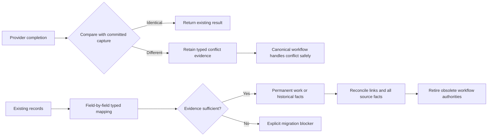

# FLO-1355 — evidence retention and migration, corrected draft v2

18 September 2026 · Documentation only · Implementation paused

This replaces the first R2/R3 schema proposal. [Ownership v6](Fload-Inbox-Ownership-Design-v6.md) remains accepted; its ownership review is closed. [V15](Fload-Inbox-Revised-Design-v15.md) remains the carried behavioral baseline. This document corrects evidence, source-inventory and cutover rules. It is **not complete DDL, a completed source mapping, or migration proof**.

R2 means retaining a contradictory completion without granting it execution authority. R3 means preserving existing content, decisions, receipts and links without manufacturing an approval. Both remain open until the explicit completion gates below pass.

## 1. What changes, simply

The corrections preserve the small conceptual model: a ticket, exact content, attributable decisions and evidence. Provider facts stay with providers; historical facts cannot authorize delivery. We are not accepting one new table per old source table as the final architecture.

## 2. Source baseline and corrections to the inventory

Two distinct references were inspected read-only:

- Preserved prototype: `f0b1af5fc5925d818be7d9b02b42b1fc54556ecc` plus its recorded uncommitted files. This is historical implementation evidence.
- Available `origin/main`: pinned at `e2cc156994855e401a83399fbb4c3d7be5194875`. This is a local remote-tracking snapshot, not a claim that production or the remote has been freshly queried. No database package changes occur between the first proposal's `2f27346df` and this pin.

The first proposal's statement that two recommendation tables gained `test_plan` is incorrect. `aso_experiment.test_plan` is the actual column. Neither `aso_recommendation` nor `aso_recommendation_variant` contains it. Their shapes are different and must not be collapsed into a fictitious union of their fields. `opportunity_backlog.impact` and `.risk` are actual additions since the prototype.

The twelve named source tables contain **212 declared columns, including 23 JSONB columns across nine tables**, not 25. The [source field inventory](Fload-Inbox-R3-Source-Fields.md) lists their actual declared types and nullability. This is a census of that named set, not the full dependency closure of the migration. Referenced experiments, runs, source assets, receipts, old URLs and queues still need their own ownership and link checks. Existing experiment data remains owned by ASO; this draft does not create a second experiment lifecycle.

| Source | Actual JSONB columns requiring typed treatment if retired or copied |
|---|---|
| `pending_action` | `params`, `beforeState`, `afterState`, `checkBackResult` |
| `agent_request` | `evidence`, `proposedOutcome`, `whatWillHappen`, `approvalPolicy`, `blockerContext`, `unblockGuide`, `recommendationIds` |
| `agent_request_event` | `data` |
| `review_draft_rejection` | `draft_snapshot` |
| `review_history` | `developer_response`, `draft_reply` |
| `opportunity_backlog` | `work_params`, `work_preview`, `work_preflight_receipt`, `evidence_refs` |
| `aso_recommendation` | `evidence`, `proposal` |
| `aso_recommendation_variant` | `proposal` |
| `inbox_recovery_run` | `manifest` |

Unknown values and unrecognized object properties must fail a closed decoder. A `decoded=true` flag cannot replace the decoded facts. No JSONB, serialized-object text column, EAV map or arbitrary payload escape hatch is introduced in the destination.

Migration journal entries through `0154` already exist at the pinned main. Prototype `0146`/`0147` collide and cannot be applied there. Generate migrations from the actual current main in a fresh repository-managed worktree when implementation resumes. Let Drizzle allocate the next sequence; do not prescribe `0155` or delete/rewrite the preserved prototype. The absence of an Actions schema on main does **not** imply that all touched relations are new: existing Usage projections and retained domain references still need explicit change classification.

## 3. R2: retain the original interaction's exact meaning

### 3.1 Identity and attribution

Keep `conflicting_completion` as an evidence-only attempt kind, using the accepted attempt envelope and provider-owned leaves. It is inserted finished. `subject_attempt_id` must resolve to an original `write`, `readback`, `inspection`, `generation` or `manual_observation`, with the same organization, execution and step. It cannot point to another conflicting or late record. Resolve the subject's own subject separately when the original interaction is a readback or manual observation.

| Fields | Required shape on a conflict record |
|---|---|
| `organization_id`, `execution_id`, `step_id` | Exact original scope; composite foreign keys, not independent ID-only references. |
| `claim_generation`, `claim_token`, `started_at`, `transport` | Copy original admission identity. These are historical facts, not the current fence. |
| `input_attempt_id`, `input_parent_revision_id` | Copy the original values, including NULL. |
| `connector_id`, `agent_run_id` | Retain the original applicable identities and same-tenant references. A generated `no_work` outcome retains its completed run as well as its closed reason. Native correlation remains in its provider owner. |
| `inspection_purpose`, `planned_write_step_id`, `prewrite_attempt_id`, `resource_guard_generation` | Copy the original values with the original kind's required/forbidden shape. A conflict does not consume the prewrite reference a second time. Do not erase these links by setting them all to NULL. |
| `finalized_claim_generation`, `finalized_claim_token`, `cycle_command_id` | NULL: capture retention is neither current-fence finalization nor a new recovery admission. |
| `evidence_command_id` | Required accepted, same-tenant `record_attempt` command admitting this capture. |
| `finished_at`, `recorded_at` | Original capture-completion instant and database admission instant respectively. Persistence retries cannot rewrite either committed fact. |
| `capture_digest` | Proposed `char(64) NULL`, lowercase SHA-256. CHECK requires non-NULL exactly for conflict records and NULL for every other kind. |
| `capture_digest_version` | Proposed `integer NULL`; **closed supported codec versions**, initially `1`, not any positive integer. CHECK requires non-NULL exactly with the digest and NULL otherwise. |

### 3.2 Outcomes and marks

Apply the immutable original operation contract to the captured result. Do not use one permissive matrix for both readback and inspection.

| Original kind | Captured result | Fingerprint/version | `terminal_outcome` |
|---|---|---|---|
| write | `acknowledged`, `known_not_applied`, `uncertain` | Forbidden | Forbidden |
| generation | `generated`, `discarded`, `known_not_applied`, `uncertain` | Forbidden | Forbidden |
| readback | `matched`, `matched_external`, `mismatch` | Required pair | Required boolean, backed by the contract's proof if TRUE |
| readback | `known_not_applied` | Forbidden | TRUE, with exact native non-application proof |
| readback | `unreadable` | Forbidden | Forbidden |
| inspection | `matched`, `mismatch` | Required pair | FALSE |
| inspection | `unreadable` | Forbidden | Forbidden |
| manual observation | `matched_external`, `mismatch` | Required pair | Forbidden; retain manager attribution |
| manual observation | `unreadable` | Forbidden | Forbidden; retain manager attribution |

`inspection/matched_external` is invalid. Unfinished conflict records are invalid. Basis, retry disposition, uncertainty reason, unreadable reason and output variants retain the original contract's closed, required/forbidden matrix. In particular, a readback's non-application is not a pre-dispatch failure. Unknown combinations fail closed; SQL CHECKs must test required values explicitly rather than accepting NULL comparisons.

### 3.3 Native receipts, observations and manifests

Conflict retention changes **authority**, not the truth requirements for constructing a typed provider result. Both `<provider>.attempt_receipt` and `<provider>.attempt_evidence` belong to the captured attempt; an HTTP receipt alone does not preserve native pagination, correlation or decoder proof. Ownership v6 §5.3 remains binding:

- Acknowledged external writes require their native receipt and operation-specific creation identity. Pre-dispatch failure forbids a receipt; provider rejection and decoded acceptance require the applicable receipt.
- Terminal readback and native non-application require exact provider proof. Nonterminal Play edit-presence reads require their exact GET receipt and finite native expiry.
- Matched ASC binding/prewrite inspections require version/localization evidence. `unreadable/no_editable_release` requires a successful, fully paginated, correctly scoped collection-read receipt. It does not invent a version ID.
- Other branches are optional only where that exact immutable operation contract permits it. Generation and internal operations cannot acquire provider receipts.
- Observation completeness is relative to the closed scope and surface. Resource-presence evidence is not listing-copy evidence. Preserve truthful partial/unreadable observations where the contract admits them; do not forbid every observation merely because the result is unreadable. An absence result does not require invented listing content.

Provider-owned capture storage must retain an App Clip upload manifest whenever a decoded completion actually carries one: reservation-write response **or reservation readback**, including late evidence while the plan is still unexpanded. Neither a late nor conflicting record may directly append steps. Omitting storage because a plan is not expanded would lose the exact manifest needed for later recovery.

The proposed ASC leaf has the following fields. It remains a draft until the exact manifest-presence/header and provider codec constraints are closed:

| Field | SQL type | Shape |
|---|---|---|
| `organization_id` | `text` | Required, tenant FK. |
| `attempt_id` | `text` | Required; deferred FK with organization to its capture attempt. |
| `provider_media_id` | `text` | Required exact native media identity; provider owned. |
| `ordinal` | `integer` | Required, nonnegative; PK `(organization_id, attempt_id, ordinal)`. |
| `upload_offset` | `bigint` | Required, nonnegative. |
| `upload_length` | `bigint` | Required; the versioned native manifest contract defines valid ranges and coverage. |
| `upload_url_ciphertext` | `text` | Required encrypted URL captured once and reused during DB-only retries. |
| `upload_method` | closed enum | `PUT` for the admitted current contract. |
| `upload_content_type` | provider-owned closed enum, nullable | Exact allowed media values and NULL meaning must be enumerated from the current codec before DDL. No arbitrary string accepted by default. |

This is capture evidence, not another queue or an adopted plan. `step_contract` remains the adopted step representation. A manifest that cannot be decoded stays an explicit blocker; native upload fields never move into Actions Core.

### 3.4 Replay identity

Capture the immutable envelope once before attempting persistence. Reuse its IDs, bytes, timestamps and encrypted values on retries; do not make another provider request, regenerate output or re-encrypt a URL to retry the database commit.

The codec must cover **all immutable semantic capture fields**, including original identity and fence; outcome and every discriminant; fingerprint **and version**; observation target, purpose, scope, surface, completeness, capture time, comparison version and typed content; provider receipt **and evidence** variants; manifest presence, header and ordered operations; generation output kind, source references, intended disposition and no-work reason/completed-run identity. A content digest alone does not identify the whole observation. Newly allocated storage-row IDs, database admission time and other generated commit metadata are excluded. Existing referenced domain/output identities are semantic inputs and remain included; do not confuse them with newly allocated capture-row IDs.

Each version has an explicit ordered typed tuple; NULL is different from empty string, false, zero or absent collection. Specify UTF-8, unambiguous length prefixes, exact integer/decimal encoding and UTC timestamp precision. Provider modules supply their closed nested tuples; composition checks coverage without Core inspecting native fields. No generic object serialization determines identity.

Proposed uniqueness: `(organization_id, subject_attempt_id, capture_digest_version, capture_digest)` restricted to conflict records. Select the codec version from the pinned immutable capture contract; a retry cannot choose a newer encoding. On a digest hit, verify equality of the complete stored typed capture before returning it. A digest collision or codec inconsistency is an integrity failure, not permission to discard evidence. Exact per-provider tuple orders and encoding fixtures remain a documented gate.

### 3.5 Transaction, race and authority boundaries

1. Acquire the accepted ordered locks, resolve the original interaction and current state, validate its pinned contract, and compare against committed original, late and conflict captures **before creating a new evidence command or changing a hold**. Exact replay returns the existing capture. A reused idempotency key with different input is a conflict.
2. Insert any new immutable capture, its provider leaves and observation atomically with attributable history. Receipt insertion retains the deferred-parent pattern: it may precede its new finished capture parent in this same transaction; it cannot be attached later to an already finalized record. Same-tenant links and immutability are checked at commit. Uniqueness retry rolls back all newly allocated children/commands before loading the winner; no orphan evidence survives.
3. A conflict cannot displace a newer live claim or unfinished attempt. Store the evidence without overwriting that attempt's fence, claim, phase or routing. Existing in-flight I/O must still be allowed to persist its result. The unresolved-conflict check immediately forbids new effects, plan expansion, output adoption (including the newer in-flight generation's output), success, guard release and settlement. The next canonical transition reaches the diagnostic hold when the existing attempt is safely finalized/recovered. It preserves the original unfinished-attempt routing and claim-expiry recovery obligation while waiting.
4. With no live/unfinished interaction, a nonterminal execution may enter `blocked/evidence_conflict` through ordinary Core progress and attributable target/version handling. Only an actual user-facing change bumps attention; duplicate capture and additional evidence on the same unchanged hold do not repeatedly bump it. Any diagnostic read uses normal admitted recovery cycles, never the conflict record as authority.
5. If already terminal, retain the contradictory fact in history without rewriting completion, reopening the execution, reacquiring/releasing its guard or settling Usage again. A new provider read always has its own admitted original attempt.

Conflict records are excluded from authoritative effective-evidence, latest-attempt, finality, budget, prewrite-consumption, binding, expansion, output-adoption and billing selectors. A separate **unresolved-conflict check** may consult them to prevent unsafe progress; excluding their authority does not mean ignoring their existence. Kind-aware scoped constraints must cover every inbound authority-bearing reference, including native step contracts, generation inputs/outputs and Usage. Copied references on the conflict row itself preserve provenance and must not be mistaken for a new consumption.

Actual model invocations remain recorded and settled through their original generation attempt. Excluding a conflicting output from adoption or billing does not erase real model consumption, and retaining it never charges that consumption twice.

Erasure uses the accepted scoped erasure graph and the rule refusing erasure across surviving command references. It covers capture attempts, receipts, native evidence, observations and manifests; original Usage retention remains governed by Usage. The earlier reference to “v6 §L5” was invalid. Full inbound-reference and active-attempt progress fixtures are still required before claiming complete R2 DDL.

## 4. R3: normalize facts, not copies of old tables

### 4.1 Storage direction

The accepted starting point is the provisional history evidence envelope, execution claims and partial native receipt representation, with separate content, approval and membership proof. The first draft's replacement with a dozen source-shaped tables is **not accepted as a final inventory**: it omits facts, duplicates content in places and drops the named partial-native-receipt representation without a replacement.

Derive final relations from facts and cardinality. Exact review/listing content belongs in its typed domain snapshot; source provenance references that snapshot instead of independently copying it again. Multiple historical decisions, repeating manifest members or aliases need explicit relations when their cardinality requires them. Existing recommendations, experiments and runs retain domain ownership. Add a relation only after stating its determinant, owner, key, lifecycle/erasure rule and why an existing relation cannot hold the fact without duplication. Do not optimize toward a predetermined table count.

Every proposed field still needs its SQL type, nullability, complete enum, same-tenant FK, immutable scope and erasure rule. “As source”, “closed”, a comma-separated field list or a `decoded` boolean is insufficient as final schema. This correction does not label unfinished history leaf definitions as executable DDL.

### 4.2 Proofs, actors and scopes

| Fact | Required retained evidence | What it cannot do |
|---|---|---|
| Content known | Exact immutable typed revision/snapshot and source link | Prove someone approved it |
| Approval claimed | Actual known actor/time, explicit missing-actor state, source claim | Create a current approval or dispatch authority |
| Approval proved historically | Exact decision evidence, content pin, and applicable membership pin | Start a new execution merely because import succeeded |
| Membership proved | Exact parent revision/member rows or a separately typed historical set | Be represented by a bare `membership_proof='proved'` with no evidence reference |
| Delivery claimed | Original send hints, capability claim and native facts actually present | Establish native finality or permission to resend |
| Provider observation | Exact native target, scope, surface, capture time and completeness | Become a fresh recovery observation or prove historical Fload authorship |

The migration principal is always the importer, never the historical approver. Missing actors remain unknown, not system. User erasure atomically changes the FK and retained actor state through the explicit erasure exception; ordinary immutability cannot silently block `SET NULL` or leave `actor_state=known` with no actor.

History needs tenant and asset provenance independent of an optional ticket link. An unlinked row about an erased asset cannot be retained automatically merely because `action_id` is NULL. Multi-asset records require typed per-item scope; ambiguous scope blocks destructive cutover until resolved. `inbox_recovery_run.organization_id` is nullable: a global operational manifest cannot be assigned to an arbitrary tenant or copied into several tenants. Its typed scope/partition and confidentiality mapping is a mandatory gate. Apply the existing cross-surviving-command refusal rule rather than deleting unrelated graphs through opaque source IDs.

The erasure inventory covers every actor column, not only fields named `actor_user_id`: overlay `user_id`, rejection attribution, staged/archived/created/approved/applied actors, and shared import-command links all need explicit rules. A required overlay owner cannot simply use a nullable historical-actor FK policy.

### 4.3 Mapping and authority rules

Every source field must appear in a conservation ledger with one disposition: **mapped to an exact typed field/link**, **retained in its existing authoritative domain**, **explicitly retired with a reviewed reason**, or **unresolved blocker**. Retirement is a reviewed data decision, not a way to bypass an unknown payload. For every decoded object, nested properties and variants require the same coverage.

These concrete losses in the first draft are now explicit required mapping work:

| Source | Facts that must survive in owned typed fields/references |
|---|---|
| Rejection's `draft_snapshot` | Original AI reply, model, prompt/completion/total tokens, pending-send/sent times, send attempts/error, original created/updated times, in addition to the rejected reply. The writer deletes the source draft; the snapshot may be the only remaining copy. Do not invent a `snapshot_source` field that the actual snapshot does not contain. |
| Pending action | Successor action, result run, check-back run/time, source run/recommendation index and experiment linkage. Generic decision `reason` or one `occurred_at` cannot preserve these relationships. |
| Request event | Original `agentRequestId` in addition to the event ID, including when neither record can be linked to a new ticket. |
| Recommendation variant | `recommendationId` and `approvedAt`; parent-derived asset/store/type/risk must retain their owning parent relationship. |
| Backlog | `assetId`, `createdBy` and staged-action relationship, including for unlinked historical evidence. |
| Non-open/unsupported request | Kind, agent type, phase, title, summary, original source run, idempotency key, pending-action and successor links. Unsupported delivery capability does not erase its content/history. |

The companion field inventory is the source checklist. These requirements do not pretend that the exact destination columns, full payload decoders and constraints have already been written.

- Consolidate overlapping pending actions, draft replies, requests, backlog rows and recommendation children before creating work. Sources proved to describe the same work share one permanent ticket and preserve all aliases. Equal content alone is not work identity. Conflicting bytes, targets or membership block import instead of creating independently executable duplicates.
- Only provably unapproved and unissued work becomes immediately approvable. Old approval, send, queue, receipt or completion hints anywhere in the overlapping source graph require recovery first. An unproved historical approval does **not** automatically mean “open ticket”; external effects may already exist.
- Preserve declined/superseded/deleted identities and review suppression fingerprints. Do not revive terminal history as fresh proposals. Backlog rows linked to existing staged actions retain that identity and schedule provenance.
- Preserve each real event payload variant, including non-decision facts and output links. Do not reduce an event to a message plus `data_decoded`.
- Preserve exact rejection snapshot fields and delivery attribution, revision/intent facts, locale/source identity and historical timestamps. Do not reconstruct them from a later mutable review.
- Include the current wire overlay sources: `pending_action`, `pending_action_batch`, `review_draft_batch`, `agent_request` and `agent_activity`. Historical `review_draft` rows need an explicit census-backed compatibility mapping; a stale schema comment is not the live contract. Preserve the original `sourceId` target separately from the overlay row ID. Map all aliases before importing personal read watermarks. Both `read` and `unread` stay personal. Shared overlays require the established explicit resolution; a personal dismissal does not become an organizational decision automatically.
- Historical review observations keep their original evidence time and provenance. Their mere presence on an imported ticket never qualifies them as a newly admitted recovery read or a post-reopen fresh baseline.
- Native partial receipts need a typed historical home even when there is no execution, actor or complete target. Provider-native fields remain in the provider-owned representation; absence is explicit. A capability claim is not a substitute for these receipts.

All old public namespaces need an explicit resolver and persisted target: pending action, draft, derived batch, request, backlog, stage blocker, agent activity and capability receipt. In particular, `pending_action_batch` and `review_draft_batch` are actual source kinds; the latter has an existing `review_draft_batch:<assetId>` identity. A proposed `review_batch` name cannot silently replace that old identity. Source-row uniqueness does not by itself preserve a derived batch alias or an evidence-only receipt URL. Preserve known historical membership exactly; mark unknown membership explicitly. The final alias-to-ticket/evidence FK matrix remains a completion gate, not an assumed property of `imported_record`.

### 4.4 Atomic, restartable import

Preflight is read-only advice. Apply must revalidate the complete connected source set under the cutover write freeze/locks or equivalent verified high-water boundary. A non-locking census followed by an unchecked insert can miss approval, delivery or content changes.

Use tenant-qualified source identity and versioned canonical source fingerprint, with a deterministic attributable import command. Exact replay returns the original receipt. A changed source fails with an explicit reconciliation requirement; it is not a second independent import. Cross-source aliases, deduplicated work, historical facts and the row's final disposition commit atomically. Never commit a ticket first and hope history catches up later.

Every connected source component has one idempotent import outcome, but a component can contain many source records and multiple legitimate tickets. Do not equate one physical source row with one work item. Operator resolution and recovery evidence must be durably attributable too.

Reconciliation must compare **keys, field coverage, values and relationships**, not only aggregate counts. Required zero-result checks include missing source identities, extra imports, unmapped columns/properties, wrong tenant/asset, missing actor/proof facts, unresolved effects, broken aliases, lost rejected-review suppression, duplicate executable work, changed source fingerprints, stale schedule conversion, and lost queue obligations. No obsolete source can be dropped while any relevant blocker remains.

## 5. Consolidated schema and cutover

1. **Design completion:** close the typed codec and source-field ledger; enumerate real operation and provider variants; finish normalization decisions, FKs, roles and constraints. Keep the accepted v6 capability/routing policy.
2. **Fresh isolated worktree:** use the repository's worktree tool from current main when implementation is authorized. Preserve the frozen prototype as reference. Never apply its colliding migration sequence.
3. **Expand:** new owner modules must actually be included by the Drizzle schema entrypoint/config and exported to consumers. Current config points to `src/schema.ts`; unreferenced new files are not automatically migrations. Generate migrations through `db:generate`; apply through `db:migrate`, never `db:push`.
4. **Types and constraints:** use dependency-safe shared closed enum definitions for SQL/Core/wire. Database already depends on shared-types; do not reverse that dependency. Keep structural, immutable, tenant, fence and uniqueness safeguards while leaving behavioral policy in the canonical writer. Enumerate roles and grants; `SECURITY DEFINER` describes functions with a controlled owner/search path, not a property of a role. RLS proof uses the actual non-owner runtime role.
5. **Rehearse:** isolated full migration chain; representative authorized data plus synthetic edge cases; deterministic source/value/link conservation and crash injection. Validate naive-time conversions from source writer conventions per column; do not assume all are UTC without proof.
6. **Freeze and switch:** drain old writers, provider sends and accepted queue work; resolve uncertain effects; revalidate/import/reconcile; rebuild routing and resource identity under the accepted quiesced cutover. Enable one canonical writer. Durable SQL obligations must survive loss of queue hints.
7. **Contract:** after conservation and cutover gates pass, use explicit reviewed migrations to remove obsolete readers/writers, overlays, delivery paths, constraints and tables. Drop only inventoried obsolete authorities; retain independently owned domain data. The earlier “all migrations additive” claim is withdrawn. The clean endpoint has no indefinite second legacy workflow.

Runtime/crash tests are implementation acceptance criteria, not prerequisites to writing a reviewable specification. None has been executed by this documentation correction. Rehearsal and cutover remain separate gates.

## 6. Acceptance gates still owed

| Gate | Required deliverable |
|---|---|
| R2 codec | Exact versioned tuple order and required/forbidden native fields for every actual operation; manifest header/presence/range rules; generated-output variants; complete reference-exclusion census. |
| R2 concurrency | Identical/conflicting response in both lock orders; existing original/late/conflict replay; stale fence and a newer active attempt; lost commit response; reservation readback manifest; actual Usage preserved; terminal contradiction; erasure. |
| R3 conservation | Complete field and nested-variant destination ledger against a pinned current main; partial receipts, decisions/proofs, actors, source links, schedules, aliases and erasure scopes. |
| R3 migration | Duplicate-source consolidation; changed source between preflight/apply; unresolved prior send; missing actor/membership; rejected snapshot; event completion links; multi-asset history; restart and source retirement. |
| Consolidated DDL/types | Executable owner schemas, complete structural constraints, schema registration, generated closed contracts and explicit expand/contract migrations. |
| Runtime proof | Repository-required integration and regression coverage, non-owner RLS, provider codec fixtures, queue-loss recovery, list/count agreement, representative migration rehearsal and measured recovery. |

The correction pass fixes identified rules and source claims. It does not close R2/R3 by relabeling their remaining work as implementation detail. Platform implementation remains paused.
