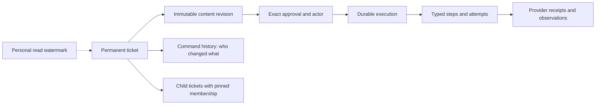
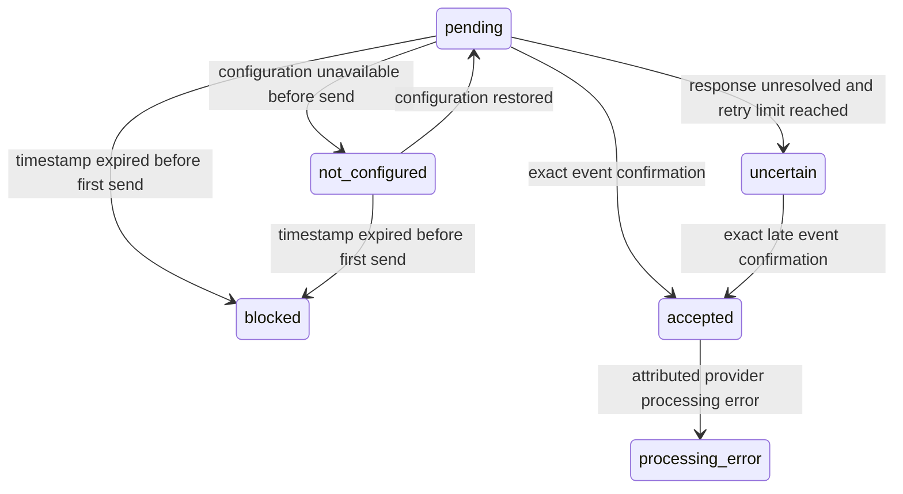

# FLO-1355 — revised design v12

17 September 2026 · Corrected design for independent review · Implementation paused

**This version applies the v11 review corrections directly.** It closes the lost-cleanup-response dead end without inventing non-application, specifies exact successful DELETE response variants, and makes the same-release automatic recovery limit explicit. The accepted architecture remains the foundation. Permanent tickets, immutable revisions, exact approvals, stable children, typed provider boundaries and the existing Actions/BullMQ architecture remain the design. This is a documentation specification; it is not migrated DDL, a passing implementation or a deployment.

Source checkpoint: platform HEAD `f0b1af5fc5925d818be7d9b02b42b1fc54556ecc` plus the preserved uncommitted prototype; all 215 source-manifest entries matched fingerprint `22c54c4352f996d8620b7aa90a8b66b5ca872061c093ba9715703390921f2cbf` during this review. No main refresh or platform edit was performed. The existing 31-table/497-column catalog describes that prototype, not these corrected contracts.

## The product contract

- One organization-owned ticket and URL survive edits, approvals, waits, retries and completion. Parent and child work use the same ticket identity model.
- Proposal revisions and selected batch membership are immutable. Approval records the exact revision, actor, channel/delegation, scope and server Undo deadline. Changing approved content requires fresh approval.
- Read/unread is personal. Lifecycle, owner, schedule, snooze, approvals and outcomes are shared, attributable facts. Counts and paginated lists use the same eligibility/visibility predicate with an explicit parent/child counting scope.
- A concrete draft can be approved while waiting for an editable release. It stays the same approved ticket, shows the prerequisite, and resumes when eligible. Whole-package waiting keeps editing available until the first actual write/generation admission.
- Mission Control shows one list grouped by due month, with due work visible once and completed work collapsed. Its projection does not create a second workflow authority. The underlying changes apply to all entrypoints.
- Durable SQL obligations own acceptance and recovery. BullMQ transports wakeups. Queues, browser memory and timers do not own approval, completion or Undo.
- Success requires evidence at the appropriate surface. Approved, applied to editable content, published live and measured are distinct. Uncertain external delivery remains visible.



The diagrams summarize relationships. The field tables and invariants below define the contract. Unchanged relations retain their pinned definitions in the existing end-to-end packet and source catalog; changed contracts here take precedence over earlier prose. No JSON/JSONB, serialized executable payload, arbitrary property/value map or generic SQL job table is introduced.

## Retained schema and product contracts

This appendix carries forward the accepted contracts that the v12 execution and Usage corrections do not replace. It describes the proposed design, not shipped behavior. v12 is authoritative for scheduling, inspection and binding, evidence/finality, retry and reconciliation, reopening, Usage, and privileged erasure. Earlier predicates for those areas must not be reinstated from this appendix.

### Exact Actions relation inventory

The proposal has **28 Actions relations**: 25 in `actions`, two in `app_store_connect`, and one in `apple_ads`. Names below are physical relations, not views.

| Responsibility | Relations |
|---|---|
| Durable work and immutable content identity | `actions.action`, `actions.action_revision` |
| Structural relationships and exact revision membership | `actions.action_membership`, `actions.action_dependency` |
| Personal read state | `actions.action_read` |
| Attributable commands and exact results | `actions.action_command`, `actions.action_command_target` |
| Authority | `actions.action_approval`, `actions.action_policy_revision` |
| Durable execution and exclusion | `actions.action_execution`, `actions.action_execution_step`, `actions.action_execution_attempt`, `actions.action_resource_guard` |
| Stable old links and provenance | `actions.action_alias`, `actions.action_revision_source` |
| Singleton content families | `actions.action_review_content`, `actions.action_listing_content`, `actions.action_request_content`, `actions.action_advisory_content`, `apple_ads.action_content` |
| Repeated content facts | `actions.action_media_content`, `actions.action_content_note`, `actions.action_content_term`, `actions.action_market_country`, `actions.action_market_competitor` |
| ASC-specific targets and upload/binding contracts | `app_store_connect.listing_contract`, `app_store_connect.step_contract` |
| Typed provider evidence | `actions.attempt_receipt` |

Relative to the preserved 31-table draft, replace `app_store_connect.attempt_receipt`, `google_play.attempt_receipt`, and `apple_ads.attempt_receipt` with **one** `actions.attempt_receipt`; remove `google_play.listing_contract` after moving its fields below. Arithmetic: 31 − 3 + 1 − 1 = 28. The two new Usage relations are separate from that subtotal; the existing Usage credit log is modified, not a third new relation.

Keep the projection views `action_listing_contract`, `action_execution_step_contract`, and `action_execution_attempt_contract`; the last becomes a join against the single receipt relation. Views add no independently mutable facts. History remains a projection of immutable commands, revisions, approvals, attempts and evidence, rather than another generic event table.

No further consolidation is silently assumed. Combining notes/terms, removing dependencies, or adding a research leaf remains a separate decision. A merger must preserve the actual foreign-key owner, subtype restrictions, ordering, country validation and meaning rules. Countries and competitors belong to request content; a generic key/value collection would lose that contract. One-to-one subtype separation is a design choice, not something normalization mandates.

### Listing fields moved into the common content row

The PK remains `(organization_id, revision_id)`. Move these exact fields into `actions.action_listing_content`:

| Field | Type / presence |
|---|---|
| `provider_account_id` | text NOT NULL, frozen account identity |
| `package_name` | text NULL; present exactly when `store='android'` |
| `google_edit_id` | text NULL; Android observation evidence only, never a proposal target |
| `play_commit_policy` | closed `google_play.play_commit_policy` enum NULL; required on an Android proposal; absent on iOS |
| `release_selection` | closed enum `exact_release` / `next_editable_release`, NOT NULL, default exact_release |

`app_store_connect.listing_contract` drops its duplicate `provider_account_id`; the common row is the sole authority. Remove `google_play.listing_contract`. Proposals always have `google_edit_id IS NULL`; observations may carry the edit actually inspected. `next_editable_release` is iOS-only and limited to intents update/create. Its exact target-binding, baseline and field-effect rules are defined in v8; do not restore the former immediate-write behavior for mixed fields.

### Closed advisory and request shapes

Both content relations have `(organization_id,revision_id)` as PK and `evidence_completeness` as a NOT NULL closed enum: complete/historical_incomplete, default complete. The matrices below are exhaustive for subtype-specific columns: **required** means non-null, **optional** means nullable, and every unlisted subtype-specific column must be NULL. They do not forbid the common identity, discriminator or completeness columns. Use NULL-safe SQL CASE branches and the same closed wire variants.

`primary_link_label` and `primary_link_path`, where optional, appear together or are both absent. Internal link paths retain the existing internal-path validation. `consecutive_failures` is a non-negative integer on storage and wire; producers must stop stringifying it.

| Advisory `kind` | Required fields | Optional fields |
|---|---|---|
| connect_source | source_label, benefit, primary_link_label, primary_link_path | none |
| store_app_access_lost | connector_source_id, connector_type, connector_name_snapshot, detail | last_success_at, consecutive_failures, last_error, app_name_snapshot, bundle_id_snapshot, scraping_account_email_snapshot, primary_link_label, primary_link_path |
| agent_attention_needed | agent_source_id, consecutive_failures, last_error, detail | last_success_at, primary_link_label, primary_link_path |
| onboarding_audit_recommendation; optimize_keywords; improve_retention; adjust_monetization; update_store_listing | detail, impact, effort, confidence_label, quick_win_source_id, audit_store, audit_store_app_id, audit_country, audit_locale, audit_generated_at | proposed_next_step, confidence_score, recommendation_type, market_label, gate_text, capability_tier, primary_link_label, primary_link_path |
| stage_blocker | blocker_reason_text, unblock_title, unblock_what_happened, unblock_why_it_matters, unblock_next | blocker_reasoning, unblock_cta_label, unblock_cta_path, primary_link_label, primary_link_path |
| review_finding; aso_review_needed; flag_issue; escalate | detail | suggestion, source_label, benefit, impact, market_label, primary_link_label, primary_link_path |

`unblock_cta_label` and `unblock_cta_path` are both present or both absent. Existing closed enums remain closed: severity/impact/effort/confidence labels low/medium/high, connector kind, recommendation kind and store kind. `capability_tier` remains 1–3. Scalar explanatory prose is text; it is not an extensible payload or a behavioral discriminator.

| Request `intent` | Required fields | Optional fields / repeated facts |
|---|---|---|
| locale_expansion | store, locale, origin | wave_index, language, reasoning, score, demand_lookback_days, downloads, revenue_usd, impressions, review_count, competitor_strength, localized_competitor_count, top_chart_count, estimated_market_downloads, market_research_note, plan_source_id, operator_instructions, hypothesize_policy, draft_policy, execute_policy; country and competitor child rows |
| listing_change | store, locale, recommendation_type, origin | plan_source_id, source_capture_at, finding_title, finding_rationale, finding_severity, context_text |
| review_catch_up | window_days, review_mode, origin | store, hypothesize_policy, draft_policy, execute_policy, operator_instructions |
| review_analysis | window_days, origin | store, focus, context_text |
| wake_agent | requested_agent_id, origin | operator_instructions, focus, context_text |

The policy triple is all present or all absent; each value is auto/await. The finding triple is all present or all absent. `review_mode` is manual/full_agentic. `origin` is scheduled_agent/user_directed_chat_or_mcp/human/system. Keep the supported store/locale catalog, positive lookback, nonnegative wave index, and 7–180 day window checks. Country rows store `(organization_id,revision_id,role,ordinal,country)`; competitor rows store `(organization_id,revision_id,ordinal,competitor_name)`. They are permitted only for the locale-expansion subtype; they are not arrays or open metadata.

**Incomplete history is not executable work.** historical_incomplete may relax required content values only for an immutable import authored through the migration channel. It does not relax forbidden fields, discriminator agreement, tenant rules or known value constraints. Both approval and execution admission refuse it with incomplete_revision. A migration may retain only facts that are proved; completing such a ticket requires a new, fully populated revision and a fresh decision. No historical approval or membership is inferred to make an import pass.

### Links, source provenance and actor retention

`action_alias` fields remain `organization_id`, closed `namespace`, `old_id`, `action_id`, and `historical_membership_known boolean NOT NULL`; PK `(organization_id,namespace,old_id)`. Add namespaces backlog_item and stage_blocker_card. Known old item, card, batch and receipt links resolve to the permanent ticket. `historical_membership_known=false` explicitly says an old package's exact membership cannot be established; it never authorizes reconstructed children or retroactively certifies a batch approval.

`action_revision_source` retains its closed kind and exactly one matching non-null source column: `source_recommendation_id`, `source_variant_id`, `source_report_version_id`, `source_backlog_id`, `source_experiment_id`, `source_agent_run_id`, or `source_action_id`. Add `source_present_at_insert boolean NOT NULL DEFAULT true`. True requires the exact live source and same tenant at admission. False is migration-only for an already-deleted source; show “source not available at import.” The source identifiers remain opaque historical values after referent retirement; none is executable authority.

Remove referent-retention FKs for those source columns and for `action_command.actor_agent_run_id`, `actor_slack_integration_id`, `actor_discord_integration_id`; keep the values. Validate existence and same tenant when a new attributable command is admitted. `actor_user_id` and `actor_api_key_id` retain FKs with the precise erasure nullification exceptions. API-key admission checks both its organization and its user against the recorded actor. The immutable actor subject and command attribution must survive routine integration/run cleanup without pretending the actor is still active.

`action_request_content.requested_agent_id` is retained exactly after the agent's retirement; its referent FK is replaced by live same-tenant validation on admission. Execution additionally checks that exact agent is still enabled and authorized; disappearance yields a permission hold, never substitution. Attempt `connector_id`, `agent_run_id`, `output_agent_run_id`, and `output_review_analysis_id` likewise retain their exact historical values after permitted referent retirement. Active authorization and generated-output admission still require the real live object, correct tenant/asset and completed output as applicable. Outstanding-output protection, concurrency with deletion, and erasure use **v8's** effective-evidence rules, not an unfinished-only check. Historical reads use LEFT JOIN and retain the fact when the referent is absent.

Ordinary asset deletion remains soft deletion while tickets reference it. Organization/account erasure and synthetic-asset erasure must use the scoped, tested authority and graph closure defined in v8. Database roles and grants are verified release gates; a session setting alone grants no authority. Intra-Actions ownership and tenant FKs remain intact.

The synthetic-asset graph erasure entry point runs through narrowly granted SECURITY DEFINER functions owned by fload_erasure, with a fixed qualified search path and function-validated asset scope. It refuses an unresolved issued write or unresolved generation, uses the v8 Actions→Usage lock order, and settles/protects usage before removing execution references. Delete dependent reads, receipts, attempts, steps, executions, approvals and command targets in FK-safe order; keep a multi-asset command if any target survives. Then remove the asset's revisions/content/provenance/aliases/memberships/dependencies/policy revisions and actions, after checking inbound structural references are in scope. Preserve global resource-guard identity, surviving command history, Usage invocation/settlement records and their immutable attempt_ref. Nullable Usage attempt_id is cleared only by authorized FK erasure. Org-wide advisories and opaque historical source_action_id values remain. Cross-scope dependencies must block erasure or be included by an explicitly validated graph, never silently cascaded. Account/organization erasure is a separately authorized scope with its own retention requirements; it cannot borrow synthetic-asset eligibility.

### Parent selection and approval ownership

A parent is itself a ticket and can have its own generation or revision obligation. Its `decision='approved'` exactly when it holds `current_approval_id`, just as for other tickets. A parent's own iterate/generate approval and Undo are commands on that parent, not inferred child decisions.

A selection approve/Undo locks and pins the parent and its current membership, verifies every selected child revision, and refuses while the parent has an unsettled execution of its own. The parent participates in the command with `version+1` and unchanged decision, approval, owner and placement. Selected children get their exact approvals or cancellations. **No selection command fabricates a parent approval or parent execution.**

Approval coverage is a projection: approved_members are current members whose child approval pins both the current parent revision and the member's exact child revision. A child approved separately is reported as outside_membership. Changing a package's membership requires a new immutable parent revision; new reviews or languages never silently join an existing approval. Parent progress is derived; parent identity and membership are persisted.

### One list/count predicate and separate personal attention

Keep scope top_level/children/all (default top_level), identically applied to list and count and bound into the signed cursor. In top_level, select roots whose own row or current-membership child matches; return matched_children. Use server-side cursor pagination without a hidden actionable-row cap.

* needs_decision: a standalone ticket in needs_approval/uncertain/failed/blocked; or a parent with its own decision obligation or a current-member child in such a state.
* in_progress: queued/working/verifying/waiting, excluding rows already in needs_decision. needs_attention is their union.
* A container whose children are complete/declined and which has no own obligation projects completed, regardless of its stored open decision. Waiting for an editable release is in_progress, not needs_decision.
* Root archive/snooze controls root placement. A child's snooze does not hide its parent. unreadOnly means the root is unread or any relevant child is unread.

Mission Control is one top-level work projection with Due now first, then future months, with collapsed Done groups. Month placement uses v8's separate `scheduled_for`; do not reuse snoozed_until. Done placement uses the closing command's accepted_at. Each group has server counts and a cursor with the same eligibility predicate. State chips and available actions come from the shared read model; v8's admission rules control editing, scheduling and waiting behavior.

Personal state remains `action_read(organization_id,user_id,action_id,seen_attention_version,force_unread,updated_at)`. Marking read never changes workflow state. Attention increases for meaningful revision, approval/Undo, reopen, reject/acknowledge, external resolution, supersession, replacement of declined content, assignment to another person, and deduplicated visible progress transitions. Snooze/unsnooze, schedule/unschedule, archive/restore, self-assignment, retry, reconcile, resume_hold and binding alone do not create unread churn. Entering waiting creates one visible attention change, not one per poll. Schedule/unschedule changes workflow version only for every actor, with no owner-dependent exception.

A user command other than schedule/unschedule may advance only that actor_user_id's watermark, never acting_for_user_id's; only directly targeted tickets; only if the old watermark equaled OLD.attention_version. It never clears force_unread. Worker evidence and workflow version behavior follow v8's exact command guards rather than an assertion that every evidence append mutates the ticket head.

### Review identity, rejected-source replacement and cutover

All review producers use `reviewWorkCreationKey(org,store,providerAppId,providerReviewId)` with unique `(organization_id,creation_key)`: catch-up generation, sync, agent, HTTP and chat materialize the same ticket. Existing historical rejection rows import as declined tickets with their source fingerprint; rejection suppression remains active until that import is complete.

`replace_declined` is an atomic revise mode: exact current pins; decision declined; source fingerprint changed meaningfully in rating/body/title/provider-edited flag (`modifiedAt` alone is insufficient); no unresolved effects under v8. Install a new proposal whose baseline is the fresh source observation and reopen in one transaction, or change nothing. Use `stableUuid('source-change:' + actionId + ':' + sourceFingerprint)` as its idempotency key; retain the original rejection history. Automatic discovery may reconsider a declined ticket only through this mode.

Normalize Apple reply text and reject unsupported angle brackets before sealing. ASC listing comparison uses the versioned normalizeListingComparisonText rule with comparison_version 2; never mutate sealed content to normalize it later. Delegation's closed database and wire shapes admit chat alongside the already supported delegated channels; MCP authority remains canonical and unchanged.

Cutover is coordinated: convert the inventoried producers, retire the three legacy approval→platform-execution routes and both scheduled ASO direct writers, import and reconcile source data, then switch readers. The inventory's nine producer families are the checklist, not a claim that producer conversion is complete. Actions-covered write transports may be imported only through the Actions provider boundary; connector setup, credential/session refresh, provider internals and read-only inspection remain explicit exceptions. Test that boundary.

The default end state has one authority and no legacy execution fallback. A temporary backlog read projection is permitted only for an explicitly necessary phased cutover, with the durable ticket winning via backlog_item/stage_blocker_card aliases and list/count deduplicating identically. It must have a removal gate. Old links remain valid after old runtime tables and writers are retired; unknown approval content, outcomes or membership remain explicit migration blockers or non-authorizing history, never fabricated success.

### Remove the unused approval authorization field

Omit `authorization_version` from action_approval and remove `action_approval_authorization_version_check`, the Drizzle field, constant insert, wire field/projection and fixture assertions as part of implementation. Regenerate the unpublished design migration and revised catalog and keep wire/Core/database parity. Do not replace it with a new rule-version registry, JSON object or placeholder subsystem.

Authorization remains the existing explicit structure: approval pins revision/scope/required surface and, where applicable, exact policy_revision_id; command records the canonical actor. Admission rechecks current actor/policy/entitlement and exact approval/revision/fence. Read-only recovery keeps its separately limited authority for issued effects. `recovery_policy_version`, content canonicalization version and actual policy revision identity remain because they select concrete behavior; they are not replacements for the removed dummy field.

## Actions execution, evidence and provider safety

### Typed inspection purpose and write consumption

Keep `inspection` as a read-only attempt on `asc_editable_release_bind`. Add `inspection_purpose = {binding, prewrite}`. Use grant source `observation_grant_kind = {initial, reconcile, event}`; remove `prewrite` from that enum. Purpose and source have different determinants.

Add these columns to `action_execution_attempt`:

| Column | Type | Shape |
|---|---|---|
| inspection_purpose | inspection_purpose NULL | Required exactly for an inspection; late evidence copies its original inspection's purpose; otherwise NULL. |
| planned_write_step_id | text NULL | Required exactly for a prewrite inspection and its late evidence. FK `(organization_id, execution_id, planned_write_step_id)` to step `(organization_id, execution_id, id)`. |
| prewrite_attempt_id | text NULL | Only a write or its late evidence may carry it. FK `(organization_id, execution_id, prewrite_attempt_id)` to attempt `(organization_id, execution_id, id)`. |
| resource_guard_generation | bigint NULL | Positive; required for a write and a prewrite inspection, copied by their late evidence; otherwise NULL. |

Add `action_resource_guard.acquisition_generation bigint NOT NULL DEFAULT 0 CHECK (acquisition_generation >= 0)`. Acquiring an unheld guard increments this value; retaining the same holder does not. Releasing never decrements it. Add the composite UNIQUE keys required by the two FKs above.

Partial UNIQUE `(organization_id, prewrite_attempt_id) WHERE kind='write' AND prewrite_attempt_id IS NOT NULL` makes an inspection consumable once. Late evidence does not consume it again. The existing one-unfinished-attempt-per-execution index remains.

`guard_prewrite_admission` validates a prewrite inspection **without requiring a future write row**: current approval and revision; current live claim; same execution; `planned_write_step_id` is the next eligible external write step under the approved plan; all preceding dependencies are satisfied; same canonical resource; guard held by this execution at the recorded acquisition generation; no unresolved issued write. The inspection's binding target comes from the immutable binding evidence, never a new release choice.

`guard_write_prewrite` runs when a write is inserted on a listing execution whose approved revision has `release_selection=next_editable_release`. Other existing provider operations keep their exact-target admission contracts and must leave `prewrite_attempt_id` NULL. Within this binding flow, the first write in each guard-acquisition generation requires `prewrite_attempt_id`. An explicit retry of a definitively non-applied write also requires a fresh prewrite, even if the guard was retained. The referenced inspection must be finished `matched`, complete, target-valid, for this exact planned write step, same live claim generation/token and guard acquisition generation, and unused. Writes continuing an uninterrupted guard generation after a resolved predecessor do not require another whole-package prewrite. An inspection finished under an expired, cancelled or replaced claim cannot authorize a write.

### Prewrite budget and complete outcome handling

Initial binding budgets are keyed by `(step_id, inspection_purpose=binding)` and start at the first admitted initial binding inspection. Initial prewrite budgets are keyed by `(execution_id, planned_write_step_id, inspection_purpose=prewrite)` and start at the first admitted initial prewrite inspection for that key. The step's closed policy version supplies maximum observations, window and backoff. Count actual inspection starts, including failed, expired and cancelled inspections; exclude the row being finalized when checking admission counts. Grant limits are checked on INSERT, not again as though finalization were another admission.

A `reconcile` grant has its own accepted-command start/window and count for the exact purpose and planned step. It permits observations only: write insertion still requires `allowNewEffects=true` from the current approval/accepted retry state. For inspections, an accepted event supplies one bounded grant for the exact binding obligation, never a prewrite; a publication event may supply one bounded readback grant for its exact issued subject. The event count/window/closure rules below govern all starts under that grant. Timers do not renew a budget. Resource contention consumes no observation budget because no inspection is admitted.

Derive effect permission per step from the still-current original approval and accepted retry facts, not from the kind of the latest recovery command. Reconcile adds observation capacity without revoking original approval for a never-attempted planned effect. Thus an exhausted prewrite can be reconciled, match, and allow the first write under its original approval after all current authorization gates pass. Resending an already-attempted effect still requires definitive non-application and the explicit retry/budget contract. Replace the prototype's global `latest reconcile => allowNewEffects=false` derivation; otherwise a successful prewrite recovery before any write is stranded. Reconcile itself grants no new mutation authority.

### Inspection transitions — purpose-specific and total

#### Binding purpose

Add the single closed `action_unreadable_reason` value **no_editable_release** to SQL, Core and wire. It is allowed only when the original interaction kind is inspection, inspection_purpose=binding, and step kind asc_editable_release_bind; apply the same restriction to its late completion through the original subject. A cancelled/replaced inspection’s late result remains non-authorizing evidence under the existing fence rules. It records the absence of a compatible editable release after a **successful, complete, correctly scoped provider collection read**. Require a successful native receipt and the exact grant's provider/account/app scope. The versioned decoder must validate pagination/completeness before constructing this value. No user input, HTTP failure, truncated page or transport exception can construct it. It is the recorded closed readiness fact, not a claim that a provider write was made.

Reserve `unavailable` for a failed/unavailable provider read. This small enum distinction replaces v8's ambiguous use of unavailable for both network failure and “no release.” No new payload or table is added.

| Binding outcome | Transition |
|---|---|
| `matched` | Persist exact binding evidence and atomically append static steps once. Dynamic reservation plans remain incomplete. Proceed to required prewrite under original authority. |
| `mismatch` | `blocked/target_changed`, NULL due; no automatic retargeting or event retry. |
| `unreadable/no_editable_release` | `blocked/awaiting_release`; bounded next_run_at while an applicable grant has capacity, otherwise NULL. Exhaustion does not turn this readiness fact into unsupported_readback. |
| `unreadable/unavailable` or `unreadable/partial` | If the last authoritative binding readiness fact was no_editable_release and no later complete binding superseded it, retain awaiting_release with the bounded due/NULL rule; display the failed latest check and date of the last readiness fact. Otherwise ready with bounded due while capacity remains; on exhaustion blocked/retry_exhausted with binding_observation_budget qualifier and NULL due. Do not invent a no-release fact. |
| `unreadable/unsupported` | blocked/unsupported_readback, NULL due; no automatic inspection. |
| Inspection expiry | Finish unreadable/unavailable; use the preceding row. No write uncertainty is fabricated. |
| Command cancellation | Finish unreadable/cancelled under its command fence; use the schedule/edit/Undo command's defined transition, not this provider-outcome table. Late results are history only. |

An applicable release_detected event supplies a bounded binding grant only when the exact pending obligation is binding, no write/generation was admitted, and the execution is either blocked/awaiting_release or blocked/retry_exhausted with binding_observation_budget. The second case enables recovery after transport-only failures without pretending a no-release fact exists. Persist the exact step scope in the event command. Require the same execution, approved target, stable provider-version identity and current authority; recheck approval, policy, entitlement, Undo and schedule before event acceptance and each inspection. Unsupported/prewrite/target-changed/diagnostic holds do not qualify. An inapplicable or premature event creates no row and consumes no deduplication identity. The event conveys a reason to inspect, not a binding or approval.

Existing release/review sync workers must offer their typed currently-observed readiness events on each successful relevant sync, not only once on a detected edge. After a future schedule becomes due, the same observed provider version can therefore be admitted if earlier offers were ignored. Once accepted, the event uniqueness key prevents fresh budgets from repeated syncs of that version under the same actual scheduling decision. A later actual schedule/unschedule change uses the distinct context defined below; a no-op date command does not renew capacity. No API timer/listener or new queue is introduced.

#### Prewrite purpose

Keep v8's prewrite release predicate and no-provider-write-before-durable-admission rules.

| Prewrite outcome | Transition |
|---|---|
| `matched` | Current live claim may consume the inspection exactly once for its pinned write, provided new-effect authority still applies. A reconcile-only observation never invents resend authority. |
| `mismatch` | Persist evidence; blocked/target_changed, NULL due; no write. |
| `unreadable/unavailable` or `unreadable/partial` | Ready with bounded observation backoff while an applicable grant has capacity; otherwise blocked/retry_exhausted, prewrite_observation_budget, NULL due. No write. |
| `unreadable/unsupported` | blocked/unsupported_readback, NULL due; no write. |
| Expiry | Finish unreadable/unavailable and apply that bounded rule; no synthetic uncertain write. |
| Command cancellation | Use the existing command-fence path, not a provider mismatch. |

On every non-match, release inspection-only exclusion in the same transaction **only** through prewrite_release_allowed, including its whole-execution no-unresolved-write and no-conflict checks. Readiness events never grant a prewrite. A fresh reconcile supplies bounded inspection capacity, not a new approved payload or an automatic resend.

Inspection marks: matched/mismatch require fingerprint/version and `terminal_outcome=FALSE`; unreadable (including no_editable_release) has NULL terminal/fingerprint/version marks. An inspection never establishes request_final. Its matched result is readiness/baseline evidence, not request completion.

### Runnable guard/read/write transactions

**P1: durable prewrite admission.** In one transaction lock action IDs in order, execution, then canonical resource guard. Recheck approval, policy, Undo deadline, schedule, execution phase and grant. Acquire/retain the guard and its acquisition generation under the explicit **prewrite admission** exception. Persist the claimed execution with `next_step_id` set to the inspection step and insert the unfinished prewrite inspection. Commit. No provider I/O occurs inside this transaction.

**P2: provider inspection.** Read the exact bound version/localization and all relevant approved conditions through the authenticated adapter. Keep the durable guard held. Capture a complete typed observation; partial information cannot become `matched`.

**P3: finalize and admit the write.** Lock action IDs, execution and guard again. Require the same live claim and guard generation. Insert the receipt and sealed observation, then finish the inspection. If matched and new effects remain authorized, set `next_step_id` to its planned write step and insert the write with `prewrite_attempt_id`, same claim and guard generation. Finish the inspection before inserting the write, preserving the one-active-attempt index. Commit, then send that one provider request through the existing immediate dispatch fence. Receipt/observation validation may be deferred to commit; authority and admission checks remain immediate.

On mismatch/unreadable, persist the outcome and hold/backoff instead of inserting a write. Release the guard only when no write remains non-final; never release it merely because an inspection failed while earlier native work is unresolved. On lost claim, append late evidence only. A new owner cannot consume the old prewrite; it must revalidate under its own claim.

The guard-acquisition rule is therefore: allowed in the transaction admitting an authorized prewrite inspection, or for an operation whose existing exact-target contract does not require this binding prewrite. It is no longer restricted to a transaction that already inserts a write.

The Fload guard excludes Fload writers. It does **not** exclude external console changes. Without a supported conditional provider mutation, B→external Y→Fload X→readback X can conceal Y. After-effects verification establishes the final observed value; it does not promise to detect or prevent every overwritten external edit.

### Cancellation and schedule fences without violating immediate guards

Undo, edit, reject, schedule and unschedule require **zero admitted write/generation attempts**, finished or unfinished. Undo additionally requires its server deadline. Schedule/unschedule retain the existing approval and execution; they do not cancel that execution.

For a command racing an inspection, use this order in one transaction:

1. Acquire the idempotency lock, ordered action locks, execution and held guard. Insert the accepted command and target using the established command-at-commit protocol.
2. Advance to a fresh claim generation/token while retaining a valid claimed execution. A narrowly scoped command-fence exception permits replacing the prior live claim only for these accepted targeted commands, with zero write/generation attempts; it is not a general worker claim-stealing exception.
3. Finish any inspection with `unreadable/cancelled` and that new finalization fence.
4. For undo/edit/reject, set execution cancelled and clear the claim. For schedule/unschedule, retain approval/execution and recompute the pending obligation from immutable evidence using the purpose-specific table below. An unsuperseded complete no-release fact preserves blocked/awaiting_release even after cancelling a claimed binding inspection; only without that fact does ready versus retry_exhausted depend on capacity. Clear claim/next-step claim, advance delivery generation and apply the ticket change. Release inspection-only exclusion through prewrite_release_allowed.

Only step 4 enters a terminal phase, after the inspection is finished, so the immediate no-open-I/O terminal guard remains valid. A late worker's old token cannot dispatch or extend a plan. The command's accepted target authorizes both the exceptional fence advance and inspection cancellation.

### Immutable effective evidence, receipts and manual observations

Add partial UNIQUE `(organization_id, subject_attempt_id) WHERE kind='late_evidence'`. There is at most one late completion record for one original interaction. Repeated persistence of the same late completion returns its existing row only when all immutable outcome, receipt, observation and output fields agree; a different completion is rejected as an evidence conflict. A provider status lookup is a **new readback attempt**, not another late completion of the original request.

Define `effective_evidence(original_attempt_id)` as one typed record containing the selected evidence row ID, original interaction identity, result, reason/basis, terminal mark, observation/output references **and that selected row's receipt**:

- Original unfinished, `uncertain` or `unreadable`: use its admitted late completion if present; otherwise the original row.
- Original definitive result: retain it. A contradictory admitted late completion is preserved, but produces a closed `evidence_conflict` hold; it is never silently used to authorize retry or success. Add that hold reason. Ordinary workers may perform request-correlated readback while held, but cannot issue a new effect, settle success or reopen from contradictory evidence. This is an explicit operator diagnostic hold with **no automatic resolution**: readbacks may enrich its history but cannot themselves clear this hold, release its exclusion, settle success, or authorize a new effect. Ordinary retry/reopen cannot manufacture its resolution. Resolving contradictory native evidence requires a separately reviewed repair outside this ordinary execution contract.
- For a late readback/inspection, follow the original interaction to recover its typed subject and authority. Native receipt facts come from the selected completion; absence is not filled from an unrelated read or another request.

All reads of result, receipt, observation and output for the shared predicates use this single resolver. Thus a timed-out write with no receipt can gain request Q from late `accepted_pending`, and a subsequent terminal readback can correlate with Q. `unreadable` may improve through its one late response, matching the preserved Core behavior.

Manual observations are manager-attributed, internal, subject-write-linked records, with `terminal_outcome IS NULL`. A manual `matched_external` records the manager's observed desired state; it is not native request-finality evidence and does not by itself establish `verified_live` or `verified_editable`. Display its actor and evidence source explicitly. A manager-triggered canonical provider read can supply an ordinary external readback observation through the same native validation path; the human trigger does not weaken its evidence requirements. A user-authored baseline refresh remains an attributed sealed observation on the open ticket and grants no execution authority.


The observation-marks matrix replaces all earlier variants:

| Effective interaction kind and row result | terminal_outcome | semantic_fingerprint / fingerprint_version |
|---|---|---|
| write or generation, any result | NULL | both NULL |
| readback or inspection, unfinished or unreadable | NULL | both NULL |
| readback, matched/matched_external/mismatch | non-NULL boolean | both required |
| exact temporary_edit_quiescent native cleanup readback, matched | TRUE; narrow contract above required | both required; non_application_basis/retry_disposition NULL; exact native receipt mandatory |
| inspection, matched/mismatch | FALSE | both required |
| readback, known_not_applied | TRUE | both NULL |
| manual_observation, matched_external/mismatch | NULL | both required |
| manual_observation, unfinished/unreadable | NULL | both NULL |

For a late row, select the matrix branch by its original interaction's kind and the late row's result. `grant_kind` and `grant_command_id` must both be NULL for late evidence; its inspection purpose, planned-write link and resource generation are copied identity facts, not another grant admission or consumption. Ordinary readbacks/inspections require a grant; ordinary writes, generations and manual observations forbid grant fields. Initial grants have NULL command IDs; reconcile/event grants require their exact accepted command IDs.

A released guard retains `acquisition_generation`. Every acquisition from unheld to held increments it, including reacquisition by the same execution. All current prewrite/write admission and final dispatch checks require the stored generation to equal the held guard's generation. Late evidence copies its original generation without requiring it to remain current and may never reacquire or alter a guard. An expired inspection's old evidence cannot authorize a write after another execution acquires/releases the same resource.

### Persist captured confirmation without repeating I/O

For each provider write, readback or inspection completion, capture one immutable completion envelope before finalization: original attempt identity/fence, decoded outcome and basis, native receipt fields, observation bytes and capture time/comparison version, and any exact upload manifest. Allocate deterministic evidence/observation/step IDs once. Reuse that envelope; do not re-read the provider, regenerate IDs, re-encrypt the upload manifest differently, or alter observed content between persistence attempts.

A delivery may submit finalization at most four times (initial submission plus retries after 100 ms, 500 ms and 2 s). Retry only transient connection/transaction failures or an ambiguous commit response. Do not retry a deterministic validation/authorization/constraint error as though it were a transient outage. Every transaction reacquires the documented locks and reads database time/claim state; a local timer never extends a lease. No provider request is repeated by this loop.

At the start of every finalization submission:

1. If the original attempt is already finalized with the same captured native facts and exact receipt/observation/manifest references, return its committed result as success. Do not append late evidence, repeat plan expansion, mutate history/attention or re-run settlement. Database-generated commit/finalization timestamps need not equal the retry's current clock.
2. If an identical late completion is already present, return it as success. A different completion follows the explicit evidence-conflict rule; never overwrite it.
3. If the original attempt remains unfinished and this claim is live/current, atomically persist the envelope, finalize the attempt, append any authorized manifest and update the execution. Normal current-claim plan mutation requires the exact live fence.
4. If the lease expired, the claim was replaced, or the original attempt was finalized uncertain/unreadable in recovery, persist the captured response only through the existing single late-completion path. Do not extend a plan, consume prewrite authorization, dispatch, or change a newer ticket head from that late response.
5. If the original already has a different definitive result, preserve the contradictory captured completion through the existing attributable evidence-conflict path and stop ordinary processing. Neither a generic retry nor the stale-response branch may replace that known result or release exclusion.

An ambiguous commit must be resolved by reading the durable attempt before attempting another finalization mutation. Its identical committed result wins even if the claim is now expired or the execution advanced. If persistence remains unavailable after the bounded submissions, stop this delivery; the already-durable intent and SQL recovery obligation remain. On lease expiry recovery classifies the unfinished write uncertain and performs permitted native readback before any resend. Losing an in-memory completion cannot justify repeating the write or claiming confirmation was persisted.

The same no-repeat-I/O principle applies to a captured generation output; its adoption remains subject to the existing exact-head CAS and output-recovery contract.

Acceptance: provider ACK → transaction rollback → identical finalization succeeds with one send; commit succeeds but response is lost → retry returns committed original without a late row or duplicate manifest; lease expires before confirmation → one late row, no plan mutation; four transient persistence failures → durable recovery obligation, no resend; known validation error is surfaced without a persistence retry storm.

### Native content results and request finality

Use the following closed meanings for **native readbacks** and their effective late completions:

- `matched`: complete authoritative observation equals the exact approved desired values at the reported surface and comparison version. This states observed content, not who wrote it. Request correlation is **not** required merely to record this result.
- `matched_external`: the same complete content equality, plus proof that this execution did not apply the relevant effect. The subject write and every other write attempt for that exact effect/step must satisfy `write_definitively_not_applied` below. No attempt for that effect may retain applied, unfinished, unresolved or conflicting evidence; a historical uncertain row may qualify only after exact native evidence has definitively resolved it as non-applied. Otherwise use `matched`; do not infer external handling from an absent receipt.
- `mismatch`: complete authoritative observation differs from the approved desired values. Unknown/partial data is `unreadable`, never mismatch.

An explicit native `matched_external` trigger validates the above effective-evidence checks. It follows the original readback's subject through a late-completion row. Manual observations retain their separate internal, manager-attributed rules and `terminal_outcome=NULL`; they are not native verification.

For native readbacks, `terminal_outcome=TRUE` means the pinned operation contract establishes **no remaining effect from that issued write**: validated terminal completion/non-application by request correlation, the closed Play edit-expiry rule, or the exact temporary-inspection-edit quiescence rule below. The last proves safe effect closure without proving whether the DELETE applied. It never reclassifies the original write as known_not_applied. A GET's own response/request ID is not automatically the earlier write's request correlation. When only desired content was observed, use `terminal_outcome=FALSE`; finality may nevertheless already follow from the write's own terminal acknowledgement or definitive non-application.

`content_established(W, surface)` accepts a complete native `matched` or valid `matched_external` at the exact required surface without requiring `terminal_outcome=TRUE`. `request_final(W)` retains its terminal-acknowledgement/non-application/correlated-readback alternatives and the narrowly scoped temporary-edit-quiescence alternative below. This is the predicate for safe effect closure; it does not by itself assert a confirmed HTTP response or causal attribution. Success requires both predicates, plus plan and unfinished-attempt rules. `handled_externally` additionally requires definitive non-application for every relevant Fload effect; `matched` never supplies that provenance.

`write_definitively_not_applied(W)` is true only with consistent effective evidence of (a) the write's validated known_not_applied result, or (b) a complete native known_not_applied readback proving non-application of that exact request through its validated correlation or Play edit-expiry basis. All existing receipt requirements apply. Content equality/absence alone does not qualify. This includes an uncertain original write subsequently resolved as non-applied by readback; it does not mutate that original history. Use this shared predicate for native matched_external and handled_externally, so every relevant attempt must be definitively non-applied.

### Shared ordering and definitions

Evaluate recovery after a completion/late-evidence admission, on a delivery before admitting I/O, on a state-only deadline wake, and after a reconcile/event grant. Lock ordered actions, execution and affected guard. Use DB time and the same selector/predicates in SQL and Core.

1. Terminal execution: retain history only; never restart it.
2. Evidence conflict: preserve the diagnostic hold and its explicit bounded diagnostic-readback rules; no new effects, ordinary success/reopen or automatic clearance.
3. Unfinished attempt: only its current finalizer or claim-expiry recovery may finish it. Do not make a competing admission or settle around it.
4. **Any non-final issued write anywhere on the execution dominates local verification results.** Select the earliest unresolved effect in plan order for recovery. No successor write, successful/failed settlement, reopen, writes-closed flag or guard release is authorized by another step's matched/final readback.
5. With all issued writes final, select the next plan dependency, required verification or remaining effect. Never infer a grant or a provider observation from a queue delivery.

`capacity(scope, now)` means an existing admitted grant for that exact step/purpose/subject has unused starts, its pinned window is open, and its admission authority still applies. An event has one fixed bounded grant using its step policy from command acceptance; it does not reset initial/reconcile counts. A closed event grant cannot be reused even if its numeric count/window would otherwise allow another start. Finalization consumes no second start. A late completion updates effective evidence but consumes no grant.

`latest_attempt(scope)` is the latest eligible **original** native readback attempt in that exact execution/step/subject/target/surface/comparison scope, resolved through its one effective late completion. Order by the original step attempt number, never response arrival/capture timestamp or the late row’s number. An unfinished attempt still blocks admission/settlement.

`latest_complete(scope)` is the latest of those original attempts whose effective evidence is a complete native matched/matched_external/mismatch observation valid for that scope. It is preserved historical evidence. A later unreadable attempt does not erase it; a later complete observation replaces it. A late result cannot displace a newer complete original attempt. Manual assertions, wrong targets/surfaces, another issued subject and another comparison version never qualify.

Positive verification continues to require the applicable latest attempt’s valid complete match, plus the existing required-surface and freshness/dependency predicates. An older complete match followed by unreadable evidence does **not** become current success merely because latest_complete still points to it. An older mismatch may remain the dated failure evidence when later reads are unreadable; show both “different when observed” and “latest check unavailable,” not a claim that the provider’s current state is known. Neither selector grants a write or native request finality.

### Readback transitions — exhaustive result handling

First persist and validate native outcome, receipt and sealed observation, then recompute global finality. Do not select a row below using only the just-observed subject. Positive verification uses latest_attempt. For exhausted mismatch/reopen decisions use latest_complete separately; later unreadable diagnostics preserve dated mismatch without asserting current content knowledge. At exhaustion, first select required Play cleanup, then restore the exact failed verification hold after cleanup_resolved.

#### A. At least one issued request remains non-final

| Selected unresolved request | Capacity remains | No capacity / adapter cannot perform recovery |
|---|---|---|
| Any valid native readback outcome, including `matched` without request-finality proof, `mismatch`, `unreadable`, or a result that resolved another step only | `phase=uncertain`, `hold_reason=uncertain_write`, non-null bounded-backoff `next_run_at`; recover the selected unresolved request only | `phase=blocked`, `hold_reason=uncertain_write`, `next_run_at=NULL`; retain exclusion; offer bounded Reconcile when available |

Projection remains **Outcome uncertain**, including when the physical phase is blocked. A content match may be shown alongside that uncertainty. Do not manufacture finality from repeated mismatch, elapsed time or budget exhaustion. A validated terminal/non-application readback may make the last request final; recompute and use table B in that case.

This uses existing phases/hold values and preserves the pinned constraint `action_execution_uncertain_due` (uncertain requires a non-null due). Do not leave `uncertain` with NULL next_run_at, and do not remove the constraint merely to hide an exhausted recovery obligation.

#### B. Every issued write is final and no attempt remains unfinished

| Selected scope's effective evidence | Remaining capacity | Exhausted count/window, or no relevant grant |
|---|---|---|
| `matched` / valid native `matched_external` satisfying the exact required surface and comparison contract | Required verification is satisfied; advance according to timing below. No extra observation is needed. | Same; budget expiry cannot invalidate already-valid evidence. |
| Complete `mismatch`, or a complete content match on a different surface, with `publication_pending(scope,O)=true` as defined below | `blocked/awaiting_publication`, next_run_at = bounded observation backoff | `blocked/awaiting_publication`, next_run_at=NULL; explicit applicable publication event/reconcile may grant another readback |
| Complete `mismatch` without that typed pending-publication proof | `verification_due`, non-null bounded-backoff next_run_at | Select required exact Play cleanup first when its exception applies; otherwise `blocked/target_changed`, next_run_at=NULL |
| Complete content match on a different surface, without pending-publication proof | `verification_due` with bounded backoff only if the adapter supports the requested surface; otherwise `blocked/unsupported_readback`, NULL due | `blocked/unsupported_readback`, NULL due; matching editable data is neither live success nor evidence of target drift |
| `unreadable/unavailable` or `unreadable/partial` | `verification_due`, non-null bounded-backoff next_run_at; retain separately dated complete evidence | Required exact Play cleanup first; then target_changed when latest_complete is mismatch, otherwise retry_exhausted/readback_observation_budget; NULL due |
| `unreadable/unsupported` | `blocked/unsupported_readback`, next_run_at=NULL; no automatic polling despite unused capacity | Same |
| No completed eligible readback yet | `verification_due`, non-null due time | Required exact Play cleanup first; then blocked/retry_exhausted, readback_observation_budget, NULL due; no fabricated observation |
| Validated `known_not_applied` | Apply the existing mutation-retry decision: retry only if its retry disposition, write-attempt budget, current authority and exact retry scope authorize another attempt; otherwise `blocked/retry_exhausted`. Readback capacity itself authorizes no resend. | Same; a proven non-application fact is not invalidated by observation budget expiry. |

A final known-not-applied subject plus later authoritative content equality uses the existing valid matched_external path; it does not resend merely because the original write was non-applied. If non-application is permanent, mutation Retry is unavailable; failed-write Reopen remains subject to all v8 prerequisites.

`before_successor`: matching required-surface verification is an ordinary successor dependency. Mismatch/unreadable blocks ordinary successors even when the predecessor was acknowledged. Only the exact precompiled Play inspection DELETE may use the narrow exhausted-unsatisfied-verification cleanup exception below, applied identically in SQL and Core; it does not satisfy content verification. Passing a dependency alone does not complete the package.

`after_effects`: ordinary final-surface verification is selected after all required mutation effects/plan obligations have been resolved and the plan is complete. A readback used earlier to establish an issued request's finality has its effect-specific scope and cannot pretend that future unissued package effects already exist. Once all required surfaces pass, use v8's success predicate; otherwise retain the exact next obligation. An incomplete dynamic App Clip plan cannot settle because one readback matched.

Exhausted complete mismatch at the exact blocked **verification obligation** produces blocked/target_changed and may qualify for reopen branch (c). For after_effects, use the approval’s required outcome scope; for before_successor, use that step’s declared required scope. For a mismatch exit require latest_complete mismatch at the exact target/surface/comparison version; later unreadable attempts do not erase that dated fact. The separate exhausted-unverified alternative below does not require a fabricated complete observation. Both alternatives require every issued write final, no unfinished attempt and no evidence conflict. A prewrite or binding inspection is not this native readback branch. Ordinary successors remain forbidden after mismatch. The sole Play inspection-cleanup exception below may run before entering the final target_changed hold; it neither satisfies the failed content verification nor authorizes another listing mutation.

#### Publication-pending is a typed fact, not a synonym for mismatch

`publication_pending(scope,O)` requires a complete authoritative observation of the exact approved target, with the desired proposed content confirmed on its actual provider surface, while the required published surface is not yet established. The adapter's closed operation contract must support this distinction.

The existing observation fields supply the finite supported cases:

- Review required surface `review_response`: exact desired response text/target and native `publicationState='pending_publication'` (storage `provider_response_state`).
- Listing required surface `live_listing`: exact desired listing fields/target on the inspected editable version, and native `versionState IN ('in_review','processing')` (storage `provider_version_state`). Record the actual observed surface; editable evidence is not a live match.

`hidden`, `deleted`, `rejected`, `removed`, `unreadable`, an arbitrary `editable` state, elapsed time, missing content, or a generic 200/202 does not establish this predicate. If current adapters cannot produce the complete facts, use ordinary mismatch/unreadable handling, not an invented pending-publication hold. These names already exist in the preserved closed observation enums.

A content match at an editable surface can therefore support this typed waiting fact while failing the required live-surface verification; do not relabel that content as mismatched merely to enter the waiting state.

Pending publication does not establish native request finality. If any write remains non-final, table A still dominates; recovery stays uncertain and the guard stays held.

### Shared finality and settlement predicates

`request_final(W)` is true only when the effective evidence is consistent and either (a) effective write result is `known_not_applied` with its validated basis, (b) effective write result is `acknowledged` and the operation's pinned policy declares that response terminal, or (c) a complete external readback's effective evidence proves terminal completion/non-application of **that issued request**, correlating with the effective write receipt's native request ID, or satisfying the pinned Play edit-expiry rule. Alternatively (d), play_inspection_cleanup_quiescent(W) below proves that this exact cleanup write can have no further relevant effect. Same text, generic resource absence, native idempotency keys, manual observations and still-processing states do not establish finality. Alternative (d) does not satisfy write_definitively_not_applied.

`content_established(W, required_surface)` requires complete authoritative external observation of the exact approved target/effect, `matched` or `matched_external`, the exact required surface, and the pinned comparison version. `provider_response` may instead be satisfied by the operation's validated acknowledged receipt. Editable evidence does not establish live publication. Manual observations remain separately labelled evidence.

Successful settlement requires: no unfinished attempt; complete plan; every issued write final; every required effect satisfied at its required surface. Results distinguish acknowledged-only, verified-editable, verified-live and handled-externally according to their evidence. `handled_externally` requires authoritative desired-state evidence plus proof that Fload's relevant writes were definitively not applied; a lost response never becomes external handling by inference.

Failed settlement through `reopen` has three branches. Branch (a) requires blocked/retry_exhausted and the failing step's latest write definitively known_not_applied/permanent. Branch (b) requires blocked/target_changed and a finalized complete mismatch prewrite naming the next required write step. Branch (c) is the failed declared-verification-scope path below. Shared preconditions for branches (a), (b) and (c): exact current action/version/revision/approval/execution pins; execution nonterminal; no unfinished attempt; **every issued write on this execution satisfies request_final**; no evidence conflict; canonical command authority. None of the branches grants a new write.

Branch (c) has two mutually exclusive presentations for the exact blocked declared verification obligation (approval outcome scope for after_effects, step scope for before_successor):

- Mismatch: phase=blocked/target_changed and latest_complete is a sealed complete native mismatch at the exact target/surface/comparison version, not superseded by a newer complete match. A later unreadable attempt preserves that dated evidence; show both the observed difference and unavailable latest check. Binding/prewrite inspections, manual assertions and another scope do not qualify.
- Unverified: phase=blocked/retry_exhausted with typed readback_observation_budget for that exact step/original-write subject, all applicable observation grants exhausted, and no current valid latest-attempt match. This covers no complete observation and an older complete match followed by unreadable evidence. It does not prove target drift, permanent provider rejection or non-application.

Both require all issued writes final, no unfinished attempt, no evidence conflict, and cleanup_resolved for every required confirmed Play inspection resource. Preserve the failed content scope through cleanup; DELETE receipts never replace it. A newly usable observation grant refuses the exhaustion-based exit. A newer complete match supersedes a previous mismatch, while unrelated or cleanup evidence does not.

For the unverified variant reuse the existing command scope fields: progress_execution_id, progress_step_id, progress_subject_attempt_id and progress_exhaustion_reason=readback_observation_budget. Derive them under the execution lock from the failed obligation; the subject is its original issued write and must resolve to the command target's previous approval/execution. Other progress phase/result/hold snapshots remain forbidden on reopen. The mismatch variant retains required complete evidence_revision_id and has no exhaustion scope fields.

The original write's finality is established independently. `mismatch` need not assert terminal completion of that write, nor identify an external actor: for example, a conclusive terminal acknowledgement already establishes request finality. A mismatch with an unresolved timed-out write still refuses `unresolved_write`.

Under the command locks, record latest_complete in the target's evidence_revision_id when one exists; the unverified variant explicitly permits NULL when none exists and requires the exact command scope above. Never invent a mismatch revision. Settle failed, release the guard only after the shared finality/cleanup checks, clear current approval and open the same ticket. Preserve all applied effects, attempts and approval history. Mismatch wording reports the dated observed difference; unverified wording is “The requested state could not be verified,” with last complete evidence if present and actual unavailable/no-observation history. Neither claims rollback or provider rejection. Replacement requires a new sealed proposal and qualifying post-reopen baseline; the old observation cannot become that fresh baseline. If fresh discovery is unavailable, the ticket remains open with that prerequisite visible.

Failed settlement does not require desired content or a complete plan; it records that this execution did not satisfy the approved outcome. Required cleanup of an actually created Play inspection edit is the explicit exception: resolve it before failure settlement, while later unissued ordinary plan effects may be abandoned. With zero issued writes/generation the ordinary cancellation/edit path remains available. Normal execution retains exclusion across unfinished package effects; finality alone does not close the package. Guard release requires a success/failure/cancellation transition, a permitted blocked/read-only phase with no non-final write, or the explicit prewrite-release predicate below. Reacquisition before another effect requires a fresh prewrite.

### Play inspection cleanup after unsuccessful verification

Select the existing `play_inspection_edit_delete` when its exact predecessor’s verification is **not satisfied and observation capacity for that obligation is exhausted**, including complete mismatch, only unreadable/partial attempts, or expiry before any complete observation. A historical matched observation followed by a newer unreadable attempt does not prohibit cleanup or manufacture verification success. Require the exact confirmed inspection-create receipt, current approval/claim/resource authority, no unfinished attempt, every earlier issued write final, and no evidence conflict. The exception authorizes only DELETE of that already-recorded inspection edit. Keep the same narrowly scoped SQL predecessor and Core selector exception; no replacement edit, commit or listing mutation is admitted.

The finalization/deadline-normalization transaction selects cleanup before persisting the exhausted verification hold: ready, exact cleanup next_step_id, non-null due, incremented schedule generation. Retain the exact original verification scope and its immutable evidence. After cleanup is resolved, restore target_changed when latest_complete is mismatch and no newer complete match supersedes it; otherwise use retry_exhausted/readback_observation_budget when verification was never established or a newer unreadable attempt prevented relying on an earlier match. Successful cleanup never changes the listing evidence into a match.

A current valid match still follows ordinary cleanup/success. An applicable new observation grant prevents classifying that scope as exhausted. Any non-final issued write anywhere dominates both paths.

`cleanup_resolved(delete_step)` requires either no inspection resource was ever created under the existing no-resource branch, or all of the following:

1. Exact scope: same organization/execution, typed inspection-create predecessor, persisted inspection edit ID, account/package route, and approved revision.
2. Every issued cleanup DELETE is independently `request_final`; no unfinished attempt or evidence conflict exists. Generic resource absence does not supply this predicate; the exact freshly admitted recovery-read quiescence contract below can.
3. Either a validated terminal successful DELETE acknowledgement for that exact edit, **or** a complete authoritative native observation proving that this exact edit is absent/invalid and no longer usable, admitted under the pinned resource decoder below.

The absence branch uses existing typed evidence: a cleanup-step native readback with `availability=absent`, the exact `googleEditId`, `observation_surface=provider_response`, a sealed observation revision and the exact Google receipt. For an uncertain DELETE, the exact quiescence contract below admits matched with terminal_outcome=TRUE; the original write remains uncertain in immutable history. Use matched_external only when separate evidence proves every DELETE for this effect definitively non-applied. Absence or quiescence alone never supplies that attribution. A mere content/resource match outside the quiescence contract remains terminal_outcome=FALSE. Existing effective-evidence and native request-correlation rules remain otherwise unchanged.

The versioned Play resource decoder must recognize a **structured, exact-edit invalid/not-found provider response** through the authenticated, account/package/edit-bound endpoint. Before enabling that branch, pin controlled provider fixtures for: a known created edit invalidated by a console change, an expired edit, an already-deleted edit, a valid existing edit, a wrong edit/package, permission denial and throttling. The accepted structured invalid-edit response shape/native reason must be enumerated by that version, with exact target binding. Unknown reasons, unstructured or permission-concealing responses and a bare HTTP status are unreadable. Do not invent an undocumented native error-code name in the generic schema. This is a concrete decoder/fixture acceptance gate for the existing absence shape; it adds no new table or open payload.

403/401, 429, a pre-dispatch denial and other definitive non-application outcomes prove no removal and cannot resolve cleanup. They follow existing authority/retry rules. A timeout followed by validated exact temporary-edit quiescence resolves the remaining-effect uncertainty through the narrow rule below. A timeout followed only by a generic 404, permission error, transport failure or unvalidated absence does not. The expired_uncommitted_edit basis, local wall clock and generic GET/DELETE 404 cannot substitute for either predicate. If the decoder cannot distinguish confirmed invalidity from permission/transport failure, retain the explicit cleanup hold. A failed verification exit must never silently waive it.

This permits either a conclusively rejected/non-applied DELETE plus supported exact-resource absence, or an uncertain DELETE plus the stricter quiescence evidence. Neither path equates every rejection with cleanup or attributes an absent edit to an external actor.

The no-resource branch means inspection creation was never attempted or every creation attempt is definitively non-applied, with no creation receipt/unresolved request. Only then may cleanup remain unissued. Once a confirmed inspection edit exists, require cleanup_resolved before failure settlement; never dispatch cleanup after terminal settlement. A current valid content match follows ordinary cleanup and success; exhausted unsatisfied verification follows the failure presentation above. The narrow exception applies only to the existing exact inspection DELETE, identically in Core and the SQL predecessor guard, and retains current approval/entitlement/claim/resource/dispatch fencing.

Recheck exhaustion and grant eligibility under the execution lock again at cleanup admission: a concurrent Reconcile accepted first can defer cleanup, while an admitted cleanup fences any new grant for content reads through that edit. After confirmed deletion or decoder-proven invalidity, refuse Reconcile grants and new listing-content readback through that unusable edit; expose the eligible reopen path instead. Preserve eligible pre-cleanup content evidence; fresh discovery belongs to the post-reopen baseline protocol. Cleanup-only evidence cannot displace content evidence. This adds no new queue/table or hidden replacement edit.

Google documents invalidation of other open edits after console changes/commits and defines expiry as loss of validity. These facts support the exact-resource recovery model below; they do not establish a general absence-to-finality rule or authorize generic-error shortcuts. Sources: [Edits guide](https://developers.google.com/android-publisher/edits), [AppEdit resource](https://developers.google.com/android-publisher/api-ref/rest/v3/edits), [DELETE contract](https://developers.google.com/android-publisher/api-ref/rest/v3/edits/delete). The current adapter's 204 branch is source behavior to validate under policy 2; the reference is not claimed to guarantee only that status.

### Lost inspection DELETE response: terminal effect closure without invented attribution

`play_inspection_cleanup_quiescent(W)` is the only new safe-closure alternative. It is derived from existing typed facts, not a new non_application_basis, mutable flag, receipt field or table. Require all of the following:

1. W is an original issued write on exactly play_inspection_edit_delete, under the immutable step policy version that explicitly supports this rule. No other DELETE, provider operation, creation, commit, listing mutation or generation qualifies.
2. Resolve its exact same-tenant action/approval/execution and the precompiled inspection-create predecessor through the persisted creation receipt and DELETE input. Account, package and native edit ID must all agree. It must be the Fload-created inspection edit, never the committed mutation edit, another app or a successor edit.
3. W has finished and has no conflicting effective evidence. The native readback was admitted after W was finalized or expired to uncertain; it names W as its original-write subject, uses that same cleanup step, and has a later original-attempt sequence. Its provider read begins after that admission. An observation captured before this recovery readback admission, a synthetic timestamp or an unrelated cached sync cannot qualify. Physical send timing is not required proof: a paused original sender is harmless only because the exact-target no-future-effect predicate below also covers it.
4. Effective readback evidence is a sealed complete native observation at provider_response: availability=absent, googleEditId equal to the exact receipt/input edit ID, the pinned cleanup comparison version/fingerprint, and a mandatory same-row Play receipt with that exact edit ID, HTTP status and the decoder's enumerated native error reason when applicable. It has result=matched and terminal_outcome=TRUE; non_application_basis and retry_disposition are NULL. This step compares desired edit absence, not desired listing fields. Existing independently proved matched_external cases keep their stricter non-application requirements.
5. The versioned native decoder proves permanent invalidity/absence of this exact edit resource through the authenticated account/package/edit route. Its pinned operation contract establishes that deleting that resource cannot publish listing content, recreate the edit, target a later distinct edit or leave a deferred effect that can affect the app. Edit identity refers to that resource incarnation; ambiguous identity reuse or uncertain permanence is unsupported evidence, not a passed guard.

The terminal mark here means **temporary_edit_quiescent**, a closed derived evidence classification. Define the read-only Core/strict wire projection for each original write as finality_class = unresolved | definitive_non_application | terminal_acknowledgement | correlated_terminal | temporary_edit_quiescent. Conflicting or unfinished evidence is unresolved; otherwise prefer validated definitive non-application, terminal acknowledgement, correlated terminal readback, then exact quiescence, in that order. The old expired_uncommitted_edit proof stays under definitive_non_application. Other interaction variants forbid this write projection. SQL supplies the same validated predicates; the projection is not a stored enum/column or caller input. SQL, Core and the history projection derive it from the exact predicate, rather than accepting a caller-selected free-form basis. Keep the original uncertain row, original missing/invalid confirmation and new readback linked. The displayed recovery explanation is “Temporary edit is confirmed unusable; cleanup response was not confirmed.” Do not display “DELETE never happened,” “handled externally,” or a recovered successful response. Acknowledged deletion and definitive non-application remain separately attributable facts.

The predicate is checked per original DELETE subject, not inferred execution-wide from a different attempt's observation. When it makes the last unresolved effect final, persist readback, resolve cleanup, recompute the original content-verification outcome and settle or restore the failed-verification hold atomically under the ordered action/execution/guard locks. If another issued write is unresolved, it still blocks settlement and guard release. Repeated deliveries return the already-recorded outcome and never repeat DELETE, revive the execution or release another execution's guard.

If the recovery readback claim expires, its response may finalize only through the existing late-evidence path for that original readback, with its own receipt and original subject. The current owner recomputes closure under the normal locks; the late finalizer cannot change the ticket head, dispatch, or mutate the current guard. A matching late acknowledgement or definitive rejection of the original DELETE can refine attribution in retained history; it is consistent with earlier attribution-unknown quiescence. It neither changes that readback's immutable result nor reopens a settled ticket or grants more effects. Conflicting exact-resource evidence follows the existing diagnostic conflict rules; a late row cannot reacquire or release a guard now held by a newer execution. Manual observations, inspection-purpose reads and writes themselves cannot set this readback terminal mark.

**Schema/guard delta:** no new stored column, enum value or relation. Keep the existing marks matrix (readback matched requires fingerprint/version and a boolean terminal mark). Tighten the receipt row from optional to required for this exact branch; attempt_evidence_complete, the native terminal guard, the shared finality predicate and all settlement/reopen/erasure consumers must use this same closed rule. Direct SQL attempts to set TRUE for a generic 404, wrong edit/scope, stale/pre-admission observation, missing receipt, unknown policy or another operation must fail. Quiescence must never enter write_definitively_not_applied, matched_external admission or the effect-retry classifier.

This is an explicit inference for the exact temporary-resource operation, grounded in Google's edit lifecycle and exact-edit DELETE route, not a general HTTP DELETE guarantee. Before enabling policy 2, retain controlled fixtures proving exact route/identity binding, invalidated/expired/deleted versus usable edit decoding, and that cleanup of the old edit cannot affect a newly created distinct edit. The public reference does not enumerate every invalid-edit response shape; those native decoder fixtures remain a release gate. Sources: [Edits lifecycle](https://developers.google.com/android-publisher/edits), [Edit resource](https://developers.google.com/android-publisher/api-ref/rest/v3/edits), [Delete edit](https://developers.google.com/android-publisher/api-ref/rest/v3/edits/delete).

### Exact Play DELETE acknowledgement variants

Policy 2's strict decoder accepts two explicit terminal-success variants for the exact authenticated inspection DELETE: HTTP 200 with a JSON object containing zero properties, and HTTP 204 with an empty response body. Pin a fixture for each; 200 with malformed/nonempty JSON, an array or an empty non-JSON body does not match the first variant. HTTP 202 and other statuses are not automatically terminal because they are 2xx. Preserve their status/receipt and use the existing uncertain/invalid_response path when unsupported. Error responses retain the existing non-application-versus-uncertainty rules; error status alone is not cleanup.

Google documents an empty JSON object as the successful DELETE body; it does not state that 204 is its sole success status. The 204-empty case preserves and validates current adapter behavior, and 200-empty-object corrects its overly narrow decoder. These are the explicit supported variants of the pinned contract, not a promise that every possible successful HTTP shape has been observed. Unknown shapes stay visible and require a versioned decoder change. [DELETE response contract](https://developers.google.com/android-publisher/api-ref/rest/v3/edits/delete).

### Release prewrite exclusion before waiting

Define `prewrite_release_allowed(E,I,G)` under the ordered action/execution/guard locks:

1. I is this execution's just-finalized `inspection_purpose=prewrite`, with outcome `mismatch` or `unreadable`; no write consumed I.
2. G is still held by E at I's recorded `resource_guard_generation`.
3. No write was admitted in that acquisition generation; no write attempt anywhere on E remains unfinished or non-final; E has no evidence conflict. No unfinished attempt remains after I is finalized.

When this predicate holds, the same finalization transaction **must release G**, whether E is becoming `blocked` or `ready` with bounded backoff. This is an explicit exception to a phase-only release rule, not permission to close the mutation phase. Leave `writes_closed_at` unchanged. Do not require a complete plan: an unissued App Clip reservation is not an uncertain provider mutation.

Inspection expiry/cancellation uses the same release predicate after finishing I. Never release a later holder or acquisition generation on behalf of an old inspection. If any global non-final write exists, retain exclusion and permit only its recovery; “no writes in this generation” alone cannot authorize release.

A later attempt acquires G at a new generation and performs a fresh required prewrite. Old prewrite evidence remains immutable and cannot authorize that generation. This permits release for an execution paused **before** admitting those effects and satisfying the global no-unresolved-write rule.

### Whole-package and dynamic App Clip execution

Binding preserves one immutable approved package. Its initial prewrite compares all approved overwrite conditions against the pinned baseline while the guard is held. It does not change the approved target or silently choose a different release.

For `next_editable_release` executions, a fresh prewrite is required before (1) the first write, (2) the first write after acquiring/reacquiring the resource guard at a new generation, and (3) an explicit resend of a definitively non-applied effect. Its `planned_write_step_id` is the next effect actually to be issued. The per-step budget key identifies that resume/retry point; it does not mandate a read before every step.

While the same guard generation remains continuously held, ordinary successor writes do **not** perform another whole-package provider inspection. Admission still validates the exact approval and immutable payload, current authorization/claim/guard generation, satisfied predecessor, exact predecessor receipt/resource IDs, no unresolved earlier write, and any explicitly declared `before_successor` verification. The dispatch fence runs immediately before each request. App Clip upload additionally validates the exact approved immutable bytes and reservation manifest. These are concrete checks, not a claim of another provider read.

When a new prewrite is required after partial progress, its expected state is the pinned baseline overlaid with this execution's conclusively applied approved effects and exact created-resource receipts. It must not reject Fload's own already-applied fields as external drift. The expected-intermediate-state check runs only when a fresh prewrite is actually required.

Changes made outside Fload during an uninterrupted guard generation are assessed by the declared provider verification steps/after-effects readback. This contract does not promise to detect an external intermediate value overwritten before verification and does not add hypothetical conditional provider writes.

Static binding can complete a plan. An App Clip reservation-dependent plan remains incomplete after binding. Reservation receipt and exact encrypted upload manifest are persisted atomically with its acknowledgement or validated recovery; chunks and commit are appended once through the existing incomplete-plan guard. Set `plan_complete=true` only when every required field, byte range and commit obligation is represented. No placeholder chunks, premature writes-closed flag or success settlement is permitted while those obligations remain. Guard release follows the explicit phase/finality and prewrite-release rules above; an unissued reservation does not itself justify holding a resource during prewrite backoff.

## Commands, ownership history and baseline refresh

### Schedule history and strict wire contract

Keep `actions.action.scheduled_for timestamptz NULL` with CHECK (scheduled_for IS NULL OR isfinite(scheduled_for)). Do not require scheduled_for > created_at: proven imported dates may predate ticket materialization. Add to `actions.action_command_target`:

| Column | Type | Meaning |
|---|---|---|
| previous_scheduled_for | timestamptz NULL | Exact schedule before the command |
| result_scheduled_for | timestamptz NULL | Exact schedule after the command |

These are snapshots on **every** command target. NULL means unscheduled, not unknown/omitted. Pre-feature history has both NULL because this scheduling feature did not exist. Imported scheduling history must use proven source facts, never today's action value.

Extend deferred command-target/head validation, using `IS NOT DISTINCT FROM` for nullable equality:

1. Previous/result schedules equal the locked before/after action snapshots. The final head equals the last accepted target's result; chained commands in one transaction follow the existing target chain rule.
2. Accepted `schedule`: `result_scheduled_for IS NOT NULL` and equals the strict request timestamp. At original non-migration admission, timestamp must be later than the DB clock. Only the source-proven importer branch below permits a past timestamp. Replay does not revalidate against today's clock.
3. Accepted `unschedule`: `result_scheduled_for IS NULL`.
4. Other accepted commands preserve schedule; creation starts NULL. Refused/conflicting targets preserve it. Approval, restore, reopen, progress, observation and read-state changes do not reschedule work.
5. Schedule/unschedule preserve revision, approval, decision, owner, archive and snooze. Accepted mutations follow ordinary version/history rules once; replay does not mutate. An explicit command requesting the existing value may be recorded under those same rules.
6. `guard_action_command_mutation` allows schedule changes only under the corresponding accepted command with a matching result snapshot. No open payload column is introduced.

Strict requests, using the existing closed scalar schemas:

```ts
type ScheduleCommand = {
  kind: 'schedule'; idempotencyKey: string;
  target: { actionId: string; expectedVersion: DecimalVersion; expectedRevisionId: string };
  scheduledFor: IsoTimestamp;
};
type UnscheduleCommand = {
  kind: 'unschedule'; idempotencyKey: string;
  target: { actionId: string; expectedVersion: DecimalVersion; expectedRevisionId: string };
};
```

`scheduledFor` is required/non-null only for schedule and forbidden on unschedule and other variants. Actor comes from canonical server authorization. Add required-nullable `scheduledFor` to `ActionWorkflowSnapshot`, `ActionCommandTargetResult` and current detail/list projections. History uses the existing before/after snapshots. Replay loads **recorded `result_scheduled_for`**, never today's action value: a November receipt remains November after a December reschedule.

The single-ticket command must not pretend that scheduling a collection row schedules independent child executions. If collection scheduling is exposed, expand the command atomically over an explicit exact parent revision and selected child revision membership, writing one schedule snapshot/CAS target per affected child. Otherwise return `unsupported_operation`; never silently apply to later-added children.

Every newly accepted schedule/unschedule command increments each directly affected action's `version` exactly once, preserves `attention_version` exactly, and records the schedule before/after snapshots and actual actor. This is true for any actor, owner and channel, including migration. It does not alter assignment, any personal action_read row or force_unread, and it does not create an unread notification. An explicit no-op date request still records one command/version; a replay changes nothing. Refused/conflicting commands change neither counter. If an approved collection operation explicitly expands to child targets, the same rule applies separately to each pinned target; it creates no hidden parent/sibling attention change.

UI: one permanent ticket, current month from current schedule; history identifies who scheduled, moved or unscheduled it. An old replay confirms that old command; refresh current detail before displaying today's month. Scheduling never reopens Undo or claims delivery. Snooze remains separate.

### Preserve approval/execution; cancel only inspection

**Remove schedule/unschedule from commands permitted to set `execution.cancelled_command_id` or cancel/settle an execution.** They may cancel an inspection attempt, not the approved execution.

Lock order: idempotency key → action → current execution → relevant resource guard if already held. Reload pins/authority under locks.

- Open ticket/no active execution: schedule or unschedule while retaining historical executions.
- Approved ticket: require **zero write or generation attempts**, finished or unfinished, on its current execution. Otherwise persist `execution_started`, including rejected, acknowledged or uncertain effects. Rescheduling never hides recovery.
- Other workflow states: `invalid_transition`; no implicit restore.
- Use the Actions command-fence protocol: advance to its permitted fresh claim generation/token, finish any inspection, then clear the claim and next-step pointer and increment schedule generation. In-flight stale inspection responses may become late evidence only; no plan extension or dispatch.
- An unfinished inspection is finalized `unreadable/cancelled` under the new fence, linked to the accepted schedule command. No other attempt kind can be finalized this way. Release any inspection-only resource reservation using its release rule; this branch has no unresolved business effect.
- Preserve execution ID, approval ID, approved revision, actor, Undo deadline, immutable steps, plan completeness and finished evidence. Do not set cancellation, result or settlement fields.

Schedule/unschedule preserves the exact approval and execution and admits no new authorization. Under the command-fence protocol, finish the interrupted inspection as unreadable/cancelled, clear its claim, advance delivery generation and release any inspection-only guard. **Copy no pre-claim hold; recompute from immutable evidence.** Select the pending inspection from the immutable plan and current evidence. Its cancelled start consumes count and time; cancellation refunds neither and never renews a grant.

Use the same purpose-specific transition in claimed and unclaimed cases:

1. Pending binding with a successful complete no_editable_release fact not superseded by a later complete binding: persist blocked/awaiting_release. A cancelled/unavailable/partial check does not supersede that fact. Set a bounded due while an applicable grant has capacity; otherwise NULL. Preserve the readiness evidence date and failed/cancelled latest-check explanation. A later applicable release event can recover this hold under the event rules below.
2. Without that readiness fact, if a fresh inspection is authorized and budgeted: ready, hold NULL, non-null due. If no grant has capacity: blocked/retry_exhausted, NULL due, with binding_observation_budget or prewrite_observation_budget for the selected obligation. Do not invent readiness or a provider failure.
3. Recompute resource_busy under its existing resource predicate; do not copy an unavailable pre-claim value. Existing diagnostic/permanent holds stay governed by their own predicates and cannot become ready merely because the date changed. Any admitted write/generation still refuses execution_started.

The I/O due lower bound is the greatest of command admission, original Undo deadline, new schedule if any, and the recorded policy backoff. Persist the earlier required deadline-normalization wake when that lower bound falls outside the existing grant window; that wake changes state only and cannot bypass the date to perform I/O. Do not reuse an old claim expiry as backoff. The no-effect exhausted case offers Reconcile/Edit; event recovery additionally follows the exact binding scope rule below. No new grant or approval is created by scheduling.

### Required current hold qualifier and immutable historical explanation

Keep `retry_exhausted`. A current detail/list renderer or command-availability decision must never interpret or display that enum alone. Derive a required closed qualifier from the blocked obligation and its immutable attempts/grants:

- `binding_observation_budget`: binding inspection capacity exhausted; no provider failure is inferred.
- `prewrite_observation_budget`: pending prewrite observation capacity exhausted after transient failure, cancellation or window expiry.
- `readback_observation_budget`: readback capacity exhausted after transient unavailable/partial observations or before a usable observation existed. Unsupported adapter/surface remains unsupported_readback; complete mismatch remains target_changed.
- `effect_attempt_budget`: write/generation retry allowance exhausted.
- `effect_permanent_rejection`: exact effect was definitively rejected with permanent disposition.
- `effect_retry_not_authorized`: read-only reconciliation established non-application but no permitted new-effect retry applies.

Current state keeps a derived classifier with no duplicate mutable lifecycle. For newly accepted record_progress commands with hold retry_exhausted, persist the classifier's closed reason and exact causal step/subject in the existing immutable command, under the same locks that establish the transition. History reads that snapshot rather than re-running classification against later attempts. A step/subject identity alone cannot freeze what was known before a late completion; therefore the reason itself is required. The concrete fields and guards appear under Command storage variants. Include these facts in progress deduplication: a changed reason or causal scope is a meaningful history change even if the phase and broad hold enum match.

Historical imported facts without proof keep the existing explicitly historical/non-authorizing retention path; do not fabricate a new valid progress command or invent an exhaustion reason to satisfy the new CHECK. New runtime progress cannot omit its reason. Current missing/contradictory evidence is an invariant diagnostic, never default permanent rejection, permission failure or command authority. Schedule history continues to show its own immutable date snapshots; it does not masquerade as a worker progress event.

Controls follow the qualifier and the existing command preconditions: observation exhaustion offers Reconcile and, only when zero write/generation attempts exist, Edit. Readback exhaustion also offers branch-(c) unverified Reopen once all issued writes are final, every required cleanup is resolved and the exact scope checks pass. It does not authorize mutation Retry or label a write permanently rejected. A partial package may use only its defined safe retry/reopen branches. Permanent write rejection may use branch (a) only after all issued writes are final and required cleanup is resolved; failed Play content verification retains its branch-(c) scope through cleanup. The target_changed branch-(c) variant remains distinct.

Reuse the existing attempt `evidence_command_id` FK to identify the command that cancels an inspection; do not put this on `execution.cancelled_command_id`. Replace the old late-evidence-only CHECK with these mutually exclusive branches:

```sql
CHECK (CASE
  WHEN kind = 'late_evidence' THEN evidence_command_id IS NOT NULL
    AND finished_at IS NOT NULL
    AND finalized_claim_generation IS NULL AND finalized_claim_token IS NULL
  WHEN kind = 'inspection'
    AND result IS NOT DISTINCT FROM 'unreadable'
    AND unreadable_reason IS NOT DISTINCT FROM 'cancelled'
  THEN evidence_command_id IS NOT NULL AND finished_at IS NOT NULL
    AND finalized_claim_generation IS NOT NULL AND finalized_claim_token IS NOT NULL
  ELSE evidence_command_id IS NULL
END);
```

Replace `action_attempt_finalization_fence` with the corresponding closed branches: late_evidence has both finalization fence fields NULL; a cancelled inspection attributed to a command has a fresh finalized generation and token matching the command-created execution fence; every other attempt keeps `(finished_at IS NOT NULL) = (finalized_claim_generation IS NOT NULL)` and `(finalized_claim_generation IS NULL) = (finalized_claim_token IS NULL)`. The cancellation path is authorized by the accepted command, with a dedicated command-created fence, never the displaced worker's token.

The attempt trigger permits setting this existing pointer during cancellation only; resolves it to accepted undo/revise/reject/schedule/unschedule on the same action; verifies no write/generation admission and the execution's post-command generation; and forbids stale worker mutation after finalization. The existing late-evidence uniqueness index remains scoped to late_evidence. `unreadable_reason` is the existing typed column, not a new field.

Deferred execution guard requires accepted schedule target, zero admitted write/generation, preserved approval/revision/execution identity, no execution cancellation and each unfinished inspection closed at the advanced fence. Schedule and write admission serialize on the execution lock.

Trace: AP1/E1 is approved for November. Moving to December while inspection I1 is in flight atomically records November→December, advances the fence, closes I1, changes E1's due/delivery generation and retains AP1/E1. I1's later success is history only. December uses the same exact approved revision. If W1 was admitted first, schedule is refused and write/readback recovery continues.

### Concrete post-failure refresh boundary

Replace “baseline revision number >= failed execution's last observation.” It is undefined with zero observations and can accept pre-failure evidence. A qualifying replacement baseline must come from a provider read **started after the relevant reopen committed**, not merely inserted later.

Add to `action_command_target`:

| Column | Type | Constraint |
|---|---|---|
| refresh_after_command_id | text NULL | Composite deferred FK `(organization_id, refresh_after_command_id)` → `action_command(organization_id,id)` |
| refresh_read_started_at | timestamptz NULL | Server-controlled DB-clock read-start marker |

Existing `evidence_revision_id` identifies the sealed observation. No duplicate execution pointer: the reopen target's `previous_approval_id` resolves its unique execution (`action_execution.approval_id` is unique).

```sql
CHECK (
  (refresh_after_command_id IS NULL AND refresh_read_started_at IS NULL)
  OR
  (refresh_after_command_id IS NOT NULL
   AND refresh_read_started_at IS NOT NULL
   AND evidence_revision_id IS NOT NULL)
);
```

Deferred `guard_baseline_refresh` permits the populated branch only on an **accepted record_observation** command and enforces:

1. Referenced command is accepted reopen with a target on the same tenant/ticket, transitioning its exact previous approval/revision to open/no approval. That previous approval is a perform execution now settled/failed, with no unfinished attempts or unresolved provider requests.
2. It is the latest applicable failed-perform reopen boundary, ordered by target `result_version`, not timestamps/IDs. A subsequent failed execution/reopen invalidates prior refreshes. Ticket is currently open/no approval.
3. Refresh expected version/revision matches the pre-read pin. Its before version is at least reopen's result version. Its result preserves the proposal and approval, advances ordinary observation version/attention and links one sealed observation on the same ticket.
4. Observation is complete for the replacement operation's required baseline fields and exact provider/account/app-or-package/locale/review/ads target. Use the concrete subtype target guards. Capture time is >= read-start marker; read-start is >= reopen's accepted timestamp. These SQL comparisons supplement the service protocol; timestamps alone do not prove network chronology.
5. Refresh metadata is forbidden for other command kinds and refused/conflicting targets. Other observations remain evidence but cannot qualify as post-failure replacement baselines.

Canonical refresh service: client supplies only idempotency key, exact pins and `afterReopenCommandId`; never content or capture timestamps.

1. Short read-only preflight transaction: authorize, lock action, validate pin and **already committed** reopen boundary/no newer failure or approval; obtain `clock_timestamp()` as read-start marker; release transaction. This is not command acceptance.
2. Fresh native read-only request against exact target. No cached observation, preflight-old response, provider mutation or long-held DB lock. Adapter records capture completion with the same server clock convention. Unsupported/unavailable readback produces no qualifying baseline; UI remains explicit about what is missing.
3. Final transaction: lock idempotency key then action; replay if recorded; recheck authority/pin/boundary; atomically insert/seal observation and accepted record_observation command/target with refresh provenance. A stale pin/boundary records ordinary refusal against freshly reloaded state without adopting the network result. Crash before this transaction accepts nothing; retry may repeat a safe read.

Replacement perform approval guard: the previously failed proposal itself is refused `invalid_transition`; a replacement revision must pin as `baseline_revision_id` the evidence of a qualifying refresh tied to the latest failed-perform reopen boundary, else `baseline_required`. Generated replacement drafts obey the same rule. Multiple complete qualifying refreshes after one boundary are permissible; pre-write validation still protects against subsequently observed changes. This does not promise prevention of external edits after the read.

Zero-observation trace: E1's first write gets definitive 422, no observation. Reopen C7 settles E1 failed, clears AP1 and records v7. No last-observation fallback exists. R1 approval refuses; R2+B0 refuses baseline_required. Refresh preflight observes committed C7/v7, obtains start marker, then reads provider. C8 stores O8 with refresh_after_command_id=C7; edit R2 pins O8; new AP2 may be accepted. Concurrent edit/approval between preflight and C8 causes stale refusal. A late old observation inserted after C7 does not qualify without the service-created refresh provenance.

### Abandon bytes, replay and closed errors

The separator is one zero **byte**, neither PostgreSQL text NUL nor backslash-plus-zero:

```text
SHA-256(UTF8("fload:abandon:1") || byte(0x00) || UTF8(idempotencyKey))
```

PostgreSQL 17 core expression (lowercase hex, no extension):

```sql
encode(sha256(
  convert_to('fload:abandon:1', 'UTF8')
  || decode('00', 'hex')
  || convert_to(idempotency_key, 'UTF8')
), 'hex')
```

The exact bytes and replay digest are unchanged; PostgreSQL provides [sha256(bytea) in core](https://www.postgresql.org/docs/17/functions-binarystring.html). Use the same key validation/canonical representation as ordinary commands. Tombstone is refused/abandoned, no targets and no progress/resume/refresh facts. Within the same org/principal/key lock, a pre-existing receipt wins; otherwise tombstone wins. Replay checks abandon kind **before** incoming digest equality. Lookup unrecorded never clears uncertainty; a recorded result/winning tombstone does. Recorded business outcomes use typed HTTP 200 responses; auth/validation/transport errors do not manufacture receipts.

Complete command error set for these replacements:

```text
stale_version, stale_revision, stale_membership, invalid_transition,
undo_expired, execution_started, unresolved_write, permission_changed,
billing_required, unsupported_operation, idempotency_mismatch,
target_changed, not_found, abandoned, baseline_required, incomplete_revision
```

Keep SQL enum, Core union and strict wire schema identical. Missing content uses incomplete_revision; absent qualifying replacement baseline uses baseline_required; repeat failed proposal uses invalid_transition. Do not invent invalid_schedule: malformed input fails request validation; a valid non-migration timestamp no longer future at original admission returns invalid_transition; the proven schedule-import branch is the only narrower exception. not_due/stale_delivery are worker outcomes; retry_exhausted/awaiting_release/resource_busy/awaiting_publication/plan_incomplete are execution holds. An inapplicable resume_hold is an ignored internal event with no accepted row, not a persisted refusal.

### Evidence and future validation

Current snapshot command persistence stores digests and workflow snapshots but no schedule facts (`ticket-unit-of-work.ts:63–98`). This fragment supplies the missing proposed contract; no SQL was run. Future acceptance cases: original schedule receipt after rescheduling; schedule vs write admission; inspection cancellation retains AP1/E1; zero-observation failure; stale refresh; late old observation cannot qualify; identical application/PostgreSQL abandon digest bytes.

### Command storage variants

The existing closed command kinds are create/revise/approve/undo/reject/acknowledge/snooze/unsnooze/assign/archive/restore/supersede/retry/reconcile/record_observation/record_attempt/record_progress. Add reopen/resume_hold/schedule/unschedule/abandon. `action_resume_event` is release_detected/publication_detected. Add nullable `resume_event_kind action_resume_event` and `resume_provider_resource_version text` to action_command. Retain the typed progress execution/phase/result/hold columns.

Add these three typed nullable fields to actions.action_command; no new relation:

| Field | SQL type | Required / forbidden |
|---|---|---|
| progress_step_id | text NULL | Required for retry_exhausted record_progress, every resume_hold and accepted unverified branch-(c) reopen; forbidden otherwise |
| progress_subject_attempt_id | text NULL | Required for retry_exhausted readback/effect qualifiers, publication_detected and unverified branch-(c) reopen; NULL for binding/prewrite qualifiers and release_detected; forbidden otherwise |
| progress_exhaustion_reason | actions.action_exhaustion_reason NULL | Required for retry_exhausted record_progress; exactly readback_observation_budget on accepted unverified branch-(c) reopen; forbidden otherwise |

The closed action_exhaustion_reason enum contains exactly the six qualifiers above. Add composite FKs (organization_id,progress_execution_id,progress_step_id) → step(organization_id,execution_id,id) and (organization_id,progress_execution_id,progress_subject_attempt_id) → attempt(organization_id,execution_id,id). Retain/add the matching UNIQUE targets. Deferred scope validation requires the subject's step to equal progress_step_id. The subject is the original write for readback/publication scope, or the exact latest write/generation causing an effect qualifier; inspections have no mutation subject. All present IDs are nonempty. For binding_observation_budget the step is the binding step; for prewrite_observation_budget it is the pending planned_write_step_id; readback/effect qualifiers use the subject’s step. Define both new FKs as ON DELETE NO ACTION DEFERRABLE INITIALLY DEFERRED. The event/reconcile grant_command_id FK and the retained evidence_command_id FK to commands must also be DEFERRABLE INITIALLY DEFERRED. These references form a graph, not a safe universal commands-first deletion order. In the single narrowly authorized erasure transaction, determine and lock the complete eligible scope, remove command targets and graph rows, and require every deferred FK to pass at commit. Order any remaining immediate dependencies explicitly; do not disable constraints or null immutable evidence links. A surviving cross-scope reference rejects the transaction. Add fixtures covering resume command→subject write, readback→grant command, cancelled/late attempt→evidence command, and the schedule-context self-FK; erasing one edge alone must fail.

An immediate progress admission guard derives reason/step/subject from the locked transition and requires exact equality; clients cannot supply their own cause. The immutable command captures what was known at acceptance. A CASE-based CHECK uses explicit IS NOT NULL before comparisons, includes every command branch and rejects omitted, extraneous or invalid combinations. SQL, Core and strict Zod wire variants expose the same closed fields. These three fields are forbidden on other user command variants, including schedule and mismatch/permanent-failure reopen; accepted unverified branch-(c) reopen is the exact exception above. Their admission is server-derived and does not change schedule version/attention rules.

The command shape is a CASE with the following exact branches:

- record_progress: accepted system/worker; progress_execution_id and progress_phase required; phase restricted to verification_due/uncertain/blocked/settled; result present exactly for settled; hold present exactly for blocked/uncertain; all resume fields NULL. The new scope/reason fields follow the exact retry_exhausted matrix above; for every other progress hold or result all three are NULL.
- resume_hold: accepted system/worker; progress_execution_id, progress_step_id, event kind and nonempty provider resource version required; phase/result/hold/exhaustion reason NULL. release_detected has NULL subject and requires the exact binding hold/zero-effect eligibility above. publication_detected requires progress_subject_attempt_id naming the exact issued write for the pending publication/readback obligation and its applicable recovery authority. It resumes an awaiting_publication hold; it does not clear uncertainty or diagnostic holds. Validate exact tenant, provider target, execution, step and native version identity before admission. Ignore inapplicable events before command insertion. The partial NULLS NOT DISTINCT unique index on (organization_id,progress_execution_id,progress_step_id,progress_subject_attempt_id,resume_event_kind,resume_provider_resource_version,resume_schedule_command_id) permits one immutable grant for that event and scheduling context; replay returns it without changing scope or renewing capacity. The context is NULL for publication_detected and is server-derived for release_detected as specified below.
- reopen: accepted unverified branch-(c) requires progress_execution_id, step, original-write subject and readback_observation_budget; progress_phase/result/hold and all resume fields NULL. The command has its exact ticket target and optional complete evidence_revision_id as specified above. Other accepted reopen variants and refused reopen leave all progress/resume fields NULL.
- abandon: refused/abandoned; no targets; all progress/resume fields NULL; deterministic bytea digest and replay precedence as specified above.
- every other kind: all progress/resume fields NULL. Additional action/target/schedule/refresh guards enforce the operation's own finite contract.

### Finite provider event identities

A resume event is a reason for bounded inspection/readback, never proof of completion. Compute resume_provider_resource_version server-side from a closed provider/event family and its verified native resource ID:

| Event family | Persisted value | Required source and scope |
|---|---|---|
| ASC editable release | `asc-editable-version:` followed by exact native appStoreVersion ID | Successful complete discovery of a compatible editable version for the exact approved app/account; binding remains a separate inspection |
| ASC review publication | `asc-review-response:` followed by exact native response ID | A typed iOS review observation with that nonempty responseId, exact review/app/account, present reply, publicationState=published and responseHidden not true; the execution must already have the matching awaiting_publication obligation |
| ASC listing publication | `asc-live-version:` followed by exact native appStoreVersion ID | A typed iOS listing observation of versionState=live at the exact resolved native version/app/locale required by the pending obligation; use the current-live selector where required |

Each prefix has one opaque native ID component under existing ID validation; it is not delimiter-based composition of arbitrary fields. Validate the family against the exact step/subject/provider target. Do not take a key from clients, poll times, sync IDs, observation row IDs, marketing version strings or an arbitrary receipt resourceId. The existing approved step/subject provides the precise obligation; the key does not replace that scope.

For ASC reviews use observation.responseId from the native response, not an acknowledgement resourceId that may actually contain the review ID. Transports observing the same native resource produce the same key. Same-ID content changes or repeated publication observations do not automatically renew a grant; this is deliberately one bounded readiness grant per resource/obligation/gate, not a claim that an ID captures every content revision.

For listing version identity use the actual operation's resolved target: bound/exact appVersionId for version-scoped work, or livePromotionalVersionId only for that declared promotional surface. Never choose the first non-null version field or a different newer release. App Clip readiness is covered only when its already-declared outcome is this live listing/version surface; media completion is not another publication event family.

Current Play review observations expose review identity, reply text and native modified time, but no native response ID; they report present replies as published. Current Play listing verification uses an inspection edit and reports editable content. Neither supplies the required pending-publication path in current scope. They remain ordinary exact readback/sync inputs: no invented response ID, no Play publication codec and no edit ID presented as a live version. Ads publication events are outside current scope as well. The ASC listing adapter's in_review/processing coverage still requires implementation; a closed enum's existence is not that implementation.

Deduplication must additionally include progress_step_id and progress_subject_attempt_id in the command uniqueness and worker idempotency tuple, with NULLS NOT DISTINCT for binding's NULL subject and the schedule context. Two distinct obligations cannot silently replace or share one event grant. Native event origin, target and current authority are validated at command admission; success still requires the later ordinary receipt/observation/finality predicates.

Required fixtures: ASC API/browser derive identical keys for the same response ID despite optional modified-time differences; repeated captures cannot renew capacity; wrong app/version/review/subject is rejected; different obligations have distinct keys; unsupported Play publication offers are ignored without invented identity.


### Release event identity across actual schedule changes

Add one typed nullable field on actions.action_command:

| Field | Type | Required / forbidden |
|---|---|---|
| resume_schedule_command_id | text NULL | Only resume_hold/release_detected may carry it; its value equals the exact current schedule context derived below, including NULL for initial context. Forbidden on publication events and every other command. |

Define schedule_context(action) under the existing action/execution locks as the latest accepted schedule/unschedule command target for this action whose previous_scheduled_for IS DISTINCT FROM result_scheduled_for, ordered by the target's monotonic result_version. If none exists, use NULL. This includes proven migration schedule commands; do not use accepted_at timestamps or the latest unrelated action version. A no-op date command records ordinary history but is not a new context. A→B→A produces two distinct actual changes; using only scheduled_for in event identity would wrongly reuse the old A grant.

Use a composite self-FK (organization_id,resume_schedule_command_id) → action_command(organization_id,id), ON DELETE NO ACTION DEFERRABLE INITIALLY DEFERRED. A deferred same-action target guard and an immediate event-admission check require the referenced accepted command to be the exact current context. The field is immutable. Clients and provider events cannot choose a context. Its SQL/Core/wire branch is required-nullable for release_detected: NULL is a real initial context, not omitted provenance.

Replace the old event uniqueness with a partial unique index on (organization_id,progress_execution_id,progress_step_id,progress_subject_attempt_id,resume_event_kind,resume_provider_resource_version,resume_schedule_command_id) NULLS NOT DISTINCT WHERE kind='resume_hold'. Use the same canonical tuple for worker command idempotency; retaining an old schedule-agnostic idempotency key would defeat this correction before the new unique index is reached. Publication events keep NULL context and their existing fixed identity. Validate provider-native identity using the finite recipes above.

On an actual schedule change, the command fence cancels any in-flight inspection, preserves all consumed starts and original windows, and advances delivery generation. Old release-event grants retain immutable history but become ineligible for new I/O because their context is no longer current; this is not a refund or window reset. Recompute the hold using the existing readiness table and other still-applicable grants. Successful existing syncs may offer the same ready provider version after the new date gate; the new context permits one fresh bounded grant. Concurrent syncs serialize and deduplicate that tuple. A→B→A cannot revive the first A's old grant, and a no-op A→A cannot create another.

A schedule change does not itself grant observations, approve content, bypass Undo or alter shared lifecycle ownership. Early events still create no accepted row; new grants are admitted only after the gate with current authority and the exact pending zero-effect binding scope. Permission/billing restoration under an unchanged schedule is not a new context: a still-valid grant may continue, but an exhausted accepted grant requires explicit Reconcile. Repeated syncs or credential refreshes alone cannot create unbounded retries.

The new context FK joins the same authorized erasure closure as other command references; a retained referencing command prevents deletion of its schedule provenance. No timestamp snapshot or generic generation table is added.

**Same-version readiness changes (L6): retain the stricter bounded policy.** A grant that closes on definitive no_editable_release stays consumed for that exact execution/step/version/schedule context, even if a later sync observes the same native version editable again. Repeated or reordered readiness syncs cannot reopen the grant, bypass its unique key or manufacture a new provider-version identity. Offer the existing explicit Reconcile command as “Re-check now”; it supplies its own bounded grant under current authority/date gates. The customer copy should say “Automatic release checks finished. Re-check readiness,” while showing the dated readiness evidence separately. A new native version or an actual schedule change still follows the existing event rule; do not recommend a dummy reschedule to obtain retries.

This intentionally means some same-version readiness changes require a user recheck. Automatic recovery on every readiness cycle would require durable, ordered readiness-episode identity and a revised unique/idempotency contract; it is not a one-sentence reset of an immutable grant. That mechanism is outside current scope. Keep this limitation explicit in product copy and acceptance tests.


Record_observation for baseline refresh uses the exact post-reopen protocol above. Other accepted user observations require an open ticket with no current approval and a sealed same-target observation; they change only ordinary version/attention metadata and provide no execution authority. Every command persists canonical actor, organization, channel and delegation; authorization is established by the existing Fastify policy boundary.


## Closed attempt and provider schema

The new columns in the Actions execution section supplement these consolidated scalar definitions on `action_execution_attempt`:

| Column | Type | Required/forbidden rule |
|---|---|---|
| terminal_outcome | boolean NULL | Native observation matrix below; manual observations always NULL |
| semantic_fingerprint | char(64) NULL | Lowercase SHA-256 shape when present |
| fingerprint_version | integer NULL | Positive when present; paired with fingerprint |
| grant_kind | enum initial/reconcile/event NULL | Required for original readback/inspection only |
| grant_command_id | text NULL | Same-tenant command FK; required for reconcile/event, forbidden for initial |
| native_correlation | text NULL | Required on App Clip reservation write; copied by its late completion; forbidden elsewhere |

Original attempt kinds are `write`, `readback`, `generation`, `manual_observation`, `inspection`; `late_evidence` records the one delayed completion of an original attempt. Subjects are required for readback/manual/late and forbidden for write/generation/inspection. Readback subjects are writes on the same step. Late subjects may be any of the five original kinds but never another late row. The original interaction's immutable identity is retained.

### Complete outcome/mark matrix

| Original interaction | Allowed finished outcomes | Fingerprint/version | terminal_outcome |
|---|---|---|---|
| write | acknowledged, known_not_applied, uncertain | forbidden | forbidden |
| generation | generated, discarded, known_not_applied, uncertain | forbidden | forbidden |
| readback | matched, matched_external, mismatch | required pair | required boolean |
| exact temporary_edit_quiescent cleanup readback | matched only; non_application_basis/retry_disposition NULL | required pair; exact native receipt mandatory | TRUE under the exact predicate above |
| readback | known_not_applied | forbidden | required true |
| readback | unreadable | forbidden | forbidden |
| inspection | matched, mismatch | required pair | required FALSE |
| inspection | unreadable | forbidden | forbidden |
| manual_observation | matched_external, mismatch | required pair | forbidden |
| manual_observation | unreadable | forbidden | forbidden |

Unfinished original attempts have NULL result and all three marks NULL. Late rows are inserted finished; apply the matrix using the **subject's original interaction kind and the late row's outcome**. This explicitly replaces both the old late-result whitelist at 0146:2747–2750 and the old readback-only `matched_external` guard at 0146:2825–2832. Manual observations establish attributed human evidence only; they cannot prove request finality or a native verified result.

The mark CHECK must use explicit CASE branches, including the unfinished and manual branches, with `IS NOT NULL` before required comparisons. A result outside this matrix is rejected, never treated as approved. `unreadable_reason` is the closed set unavailable/partial/unsupported/cancelled/no_editable_release; no_editable_release is admitted only by the binding inspection’s validated complete successful no-release discovery contract above; `uncertainty_reason` is transport_lost/claim_expired/invalid_response/accepted_pending. `cancelled` is admitted only through the targeted command-fence path. `evidence_conflict` is an explicitly new diagnostic hold, with no automatic success, retry, reopen or clearance.

Grant shape: original readback/inspection requires a grant. Initial requires NULL command; reconcile/event requires a non-null accepted same-tenant command meeting its grant scope. All other kinds, including late evidence, have both grant fields NULL. Late evidence copies purpose/step/guard links as specified above; it does not consume a grant again. `inspection_purpose` is separate from grant source. This removes the invalid `prewrite` grant kind entirely.

Readback initial capacity is keyed by (step_id, subject_attempt_id, initial), anchored at that original subject's finished_at. INSERT requires prior starts < max_observations and started_at within that fixed observation window. Reconcile capacity is keyed by the exact step/subject/grant_command_id, starts at command acceptance, and has the same pinned count/window limits. An accepted event grants one bounded recovery scope, not one start. Its count, window and backoff use the scoped step's immutable policy, starting at command acceptance. Remove the attempt-level partial UNIQUE (organization_id,grant_command_id) WHERE grant_kind='event'; it incorrectly prohibits a second start under that grant. Keep command-level resume_hold uniqueness by execution/step/subject/event/provider version/schedule-command context, as defined in the command contract. An ordinary non-unique index on (organization_id,grant_command_id) supports counting starts. Binding events cannot grant prewrite; publication events pin an exact step and issued subject. All INSERT admissions serialize on the execution lock, validate the command scope, count every original start including failure/expiry/cancellation, and require the fixed window and count. The one-unfinished-attempt rule still applies. Finalization consumes no second start.

Close an event grant when its scoped effective evidence establishes success at the required surface, complete non-pending mismatch, definitive no_editable_release, definitive non-application, unsupported recovery, or execution cancellation by undo/revise/reject. Cancelling an inspection consumes its start. If schedule/unschedule actually changes the date, prior release-event grants lose current-context eligibility as specified above; their recorded counts/windows do not change. A no-op schedule cancellation alone does not close a still-applicable grant. Grant closure is derived from those immutable scoped attempts/effective evidence; it is not another mutable record. Queue retries, late completions and duplicate events cannot reopen it or reset its start count/window. A closed/expired event cannot make another independent valid grant unusable.

Transient unavailable/partial results may retry with bounded backoff under that same event grant. Typed pending-publication evidence is an explicit exception to treating every complete mismatch as decisive: it may continue bounded readback under that grant while the required published surface is pending. It never fabricates finality. At count/window exhaustion, use the ordinary purpose-specific hold table. An unresolved issued write still dominates local content results. A later explicit reconcile, a genuinely new provider-version event, or a same-version release event under a later actual schedule context may grant new bounded observations. Repeated delivery of the same accepted context tuple cannot. If all permitted observations fail, the visible hold requires Reconcile rather than polling forever.

`evidence_command_id` is required for late evidence and for command-cancelled inspections; it is forbidden on other attempts. For cancellation it names the accepted targeted undo/revise/reject/schedule/unschedule command. The exceptional finalization uses the command's fresh fence, finishes the inspection before a terminal execution transition, and does not weaken normal worker claim checks.

### Receipt requirements

Use one `actions.attempt_receipt` per attempt. Original and late completions use their own receipt rows; the effective-evidence resolver selects the matching receipt and outcome together.

| Interaction/outcome | Receipt requirement |
|---|---|
| External write acknowledged | HTTP status required; creation identity required by operation: Play edit ID, ASC localization/media ID, or ASA created-resource ID |
| Write uncertain: invalid_response or accepted_pending | HTTP status required |
| Write uncertain: transport_lost or claim_expired | forbidden on that original row |
| Write known_not_applied: provider_rejection | status required and HTTP >=400 or typed provider_error_code present |
| Write known_not_applied: pre_dispatch_failure | forbidden |
| Readback matched/matched_external/mismatch/unreadable | optional except terminal request correlation and the exact temporary-edit-quiescence branch, which require their native receipts |
| Readback matched: temporary_edit_quiescent | required exact Play edit ID and HTTP status; pinned decoder reason where applicable; sealed exact-edit absence from the newly admitted recovery read; no fabricated provider request correlation |
| Readback known_not_applied: provider_terminal_non_application | exact native request ID required |
| Readback known_not_applied: expired_uncommitted_edit | exact Play edit ID/expiry required |
| Inspection matched | status and exact ASC version ID required; localization ID represents exact presence/absence |
| Inspection unreadable/no_editable_release | required successful native collection-read receipt, HTTP 2xx; validated complete account/app-scoped collection; no invented version/localization identity |
| Inspection mismatch/other unreadable | optional |
| Generation/manual/internal | forbidden |

Receipt admission locks an existing parent and requires it unfinished; a new late receipt may be inserted before its new late parent in the same transaction. Deferred validation requires a finished same-tenant parent and equal transport at commit. No later attachment to already-finalized history. Receipt updates/deletes require the scoped erasure authority.

| Column | Type | Null |
|---|---|---|
| organization_id | text | no |
| attempt_id | text | no |
| transport | action_transport | no |
| response_status | smallint | no |
| provider_request_id | text | yes |
| provider_resource_id | text | yes |
| provider_error_code | text | yes |
| asc_localization_id | text | yes |
| asc_media_id | text | yes |
| asc_version_id | text | yes |
| play_edit_id | text | yes |
| play_edit_expires_at | timestamptz | yes |

PK `(organization_id, attempt_id)`; FK `(organization_id, attempt_id) → action_execution_attempt(organization_id, id)` deferred; FK organization cascade. CHECKs: `transport <> 'internal'`; `response_status BETWEEN 100 AND 599`; `transport IN ('asc_api','asc_browser') OR (asc_localization_id IS NULL AND asc_media_id IS NULL AND asc_version_id IS NULL)`; `transport IN ('play_api','play_session','play_browser') OR (play_edit_id IS NULL AND play_edit_expires_at IS NULL)`; `play_edit_expires_at IS NULL OR play_edit_id IS NOT NULL`. Trigger `receipt_admission` (BEFORE INSERT): the parent attempt, if present, is locked `FOR UPDATE` and must be unfinished. Trigger `receipt_immutable` (BEFORE UPDATE/DELETE): refuse except erasure authority. Deferred constraint trigger `receipt_matches_attempt`: at commit the parent exists, is finished, and `attempt.transport = transport`.


### Step policy fields

| Column | Type | Null | Rule |
|---|---|---|---|
| max_observations | integer | yes | `> 0` |
| observation_window_ms | integer | yes | `> 0` |
| backoff_initial_ms | integer | yes | `> 0` |
| backoff_max_ms | integer | yes | `>= backoff_initial_ms` |
| backoff_factor | numeric(3,2) | yes | `>= 1.00` |
| terminal_on_acknowledgement | boolean | no | fixed per kind by `recovery_policy_version` |

`CHECK step_policy_shape: (kind::text LIKE 'internal\_%' AND max_observations IS NULL AND observation_window_ms IS NULL AND backoff_initial_ms IS NULL AND backoff_max_ms IS NULL AND backoff_factor IS NULL) OR (kind::text NOT LIKE 'internal\_%' AND max_observations IS NOT NULL AND observation_window_ms IS NOT NULL AND backoff_initial_ms IS NOT NULL AND backoff_max_ms IS NOT NULL AND backoff_factor IS NOT NULL)`. Enum `action_step_kind + asc_editable_release_bind`; codec mode `inspection` for that kind; `action_step_verification_timing_shape` extended: that kind requires `verification_timing = 'before_successor'` and `required_surface = 'provider_response'`.


All non-write kinds set terminal_on_acknowledgement=false; “not applicable” is not a nullable stored value. Policy values are fixed by a closed recovery-policy version, not caller-selected knobs. Initial inspection policy remains six starts in 168 hours, backoff one hour doubling to a 24-hour cap; prewrite uses the same bounded policy unless a future explicitly versioned operation contract changes it.

### Provider target contracts

`step_contract` columns added: `bound_app_version_id text NULL`, `bound_app_version_localization_id text NULL`, `bound_from_attempt_id text NULL` (FK to attempt, deferred). `CHECK (bound_app_version_id IS NULL) = (bound_from_attempt_id IS NULL)`. Trigger `bound_target_matches_source`: bound columns only on kinds `asc_version_localization_upsert`, `asc_editable_promotional_text_set`, `asc_app_clip_localization_create`, `asc_app_clip_header_reserve`, `asc_app_clip_header_upload_chunk`, `asc_app_clip_header_commit`, `asc_app_clip_incomplete_header_delete`; the source attempt is a finished `matched` inspection on this execution's `asc_editable_release_bind` step; `bound_app_version_id = receipt.asc_version_id`; `bound_app_version_localization_id IS NOT DISTINCT FROM receipt.asc_localization_id`; the source observation's account, app and locale equal the approved content's. Triggers `step_contract_immutable` (BEFORE UPDATE/DELETE, refuse except erasure) and the pinned manifest validation.

Function `actions.resolved_asc_target(step_id)` returns `(app_version_id, app_version_localization_id, source_attempt_id, mode)`: `exact` from `listing_contract`, `bound` from `step_contract` after the trigger's validations. Used by the step guard (editable-promo rule reads the resolved target), provider-leaf validation (extended to version-bound kinds), observation-target validation, App Clip preparation and the adapters.

`action_listing_content`: `release_selection release_selection NOT NULL DEFAULT 'exact_release'`; `CHECK store = 'ios' OR release_selection = 'exact_release'`; `CHECK release_selection = 'exact_release' OR intent IN ('update','create')`; sealing trigger: `next_editable_release` ⇒ `listing_contract.app_version_id IS NULL AND app_version_localization_id IS NULL AND revision.baseline_revision_id IS NOT NULL`. Other v4 columns (`provider_account_id`, `package_name`, `google_edit_id`, `play_commit_policy`) and their CHECKs unchanged.


Bound source must specifically be a matched **binding-purpose** inspection; a prewrite observation cannot rebind an immutable step. All reference validation includes tenant and execution. A localization-only bound value is forbidden: bound version NULL requires bound localization and source NULL. The resolver supplies release selection only; it does not invent App Clip experience/localization identifiers. Every App Clip effect still requires the exact approved provider target or an exact predecessor receipt allowed by its typed creation contract.

### Execution eligibility and immutable authority

No schedule/unschedule command may set `cancelled_command_id`. Only undo/revise/reject may cancel an execution, with zero admitted write/generation attempts. Schedule commands preserve approval and execution and may cancel only the read-only inspection using its `evidence_command_id`.

Define `new_work_pending(e)` as no admitted write/generation on the execution, including finished attempts. Initial binding windows start at the first admitted initial inspection, so a future month cannot exhaust a never-used budget. Ignore release events before the current Undo/schedule gate without recording a grant or consuming event identity; existing syncs re-offer current readiness after the gate. Ready work with capacity inspects at its actual due time.

One SQL eligibility function and the Core admission predicate implement the same rules. Distinguish **I/O eligibility** from a required **state-normalization wake**; an exhausted grant cannot hide an unnormalized active row:

- terminal: no delivery; diagnostic/permanent holds have no ordinary automatic I/O. An accepted bounded diagnostic reconcile may inspect an exact historical request during evidence_conflict without clearing the hold, settling, reopening, releasing exclusion or authorizing an effect;
- claimed: claim expiry is the recovery due time. Do not bypass a live claim for deadline normalization;
- ready: I/O lower bound is Undo, next_run_at, and scheduled_for only while new_work_pending. A selected inspection also requires its exact grant capacity. If capacity has expired, the state-only normalization rule runs first;
- verification_due/uncertain/awaiting_publication: select the exact subject/surface/purpose and apply the complete readback tables above. Schedule never delays reconciliation. When capacity expires, persist the specified exhausted hold and NULL due before removing ordinary delivery eligibility;
- awaiting_release: only a recorded complete no-release readiness fact supports the hold. A bounded fallback or applicable event/reconcile grant may admit binding inspection under current authority. Apply schedule while new_work_pending; exhaustion retains awaiting_release with NULL due;
- resource_busy: preserve its existing resource retry rule, including schedule while new_work_pending. Resource contention starts no inspection and consumes no observation capacity;
- prewrite: apply its purpose-specific matched/mismatch/unavailable/partial/unsupported transitions, including whole-execution safe guard release. Readiness events never grant prewrite;
- accepted applicable reconcile/event: persist its exact grant and new delivery generation atomically, leaving approved content unchanged. A bounded grant never manufactures mutation authority or renews another grant’s counts/window;
- blocked/retry_exhausted from inspection-only scheduling: NULL I/O due until accepted reconcile supplies bounded inspection capacity or, for a binding obligation, an applicable release event under the binding/context rule. Current controls use the required derived qualifier and zero-effect preconditions. It becomes ready/non-null due only with usable capacity; there is no ready row with NULL next_run_at.

Extend execution hold enums with awaiting_publication/plan_incomplete/evidence_conflict. The hold_fallback_shape CHECK must permit a non-null next_run_at only for awaiting_release, awaiting_publication, resource_busy or evidence_conflict when blocked; an immediate admission/transition guard additionally requires the exact unexhausted explicit reconcile grant for evidence_conflict. That diagnostic grant sets the due time while retaining blocked/evidence_conflict. Exhaustion clears it; no timer renews it. This is a bounded readback exception, not an automatic delivery policy or a hold-clearance path.

Every new write or generation admission rechecks organization entitlement/policy, exact approval/revision, claim and resource authority. Read-only reconciliation of an already-issued unresolved request retains narrowly scoped service recovery authority even if its approver, policy, membership or billing eligibility has since been revoked: it may inspect only that historical request/target and may not create another effect. Connector availability and tenant isolation still apply; unavailable credentials produce an explicit hold, not assumed non-application. Never infer a fresh grant from a queue retry. BullMQ jobs carry only durable identities/generations and are safely disposable; the worker's SQL reconciliation pass recovers omitted jobs and promotes existing delayed wakeups when server eligibility moves earlier.


### Deadline normalization — no invisible verifying rows and no timer renewal

Exhaustion is not evaluated only when a provider attempt finishes. A count/window may expire between deliveries, before the first delayed readback, or after a schedule command.

Define a read-only `normalization_due_at(E,now)` from existing execution/step/grant/attempt facts. It is due immediately when the persisted active/waiting state is inconsistent with the tables above because its selected observation grant is exhausted/expired; while a grant is live, its deadline is a possible future state-only wake. For multiple existing applicable grants, normalize against their combined remaining eligibility: expiry of one does not block an independently valid explicit grant.

Persist the earlier I/O-or-normalization deadline in existing next_run_at whenever the locked transition changes an obligation or grant. A claimed row uses claim_expires_at; claim recovery re-evaluates normalization. Keep the due scan index-driven: include ready/verification_due/uncertain/claimed plus blocked awaiting_release/awaiting_publication/resource_busy/evidence_conflict rows with a non-null allowed due. Extend the existing due index and cursor query consistently. normalization_due_at is the shared transition/invariant calculation, not an unindexed whole-table scheduling function. prepare must handle eligible blocked rows and perform state-only normalization under locks without claiming provider I/O; it must not blindly discard all blocked rows.

An execution already in its correct exhausted hold with NULL due has no wake until new evidence/grant/state arrives. This does not add a queue engine or API timer.

On this wake, acquire the normal locks and **apply the tables without admitting I/O**, without inventing an observation and without resetting a count/window. Persist the resulting hold/phase/NULL due, clear any no-longer-live claim through the existing recovery rules, increment schedule generation and record a deduplicated attributable progress transition when its visible state changed. No extra unread change for an unchanged hold or a poll. Only then does ordinary delivery eligibility become NULL. The queue never needs an impossible final readback merely to reveal exhaustion.

If the calculated next backoff crosses the last eligible window end, schedule the normalization wake at that window end, not beyond it. Count exhaustion is normalized in the finishing transaction; deadline expiry is normalized by the existing worker scan. Preserve the constraints requiring non-null due times for ready, verification_due and uncertain.

## Usage storage and settlement

### Scope and invocation grain

This release records **one actual model invocation made by an Actions generation attempt**. Use a closed `invocation_origin` enum containing `actions_generation`; do not advertise `agent_run`, `chat`, or `route` until their distinct typed source identities, admission and closure paths exist. An Actions call made by an agent still has origin `actions_generation`; `agent_run_id` is optional, validated provenance, not a second billing identity.

`llm_invocation` fields:

| Field | Type / constraint |
|---|---|
| `id` | text PK, deterministic from attempt ref and sequence |
| `organization_id` | text NOT NULL, organization FK ON DELETE CASCADE |
| `origin` | invocation_origin NOT NULL |
| `attempt_ref` | text NOT NULL CHECK length > 0, immutable opaque identity |
| `attempt_id` | text NULL, single-column FK to Actions attempt(id) ON DELETE SET NULL |
| `agent_run_id` | text NULL, opaque provenance validated against the same attempt on admission |
| `sequence` | integer NOT NULL CHECK > 0 |
| `model_id` | text NOT NULL CHECK length > 0, resolved model identity pinned before I/O |
| `charge_policy` | closed enum billable/waived NOT NULL; immutable at admission (mechanical calls are waived) |
| `pricing_version`, `policy_version` | integer NOT NULL CHECK > 0; immutable versions of the Usage pricing and waiver policy |
| `status` | closed enum started/completed/failed/unknown NOT NULL |
| `usage_version` | integer NOT NULL CHECK > 0 |
| `started_at` | timestamptz NOT NULL |
| `finished_at` | timestamptz NULL |
| `input_tokens`, `output_tokens`, `cache_read_tokens`, `cache_write_tokens` | bigint NULL; each CHECK IS NULL OR >= 0 |
| `raw_cost_usd` | numeric(30,12) NULL CHECK IS NULL OR >= 0; exact cost evidence used for aggregate pricing, never reconstructed from a later mutable price catalog |

Keys: `UNIQUE (organization_id,id)`; `UNIQUE (organization_id,attempt_ref,sequence)`. `attempt_id IS NULL OR attempt_id = attempt_ref` is a non-null Boolean because `attempt_ref` is NOT NULL. The NULL state is historical erasure only: admission requires `attempt_id IS NOT NULL`, a same-tenant generation attempt, and equality with `attempt_ref`.

Use one non-null-returning status CHECK:

```sql
CHECK (CASE status
  WHEN 'started' THEN finished_at IS NULL
    AND num_nonnulls(input_tokens,output_tokens,cache_read_tokens,cache_write_tokens,raw_cost_usd)=0
  WHEN 'unknown' THEN finished_at IS NOT NULL AND finished_at >= started_at
    AND num_nonnulls(input_tokens,output_tokens,cache_read_tokens,cache_write_tokens,raw_cost_usd)=0
  WHEN 'completed' THEN finished_at IS NOT NULL AND finished_at >= started_at
    AND input_tokens IS NOT NULL AND output_tokens IS NOT NULL AND raw_cost_usd IS NOT NULL
  WHEN 'failed' THEN finished_at IS NOT NULL AND finished_at >= started_at
    AND input_tokens IS NOT NULL AND input_tokens=0
    AND output_tokens IS NOT NULL AND output_tokens=0
    AND cache_read_tokens IS NOT NULL AND cache_read_tokens=0
    AND cache_write_tokens IS NOT NULL AND cache_write_tokens=0
    AND raw_cost_usd IS NOT NULL AND raw_cost_usd=0
  ELSE FALSE END)
```

Here `failed` means a **definitively unconsumed invocation**, supported by the adapter's closed failure classification. The four token counts and cost are therefore known zero by that proof, rather than missing measurements replaced with zero. A transport failure, ambiguous rejection or missing cache report does not prove non-consumption and cannot select this branch; unknown consumption is `unknown`. A consumed call whose generated output is later rejected is `completed`; output acceptance never controls usage.

For `completed`, nullable cache counts mean an unreported breakdown, not fabricated zero. Input/output counts and exact raw cost remain required under the pinned pricing contract. If that exact cost cannot be supplied without the missing breakdown, retain `unknown` until it can. This intentional status-dependent distinction preserves strict evidence: proved no consumption has exact zeroes; proved consumption may have an incomplete cache breakdown but never an invented cost.

Admission locks the attempt `FOR SHARE`, requires unfinished status and an active generation admission, then locks the per-tenant/attempt Usage advisory key. Under that key, read the existing invocation rows for the exact organization/attempt_ref. If none exist, the first accepted invocation resolves and immutably stores pricing_version and policy_version. Otherwise every new invocation **copies those already-pinned versions**, never the currently active catalog versions. Resolve its model price and charge_policy under those pinned contracts. Concurrent first admissions serialize on the same Usage key; a transaction that rolls back has pinned nothing. A committed started invocation pins the versions even if its later outcome is failed or unknown. Admission validates equality against the first persisted invocation; mismatches are rejected before model I/O. Do not add a duplicate mutable pricing pointer on the attempt or another table.

Retain immutable versioned pricing/policy definitions for existing attempts and settlement. The current time-based activeUntil price book is not this contract: introduce an append-only, exhaustively typed versioned code catalog for this fixed release scope, retained in later releases. Resolve old versions without the current clock or fallback prices; no new catalog table or open payload is required. Enforce equality of pricing/policy versions on invocation INSERT in SQL under the same per-attempt Usage serialization as Core, so an alternate writer cannot bypass the first-invocation pin. If a later call's selected model has no price under the pinned version, or that definition is unavailable, refuse admission before any model call; do not silently reprice earlier calls or switch that attempt to the current catalog. The generation attempt follows its existing explicit failure/recovery path. Each invocation pins its closed charge_policy under the same policy version; mechanical consumption is waived and output adoption does not change it.

Closure locks the attempt `FOR UPDATE`, then the same Usage key, and closes every started invocation to unknown before finishing the attempt. No new invocation can enter after closure. Completion locks only the Usage key and invocation rows in ID order; it never later tries to acquire an attempt lock. Erasure uses the same order and refuses unresolved generation or started invocation rows before closing/settling and deleting the attempt. Retained invocation facts and attempt_ref preserve pricing for later settlement after erasure; an erased/finished attempt cannot gain a new invocation.

The invocation trigger permits only: INSERT started/version 1; started→completed/failed/unknown and unknown→completed with version exactly OLD+1; or authorized FK nullification `attempt_id→NULL` with **every other field, including usage_version, unchanged**. Completion may fill only the usage evidence and finish time. Identities, model, charge_policy, pricing/policy and prior known evidence cannot be rewritten. Same-state retry is an application no-op, not a new version. FK nullification additionally requires the referenced attempt absent in the authorized erasure transaction; arbitrary unlinking is forbidden.

### Settlement pairs and batches

`llm_invocation_settlement` keeps `organization_id NOT NULL`, `invocation_id NOT NULL`, `usage_version NOT NULL CHECK > 0`, closed `kind` charged/waived/unknown NOT NULL, `credit_log_id NULL`, and `settled_at NOT NULL`.

* PK `(invocation_id,usage_version)`; composite FK `(organization_id,invocation_id)` to the invocation; composite FK `(organization_id,credit_log_id)` to `usage_credit_log`, both with tenant-qualified unique targets.
* Exact CHECK: `CASE WHEN kind='unknown' THEN credit_log_id IS NULL ELSE credit_log_id IS NOT NULL END`.
* Admission trigger, under the Usage key and locked invocation row: the version equals the invocation's current version; started cannot settle; unknown requires invocation unknown; charged/waived require known usage. A definitively unconsumed failed call contributes zero and does not trigger the minimum-call charge.
* A known pair's batch must have the same organization, `settlement_attempt_ref=invocation.attempt_ref`, and exact pinned pricing/policy versions. Its kind must match the invocation's immutable charge_policy (billable→charged, waived→waived); no settlement-time waiver decision may override it. A previous unknown pair is never updated; later completion adds the next version's pair.
* All pair rows are immutable except scoped organization erasure. A deferred batch-completeness guard requires a new Actions batch to have at least one charged/waived pair, all for the same attempt and pinned versions. Unknown-only closure writes unknown pairs without inventing an empty charge batch.

Add the **missing concrete** `settlement_batch_no integer NULL` to `usage_credit_log`. For an Actions batch require it > 0, and require:

```sql
UNIQUE (organization_id,settlement_attempt_ref,settlement_batch_no)
UNIQUE (organization_id,settlement_key)
-- plus UNIQUE (organization_id,id) for the tenant-qualified pair FK
```

The business identity remains `(organization_id, settlement_attempt_ref, settlement_batch_no)`, with its existing UNIQUE constraint. The persisted settlement key is now a fixed 69-character ASCII identifier, not an unbounded concatenation and not a provider-selected value:

```text
LP(x) = ASCII(decimal byte length of UTF8(x)) || byte(':') || UTF8(x)
preimage = UTF8('fload:usage-settlement:1') || byte(0x00)
           || LP(organization_id) || LP(settlement_attempt_ref)
           || LP(canonical positive base-10 settlement_batch_no)
settlement_key = 'llm1_' || lowercase_hex(SHA-256(preimage))
```

The decimal lengths have no leading zeroes. Batch numbers have no sign, exponent or leading zeroes. LP uses byte length, not JavaScript UTF-16 length or SQL character length. Organization and attempt identities keep their exact stored bytes: no Unicode normalization or trimming. The implementation supplies the same pure encoding in the Usage domain and the qualified SQL guard; a batch-insert guard recomputes and validates the key from those three immutable fields. Retain the business UNIQUE and settlement-key UNIQUE constraints. A hash collision is an explicit integrity failure, never permission to reuse a different batch's receipt.

For an Actions batch require `settlement_key ~ '^llm1_[0-9a-f]{64}$'`. For a metering obligation require non-null `metering_identifier = settlement_key` and `char_length(metering_identifier) <= 100`. The key never changes on delivery retry or recovery. This closes the length defect while preserving unambiguous component encoding; the review's colon-concatenated UUID seed would need that ambiguity fixed as well.

The external `metering_event_name`, when present, must be nonempty and at most 100 characters. Binding validates configuration before admission; an unavailable or invalid unbound name leaves a never-sent obligation not_configured. An already-bound valid name never follows later configuration changes.

Source: [Stripe's meter-event creation contract](https://docs.stripe.com/api/billing/meter-event/create). Its identifier and event-name limits are admission constraints, not reasons to burn the delivery retry budget. One Usage key serializes batch allocation, the aggregate, and the selection of unsettled versions even after the Actions attempt has been erased. Row locks on invocations alone or a uniqueness error alone do not serialize different subsets of one attempt's aggregate. Quota accounting additionally locks the existing tenant billing counter in the canonical Usage lock order.

The batch records the **delta** of aggregate rounded, non-waived known consumption minus previously charged batch totals. Raw costs and pinned versions come from immutable invocation facts. Unknown versions contribute no cost and do not trigger the minimum; a failed zero-consumption invocation does not trigger it either. Never sum a batch amount once per joined pair: sum distinct batch rows by primary key. Pair membership has no per-pair copy of the rounded batch amount.

Actions settlement writes the batch, version pairs, counter delta and metering obligation in one Usage transaction. It must not use the current record/consume wrappers for batch persistence: those omit non-positive amounts and deliver audit events separately. It must not route billable settlement through the audit-only bypass either.

An Actions batch amount is a nonnegative integer, including zero. Known charged/waived version pairs with a zero incremental credit delta still require their immutable batch row and pass batch-completeness validation; the pair kind remains derived from charge_policy, never from whether this batch rounded to zero. A zero-credit batch makes no quota increment, emits no threshold/overage event, and has metering_status=not_required with all delivery fields NULL. A positive batch may also be not_required when it has no overage. Unknown-only closure continues to create unknown pairs without a charge batch. Replaying any zero-credit batch cannot manufacture a later charge.

### Batch payload and exact delivery shapes

The existing `usage_credit_log` keeps its original id, organization, amount, source, metadata and created time. Existing metadata carries **no new Actions settlement or delivery facts**. The complete typed extension is:

| Column | Type |
|---|---|
| settlement_key, settlement_attempt_ref | text NULL |
| settlement_batch_no, pricing_version, policy_version | integer NULL |
| credit_note | text NULL |
| metering_status | closed metering_status enum NULL |
| metering_account_id | text NULL |
| metering_overage_credits | integer NULL |
| metering_meter | enum credit_overage NULL |
| metering_event_name | text NULL |
| metering_occurred_at | timestamptz NULL |
| metering_identifier | text NULL |
| metering_attempts | integer NULL |
| metering_first_admitted_at, metering_last_attempt_at | timestamptz NULL |
| metering_accepted_at | timestamptz NULL |
| metering_error_code | text NULL |
| metering_block_reason | enum timestamp_expired NULL |
| metering_claim_token | uuid NULL |
| metering_claim_expires_at, metering_next_attempt_at | timestamptz NULL |

The following shape and transition guards define which NULLs are legal; a nullable column never implies an open variant.


The extension includes `settlement_batch_no`, `metering_first_admitted_at timestamptz NULL`, `metering_event_name text NULL`, `metering_claim_token uuid NULL`, `metering_claim_expires_at timestamptz NULL`, `metering_next_attempt_at timestamptz NULL`, and `metering_block_reason metering_block_reason NULL` (closed enum `timestamp_expired`). `metering_meter` becomes the closed logical enum `credit_overage`; event_name is the separately pinned provider configuration. No delivery table is added. `metering_status` is a closed enum: not_required/pending/accepted/processing_error/uncertain/not_configured/blocked. Transport evidence stores diagnostic `metering_error_code text NULL`; arbitrary text is never a transition selector.

Use an outer CASE rather than an OR whose required fields can evaluate UNKNOWN:

```sql
CHECK (CASE WHEN settlement_key IS NULL THEN
  num_nonnulls(settlement_attempt_ref,settlement_batch_no,pricing_version,policy_version,
    credit_note,metering_status,metering_account_id,metering_overage_credits,
    metering_meter,metering_occurred_at,metering_identifier,metering_attempts,
    metering_first_admitted_at,metering_last_attempt_at,metering_accepted_at,
    metering_error_code,metering_event_name,metering_claim_token,
    metering_claim_expires_at,metering_next_attempt_at,metering_block_reason)=0
ELSE
  settlement_key ~ '^llm1_[0-9a-f]{64}$' AND settlement_attempt_ref IS NOT NULL
  AND length(settlement_attempt_ref)>0
  AND settlement_batch_no IS NOT NULL AND settlement_batch_no>0
  AND pricing_version IS NOT NULL AND pricing_version>0
  AND policy_version IS NOT NULL AND policy_version>0
  AND amount>=0
  AND metering_status IS NOT NULL
  AND CASE WHEN metering_status='blocked' THEN
    metering_block_reason IS NOT NULL AND metering_block_reason='timestamp_expired'
    ELSE metering_block_reason IS NULL END
  AND CASE WHEN metering_status='not_required' THEN
    num_nonnulls(metering_account_id,metering_overage_credits,metering_meter,
      metering_occurred_at,metering_identifier,metering_attempts,
      metering_first_admitted_at,metering_last_attempt_at,metering_accepted_at,
      metering_error_code,metering_event_name,metering_claim_token,
    metering_claim_expires_at,metering_next_attempt_at,metering_block_reason)=0
  ELSE
    metering_account_id IS NOT NULL AND length(metering_account_id)>0
    AND metering_overage_credits IS NOT NULL AND metering_overage_credits>0
    AND metering_overage_credits<=amount
    AND metering_occurred_at IS NOT NULL
    AND metering_identifier IS NOT NULL AND metering_identifier=settlement_key
    AND char_length(metering_identifier)<=100
    AND (metering_event_name IS NULL OR char_length(metering_event_name) BETWEEN 1 AND 100)
    AND metering_meter IS NOT NULL AND metering_meter='credit_overage'
    AND metering_attempts IS NOT NULL AND metering_attempts>=0 AND metering_attempts<=32
    AND ((metering_claim_token IS NULL)=(metering_claim_expires_at IS NULL))
    AND CASE WHEN metering_claim_token IS NULL THEN TRUE ELSE
      metering_status='pending' AND metering_attempts>0
      AND metering_claim_expires_at IS NOT NULL AND metering_first_admitted_at IS NOT NULL
      AND metering_last_attempt_at IS NOT NULL
      AND metering_claim_expires_at>metering_last_attempt_at
      AND metering_claim_expires_at<=metering_first_admitted_at+interval '23 hours' END
    AND CASE WHEN metering_status='pending' THEN
      CASE WHEN metering_claim_token IS NOT NULL THEN metering_next_attempt_at IS NULL
      ELSE metering_next_attempt_at IS NOT NULL AND metering_attempts<32
        AND CASE WHEN metering_first_admitted_at IS NULL THEN TRUE
          ELSE metering_next_attempt_at<metering_first_admitted_at+interval '23 hours' END END
      ELSE metering_next_attempt_at IS NULL END
    AND CASE WHEN metering_attempts=0 THEN
      metering_first_admitted_at IS NULL AND metering_last_attempt_at IS NULL
    ELSE metering_first_admitted_at IS NOT NULL AND metering_last_attempt_at IS NOT NULL
      AND metering_last_attempt_at>=metering_first_admitted_at END
    AND CASE metering_status
      WHEN 'not_configured' THEN (metering_event_name IS NULL OR length(metering_event_name)>0)
        AND metering_attempts=0
        AND metering_accepted_at IS NULL AND metering_error_code IS NULL
      WHEN 'blocked' THEN (metering_event_name IS NULL OR length(metering_event_name)>0)
        AND metering_attempts=0 AND metering_accepted_at IS NULL AND metering_error_code IS NULL
        AND metering_claim_token IS NULL AND metering_claim_expires_at IS NULL
        AND metering_next_attempt_at IS NULL
      WHEN 'pending' THEN metering_event_name IS NOT NULL AND length(metering_event_name)>0
        AND metering_accepted_at IS NULL AND metering_error_code IS NULL
      WHEN 'uncertain' THEN metering_event_name IS NOT NULL AND length(metering_event_name)>0
        AND metering_attempts>0 AND metering_accepted_at IS NULL AND metering_error_code IS NULL
      WHEN 'accepted' THEN metering_event_name IS NOT NULL AND length(metering_event_name)>0
        AND metering_attempts>0 AND metering_accepted_at IS NOT NULL
        AND metering_accepted_at>=metering_first_admitted_at AND metering_error_code IS NULL
      WHEN 'processing_error' THEN metering_event_name IS NOT NULL AND length(metering_event_name)>0
        AND metering_attempts>0 AND metering_accepted_at IS NOT NULL
        AND metering_accepted_at>=metering_first_admitted_at
        AND metering_error_code IS NOT NULL AND length(metering_error_code)>0
      ELSE FALSE END
  END
END)
```

The logical meter is always the closed `credit_overage` value for an obligation. Its external `metering_event_name` may be absent only in not_configured or a never-sent blocked obligation. not_configured also permits a previously bound, nonempty event name when credentials are missing; the binding remains unchanged. Organization billing account and overage remain exact immutable batch facts. The immutable-batch trigger freezes tenant, batch key/number, attempt ref, pricing/policy, credit amount/note, and every payload field. Sole payload exception: not_configured→pending may fill event_name only if OLD.event_name is NULL, exactly once before any send; an existing value must be preserved. It cannot repoint account, amount, occurrence time, logical meter or identifier. No conversion of an existing ordinary usage log into an Actions batch or vice versa.

Delivery mutations are permitted only through the Usage worker's guarded transition entry point under a batch row lock:

* Initial batch: not_required, pending with attempts 0, not_configured with attempts 0, or blocked/timestamp_expired with attempts 0 when the guarded age check proves the event timestamp already expired.
* Before a physical send: pending→pending, attempts exactly OLD+1; first_admitted_at is set once and then immutable; last_attempt_at records this admission. This commits before network I/O. Even a crash before the actual send consumes this conservative admission time.
* pending→accepted on exact successful transport evidence; pending→uncertain on unresolved delivery at the retry boundary.
* uncertain→accepted only with identifier-specific authoritative evidence. No uncertain→pending transition, identifier rotation, or automatic resend justified by aggregate meter summaries.
* pending/uncertain→processing_error on an authenticated, identifier-specific provider processing error. If no success callback arrived first, set accepted_at once to the time acceptance became known through that error; this is a local knowledge timestamp, not an invented exact provider acceptance time.
* accepted→processing_error preserves accepted_at unchanged. Every accepted/uncertain/processing_error/blocked delivery transition clears claim token, claim expiry and next_attempt_at. Replayed callbacks are no-ops; they do not rewrite the original timestamps or increment send counts. A processing error remains an explicit unresolved operator obligation, not a retry authorization.
* pending→not_configured is allowed only with attempts 0 and no live claim, when configuration or credentials are missing. Preserve any bound event_name; clear next_attempt_at. not_configured→pending restores configuration, fills event_name only if still NULL, and sets a due time after checking the event timestamp remains admissible.
* pending/not_configured→blocked with block_reason timestamp_expired is allowed only with attempts 0, no claim, no accepted timestamp, and an event timestamp older than the provider's 35-day admission window. The age predicate belongs in the locked transition/admission guard, not a time-dependent row CHECK. Preserve the original timestamp, identifier, logical meter and any bound event_name; clear due time. blocked has no automatic outgoing transition and never sends. It is an explicit operator obligation, not uncertainty about an issued request.
* After any admitted send, credential outages retain bounded pending recovery or become uncertain at the retry deadline/cap. They cannot become not_configured or blocked/timestamp_expired, and cannot reset attempts or first_admitted_at.

The worker atomically claims a due pending batch under its row lock, sets a fresh claim token and bounded expiry, clears next_attempt_at, increments attempts, and fixes first_admitted_at on the first admission. It commits before sending. A second worker cannot admit while the claim is live. Normal completion must compare the exact claim token under the same row lock; a stale failure cannot change current delivery state. An identifier-specific late acceptance or processing error is positive evidence and may resolve the obligation under the guarded evidence transition, without changing its payload or inventing another send.

The fixed admission limits are **32 sends**, delays at least **60 seconds** with exponential backoff capped at **1 hour**, and deadline **first_admitted_at + 23 hours**. These are persisted-history admission rules, not a mutable last-attempt sliding window. Clearing a failed/expired claim sets next_attempt_at only when attempts remain and that time is strictly before the deadline; otherwise it moves to uncertain and clears scheduling/claim fields. No new send is admitted after the deadline or cap. Each next-attempt update is checked against the preceding admission and fixed backoff rule by the transition trigger. not_configured has no send deadline until first admission, but the original event timestamp can expire while it waits; resolving configuration preserves or once-binds event_name and rechecks the event timestamp before admission. The delivery protocol must recheck the exact claim and deadline immediately before network I/O. Positive provider evidence remains admissible after expiry; an expired claim is not evidence that the provider did nothing.

### Required acceptance cases

1. Every nullable field in each matrix replaced by NULL individually: only documented optional states pass.
2. Cross-tenant pair, mismatched attempt batch, differing pricing/policy versions, duplicate version and forged erased invocation: refused.
3. Two workers settling disjoint newly completed calls of the same attempt: one serialized aggregate/delta per batch, including after attempt erasure.
4. Invocation begin versus closure; completion versus settlement; late completion after authorized erasure: no lost usage and no new call admitted after closure.
5. Replay after pending send, lost acknowledgement, delayed provider error, and duplicate callback: identifier and first-send time fixed; accepted_at survives processing_error.
6. A never-sent event aging beyond 35 days becomes blocked/timestamp_expired with zero attempts and no due time; credential loss before first send preserves any bound event name; after a send it never resets to not_configured.
7. Uncertain delivery beyond the retry boundary and ambiguous aggregate summaries: remains uncertain; no regenerated identifier or automatic resend.

These are required proofs, not tests reported as executed.

## Metering delivery and the external certainty boundary

This protocol operates on the typed metering columns of the existing Usage batch. BullMQ only wakes the Usage worker; a SQL due scan recovers eligible batches after lost jobs. The API process owns no poller. It adds no generic SQL job table.

### Frozen payload and interpretation

The quota transaction captures the billing account, positive overage delta, logical meter, occurrence time, batch identity and pinned pricing/charge policy. A batch consuming 10 credits when eight included credits remain meters two. Later workers never recalculate that split from the current subscription or counter. The occurrence time is the settlement time: a late usage correction belongs to its later settlement, explicitly, rather than being silently backdated.

The external meter event name is bound once before the first delivery, from the configuration for the logical meter. Before the first send, unavailable configuration or credentials produce `not_configured` without calling Stripe; an already-bound event name is preserved. Restoring configuration enables the same obligation and fills the name only if it is still NULL. After any send admission, configuration outages retain bounded pending recovery or become uncertain at exhaustion; they never reset the obligation to not_configured. Account, quantity, occurrence time and identifier are immutable from settlement, and the external event name is immutable once bound. The provider request uses these stored fields, never a new default timestamp or today's event-name setting.

### Admission, I/O and confirmation

1. The worker locks the batch. It verifies a complete payload, an eligible state, no live delivery lease, the due time, and retry capacity. It reserves a fenced delivery lease, increments the admitted-send count and records first/last admission times before I/O, then commits. A missing configuration path does not pretend a send occurred.
2. The call runs outside the transaction with the immutable identifier and occurrence timestamp. A final pre-send check validates the lease and deadline. Requests have a bounded timeout. Multiple workers cannot intentionally admit concurrent sends for one batch.
3. A successfully decoded response must identify this exact event and payload before `accepted` is recorded. That state means transport acceptance. The captured confirmation can still resolve a batch after lease expiry; its identity is checked, and it cannot regress an existing accepted/error fact.
4. A missing response leaves possible application unresolved. Within the bounded deduplication window, retry the same identifier and payload. A worker crash after admission but before send is conservatively treated the same way, since another process cannot infer whether I/O happened.
5. Version 1 permits at most 32 admitted sends with exponential backoff starting at 60 seconds and capped at one hour. Its automatic retry deadline is the immutable first admission time plus 23 hours, conservatively inside Stripe's documented minimum 24-hour identifier-uniqueness window. Neither a retry nor a lease renewal resets that deadline. At deadline/budget exhaustion, clear the lease and retain `uncertain` with no automatic delivery due time.
6. A valid late confirmation for the exact identifier may resolve `uncertain → accepted`. An authenticated processing-error event associated with that identifier records `processing_error`, preserves the earlier acceptance timestamp, and stops automatic retries. Errors that identify only an aggregate affected window prompt investigation; they do not invent a per-event result.

An uncertain batch is never resent under a replacement identifier. No `:r2` identifier exists in this design. Stripe meter summaries return aggregated quantities, and processing is asynchronous; neither a matching total nor an absent total proves the fate of this individual event. Read summaries as diagnostic context only. If event-specific evidence remains unavailable, preserve the uncertain obligation and route it to the existing billing investigation/adjustment workflow. This design does not automatically create an adjustment or clear the obligation on an operator assertion.

The provider's occurrence-time acceptance window remains an additional dispatch gate. A never-sent batch older than the provider's permitted timestamp window becomes `blocked/timestamp_expired` for investigation. With no admitted send its remote outcome is not uncertain. Do not change its historical timestamp to force acceptance.

Sources: [Stripe meter-event creation](https://docs.stripe.com/api/billing/meter-event/create), [aggregate event summaries](https://docs.stripe.com/api/billing/meter-event-summary/list), [asynchronous usage processing](https://docs.stripe.com/billing/subscriptions/usage-based/recording-usage-api).



In this diagram, a retry while pending reuses the same immutable identifier. A summary lookup has no state-transition arrow.


## Six corrected transaction walkthroughs

These are acceptance specifications, not executed runtime tests. They use the exact admission/row contracts above. All native I/O occurs outside database transactions.

### 1. Approve, wait, bind, publish

Materialize A/R1 and sealed B0, then approve under key K: command/target, AP1, E1 and bind step S1 commit atomically with the server Undo deadline. Before discovery the UI shows “Approved · checking release readiness.” Initial inspection I1 records unreadable/no_editable_release only after a successful complete scoped provider read, then persists awaiting_release; bounded fallback consumes starts once. Timer exhaustion retains that hold with NULL due. An applicable deduplicated release event, accepted under current authority for this exact execution and approved target, supplies one bounded binding grant. If I2 fails transiently, I3 retries under that same grant; a matched exact receipt/O1 appends static bound steps once and closes the event grant. Reservation-dependent plans remain incomplete.

P1 then acquires guard G at generation g and records prewrite I3 **before** reading. P2 reads the exact target while G remains held. P3 records I3's receipt/O3, finishes it matched, and inserts W1 consuming I3 under the same live claim and G/g. Only then is PATCH sent. Its receipt and outcome commit together; the exact approval-surface readback establishes completion. Preserve AP1, every revision, command and attempt.

Negative variants: another Fload ticket cannot write between P2 and P3; a mismatched/partial inspection inserts no W; expiry and cancellation produce no synthetic write; a state-only deadline wake persists the correct exhausted hold once, after which no timer renews observation capacity. A non-matched prewrite releases the guard in that same commit when prewrite_release_allowed holds, even when the execution returns ready with backoff; a different ticket may acquire it immediately. Edit while I3 is unfinished uses the fresh command fence, finishes I3, then cancels E1 and opens R2 for reapproval. Edit after W1 admission is refused. App Clip plans append exact chunks after reservation; resumed checks compare expected intermediate state, including Fload's own known effects. External console edits remain subject to the documented conditional-write limitation.

### 2. Schedule and reschedule without losing history

Schedule A for November records NULL→November in its immutable target. Approval preserves that date. An early release event while E1 is ready is ignored; the first November inspection starts a fresh initial budget and reads current readiness even if no new event arrived. Moving to December records November→December, serializes against write admission and preserves AP1/E1. The receipt from the first command still returns November. Unschedule records December→NULL. Progress/read commands preserve the exact schedule snapshots.

If inspection is in flight, finish it under the command fence before clearing the claim and changing delivery generation. Its late result cannot dispatch. An unsuperseded complete no-release fact recomputes blocked/awaiting_release with a bounded due or NULL on exhaustion. Without that fact, usable capacity yields ready/non-null due and exhaustion yields blocked/retry_exhausted/NULL due with the inspection qualifier. No pre-claim hold is copied; immutable evidence governs both claimed and unclaimed cases. Schedule changes version but not attention or personal reads. If any write/generation already exists, schedule refuses execution_started; existing-effect verification remains due independently of the date. Scheduling a parent alone never silently moves child executions.

### 3. Failure with no observation, reopen, fresh baseline

W1's definitive 422 produces a typed rejection receipt and permanent failure. Reopen C7 locks the ticket/execution, requires every issued write final and no unfinished attempt, settles E1 failed, releases G and clears AP1. Desired content and a complete plan are not required for this failed transition. No observation fallback is invented.

The refresh service validates already-committed C7 and pins in a short preflight, captures the server read-start marker, then performs a fresh provider read. Its final CAS transaction records O8 and a record_observation target with refresh_after_command_id=C7 and the read-start marker. R2 pins O8; AP2 may approve R2. R1 itself, a pre-failure B0, an observation inserted late without refresh provenance, or a stale refresh response cannot qualify. A newer failed/reopened execution invalidates the older boundary. Sibling case: a terminal acknowledged write followed by complete required-surface mismatch may reopen through branch (c) once every issued write is final and no attempt is open. The mismatch does not need to invent request correlation or external authorship; the replacement still requires this fresh post-reopen baseline.

### 4. Lost command response and abandonment

Original K is delayed. Lookup under the same actor/org/key lock finds no record and returns unrecorded; the client retains the original request/key. If the original commits first, retry and abandon both return its recorded receipt. If abandon wins first, its key-wide tombstone returns refused/abandoned to every later request under K, before digest comparison, with no target mutations. Lookup while a transaction owns the key waits for commit/rollback. A revoked caller's auth failure cannot prove that an earlier delivery was refused.

### 5. Late evidence, finality and retention

W times out and is finished uncertain with no receipt. Its one late completion L supplies accepted_pending with native request Q; outcome and receipt resolve together through L. Readback RB provides authoritative terminal evidence for Q. Correlation uses L's receipt, not W's absent receipt. An expired unreadable RB can improve through its one late response. Same-content/manual evidence and processing responses do not prove native finality. A terminal ACK with no request ID plus complete required-surface matched/FALSE evidence may settle; an uncertain write with the same content match remains unresolved. A DB-only finalization retry reuses the captured envelope; an already-committed identical row is success before considering late evidence.

Persisting the identical late completion twice is idempotent; a different second completion is an evidence conflict. Never overwrite known facts or replace a resolved result with another uncertain late row. Contradictory history stays in an explicit diagnostic hold. Retention evaluates effective output references and resolution together; unknown generation protects its run/output, and admitted late generated evidence permits the documented retirement path. Erasure refuses unresolved generation, uses the Usage lock order, and preserves invocation attempt_ref and tenant attribution after the FK becomes NULL.

### 6. Usage closure, exact charge, crash recovery

Before each model call, record an admitted invocation with resolved model, pinned pricing/policy and charge_policy. Closure locks the attempt and Usage identity, closes any started invocation to unknown, and prevents new calls. Completed consumption remains recorded even if output adoption fails. Settlement serializes per tenant/attempt_ref, locks the billing counter and atomically records aggregate charge delta, exact overage payload and immutable version-pair membership. All-unknown usage records no minimum charge; waived cost never returns in a later charged aggregate.

If a ten-credit batch crosses eight remaining included credits, its meter payload is exactly two. Crash after commit is recovered by the SQL due scan. Delivery uses the same identifier, committed send admission/lease and fixed first-admission deadline. Exact acceptance resolves it; missing response is retried only within the bounded window. Aggregate summaries never justify acceptance or a replacement identifier. Out-of-window uncertainty stays visible. A later attributed processing error preserves accepted_at. A never-sent expired timestamp is blocked, not a fabricated provider outcome. Even long or multibyte source identities produce the fixed 69-character settlement key; a known-usage delta that rounds to zero still writes its batch and pair membership with metering not_required. Late invocation completion after authorized erasure uses retained attempt_ref, creates one next batch, and cannot duplicate previously settled pairs.

## Import historical schedules with proven source facts

#### Field and validation rule

`action.scheduled_for` allows NULL or a finite timestamp. Do **not** retain `scheduled_for > action.created_at`: an imported source date can predate creation of the durable ticket. Use:

```sql
CHECK (scheduled_for IS NULL OR isfinite(scheduled_for));
```

For new non-migration schedule commands, preserve strict future-at-first-admission validation. Replay never revalidates that historical receipt against today's clock. For the narrow migration branch below, the timestamp may be past or future and must equal the proved source instant. No client `allowPast`/`import` flag and no public authorization policy may select this branch.

#### Exact source mapping and immutable command

1. Run only in the bounded authorized importer, with a canonical system migration actor and `channel=migration`; service/DB import authority must establish that capability, not merely trust a client-supplied channel string. Ordinary API/worker commands cannot impersonate it.
2. Materialize the durable ticket open with schedule NULL. Lock its action, the exact staged opportunity_backlog row and its source/alias mapping; recheck the dry-run fingerprint before writing. Require same tenant, stage identity and a proven one-to-one alias/source association with this ticket. Retain typed source_backlog_id in the ticket's source relation. Ambiguous/missing source or conflicting source dates is a reported migration blocker, not a guessed schedule.
3. If available_at is NULL, preserve NULL without inventing a dated schedule. If non-null, record one migration-channel schedule command with previous_scheduled_for NULL and result_scheduled_for equal to that exact source timestamp. The command's accepted_at is the actual import time, not a forged historical user action; actor is the importer, not staged_by. Source provenance explains the inherited date.
4. Use a deterministic importer key for this source→action schedule mapping. The command's canonical digest covers the exact action/pins and canonical source timestamp. The existing immutable command target retains the resulting timestamp after the backlog is retired. On rerun, the recorded receipt wins; changed source data causes a fingerprint/reconciliation blocker, never a second schedule overwriting subsequent user work.
5. Apply this initialization **before** restoring imported approvals, executions or terminal decisions; it neither authorizes delivery nor rewrites an existing runtime ticket. Existing admitted provider work is imported and recovered under its separate exact-history rules. A rerun after runtime mutation does not bypass scheduling's execution_started rule.
6. Import action version increments once; attention stays unchanged. Schedule target is immutable and its final head check remains enforced. The same transaction records source association, accepted command and target/head mutation. Importing a date does not create an approval or execution.

The migration-only guard requires all of: accepted schedule, canonical importer authority + migration channel/system principal, open newly imported target with NULL prior schedule and no approval/execution, matched same-tenant staged source/alias, valid unchanged source fingerprint, and result_scheduled_for equal to the locked available_at instant. All normal command rules remain in force unless explicitly narrowed above. After committing the source-backed immutable target, source retirement does not require a permanent FK to the retired backlog; retain its opaque provenance under the documented retirement contract.

`available_at` is stored as timestamp without time zone in the old schema. The rehearsal must verify the historical writer/reader time convention and use one explicitly documented conversion to timestamptz. Do not use the importing session's implicit timezone or shift dates to “now.” An ambiguous historical instant is a migration blocker. The UTC convention, if confirmed by that rehearsal, is expressed explicitly as `available_at AT TIME ZONE 'UTC'`.

#### Product result

A November source date imported in December remains November in immutable schedule history. Current actionable placement is **Due now** because the date is past, not hidden in a future bucket. A future source date stays in its actual month. A new later user schedule records the inherited date→new date normally. Lists and counts share those same rules.

## Implementation and migration gates

The existing end-to-end inventory remains required: localization derivation, individual review replies, stable review batches/handoffs, agent requests, advisories/prerequisites, ASO/media, ads operations, HTTP/SDK/web/MCP/chat/automation/admin/worker entrypoints and legacy URL/source identities. Provider facts stay in their typed integration boundary; adding Meta or another provider adds its concrete capability/target contract without putting Apple-only fields on a generic ticket.

1. Implement the exact relational constraints and strict SQL/Core/Zod/SDK unions together; enumerate required/optional/forbidden fields. Compare SQL and Core eligibility and evidence predicates with the same fixtures.
2. Reproduce each behavior with the repository-required failing test, then prove the fix: concurrent approve/iterate/schedule/Undo; stale child revisions; read-state isolation; repeated commands; queue loss/promotion; crashes before/after provider I/O and local confirmation; uncertain readback; review batch handoff; localization derivation; same-ticket reopen; late output and billing recovery.
3. Rehearse migration against the isolated test database and full migration chain. Conserve ticket identity, URLs/aliases, parent/child membership, exact content, attributable approvals, receipts, provider resource IDs and provenance. Unknown historical approval stays unknown; no guessed approval or fabricated membership. Check tenant FKs/RLS and search-path behavior with real application/worker roles.
4. Coordinate all producers/writers/readers and queue generations at cutover. Remove obsolete status overlays, browser acceptance timers, synthetic read-time batch identity and duplicate workflow authority after reconciliation. Compatibility used for rollout must have a tested removal boundary; it is not a permanent alternate model.
5. Pass the relevant integration/unit suites, typecheck, lint, build, route/authorization inventories and Semaphore checks before a reviewable implementation PR. No production deployment is authorized by this document.

No runtime pass, provider guarantee, or migration readiness is inferred from these walkthroughs. Native contract limitations and unsupported evidence remain explicit holds. The original wider inventory and cutover packet supplies unchanged domain details; this version supplies the corrected contracts for the reviewed paths.


### Recovery transition acceptance cases from the v8 review

1. Final ACK → six complete required-surface mismatches → persisted target_changed → safe reopen(c); any non-final write elsewhere refuses reopen/release.
2. Window expires with no finishing attempt/new readback → state-only wake records the exact hold once; no provider call, busy loop or hidden verification_due row.
3. Before-successor mismatch prevents ordinary successors; only the exact Play inspection DELETE follows its narrow exhausted-mismatch exception. A matched dependency or successful cleanup alone cannot settle the package as successful. Incomplete App Clip plan remains incomplete.
4. Terminal ACK + matched/FALSE at required surface settles; same content with unresolved request remains uncertain, then blocked/uncertain_write when capacity ends.
5. Typed pending-publication evidence waits/resumes; ordinary mismatch, rejected/hidden state and transport failure cannot mint awaiting_publication.
6. Complete no-release discovery exhausts timers but retains awaiting_release; one applicable event grants bounded binding recovery, including a transiently failed first read and a successful second read. Duplicate/unrelated/revoked events do not mint extra grants.
7. Network unavailable without no-release proof cannot create awaiting_release. Partial pagination cannot create no_editable_release.
8. Inspection matched/mismatch with TRUE is rejected; unreadable with any mark is rejected. Prewrite non-match releases only when the global release predicate holds.
9. Scheduling an exhausted inspection displays the correct derived qualifier and never exposes a mutation-retry control solely from retry_exhausted.

### Play verification-scope reopen acceptance case

Play create → listing set → commit → inspection create, all with final validated acknowledgements. N complete mismatches exhaust the exact editable-listing verification budget. The finishing/normalization transaction persists the existing exact cleanup as due; it does not lose the mismatch or expose Reopen yet. Crash/re-deliver: admit one fenced DELETE of the persisted inspection edit (never the committed mutation edit). Its validated terminal acknowledgement or exact cleanup_resolved absence branch restores the failed verification hold. A dated mismatch uses target_changed; never-established/unavailable verification uses retry_exhausted/readback_observation_budget. Branch (c) reopens using exact failed scope, optional complete evidence and a mandatory post-reopen fresh baseline.

Negative variants: wrong edit/input/execution is rejected by SQL; ordinary listing successor cannot bypass mismatch; cleanup whose remaining effect is unresolved or any unresolved sibling write prevents reopening and guard release; expired local timer alone changes none of those facts; cleanup permission rejection does not synthesize success; cleanup cannot dispatch after terminal settlement. A pre-create permanent failure with no created inspection resource may settle failed while its never-needed cleanup stays unissued. A newer complete eligible listing readback supersedes older complete content evidence; a later unreadable read retains dated mismatch without becoming current success.

### Invalidated/unreadable verification acceptance cases

1. No complete verification: final Play writes → confirmed inspection edit → invalidated edit/readback unavailable × N → durable exact cleanup → validated terminal acknowledgement (200 empty object or 204 empty body), final non-applied DELETE plus exact invalidity, **or** uncertain DELETE plus validated temporary-edit quiescence → retry_exhausted/readback_observation_budget → failed reopen with NULL evidence_revision_id, exact command scope and fresh-baseline prerequisite.
2. Complete mismatch → unreadable × N: preserve dated mismatch, clean up, reopen with that observation. Later complete match supersedes the mismatch; older late evidence cannot reverse that ordering.
3. Earlier complete match → later admitted unreadable × N: no stale-success resurrection; unverified failure wording and baseline refresh. A normal match with no later read still follows ordinary successful cleanup.
4. 403/429 DELETE with a still-valid edit never resolves cleanup. Timeout DELETE + validated exact-edit quiescence from a newly admitted recovery read resolves that cleanup effect without rewriting the uncertain write or claiming non-application; timeout + generic 404, permission/transport failure, stale observation or wrong edit does not. Any unresolved sibling write still prevents settlement/release.
5. Cleanup receipt cannot replace failed listing evidence; no new content read through the deleted edit; no I/O after terminal settlement. ASC after-effects unreadable exhaustion uses the same unverified branch without inventing Play cleanup.
6. Lose the cleanup response, crash before/after readback persistence, redeliver, and admit a second ticket for the same package after valid settlement: no repeated DELETE, no stale guard release and no permanent resource_busy. A matching late acknowledgement/rejection refines history only.
7. DELETE 200 {} and 204 empty are terminal acknowledgements; 202, 200 malformed/nonempty JSON, error bodies and ambiguous targets are not. Direct SQL/Core/wire fixtures reject fake quiescence and identical replay retains the same receipt/observation.
8. Release V seen editable → grant accepted → complete no_editable_release closes grant → V editable again under the same context: no new event grant; Re-check now supplies one separate bounded Reconcile grant. Duplicate syncs, duplicate Reconcile keys and no-op schedule changes do not renew capacity.

### Concrete implementation handoffs from the v7 review

- Introduce recovery policy version 2 for the new inspection/observation/terminal-acknowledgement contract. Before enabling it, supply an exhaustive typed per-operation decoder and supported-provider evidence for terminal_on_acknowledgement; the current codec accepts version 1 only. Unknown versions remain refused. Do not silently reinterpret existing policy-1 history with current defaults.
- Use the same resolved ASC target in native adapters, editable promotional-text guards, provider-leaf validation, observation target validation and App Clip preparation. A bound target must never fall back to the old nullable listing-contract version IDs.
- Ingest identifier-specific authenticated Stripe processing-error evidence through the existing Stripe webhook boundary; aggregate error reports remain investigation input. Delivery acceptance and asynchronous processing remain distinct facts.
- Implement Usage settlement transactionally across counter, batch, pairs and frozen overage payload, including zero-credit batches. The current event-delivery wrappers do not provide this guarantee.
- Turn the six prose traces into failing-then-passing fixtures named against guard_prewrite_admission, guard_write_prewrite, prewrite_release_allowed, attempt_evidence_complete, receipt_admission, guard_baseline_refresh and the Usage batch-shape/completeness predicates. Include all three reopen branches and loss of the database commit response.

These are implementation gates, not additional tables or executed tests.

## Changes retained from v6 to v7

- Acquired the durable guard before prewrite inspection; separated purpose from grant source; pinned single-use write consumption and bounded failure paths.
- Preserved approval/execution during rescheduling and stored exact schedule history. Added fresh post-reopen baseline provenance without relying on a previous observation.
- Resolved effective receipt, outcome and output together; included unreadable late recovery, one late completion per interaction, manual-evidence limits and result-specific settlement.
- Replaced unsafe summary-based billing replay with fixed identifiers, exact durable payloads, fenced delivery and bounded retries. Added closed blocked/uncertain states and preserved processing-error history.
- Specified invocation pricing/cost/policy facts, tenant-safe batch membership, serial aggregate charging and erasure-safe accounting identity. The current new ledger integration is Actions generation only; speculative origin variants were removed.
- Fixed NULL-safe field matrices, cancellation order, App Clip intermediate-state handling and explicit external-write limitations.

Relation count remains **28 Actions relations plus two new Usage relations**, with existing usage_credit_log modified: **31 touched relations**, not 31 newly added tables. This pass adds fields, constraints and closed types to those relations, not another queue table. Historical prototype field counts do not describe v7.

## What changed from v7 to v8

- D1: added safe same-ticket reopening after final writes and post-effects mismatch; failed verification is not described as a rejected or rolled-back write.
- D2: release inspection-only exclusion atomically before prewrite backoff, with global no-unresolved-write/no-conflict checks.
- D3/D5/D9: fixed-length unambiguous billing identifiers, core PostgreSQL SHA-256, and explicit zero-credit settlement evidence.
- D4: kept content equality separate from native request finality; terminal ACK without a request ID remains verifiable, while native external handling requires proven non-application.
- D6/D8: deterministic capacity-dependent scheduling outcomes and version-only date history; no reconstructed prior hold or unread churn.
- D7/D10: explicit first-write/reacquisition/retry prewrite coverage and bounded identical-confirmation persistence without another provider call.
- D11: removed unused authorization_version from the proposed approval contract, preserving meaningful policy and recovery versions.
- Specified source-proven past-date schedule import and carried the review's implementation handoffs into the acceptance gates.

Relation count remains 28 Actions relations plus two new Usage relations and one modified existing Usage log: 31 touched. No platform code, migration or provider operation was changed in this documentation pass. The preserved prototype catalog is historical evidence, not regenerated v8 DDL.

## What changed from v8 to v9

- R1: explicit readback finalization and deadline-expiry transitions reach safe holds; final required-surface mismatch can reach reopen, while any unresolved issued write keeps the outcome uncertain.
- R2: binding has a typed no-editable-release result and a durable awaiting_release hold. It is distinct from transport failure and from prewrite outcome handling; an eligible deduplicated release event supplies one fresh binding inspection.
- R3: matched/mismatch inspections record terminal_outcome=FALSE, including late inspection evidence. They never claim finality of an issued mutation.
- R4: retry_exhausted has a required attempt-derived qualifier in current read models and controls; history never invents a cause when immutable causal evidence is absent. It cannot authorize mutation Retry on inspection-only work.
- R5: the first committed invocation pins an attempt's pricing and policy versions; subsequent invocations copy them under the existing Usage lock.
- R6: failed invocations require proven no consumption and exact zeroes; completed invocations may omit an unreported cache breakdown only when their exact cost is still known.

Required Usage regression fixtures: two concurrent first invocations serialize and pin the same versions; a pricing/policy activation between calls does not change the second call's pins; a failed/unknown first invocation still pins its committed versions; missing model pricing under that version refuses provider I/O; definitive non-consumption accepts only exact zero counts/cost; ambiguous consumption cannot be failed; completed cache NULLs require independently exact cost. Exercise SQL admission constraints and Core with the same fixtures. These are required tests, not results from this documentation pass.

No tables are added by this pass. The relation count remains 28 Actions relations, two new Usage relations and one modified existing Usage log. Current prototype SQL/catalogs are unchanged; no v9 DDL or application test pass is claimed.

## What changed from v9 to v10

- H1: reopen branch (c) follows the exact failed verification scope, including Play before-successor verification, while preserving all-issued-write finality and explicit cleanup rules.
- M1: rescheduling recomputes readiness from immutable evidence, preserving a proved release wait even when a fallback inspection was claimed.
- M2: one deduplicated event provides a bounded retry grant, rather than one fragile read. The attempt-level single-start index is removed; count/window and scope checks remain atomic.
- L1/L2: transient exhaustion uses retry_exhausted with a precise qualifier; release events can recover a pending binding after transport-only failures without inventing a no-release fact.
- L3: three typed fields on existing commands capture immutable exhaustion explanations and exact event scopes. No new table or generic history payload.
- Implementation handoffs now explicitly cover indexed blocked-row/deadline scans, repeated typed sync offers and a retained versioned price/policy catalog with SQL admission enforcement.

Required new fixtures: event read fails transiently then matches under the same grant; duplicate/concurrent same-version offers cannot multiply grants; complete no-release and non-pending mismatch close event capacity; pending-publication evidence remains bounded; authority/date gates cannot be bypassed; a scheduled cancelled fallback retains its proved wait; transport-only exhaustion recovers on an applicable event; historical reasons remain unchanged after late evidence; invalid reason/step/subject combinations fail SQL and wire admission. Exercise these with the existing H1 Play trace and repository-required failing→passing tests when implementation resumes.

Keep the current pinned mismatch polling policy in this revision. Do not infer terminality or exhaustion from identical fingerprints, or silently shorten a policy based on a UI observation. A new versioned operation policy requires adapter evidence and fixtures; no new consecutive-mismatch counter is introduced here.

Relation count remains 28 Actions relations plus two new Usage relations and one modified existing Usage log: 31 touched. No platform code, regenerated DDL, application test pass or production deployment is claimed.

## What changed from v10 to v11

- H2: retain latest-attempt diagnostics separately from latest complete scoped content evidence; an unreadable read cannot erase a proved mismatch or manufacture fresh success. Exhausted unverified work gains a safe same-ticket reopen path after all requests are final and required cleanup is resolved.
- Play cleanup is selected for exhausted unsuccessful verification, including invalidated/unreadable inspection edits. Cleanup non-application and edit absence remain separate facts; generic errors and local expiry timers cannot fabricate either success or finality.
- M3: release-event identity includes the immutable command that last actually changed scheduling. This handles A→B→A as well as an accepted grant expiring before the new date; no-op scheduling cannot mint capacity. One typed nullable self-reference is added to the existing command.
- L4: binding events are included consistently as recovery for eligible inspection-budget exhaustion.
- L5: cyclic command/attempt references use deferred FKs and one authorized graph-erasure transaction, with no orphaning or weakened tenant boundaries.
- Event producers receive explicit finite identity recipes; shared exhaustion classification and policy-2 native evidence fixtures remain implementation requirements.

The first candidate for a later versioned policy improvement is a short Play editable-verification window, because its temporary edit and app-level exclusion should not be retained unnecessarily. No default count/window is changed here and no repeated fingerprint proves request finality.

New regression requirements include invalidated edit with no complete observation; mismatch then unreadable; later complete match superseding mismatch; generic DELETE 403/429/404 versus validated exact resource absence; unresolved cleanup effect refusing reopen; accepted release grant→actual reschedule beyond window→same version accepted once under new context; A→B→A and no-op A→A; unchanged-schedule authority restoration; and commit-time erasure of the entire command/attempt cycle. These are required failing→passing fixtures, not executed tests.

No tables added. The revised scope remains 28 Actions relations plus two new Usage relations and one modified existing Usage log. No platform code, regenerated DDL, application test pass or production deployment is claimed.

## What changed from v11 to v12

- M4 is accepted. Exact temporary-edit quiescence closes the lost DELETE response dead end through existing typed matched/terminal readback evidence. It preserves unknown causal attribution instead of falsely recording known_not_applied or handled_externally.
- The same shared predicate governs SQL/Core validation, cleanup, settlement/reopen, guard release, writes-closed and erasure. It is unavailable to every other mutation, generic absence, stale evidence and manual observations.
- The DELETE decoder accepts explicit 200-empty-object and 204-empty-body success variants, with fixtures; arbitrary 2xx is not terminal proof.
- L6 chooses the review's permitted stricter policy explicitly: one automatic grant per fixed identity; a same-version readiness cycle offers bounded Re-check now. There is no hidden uniqueness exception or budget reset.
- Added recovery/crash/replay/late-response, exact native decoder, cross-ticket guard-release, direct SQL and same-version readiness fixtures as implementation requirements.

V12 adds no persistent columns, enum values or relations. The v11 scheduling reference remains. Scope remains 28 Actions relations + two new Usage relations + one modified Usage log. No platform implementation, migration or application test pass is claimed.

Next step: independent review of these applied corrections, then explicitly resume implementation.
