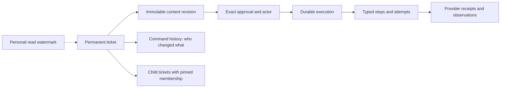
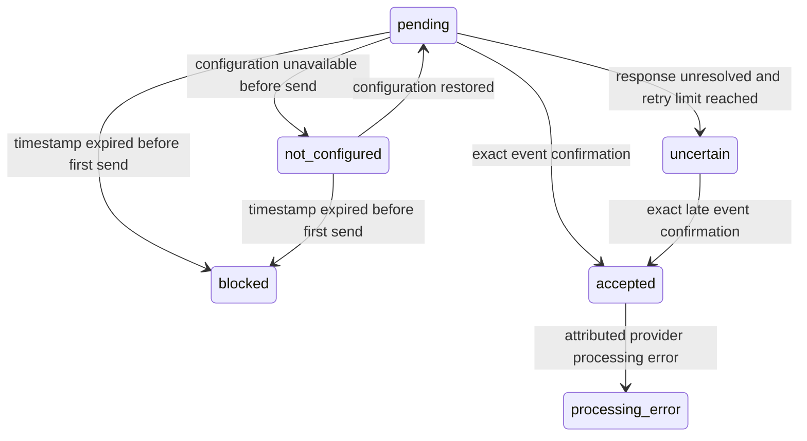

# FLO-1355 — revised design v7

17 September 2026 · Corrected design for independent review · Implementation paused

**This version applies the fixes directly.** It replaces the conflicting execution, command-history and Usage contracts in v6. Permanent tickets, immutable revisions, exact approvals, stable children, typed provider boundaries and the existing Actions/BullMQ architecture remain the design. This is a documentation specification; it is not migrated DDL, a passing implementation or a deployment.

Source checkpoint: platform HEAD `f0b1af5fc5925d818be7d9b02b42b1fc54556ecc` plus the preserved uncommitted prototype; all 215 source-manifest entries matched fingerprint `22c54c4352f996d8620b7aa90a8b66b5ca872061c093ba9715703390921f2cbf` during this review. No main refresh or platform edit was performed. The existing 31-table/497-column catalog describes that prototype, not these corrected contracts.

## The product contract

- One organization-owned ticket and URL survive edits, approvals, waits, retries and completion. Parent and child work use the same ticket identity model.
- Proposal revisions and selected batch membership are immutable. Approval records the exact revision, actor, channel/delegation, scope and server Undo deadline. Changing approved content requires fresh approval.
- Read/unread is personal. Lifecycle, owner, schedule, snooze, approvals and outcomes are shared, attributable facts. Counts and paginated lists use the same eligibility/visibility predicate with an explicit parent/child counting scope.
- A concrete draft can be approved while waiting for an editable release. It stays the same approved ticket, shows the prerequisite, and resumes when eligible. Whole-package waiting keeps editing available until the first actual write/generation admission.
- Mission Control shows one list grouped by due month, with due work visible once and completed work collapsed. Its projection does not create a second workflow authority. The underlying changes apply to all entrypoints.
- Durable SQL obligations own acceptance and recovery. BullMQ transports wakeups. Queues, browser memory and timers do not own approval, completion or Undo.
- Success requires evidence at the appropriate surface. Approved, applied to editable content, published live and measured are distinct. Uncertain external delivery remains visible.



The diagrams summarize relationships. The field tables and invariants below define the contract. Unchanged relations retain their pinned definitions in the existing end-to-end packet and source catalog; changed contracts here take precedence over earlier prose. No JSON/JSONB, serialized executable payload, arbitrary property/value map or generic SQL job table is introduced.

## Retained schema and product contracts

This appendix carries forward the accepted contracts that the v7 execution and Usage corrections do not replace. It describes the proposed design, not shipped behavior. v7 is authoritative for scheduling, inspection and binding, evidence/finality, retry and reconciliation, reopening, Usage, and privileged erasure. Earlier predicates for those areas must not be reinstated from this appendix.

### Exact Actions relation inventory

The proposal has **28 Actions relations**: 25 in `actions`, two in `app_store_connect`, and one in `apple_ads`. Names below are physical relations, not views.

| Responsibility | Relations |
|---|---|
| Durable work and immutable content identity | `actions.action`, `actions.action_revision` |
| Structural relationships and exact revision membership | `actions.action_membership`, `actions.action_dependency` |
| Personal read state | `actions.action_read` |
| Attributable commands and exact results | `actions.action_command`, `actions.action_command_target` |
| Authority | `actions.action_approval`, `actions.action_policy_revision` |
| Durable execution and exclusion | `actions.action_execution`, `actions.action_execution_step`, `actions.action_execution_attempt`, `actions.action_resource_guard` |
| Stable old links and provenance | `actions.action_alias`, `actions.action_revision_source` |
| Singleton content families | `actions.action_review_content`, `actions.action_listing_content`, `actions.action_request_content`, `actions.action_advisory_content`, `apple_ads.action_content` |
| Repeated content facts | `actions.action_media_content`, `actions.action_content_note`, `actions.action_content_term`, `actions.action_market_country`, `actions.action_market_competitor` |
| ASC-specific targets and upload/binding contracts | `app_store_connect.listing_contract`, `app_store_connect.step_contract` |
| Typed provider evidence | `actions.attempt_receipt` |

Relative to the preserved 31-table draft, replace `app_store_connect.attempt_receipt`, `google_play.attempt_receipt`, and `apple_ads.attempt_receipt` with **one** `actions.attempt_receipt`; remove `google_play.listing_contract` after moving its fields below. Arithmetic: 31 − 3 + 1 − 1 = 28. The two new Usage relations are separate from that subtotal; the existing Usage credit log is modified, not a third new relation.

Keep the projection views `action_listing_contract`, `action_execution_step_contract`, and `action_execution_attempt_contract`; the last becomes a join against the single receipt relation. Views add no independently mutable facts. History remains a projection of immutable commands, revisions, approvals, attempts and evidence, rather than another generic event table.

No further consolidation is silently assumed. Combining notes/terms, removing dependencies, or adding a research leaf remains a separate decision. A merger must preserve the actual foreign-key owner, subtype restrictions, ordering, country validation and meaning rules. Countries and competitors belong to request content; a generic key/value collection would lose that contract. One-to-one subtype separation is a design choice, not something normalization mandates.

### Listing fields moved into the common content row

The PK remains `(organization_id, revision_id)`. Move these exact fields into `actions.action_listing_content`:

| Field | Type / presence |
|---|---|
| `provider_account_id` | text NOT NULL, frozen account identity |
| `package_name` | text NULL; present exactly when `store='android'` |
| `google_edit_id` | text NULL; Android observation evidence only, never a proposal target |
| `play_commit_policy` | closed `google_play.play_commit_policy` enum NULL; required on an Android proposal; absent on iOS |
| `release_selection` | closed enum `exact_release` / `next_editable_release`, NOT NULL, default exact_release |

`app_store_connect.listing_contract` drops its duplicate `provider_account_id`; the common row is the sole authority. Remove `google_play.listing_contract`. Proposals always have `google_edit_id IS NULL`; observations may carry the edit actually inspected. `next_editable_release` is iOS-only and limited to intents update/create. Its exact target-binding, baseline and field-effect rules are defined in v7; do not restore the former immediate-write behavior for mixed fields.

### Closed advisory and request shapes

Both content relations have `(organization_id,revision_id)` as PK and `evidence_completeness` as a NOT NULL closed enum: complete/historical_incomplete, default complete. The matrices below are exhaustive for subtype-specific columns: **required** means non-null, **optional** means nullable, and every unlisted subtype-specific column must be NULL. They do not forbid the common identity, discriminator or completeness columns. Use NULL-safe SQL CASE branches and the same closed wire variants.

`primary_link_label` and `primary_link_path`, where optional, appear together or are both absent. Internal link paths retain the existing internal-path validation. `consecutive_failures` is a non-negative integer on storage and wire; producers must stop stringifying it.

| Advisory `kind` | Required fields | Optional fields |
|---|---|---|
| connect_source | source_label, benefit, primary_link_label, primary_link_path | none |
| store_app_access_lost | connector_source_id, connector_type, connector_name_snapshot, detail | last_success_at, consecutive_failures, last_error, app_name_snapshot, bundle_id_snapshot, scraping_account_email_snapshot, primary_link_label, primary_link_path |
| agent_attention_needed | agent_source_id, consecutive_failures, last_error, detail | last_success_at, primary_link_label, primary_link_path |
| onboarding_audit_recommendation; optimize_keywords; improve_retention; adjust_monetization; update_store_listing | detail, impact, effort, confidence_label, quick_win_source_id, audit_store, audit_store_app_id, audit_country, audit_locale, audit_generated_at | proposed_next_step, confidence_score, recommendation_type, market_label, gate_text, capability_tier, primary_link_label, primary_link_path |
| stage_blocker | blocker_reason_text, unblock_title, unblock_what_happened, unblock_why_it_matters, unblock_next | blocker_reasoning, unblock_cta_label, unblock_cta_path, primary_link_label, primary_link_path |
| review_finding; aso_review_needed; flag_issue; escalate | detail | suggestion, source_label, benefit, impact, market_label, primary_link_label, primary_link_path |

`unblock_cta_label` and `unblock_cta_path` are both present or both absent. Existing closed enums remain closed: severity/impact/effort/confidence labels low/medium/high, connector kind, recommendation kind and store kind. `capability_tier` remains 1–3. Scalar explanatory prose is text; it is not an extensible payload or a behavioral discriminator.

| Request `intent` | Required fields | Optional fields / repeated facts |
|---|---|---|
| locale_expansion | store, locale, origin | wave_index, language, reasoning, score, demand_lookback_days, downloads, revenue_usd, impressions, review_count, competitor_strength, localized_competitor_count, top_chart_count, estimated_market_downloads, market_research_note, plan_source_id, operator_instructions, hypothesize_policy, draft_policy, execute_policy; country and competitor child rows |
| listing_change | store, locale, recommendation_type, origin | plan_source_id, source_capture_at, finding_title, finding_rationale, finding_severity, context_text |
| review_catch_up | window_days, review_mode, origin | store, hypothesize_policy, draft_policy, execute_policy, operator_instructions |
| review_analysis | window_days, origin | store, focus, context_text |
| wake_agent | requested_agent_id, origin | operator_instructions, focus, context_text |

The policy triple is all present or all absent; each value is auto/await. The finding triple is all present or all absent. `review_mode` is manual/full_agentic. `origin` is scheduled_agent/user_directed_chat_or_mcp/human/system. Keep the supported store/locale catalog, positive lookback, nonnegative wave index, and 7–180 day window checks. Country rows store `(organization_id,revision_id,role,ordinal,country)`; competitor rows store `(organization_id,revision_id,ordinal,competitor_name)`. They are permitted only for the locale-expansion subtype; they are not arrays or open metadata.

**Incomplete history is not executable work.** historical_incomplete may relax required content values only for an immutable import authored through the migration channel. It does not relax forbidden fields, discriminator agreement, tenant rules or known value constraints. Both approval and execution admission refuse it with incomplete_revision. A migration may retain only facts that are proved; completing such a ticket requires a new, fully populated revision and a fresh decision. No historical approval or membership is inferred to make an import pass.

### Links, source provenance and actor retention

`action_alias` fields remain `organization_id`, closed `namespace`, `old_id`, `action_id`, and `historical_membership_known boolean NOT NULL`; PK `(organization_id,namespace,old_id)`. Add namespaces backlog_item and stage_blocker_card. Known old item, card, batch and receipt links resolve to the permanent ticket. `historical_membership_known=false` explicitly says an old package's exact membership cannot be established; it never authorizes reconstructed children or retroactively certifies a batch approval.

`action_revision_source` retains its closed kind and exactly one matching non-null source column: `source_recommendation_id`, `source_variant_id`, `source_report_version_id`, `source_backlog_id`, `source_experiment_id`, `source_agent_run_id`, or `source_action_id`. Add `source_present_at_insert boolean NOT NULL DEFAULT true`. True requires the exact live source and same tenant at admission. False is migration-only for an already-deleted source; show “source not available at import.” The source identifiers remain opaque historical values after referent retirement; none is executable authority.

Remove referent-retention FKs for those source columns and for `action_command.actor_agent_run_id`, `actor_slack_integration_id`, `actor_discord_integration_id`; keep the values. Validate existence and same tenant when a new attributable command is admitted. `actor_user_id` and `actor_api_key_id` retain FKs with the precise erasure nullification exceptions. API-key admission checks both its organization and its user against the recorded actor. The immutable actor subject and command attribution must survive routine integration/run cleanup without pretending the actor is still active.

`action_request_content.requested_agent_id` is retained exactly after the agent's retirement; its referent FK is replaced by live same-tenant validation on admission. Execution additionally checks that exact agent is still enabled and authorized; disappearance yields a permission hold, never substitution. Attempt `connector_id`, `agent_run_id`, `output_agent_run_id`, and `output_review_analysis_id` likewise retain their exact historical values after permitted referent retirement. Active authorization and generated-output admission still require the real live object, correct tenant/asset and completed output as applicable. Outstanding-output protection, concurrency with deletion, and erasure use **v7's** effective-evidence rules, not an unfinished-only check. Historical reads use LEFT JOIN and retain the fact when the referent is absent.

Ordinary asset deletion remains soft deletion while tickets reference it. Organization/account erasure and synthetic-asset erasure must use the scoped, tested authority and graph closure defined in v7. Database roles and grants are verified release gates; a session setting alone grants no authority. Intra-Actions ownership and tenant FKs remain intact.

The synthetic-asset graph erasure entry point runs through narrowly granted SECURITY DEFINER functions owned by fload_erasure, with a fixed qualified search path and function-validated asset scope. It refuses an unresolved issued write or unresolved generation, uses the v7 Actions→Usage lock order, and settles/protects usage before removing execution references. Delete dependent reads, receipts, attempts, steps, executions, approvals and command targets in FK-safe order; keep a multi-asset command if any target survives. Then remove the asset's revisions/content/provenance/aliases/memberships/dependencies/policy revisions and actions, after checking inbound structural references are in scope. Preserve global resource-guard identity, surviving command history, Usage invocation/settlement records and their immutable attempt_ref. Nullable Usage attempt_id is cleared only by authorized FK erasure. Org-wide advisories and opaque historical source_action_id values remain. Cross-scope dependencies must block erasure or be included by an explicitly validated graph, never silently cascaded. Account/organization erasure is a separately authorized scope with its own retention requirements; it cannot borrow synthetic-asset eligibility.

### Parent selection and approval ownership

A parent is itself a ticket and can have its own generation or revision obligation. Its `decision='approved'` exactly when it holds `current_approval_id`, just as for other tickets. A parent's own iterate/generate approval and Undo are commands on that parent, not inferred child decisions.

A selection approve/Undo locks and pins the parent and its current membership, verifies every selected child revision, and refuses while the parent has an unsettled execution of its own. The parent participates in the command with `version+1` and unchanged decision, approval, owner and placement. Selected children get their exact approvals or cancellations. **No selection command fabricates a parent approval or parent execution.**

Approval coverage is a projection: approved_members are current members whose child approval pins both the current parent revision and the member's exact child revision. A child approved separately is reported as outside_membership. Changing a package's membership requires a new immutable parent revision; new reviews or languages never silently join an existing approval. Parent progress is derived; parent identity and membership are persisted.

### One list/count predicate and separate personal attention

Keep scope top_level/children/all (default top_level), identically applied to list and count and bound into the signed cursor. In top_level, select roots whose own row or current-membership child matches; return matched_children. Use server-side cursor pagination without a hidden actionable-row cap.

* needs_decision: a standalone ticket in needs_approval/uncertain/failed/blocked; or a parent with its own decision obligation or a current-member child in such a state.
* in_progress: queued/working/verifying/waiting, excluding rows already in needs_decision. needs_attention is their union.
* A container whose children are complete/declined and which has no own obligation projects completed, regardless of its stored open decision. Waiting for an editable release is in_progress, not needs_decision.
* Root archive/snooze controls root placement. A child's snooze does not hide its parent. unreadOnly means the root is unread or any relevant child is unread.

Mission Control is one top-level work projection with Due now first, then future months, with collapsed Done groups. Month placement uses v7's separate `scheduled_for`; do not reuse snoozed_until. Done placement uses the closing command's accepted_at. Each group has server counts and a cursor with the same eligibility predicate. State chips and available actions come from the shared read model; v7's admission rules control editing, scheduling and waiting behavior.

Personal state remains `action_read(organization_id,user_id,action_id,seen_attention_version,force_unread,updated_at)`. Marking read never changes workflow state. Attention increases for meaningful revision, approval/Undo, reopen, reject/acknowledge, external resolution, supersession, replacement of declined content, assignment to another person, and deduplicated visible progress transitions. Snooze/unsnooze, archive/restore, self-assignment, retry, reconcile, resume_hold and binding alone do not create unread churn. Entering waiting creates one visible attention change, not one per poll. Additional v7 commands use its explicit attention rules.

A user command may advance only that actor_user_id's watermark, never acting_for_user_id's; only directly targeted tickets; only if the old watermark equaled OLD.attention_version. It never clears force_unread. Worker evidence and workflow version behavior follow v7's exact command guards rather than an assertion that every evidence append mutates the ticket head.

### Review identity, rejected-source replacement and cutover

All review producers use `reviewWorkCreationKey(org,store,providerAppId,providerReviewId)` with unique `(organization_id,creation_key)`: catch-up generation, sync, agent, HTTP and chat materialize the same ticket. Existing historical rejection rows import as declined tickets with their source fingerprint; rejection suppression remains active until that import is complete.

`replace_declined` is an atomic revise mode: exact current pins; decision declined; source fingerprint changed meaningfully in rating/body/title/provider-edited flag (`modifiedAt` alone is insufficient); no unresolved effects under v7. Install a new proposal whose baseline is the fresh source observation and reopen in one transaction, or change nothing. Use `stableUuid('source-change:' + actionId + ':' + sourceFingerprint)` as its idempotency key; retain the original rejection history. Automatic discovery may reconsider a declined ticket only through this mode.

Normalize Apple reply text and reject unsupported angle brackets before sealing. ASC listing comparison uses the versioned normalizeListingComparisonText rule with comparison_version 2; never mutate sealed content to normalize it later. Delegation's closed database and wire shapes admit chat alongside the already supported delegated channels; MCP authority remains canonical and unchanged.

Cutover is coordinated: convert the inventoried producers, retire the three legacy approval→platform-execution routes and both scheduled ASO direct writers, import and reconcile source data, then switch readers. The inventory's nine producer families are the checklist, not a claim that producer conversion is complete. Actions-covered write transports may be imported only through the Actions provider boundary; connector setup, credential/session refresh, provider internals and read-only inspection remain explicit exceptions. Test that boundary.

The default end state has one authority and no legacy execution fallback. A temporary backlog read projection is permitted only for an explicitly necessary phased cutover, with the durable ticket winning via backlog_item/stage_blocker_card aliases and list/count deduplicating identically. It must have a removal gate. Old links remain valid after old runtime tables and writers are retired; unknown approval content, outcomes or membership remain explicit migration blockers or non-authorizing history, never fabricated success.

## Actions execution, evidence and provider safety

### Typed inspection purpose and write consumption

Keep `inspection` as a read-only attempt on `asc_editable_release_bind`. Add `inspection_purpose = {binding, prewrite}`. Use grant source `observation_grant_kind = {initial, reconcile, event}`; remove `prewrite` from that enum. Purpose and source have different determinants.

Add these columns to `action_execution_attempt`:

| Column | Type | Shape |
|---|---|---|
| inspection_purpose | inspection_purpose NULL | Required exactly for an inspection; late evidence copies its original inspection's purpose; otherwise NULL. |
| planned_write_step_id | text NULL | Required exactly for a prewrite inspection and its late evidence. FK `(organization_id, execution_id, planned_write_step_id)` to step `(organization_id, execution_id, id)`. |
| prewrite_attempt_id | text NULL | Only a write or its late evidence may carry it. FK `(organization_id, execution_id, prewrite_attempt_id)` to attempt `(organization_id, execution_id, id)`. |
| resource_guard_generation | bigint NULL | Positive; required for a write and a prewrite inspection, copied by their late evidence; otherwise NULL. |

Add `action_resource_guard.acquisition_generation bigint NOT NULL DEFAULT 0 CHECK (acquisition_generation >= 0)`. Acquiring an unheld guard increments this value; retaining the same holder does not. Releasing never decrements it. Add the composite UNIQUE keys required by the two FKs above.

Partial UNIQUE `(organization_id, prewrite_attempt_id) WHERE kind='write' AND prewrite_attempt_id IS NOT NULL` makes an inspection consumable once. Late evidence does not consume it again. The existing one-unfinished-attempt-per-execution index remains.

`guard_prewrite_admission` validates a prewrite inspection **without requiring a future write row**: current approval and revision; current live claim; same execution; `planned_write_step_id` is the next eligible external write step under the approved plan; all preceding dependencies are satisfied; same canonical resource; guard held by this execution at the recorded acquisition generation; no unresolved issued write. The inspection's binding target comes from the immutable binding evidence, never a new release choice.

`guard_write_prewrite` runs when a write is inserted on a listing execution whose approved revision has `release_selection=next_editable_release`. Other existing provider operations keep their exact-target admission contracts and must leave `prewrite_attempt_id` NULL. Within this binding flow, the first write in each guard-acquisition generation requires `prewrite_attempt_id`. An explicit retry of a definitively non-applied write also requires a fresh prewrite, even if the guard was retained. The referenced inspection must be finished `matched`, complete, target-valid, for this exact planned write step, same live claim generation/token and guard acquisition generation, and unused. Writes continuing an uninterrupted guard generation after a resolved predecessor do not require another whole-package prewrite. An inspection finished under an expired, cancelled or replaced claim cannot authorize a write.

### Prewrite budget and complete outcome handling

Initial binding budgets are keyed by `(step_id, inspection_purpose=binding)` and start at the first admitted initial binding inspection. Initial prewrite budgets are keyed by `(execution_id, planned_write_step_id, inspection_purpose=prewrite)` and start at the first admitted initial prewrite inspection for that key. The step's closed policy version supplies maximum observations, window and backoff. Count actual inspection starts, including failed, expired and cancelled inspections; exclude the row being finalized when checking admission counts. Grant limits are checked on INSERT, not again as though finalization were another admission.

A `reconcile` grant has its own accepted-command start/window and count for the exact purpose and planned step. It permits observations only: write insertion still requires `allowNewEffects=true` from the current approval/accepted retry state. For inspections, an event grants one binding inspection only, never a prewrite; a publication event may instead grant one readback of its exact issued subject. Timers do not renew a budget. Resource contention consumes no observation budget because no inspection is admitted.

Derive effect permission per step from the still-current original approval and accepted retry facts, not from the kind of the latest recovery command. Reconcile adds observation capacity without revoking original approval for a never-attempted planned effect. Thus an exhausted prewrite can be reconciled, match, and allow the first write under its original approval after all current authorization gates pass. Resending an already-attempted effect still requires definitive non-application and the explicit retry/budget contract. Replace the prototype's global `latest reconcile => allowNewEffects=false` derivation; otherwise a successful prewrite recovery before any write is stranded. Reconcile itself grants no new mutation authority.

Outcome handling is total:

- `matched`: persist complete observation and receipt; the **current** claim may consume it for the exact write in the same finalization transaction.
- `mismatch`: persist the complete incompatible observation; admit no write; `blocked/target_changed`, no automatic retry.
- `unreadable/unavailable` or `unreadable/partial`: admit no write; schedule bounded backoff while this exact grant has capacity; otherwise `blocked/unsupported_readback`, no timer. A fresh reconcile may inspect again.
- `unreadable/unsupported`: admit no write; `blocked/unsupported_readback`, no timer. Reconcile is allowed but never grants a write or bypasses the adapter capability check.
- Lease expiry: finish the inspection `unreadable/unavailable` under the replacement claim; consume that start once. Use the same bounded retry/hold rule. Never classify a read-only inspection as an uncertain provider mutation.
- Cancellation/reschedule: finish `unreadable/cancelled` through the command-fence path below. A late response is immutable evidence only; it cannot append a plan, acquire a guard, or authorize a write. The next current claim performs a fresh inspection if authorized and budgeted.

Pending prewrite eligibility uses the same budget predicate in SQL and Core, including `ready` executions. Exhaustion returns NULL until a fresh grant is accepted; it cannot produce an immediate queue loop.

### Runnable guard/read/write transactions

**P1: durable prewrite admission.** In one transaction lock action IDs in order, execution, then canonical resource guard. Recheck approval, policy, Undo deadline, schedule, execution phase and grant. Acquire/retain the guard and its acquisition generation under the explicit **prewrite admission** exception. Persist the claimed execution with `next_step_id` set to the inspection step and insert the unfinished prewrite inspection. Commit. No provider I/O occurs inside this transaction.

**P2: provider inspection.** Read the exact bound version/localization and all relevant approved conditions through the authenticated adapter. Keep the durable guard held. Capture a complete typed observation; partial information cannot become `matched`.

**P3: finalize and admit the write.** Lock action IDs, execution and guard again. Require the same live claim and guard generation. Insert the receipt and sealed observation, then finish the inspection. If matched and new effects remain authorized, set `next_step_id` to its planned write step and insert the write with `prewrite_attempt_id`, same claim and guard generation. Finish the inspection before inserting the write, preserving the one-active-attempt index. Commit, then send that one provider request through the existing immediate dispatch fence. Receipt/observation validation may be deferred to commit; authority and admission checks remain immediate.

On mismatch/unreadable, persist the outcome and hold/backoff instead of inserting a write. Release the guard only when no write remains non-final; never release it merely because an inspection failed while earlier native work is unresolved. On lost claim, append late evidence only. A new owner cannot consume the old prewrite; it must revalidate under its own claim.

The guard-acquisition rule is therefore: allowed in the transaction admitting an authorized prewrite inspection, or for an operation whose existing exact-target contract does not require this binding prewrite. It is no longer restricted to a transaction that already inserts a write.

The Fload guard excludes Fload writers. It does **not** exclude external console changes. Without a supported conditional provider mutation, B→external Y→Fload X→readback X can conceal Y. After-effects verification establishes the final observed value; it does not promise to detect or prevent every overwritten external edit.

### Cancellation and schedule fences without violating immediate guards

Undo, edit, reject, schedule and unschedule require **zero admitted write/generation attempts**, finished or unfinished. Undo additionally requires its server deadline. Schedule/unschedule retain the existing approval and execution; they do not cancel that execution.

For a command racing an inspection, use this order in one transaction:

1. Acquire the idempotency lock, ordered action locks, execution and held guard. Insert the accepted command and target using the established command-at-commit protocol.
2. Advance to a fresh claim generation/token while retaining a valid claimed execution. A narrowly scoped command-fence exception permits replacing the prior live claim only for these accepted targeted commands, with zero write/generation attempts; it is not a general worker claim-stealing exception.
3. Finish any inspection with `unreadable/cancelled` and that new finalization fence.
4. For undo/edit/reject, set execution `cancelled` and clear the claim; for schedule/unschedule, return it to `ready` or its existing applicable hold, clear the claim, recompute due time and increment schedule generation. Apply the intended ticket changes. Release a prewrite guard after confirming no unresolved write.

Only step 4 enters a terminal phase, after the inspection is finished, so the immediate no-open-I/O terminal guard remains valid. A late worker's old token cannot dispatch or extend a plan. The command's accepted target authorizes both the exceptional fence advance and inspection cancellation.

### Immutable effective evidence, receipts and manual observations

Add partial UNIQUE `(organization_id, subject_attempt_id) WHERE kind='late_evidence'`. There is at most one late completion record for one original interaction. Repeated persistence of the same late completion returns its existing row only when all immutable outcome, receipt, observation and output fields agree; a different completion is rejected as an evidence conflict. A provider status lookup is a **new readback attempt**, not another late completion of the original request.

Define `effective_evidence(original_attempt_id)` as one typed record containing the selected evidence row ID, original interaction identity, result, reason/basis, terminal mark, observation/output references **and that selected row's receipt**:

- Original unfinished, `uncertain` or `unreadable`: use its admitted late completion if present; otherwise the original row.
- Original definitive result: retain it. A contradictory admitted late completion is preserved, but produces a closed `evidence_conflict` hold; it is never silently used to authorize retry or success. Add that hold reason. Ordinary workers may perform request-correlated readback while held, but cannot issue a new effect, settle success or reopen from contradictory evidence. This is an explicit operator diagnostic hold with **no automatic resolution**: readbacks may enrich its history but cannot themselves clear this hold, release its exclusion, settle success, or authorize a new effect. Ordinary retry/reopen cannot manufacture its resolution. Resolving contradictory native evidence requires a separately reviewed repair outside this ordinary execution contract.
- For a late readback/inspection, follow the original interaction to recover its typed subject and authority. Native receipt facts come from the selected completion; absence is not filled from an unrelated read or another request.

All reads of result, receipt, observation and output for the shared predicates use this single resolver. Thus a timed-out write with no receipt can gain request Q from late `accepted_pending`, and a subsequent terminal readback can correlate with Q. `unreadable` may improve through its one late response, matching the preserved Core behavior.

Manual observations are manager-attributed, internal, subject-write-linked records, with `terminal_outcome IS NULL`. A manual `matched_external` records the manager's observed desired state; it is not native request-finality evidence and does not by itself establish `verified_live` or `verified_editable`. Display its actor and evidence source explicitly. A manager-triggered canonical provider read can supply an ordinary external readback observation through the same native validation path; the human trigger does not weaken its evidence requirements. A user-authored baseline refresh remains an attributed sealed observation on the open ticket and grants no execution authority.


The observation-marks matrix replaces all earlier variants:

| Effective interaction kind and row result | terminal_outcome | semantic_fingerprint / fingerprint_version |
|---|---|---|
| write or generation, any result | NULL | both NULL |
| readback or inspection, unfinished or unreadable | NULL | both NULL |
| readback or inspection, matched/matched_external/mismatch (where the kind admits that result) | non-NULL boolean | both required |
| readback, known_not_applied | TRUE | both NULL |
| manual_observation, matched_external/mismatch | NULL | both required |
| manual_observation, unfinished/unreadable | NULL | both NULL |

For a late row, select the matrix branch by its original interaction's kind and the late row's result. `grant_kind` and `grant_command_id` must both be NULL for late evidence; its inspection purpose, planned-write link and resource generation are copied identity facts, not another grant admission or consumption. Ordinary readbacks/inspections require a grant; ordinary writes, generations and manual observations forbid grant fields. Initial grants have NULL command IDs; reconcile/event grants require their exact accepted command IDs.

A released guard retains `acquisition_generation`. Every acquisition from unheld to held increments it, including reacquisition by the same execution. All current prewrite/write admission and final dispatch checks require the stored generation to equal the held guard's generation. Late evidence copies its original generation without requiring it to remain current and may never reacquire or alter a guard. An expired inspection's old evidence cannot authorize a write after another execution acquires/releases the same resource.

### Shared finality and settlement predicates

`request_final(W)` is true only when the effective evidence is consistent and either (a) effective write result is `known_not_applied` with its validated basis, (b) effective write result is `acknowledged` and the operation's pinned policy declares that response terminal, or (c) a complete external readback's effective evidence proves terminal completion/non-application of **that issued request**, correlating with the effective write receipt's native request ID, or satisfying the pinned Play edit-expiry rule. Same text, native idempotency keys, manual observations and still-processing states do not establish finality.

`content_established(W, required_surface)` requires complete authoritative external observation of the exact approved target/effect, `matched` or `matched_external`, the exact required surface, and the pinned comparison version. `provider_response` may instead be satisfied by the operation's validated acknowledged receipt. Editable evidence does not establish live publication. Manual observations remain separately labelled evidence.

Successful settlement requires: no unfinished attempt; complete plan; every issued write final; every required effect satisfied at its required surface. Results distinguish acknowledged-only, verified-editable, verified-live and handled-externally according to their evidence. `handled_externally` requires authoritative desired-state evidence plus proof that Fload's relevant writes were definitively not applied; a lost response never becomes external handling by inference.

Failed settlement through `reopen` requires exact current action/version/revision/execution pins, no unfinished attempt and every issued write final, plus either (a) `blocked/retry_exhausted` with the failing step's latest write `known_not_applied/permanent`, or (b) `blocked/target_changed` with a finalized complete `mismatch` prewrite inspection naming the next required write step. Branch (b) lets a partly applied package stop its remaining effects without fabricating a failed write. The accepted command settles this execution `failed`, releases its guard, clears current approval and opens the same ticket; its target pins the failure/mismatch observation. A replacement requires a new sealed proposal and a fresh qualifying baseline, and receives a new approval. Failed settlement does **not** require desired content or a complete plan. With zero issued writes, the user may instead use the cancellation/edit path in section 4. Normal execution retains its guard across unfinished package effects; finality of the writes issued so far alone does not mean the package is complete. Guard release additionally requires a success/failure/cancellation transition, or a blocked/read-only phase with no non-final write. Reacquisition before later effects requires a fresh prewrite in the new acquisition generation.

### Whole-package and dynamic App Clip execution

Binding preserves one immutable approved package. Its initial prewrite compares all approved overwrite conditions against the pinned baseline while the guard is held. It does not change the approved target or silently choose a different release.

After Fload has applied an earlier step, subsequent checks compare against the **expected intermediate state**: pinned baseline overlaid with this execution's conclusively acknowledged or request-correlated applied effects. Fields already written are compared with their exact approved values; untouched fields retain the baseline condition; newly created localization/media IDs come only from the exact predecessor receipts. An uncertain predecessor is reconciled before any successor write. Never compare the original baseline against Fload's own already-applied fields and call that external drift.

The same rule applies to a fresh prewrite after explicit retry or guard reacquisition. Its planned-write link identifies the next effect; it verifies the expected intermediate state, not a pristine initial state. A full package's first-write prewrite is not replayed before every upload chunk while the same guard generation is continuously held. Chunks still require their exact immutable approved byte range, hash, reservation receipt, live claim and dispatch fence.

Static binding can complete a plan. An App Clip reservation-dependent plan remains incomplete after binding. Reservation receipt and exact encrypted upload manifest are persisted atomically with its acknowledgement or validated recovery; chunks and commit are appended once through the existing incomplete-plan guard. Set `plan_complete=true` only when every required field, byte range and commit obligation is represented. No placeholder chunks, premature writes-closed flag, success settlement or guard release is permitted while those obligations remain.

## Commands, ownership history and baseline refresh

### Schedule history and strict wire contract

Keep `actions.action.scheduled_for timestamptz NULL`. Add to `actions.action_command_target`:

| Column | Type | Meaning |
|---|---|---|
| previous_scheduled_for | timestamptz NULL | Exact schedule before the command |
| result_scheduled_for | timestamptz NULL | Exact schedule after the command |

These are snapshots on **every** command target. NULL means unscheduled, not unknown/omitted. Pre-feature history has both NULL because this scheduling feature did not exist. Imported scheduling history must use proven source facts, never today's action value.

Extend deferred command-target/head validation, using `IS NOT DISTINCT FROM` for nullable equality:

1. Previous/result schedules equal the locked before/after action snapshots. The final head equals the last accepted target's result; chained commands in one transaction follow the existing target chain rule.
2. Accepted `schedule`: `result_scheduled_for IS NOT NULL` and equals the strict request timestamp. At original admission, timestamp must be later than the DB clock. Replay does not revalidate against today's clock.
3. Accepted `unschedule`: `result_scheduled_for IS NULL`.
4. Other accepted commands preserve schedule; creation starts NULL. Refused/conflicting targets preserve it. Approval, restore, reopen, progress, observation and read-state changes do not reschedule work.
5. Schedule/unschedule preserve revision, approval, decision, owner, archive and snooze. Accepted mutations follow ordinary version/history rules once; replay does not mutate. An explicit command requesting the existing value may be recorded under those same rules.
6. `guard_action_command_mutation` allows schedule changes only under the corresponding accepted command with a matching result snapshot. No open payload column is introduced.

Strict requests, using the existing closed scalar schemas:

```ts
type ScheduleCommand = {
  kind: 'schedule'; idempotencyKey: string;
  target: { actionId: string; expectedVersion: DecimalVersion; expectedRevisionId: string };
  scheduledFor: IsoTimestamp;
};
type UnscheduleCommand = {
  kind: 'unschedule'; idempotencyKey: string;
  target: { actionId: string; expectedVersion: DecimalVersion; expectedRevisionId: string };
};
```

`scheduledFor` is required/non-null only for schedule and forbidden on unschedule and other variants. Actor comes from canonical server authorization. Add required-nullable `scheduledFor` to `ActionWorkflowSnapshot`, `ActionCommandTargetResult` and current detail/list projections. History uses the existing before/after snapshots. Replay loads **recorded `result_scheduled_for`**, never today's action value: a November receipt remains November after a December reschedule.

The single-ticket command must not pretend that scheduling a collection row schedules independent child executions. If collection scheduling is exposed, expand the command atomically over an explicit exact parent revision and selected child revision membership, writing one schedule snapshot/CAS target per affected child. Otherwise return `unsupported_operation`; never silently apply to later-added children.

UI: one permanent ticket, current month from current schedule; history identifies who scheduled, moved or unscheduled it. An old replay confirms that old command; refresh current detail before displaying today's month. Scheduling never reopens Undo or claims delivery. Snooze remains separate.

### Preserve approval/execution; cancel only inspection

**Remove schedule/unschedule from commands permitted to set `execution.cancelled_command_id` or cancel/settle an execution.** They may cancel an inspection attempt, not the approved execution.

Lock order: idempotency key → action → current execution → relevant resource guard if already held. Reload pins/authority under locks.

- Open ticket/no active execution: schedule or unschedule while retaining historical executions.
- Approved ticket: require **zero write or generation attempts**, finished or unfinished, on its current execution. Otherwise persist `execution_started`, including rejected, acknowledged or uncertain effects. Rescheduling never hides recovery.
- Other workflow states: `invalid_transition`; no implicit restore.
- Use the Actions command-fence protocol: advance to its permitted fresh claim generation/token, finish any inspection, then clear the claim and next-step pointer and increment schedule generation. In-flight stale inspection responses may become late evidence only; no plan extension or dispatch.
- An unfinished inspection is finalized `unreadable/cancelled` under the new fence, linked to the accepted schedule command. No other attempt kind can be finalized this way. Release any inspection-only resource reservation using its release rule; this branch has no unresolved business effect.
- Preserve execution ID, approval ID, approved revision, original actor/Undo deadline, immutable steps, plan completeness and finished evidence. Do not set cancellation, result or settlement fields. Ready/claimed inspection-only execution returns to ready. A blocked awaiting_release/resource_busy hold remains that hold; other holds cannot be converted to ready by schedule.
- Recompute runnable due time from the new schedule, original Undo deadline and recovery policy. Do not reset exhausted inspection grants/budgets: exhausted holds keep NULL next_run_at until an authorized event/reconcile supplies a grant. Unschedule removes only the schedule lower bound.

Reuse the existing attempt `evidence_command_id` FK to identify the command that cancels an inspection; do not put this on `execution.cancelled_command_id`. Replace the old late-evidence-only CHECK with these mutually exclusive branches:

```sql
CHECK (CASE
  WHEN kind = 'late_evidence' THEN evidence_command_id IS NOT NULL
    AND finished_at IS NOT NULL
    AND finalized_claim_generation IS NULL AND finalized_claim_token IS NULL
  WHEN kind = 'inspection'
    AND result IS NOT DISTINCT FROM 'unreadable'
    AND unreadable_reason IS NOT DISTINCT FROM 'cancelled'
  THEN evidence_command_id IS NOT NULL AND finished_at IS NOT NULL
    AND finalized_claim_generation IS NOT NULL AND finalized_claim_token IS NOT NULL
  ELSE evidence_command_id IS NULL
END);
```

Replace `action_attempt_finalization_fence` with the corresponding closed branches: late_evidence has both finalization fence fields NULL; a cancelled inspection attributed to a command has a fresh finalized generation and token matching the command-created execution fence; every other attempt keeps `(finished_at IS NOT NULL) = (finalized_claim_generation IS NOT NULL)` and `(finalized_claim_generation IS NULL) = (finalized_claim_token IS NULL)`. The cancellation path is authorized by the accepted command, with a dedicated command-created fence, never the displaced worker's token.

The attempt trigger permits setting this existing pointer during cancellation only; resolves it to accepted undo/revise/reject/schedule/unschedule on the same action; verifies no write/generation admission and the execution's post-command generation; and forbids stale worker mutation after finalization. The existing late-evidence uniqueness index remains scoped to late_evidence. `unreadable_reason` is the existing typed column, not a new field.

Deferred execution guard requires accepted schedule target, zero admitted write/generation, preserved approval/revision/execution identity, no execution cancellation and each unfinished inspection closed at the advanced fence. Schedule and write admission serialize on the execution lock.

Trace: AP1/E1 is approved for November. Moving to December while inspection I1 is in flight atomically records November→December, advances the fence, closes I1, changes E1's due/delivery generation and retains AP1/E1. I1's later success is history only. December uses the same exact approved revision. If W1 was admitted first, schedule is refused and write/readback recovery continues.

### Concrete post-failure refresh boundary

Replace “baseline revision number >= failed execution's last observation.” It is undefined with zero observations and can accept pre-failure evidence. A qualifying replacement baseline must come from a provider read **started after the relevant reopen committed**, not merely inserted later.

Add to `action_command_target`:

| Column | Type | Constraint |
|---|---|---|
| refresh_after_command_id | text NULL | Composite deferred FK `(organization_id, refresh_after_command_id)` → `action_command(organization_id,id)` |
| refresh_read_started_at | timestamptz NULL | Server-controlled DB-clock read-start marker |

Existing `evidence_revision_id` identifies the sealed observation. No duplicate execution pointer: the reopen target's `previous_approval_id` resolves its unique execution (`action_execution.approval_id` is unique).

```sql
CHECK (
  (refresh_after_command_id IS NULL AND refresh_read_started_at IS NULL)
  OR
  (refresh_after_command_id IS NOT NULL
   AND refresh_read_started_at IS NOT NULL
   AND evidence_revision_id IS NOT NULL)
);
```

Deferred `guard_baseline_refresh` permits the populated branch only on an **accepted record_observation** command and enforces:

1. Referenced command is accepted reopen with a target on the same tenant/ticket, transitioning its exact previous approval/revision to open/no approval. That previous approval is a perform execution now settled/failed, with no unfinished attempts or unresolved provider requests.
2. It is the latest applicable failed-perform reopen boundary, ordered by target `result_version`, not timestamps/IDs. A subsequent failed execution/reopen invalidates prior refreshes. Ticket is currently open/no approval.
3. Refresh expected version/revision matches the pre-read pin. Its before version is at least reopen's result version. Its result preserves the proposal and approval, advances ordinary observation version/attention and links one sealed observation on the same ticket.
4. Observation is complete for the replacement operation's required baseline fields and exact provider/account/app-or-package/locale/review/ads target. Use the concrete subtype target guards. Capture time is >= read-start marker; read-start is >= reopen's accepted timestamp. These SQL comparisons supplement the service protocol; timestamps alone do not prove network chronology.
5. Refresh metadata is forbidden for other command kinds and refused/conflicting targets. Other observations remain evidence but cannot qualify as post-failure replacement baselines.

Canonical refresh service: client supplies only idempotency key, exact pins and `afterReopenCommandId`; never content or capture timestamps.

1. Short read-only preflight transaction: authorize, lock action, validate pin and **already committed** reopen boundary/no newer failure or approval; obtain `clock_timestamp()` as read-start marker; release transaction. This is not command acceptance.
2. Fresh native read-only request against exact target. No cached observation, preflight-old response, provider mutation or long-held DB lock. Adapter records capture completion with the same server clock convention. Unsupported/unavailable readback produces no qualifying baseline; UI remains explicit about what is missing.
3. Final transaction: lock idempotency key then action; replay if recorded; recheck authority/pin/boundary; atomically insert/seal observation and accepted record_observation command/target with refresh provenance. A stale pin/boundary records ordinary refusal against freshly reloaded state without adopting the network result. Crash before this transaction accepts nothing; retry may repeat a safe read.

Replacement perform approval guard: the previously failed proposal itself is refused `invalid_transition`; a replacement revision must pin as `baseline_revision_id` the evidence of a qualifying refresh tied to the latest failed-perform reopen boundary, else `baseline_required`. Generated replacement drafts obey the same rule. Multiple complete qualifying refreshes after one boundary are permissible; pre-write validation still protects against subsequently observed changes. This does not promise prevention of external edits after the read.

Zero-observation trace: E1's first write gets definitive 422, no observation. Reopen C7 settles E1 failed, clears AP1 and records v7. No last-observation fallback exists. R1 approval refuses; R2+B0 refuses baseline_required. Refresh preflight observes committed C7/v7, obtains start marker, then reads provider. C8 stores O8 with refresh_after_command_id=C7; edit R2 pins O8; new AP2 may be accepted. Concurrent edit/approval between preflight and C8 causes stale refusal. A late old observation inserted after C7 does not qualify without the service-created refresh provenance.

### Abandon bytes, replay and closed errors

The separator is one zero **byte**, neither PostgreSQL text NUL nor backslash-plus-zero:

```text
SHA-256(UTF8("fload:abandon:1") || byte(0x00) || UTF8(idempotencyKey))
```

PostgreSQL expression (pgcrypto, lowercase hex):

```sql
encode(digest(
  convert_to('fload:abandon:1', 'UTF8')
  || decode('00', 'hex')
  || convert_to(idempotency_key, 'UTF8'),
  'sha256'
), 'hex')
```

Use the same key validation/canonical representation as ordinary commands. Tombstone is refused/abandoned, no targets and no progress/resume/refresh facts. Within the same org/principal/key lock, a pre-existing receipt wins; otherwise tombstone wins. Replay checks abandon kind **before** incoming digest equality. Lookup unrecorded never clears uncertainty; a recorded result/winning tombstone does. Recorded business outcomes use typed HTTP 200 responses; auth/validation/transport errors do not manufacture receipts.

Complete command error set for these replacements:

```text
stale_version, stale_revision, stale_membership, invalid_transition,
undo_expired, execution_started, unresolved_write, permission_changed,
billing_required, unsupported_operation, idempotency_mismatch,
target_changed, not_found, abandoned, baseline_required, incomplete_revision
```

Keep SQL enum, Core union and strict wire schema identical. Missing content uses incomplete_revision; absent qualifying replacement baseline uses baseline_required; repeat failed proposal uses invalid_transition. Do not invent invalid_schedule: malformed input fails request validation; a valid timestamp no longer future at original admission returns invalid_transition. not_due/stale_delivery are worker outcomes; retry_exhausted/awaiting_release/resource_busy/awaiting_publication/plan_incomplete are execution holds. An inapplicable resume_hold is an ignored internal event with no accepted row, not a persisted refusal.

### Evidence and future validation

Current snapshot command persistence stores digests and workflow snapshots but no schedule facts (`ticket-unit-of-work.ts:63–98`). This fragment supplies the missing proposed contract; no SQL was run. Future acceptance cases: original schedule receipt after rescheduling; schedule vs write admission; inspection cancellation retains AP1/E1; zero-observation failure; stale refresh; late old observation cannot qualify; identical application/PostgreSQL abandon digest bytes.

### Command storage variants

The existing closed command kinds are create/revise/approve/undo/reject/acknowledge/snooze/unsnooze/assign/archive/restore/supersede/retry/reconcile/record_observation/record_attempt/record_progress. Add reopen/resume_hold/schedule/unschedule/abandon. `action_resume_event` is release_detected/publication_detected. Add nullable `resume_event_kind action_resume_event` and `resume_provider_resource_version text` to action_command. Retain the typed progress execution/phase/result/hold columns.

The command shape is a CASE with the following exact branches:

- record_progress: accepted system/worker; progress_execution_id and progress_phase required; phase restricted to verification_due/uncertain/blocked/settled; result present exactly for settled; hold present exactly for blocked/uncertain; both resume fields NULL.
- resume_hold: accepted system/worker; progress_execution_id plus event kind and nonempty provider resource version required; phase/result/hold NULL. The execution must be in the exact blocked hold matching the event. An inapplicable internal event is ignored before command insertion. Unique (organization_id,progress_execution_id,resume_event_kind,resume_provider_resource_version) for this kind prevents duplicate grants.
- abandon: refused/abandoned; no targets; all progress/resume fields NULL; deterministic bytea digest and replay precedence as specified above.
- every other kind: all progress/resume fields NULL. Additional action/target/schedule/refresh guards enforce the operation's own finite contract.

Record_observation for baseline refresh uses the exact post-reopen protocol above. Other accepted user observations require an open ticket with no current approval and a sealed same-target observation; they change only ordinary version/attention metadata and provide no execution authority. Every command persists canonical actor, organization, channel and delegation; authorization is established by the existing Fastify policy boundary.


## Closed attempt and provider schema

The new columns in the Actions execution section supplement these consolidated scalar definitions on `action_execution_attempt`:

| Column | Type | Required/forbidden rule |
|---|---|---|
| terminal_outcome | boolean NULL | Native observation matrix below; manual observations always NULL |
| semantic_fingerprint | char(64) NULL | Lowercase SHA-256 shape when present |
| fingerprint_version | integer NULL | Positive when present; paired with fingerprint |
| grant_kind | enum initial/reconcile/event NULL | Required for original readback/inspection only |
| grant_command_id | text NULL | Same-tenant command FK; required for reconcile/event, forbidden for initial |
| native_correlation | text NULL | Required on App Clip reservation write; copied by its late completion; forbidden elsewhere |

Original attempt kinds are `write`, `readback`, `generation`, `manual_observation`, `inspection`; `late_evidence` records the one delayed completion of an original attempt. Subjects are required for readback/manual/late and forbidden for write/generation/inspection. Readback subjects are writes on the same step. Late subjects may be any of the five original kinds but never another late row. The original interaction's immutable identity is retained.

### Complete outcome/mark matrix

| Original interaction | Allowed finished outcomes | Fingerprint/version | terminal_outcome |
|---|---|---|---|
| write | acknowledged, known_not_applied, uncertain | forbidden | forbidden |
| generation | generated, discarded, known_not_applied, uncertain | forbidden | forbidden |
| readback | matched, matched_external, mismatch | required pair | required boolean |
| readback | known_not_applied | forbidden | required true |
| readback | unreadable | forbidden | forbidden |
| inspection | matched, mismatch | required pair | required boolean |
| inspection | unreadable | forbidden | forbidden |
| manual_observation | matched_external, mismatch | required pair | forbidden |
| manual_observation | unreadable | forbidden | forbidden |

Unfinished original attempts have NULL result and all three marks NULL. Late rows are inserted finished; apply the matrix using the **subject's original interaction kind and the late row's outcome**. This explicitly replaces both the old late-result whitelist at 0146:2747–2750 and the old readback-only `matched_external` guard at 0146:2825–2832. Manual observations establish attributed human evidence only; they cannot prove request finality or a native verified result.

The mark CHECK must use explicit CASE branches, including the unfinished and manual branches, with `IS NOT NULL` before required comparisons. A result outside this matrix is rejected, never treated as approved. `unreadable_reason` is the closed set unavailable/partial/unsupported/cancelled; `uncertainty_reason` is transport_lost/claim_expired/invalid_response/accepted_pending. `cancelled` is admitted only through the targeted command-fence path. `evidence_conflict` is an explicitly new diagnostic hold, with no automatic success, retry, reopen or clearance.

Grant shape: original readback/inspection requires a grant. Initial requires NULL command; reconcile/event requires a non-null accepted same-tenant command meeting its grant scope. All other kinds, including late evidence, have both grant fields NULL. Late evidence copies purpose/step/guard links as specified above; it does not consume a grant again. `inspection_purpose` is separate from grant source. This removes the invalid `prewrite` grant kind entirely.

Readback initial capacity is keyed by (step_id, subject_attempt_id, initial), anchored at that original subject's finished_at. INSERT requires prior starts < max_observations and started_at within that fixed observation window. Reconcile capacity is keyed by the exact step/subject/grant_command_id, starts at command acceptance, and has the same pinned count/window limits. An accepted event grants exactly one original observation: partial UNIQUE (organization_id,grant_command_id) WHERE grant_kind='event'. Binding events cannot grant prewrite; publication events name an exact issued subject. Finalization never consumes capacity a second time. All admissions serialize on the execution lock.

`evidence_command_id` is required for late evidence and for command-cancelled inspections; it is forbidden on other attempts. For cancellation it names the accepted targeted undo/revise/reject/schedule/unschedule command. The exceptional finalization uses the command's fresh fence, finishes the inspection before a terminal execution transition, and does not weaken normal worker claim checks.

### Receipt requirements

Use one `actions.attempt_receipt` per attempt. Original and late completions use their own receipt rows; the effective-evidence resolver selects the matching receipt and outcome together.

| Interaction/outcome | Receipt requirement |
|---|---|
| External write acknowledged | HTTP status required; creation identity required by operation: Play edit ID, ASC localization/media ID, or ASA created-resource ID |
| Write uncertain: invalid_response or accepted_pending | HTTP status required |
| Write uncertain: transport_lost or claim_expired | forbidden on that original row |
| Write known_not_applied: provider_rejection | status required and HTTP >=400 or typed provider_error_code present |
| Write known_not_applied: pre_dispatch_failure | forbidden |
| Readback matched/matched_external/mismatch/unreadable | optional; terminal request correlation still requires exact native receipt evidence |
| Readback known_not_applied: provider_terminal_non_application | exact native request ID required |
| Readback known_not_applied: expired_uncommitted_edit | exact Play edit ID/expiry required |
| Inspection matched | status and exact ASC version ID required; localization ID represents exact presence/absence |
| Inspection mismatch/unreadable | optional |
| Generation/manual/internal | forbidden |

Receipt admission locks an existing parent and requires it unfinished; a new late receipt may be inserted before its new late parent in the same transaction. Deferred validation requires a finished same-tenant parent and equal transport at commit. No later attachment to already-finalized history. Receipt updates/deletes require the scoped erasure authority.

| Column | Type | Null |
|---|---|---|
| organization_id | text | no |
| attempt_id | text | no |
| transport | action_transport | no |
| response_status | smallint | no |
| provider_request_id | text | yes |
| provider_resource_id | text | yes |
| provider_error_code | text | yes |
| asc_localization_id | text | yes |
| asc_media_id | text | yes |
| asc_version_id | text | yes |
| play_edit_id | text | yes |
| play_edit_expires_at | timestamptz | yes |

PK `(organization_id, attempt_id)`; FK `(organization_id, attempt_id) → action_execution_attempt(organization_id, id)` deferred; FK organization cascade. CHECKs: `transport <> 'internal'`; `response_status BETWEEN 100 AND 599`; `transport IN ('asc_api','asc_browser') OR (asc_localization_id IS NULL AND asc_media_id IS NULL AND asc_version_id IS NULL)`; `transport IN ('play_api','play_session','play_browser') OR (play_edit_id IS NULL AND play_edit_expires_at IS NULL)`; `play_edit_expires_at IS NULL OR play_edit_id IS NOT NULL`. Trigger `receipt_admission` (BEFORE INSERT): the parent attempt, if present, is locked `FOR UPDATE` and must be unfinished. Trigger `receipt_immutable` (BEFORE UPDATE/DELETE): refuse except erasure authority. Deferred constraint trigger `receipt_matches_attempt`: at commit the parent exists, is finished, and `attempt.transport = transport`.


### Step policy fields

| Column | Type | Null | Rule |
|---|---|---|---|
| max_observations | integer | yes | `> 0` |
| observation_window_ms | integer | yes | `> 0` |
| backoff_initial_ms | integer | yes | `> 0` |
| backoff_max_ms | integer | yes | `>= backoff_initial_ms` |
| backoff_factor | numeric(3,2) | yes | `>= 1.00` |
| terminal_on_acknowledgement | boolean | no | fixed per kind by `recovery_policy_version` |

`CHECK step_policy_shape: (kind::text LIKE 'internal\_%' AND max_observations IS NULL AND observation_window_ms IS NULL AND backoff_initial_ms IS NULL AND backoff_max_ms IS NULL AND backoff_factor IS NULL) OR (kind::text NOT LIKE 'internal\_%' AND max_observations IS NOT NULL AND observation_window_ms IS NOT NULL AND backoff_initial_ms IS NOT NULL AND backoff_max_ms IS NOT NULL AND backoff_factor IS NOT NULL)`. Enum `action_step_kind + asc_editable_release_bind`; codec mode `inspection` for that kind; `action_step_verification_timing_shape` extended: that kind requires `verification_timing = 'before_successor'` and `required_surface = 'provider_response'`.


All non-write kinds set terminal_on_acknowledgement=false; “not applicable” is not a nullable stored value. Policy values are fixed by a closed recovery-policy version, not caller-selected knobs. Initial inspection policy remains six starts in 168 hours, backoff one hour doubling to a 24-hour cap; prewrite uses the same bounded policy unless a future explicitly versioned operation contract changes it.

### Provider target contracts

`step_contract` columns added: `bound_app_version_id text NULL`, `bound_app_version_localization_id text NULL`, `bound_from_attempt_id text NULL` (FK to attempt, deferred). `CHECK (bound_app_version_id IS NULL) = (bound_from_attempt_id IS NULL)`. Trigger `bound_target_matches_source`: bound columns only on kinds `asc_version_localization_upsert`, `asc_editable_promotional_text_set`, `asc_app_clip_localization_create`, `asc_app_clip_header_reserve`, `asc_app_clip_header_upload_chunk`, `asc_app_clip_header_commit`, `asc_app_clip_incomplete_header_delete`; the source attempt is a finished `matched` inspection on this execution's `asc_editable_release_bind` step; `bound_app_version_id = receipt.asc_version_id`; `bound_app_version_localization_id IS NOT DISTINCT FROM receipt.asc_localization_id`; the source observation's account, app and locale equal the approved content's. Triggers `step_contract_immutable` (BEFORE UPDATE/DELETE, refuse except erasure) and the pinned manifest validation.

Function `actions.resolved_asc_target(step_id)` returns `(app_version_id, app_version_localization_id, source_attempt_id, mode)`: `exact` from `listing_contract`, `bound` from `step_contract` after the trigger's validations. Used by the step guard (editable-promo rule reads the resolved target), provider-leaf validation (extended to version-bound kinds), observation-target validation, App Clip preparation and the adapters.

`action_listing_content`: `release_selection release_selection NOT NULL DEFAULT 'exact_release'`; `CHECK store = 'ios' OR release_selection = 'exact_release'`; `CHECK release_selection = 'exact_release' OR intent IN ('update','create')`; sealing trigger: `next_editable_release` ⇒ `listing_contract.app_version_id IS NULL AND app_version_localization_id IS NULL AND revision.baseline_revision_id IS NOT NULL`. Other v4 columns (`provider_account_id`, `package_name`, `google_edit_id`, `play_commit_policy`) and their CHECKs unchanged.


Bound source must specifically be a matched **binding-purpose** inspection; a prewrite observation cannot rebind an immutable step. All reference validation includes tenant and execution. A localization-only bound value is forbidden: bound version NULL requires bound localization and source NULL. The resolver supplies release selection only; it does not invent App Clip experience/localization identifiers. Every App Clip effect still requires the exact approved provider target or an exact predecessor receipt allowed by its typed creation contract.

### Execution eligibility and immutable authority

No schedule/unschedule command may set `cancelled_command_id`. Only undo/revise/reject may cancel an execution, with zero admitted write/generation attempts. Schedule commands preserve approval and execution and may cancel only the read-only inspection using its `evidence_command_id`.

Define `new_work_pending(e)` as no admitted write/generation on the execution, including finished attempts. Initial binding windows start at the first admitted initial inspection, so a future month cannot exhaust a never-used budget. Ignore early release events for scheduled ready work; inspect current provider readiness at its actual due time.

One SQL eligibility function and the Core admission predicate implement the same rules:

- terminal and diagnostic/permanent holds: no automatic delivery; an explicitly accepted reconcile command may admit bounded request-correlated diagnostic readbacks during evidence_conflict, without clearing that hold, settling, reopening, releasing exclusion or authorizing a new effect;
- claimed: claim expiry is the recovery due time;
- ready: due lower bound = Undo, next_run_at, and scheduled_for only while new_work_pending; a selected inspection additionally requires its grant capacity;
- verification_due/uncertain/awaiting_publication: follow exact subject observation grants and next_run_at; schedule never delays reconciliation;
- awaiting_release/resource_busy: due lower bound includes schedule only while new_work_pending; exhausted/no-event holds have NULL eligibility;
- a prewrite unavailable/partial outcome may schedule ready with bounded observation backoff; an exhausted/unsupported prewrite is unsupported_readback with NULL due time;
- a granted reconcile/event changes eligibility atomically and invalidates old delivery generation without changing approved content.

Extend execution hold enums with awaiting_publication/plan_incomplete/evidence_conflict. The hold_fallback_shape CHECK must permit a non-null next_run_at only for awaiting_release, awaiting_publication, resource_busy or evidence_conflict when blocked; an immediate admission/transition guard additionally requires the exact unexhausted explicit reconcile grant for evidence_conflict. That diagnostic grant sets the due time while retaining blocked/evidence_conflict. Exhaustion clears it; no timer renews it. This is a bounded readback exception, not an automatic delivery policy or a hold-clearance path.

Every new write or generation admission rechecks organization entitlement/policy, exact approval/revision, claim and resource authority. Read-only reconciliation of an already-issued unresolved request retains narrowly scoped service recovery authority even if its approver, policy, membership or billing eligibility has since been revoked: it may inspect only that historical request/target and may not create another effect. Connector availability and tenant isolation still apply; unavailable credentials produce an explicit hold, not assumed non-application. Never infer a fresh grant from a queue retry. BullMQ jobs carry only durable identities/generations and are safely disposable; the worker's SQL reconciliation pass recovers omitted jobs and promotes existing delayed wakeups when server eligibility moves earlier.


## Usage storage and settlement

### Scope and invocation grain

This release records **one actual model invocation made by an Actions generation attempt**. Use a closed `invocation_origin` enum containing `actions_generation`; do not advertise `agent_run`, `chat`, or `route` until their distinct typed source identities, admission and closure paths exist. An Actions call made by an agent still has origin `actions_generation`; `agent_run_id` is optional, validated provenance, not a second billing identity.

`llm_invocation` fields:

| Field | Type / constraint |
|---|---|
| `id` | text PK, deterministic from attempt ref and sequence |
| `organization_id` | text NOT NULL, organization FK ON DELETE CASCADE |
| `origin` | invocation_origin NOT NULL |
| `attempt_ref` | text NOT NULL CHECK length > 0, immutable opaque identity |
| `attempt_id` | text NULL, single-column FK to Actions attempt(id) ON DELETE SET NULL |
| `agent_run_id` | text NULL, opaque provenance validated against the same attempt on admission |
| `sequence` | integer NOT NULL CHECK > 0 |
| `model_id` | text NOT NULL CHECK length > 0, resolved model identity pinned before I/O |
| `charge_policy` | closed enum billable/waived NOT NULL; immutable at admission (mechanical calls are waived) |
| `pricing_version`, `policy_version` | integer NOT NULL CHECK > 0; immutable versions of the Usage pricing and waiver policy |
| `status` | closed enum started/completed/failed/unknown NOT NULL |
| `usage_version` | integer NOT NULL CHECK > 0 |
| `started_at` | timestamptz NOT NULL |
| `finished_at` | timestamptz NULL |
| `input_tokens`, `output_tokens`, `cache_read_tokens`, `cache_write_tokens` | bigint NULL; each CHECK IS NULL OR >= 0 |
| `raw_cost_usd` | numeric(30,12) NULL CHECK IS NULL OR >= 0; exact cost evidence used for aggregate pricing, never reconstructed from a later mutable price catalog |

Keys: `UNIQUE (organization_id,id)`; `UNIQUE (organization_id,attempt_ref,sequence)`. `attempt_id IS NULL OR attempt_id = attempt_ref` is a non-null Boolean because `attempt_ref` is NOT NULL. The NULL state is historical erasure only: admission requires `attempt_id IS NOT NULL`, a same-tenant generation attempt, and equality with `attempt_ref`.

Use one non-null-returning status CHECK:

```sql
CHECK (CASE status
  WHEN 'started' THEN finished_at IS NULL
    AND num_nonnulls(input_tokens,output_tokens,cache_read_tokens,cache_write_tokens,raw_cost_usd)=0
  WHEN 'unknown' THEN finished_at IS NOT NULL AND finished_at >= started_at
    AND num_nonnulls(input_tokens,output_tokens,cache_read_tokens,cache_write_tokens,raw_cost_usd)=0
  WHEN 'completed' THEN finished_at IS NOT NULL AND finished_at >= started_at
    AND input_tokens IS NOT NULL AND output_tokens IS NOT NULL AND raw_cost_usd IS NOT NULL
  WHEN 'failed' THEN finished_at IS NOT NULL AND finished_at >= started_at
    AND input_tokens IS NOT NULL AND input_tokens=0
    AND output_tokens IS NOT NULL AND output_tokens=0
    AND cache_read_tokens IS NOT NULL AND cache_read_tokens=0
    AND cache_write_tokens IS NOT NULL AND cache_write_tokens=0
    AND raw_cost_usd IS NOT NULL AND raw_cost_usd=0
  ELSE FALSE END)
```

Here `failed` means a **definitively unconsumed invocation**, supported by the adapter's closed failure classification. A transport failure with unknown consumption is `unknown`. A consumed call whose generated output is later rejected is `completed`; output acceptance never controls usage. Nullable cache counts mean unreported, not fabricated zero; an exact cost must still be supplied for completed usage under the pinned pricing contract. If the wrapper cannot supply that evidence, retain `unknown` until it can.

Admission locks the attempt `FOR SHARE`, requires unfinished status and an active generation admission, then locks the per-tenant/attempt Usage advisory key. All invocations of one attempt must carry the same pricing/policy versions; each invocation additionally pins its own closed charge_policy at admission. Mechanical consumption is waived; output adoption does not change the policy. Closure locks the attempt `FOR UPDATE`, then the same Usage key, and closes every started invocation to unknown before finishing the attempt. No new invocation can enter after closure. Completion locks only the Usage key and invocation rows in ID order; it never later tries to acquire an attempt lock. Erasure uses the same order and refuses unresolved generation or started invocation rows before closing/settling and deleting the attempt.

The invocation trigger permits only: INSERT started/version 1; started→completed/failed/unknown and unknown→completed with version exactly OLD+1; or authorized FK nullification `attempt_id→NULL` with **every other field, including usage_version, unchanged**. Completion may fill only the usage evidence and finish time. Identities, model, charge_policy, pricing/policy and prior known evidence cannot be rewritten. Same-state retry is an application no-op, not a new version. FK nullification additionally requires the referenced attempt absent in the authorized erasure transaction; arbitrary unlinking is forbidden.

### Settlement pairs and batches

`llm_invocation_settlement` keeps `organization_id NOT NULL`, `invocation_id NOT NULL`, `usage_version NOT NULL CHECK > 0`, closed `kind` charged/waived/unknown NOT NULL, `credit_log_id NULL`, and `settled_at NOT NULL`.

* PK `(invocation_id,usage_version)`; composite FK `(organization_id,invocation_id)` to the invocation; composite FK `(organization_id,credit_log_id)` to `usage_credit_log`, both with tenant-qualified unique targets.
* Exact CHECK: `CASE WHEN kind='unknown' THEN credit_log_id IS NULL ELSE credit_log_id IS NOT NULL END`.
* Admission trigger, under the Usage key and locked invocation row: the version equals the invocation's current version; started cannot settle; unknown requires invocation unknown; charged/waived require known usage. A definitively unconsumed failed call contributes zero and does not trigger the minimum-call charge.
* A known pair's batch must have the same organization, `settlement_attempt_ref=invocation.attempt_ref`, and exact pinned pricing/policy versions. Its kind must match the invocation's immutable charge_policy (billable→charged, waived→waived); no settlement-time waiver decision may override it. A previous unknown pair is never updated; later completion adds the next version's pair.
* All pair rows are immutable except scoped organization erasure. A deferred batch-completeness guard requires a new Actions batch to have at least one charged/waived pair, all for the same attempt and pinned versions. Unknown-only closure writes unknown pairs without inventing an empty charge batch.

Add the **missing concrete** `settlement_batch_no integer NULL` to `usage_credit_log`. For an Actions batch require it > 0, and require:

```sql
UNIQUE (organization_id,settlement_attempt_ref,settlement_batch_no)
UNIQUE (organization_id,settlement_key)
-- plus UNIQUE (organization_id,id) for the tenant-qualified pair FK
```

The canonical key is deterministically encoded from tenant, attempt ref and batch number; use an unambiguous length-prefixed/UUID encoding, not unconstrained colon concatenation. One Usage key serializes batch allocation, the aggregate, and the selection of unsettled versions even after the Actions attempt has been erased. Row locks on invocations alone or a uniqueness error alone do not serialize different subsets of one attempt's aggregate. Quota accounting additionally locks the existing tenant billing counter in the canonical Usage lock order.

The batch records the **delta** of aggregate rounded, non-waived known consumption minus previously charged batch totals. Raw costs and pinned versions come from immutable invocation facts. Unknown versions contribute no cost and do not trigger the minimum; a failed zero-consumption invocation does not trigger it either. Never sum a batch amount once per joined pair: sum distinct batch rows by primary key. Pair membership has no per-pair copy of the rounded batch amount.

### Batch payload and exact delivery shapes

The existing `usage_credit_log` keeps its original id, organization, amount, source, metadata and created time. Existing metadata carries **no new Actions settlement or delivery facts**. The complete typed extension is:

| Column | Type |
|---|---|
| settlement_key, settlement_attempt_ref | text NULL |
| settlement_batch_no, pricing_version, policy_version | integer NULL |
| credit_note | text NULL |
| metering_status | closed metering_status enum NULL |
| metering_account_id | text NULL |
| metering_overage_credits | integer NULL |
| metering_meter | enum credit_overage NULL |
| metering_event_name | text NULL |
| metering_occurred_at | timestamptz NULL |
| metering_identifier | text NULL |
| metering_attempts | integer NULL |
| metering_first_admitted_at, metering_last_attempt_at | timestamptz NULL |
| metering_accepted_at | timestamptz NULL |
| metering_error_code | text NULL |
| metering_block_reason | enum timestamp_expired NULL |
| metering_claim_token | uuid NULL |
| metering_claim_expires_at, metering_next_attempt_at | timestamptz NULL |

The following shape and transition guards define which NULLs are legal; a nullable column never implies an open variant.


The extension includes `settlement_batch_no`, `metering_first_admitted_at timestamptz NULL`, `metering_event_name text NULL`, `metering_claim_token uuid NULL`, `metering_claim_expires_at timestamptz NULL`, `metering_next_attempt_at timestamptz NULL`, and `metering_block_reason metering_block_reason NULL` (closed enum `timestamp_expired`). `metering_meter` becomes the closed logical enum `credit_overage`; event_name is the separately pinned provider configuration. No delivery table is added. `metering_status` is a closed enum: not_required/pending/accepted/processing_error/uncertain/not_configured/blocked. Transport evidence stores diagnostic `metering_error_code text NULL`; arbitrary text is never a transition selector.

Use an outer CASE rather than an OR whose required fields can evaluate UNKNOWN:

```sql
CHECK (CASE WHEN settlement_key IS NULL THEN
  num_nonnulls(settlement_attempt_ref,settlement_batch_no,pricing_version,policy_version,
    credit_note,metering_status,metering_account_id,metering_overage_credits,
    metering_meter,metering_occurred_at,metering_identifier,metering_attempts,
    metering_first_admitted_at,metering_last_attempt_at,metering_accepted_at,
    metering_error_code,metering_event_name,metering_claim_token,
    metering_claim_expires_at,metering_next_attempt_at,metering_block_reason)=0
ELSE
  length(settlement_key)>0 AND settlement_attempt_ref IS NOT NULL
  AND length(settlement_attempt_ref)>0
  AND settlement_batch_no IS NOT NULL AND settlement_batch_no>0
  AND pricing_version IS NOT NULL AND pricing_version>0
  AND policy_version IS NOT NULL AND policy_version>0
  AND metering_status IS NOT NULL
  AND CASE WHEN metering_status='blocked' THEN
    metering_block_reason IS NOT NULL AND metering_block_reason='timestamp_expired'
    ELSE metering_block_reason IS NULL END
  AND CASE WHEN metering_status='not_required' THEN
    num_nonnulls(metering_account_id,metering_overage_credits,metering_meter,
      metering_occurred_at,metering_identifier,metering_attempts,
      metering_first_admitted_at,metering_last_attempt_at,metering_accepted_at,
      metering_error_code,metering_event_name,metering_claim_token,
    metering_claim_expires_at,metering_next_attempt_at,metering_block_reason)=0
  ELSE
    metering_account_id IS NOT NULL AND length(metering_account_id)>0
    AND metering_overage_credits IS NOT NULL AND metering_overage_credits>0
    AND metering_occurred_at IS NOT NULL
    AND metering_identifier IS NOT NULL AND metering_identifier=settlement_key
    AND metering_meter IS NOT NULL AND metering_meter='credit_overage'
    AND metering_attempts IS NOT NULL AND metering_attempts>=0 AND metering_attempts<=32
    AND ((metering_claim_token IS NULL)=(metering_claim_expires_at IS NULL))
    AND CASE WHEN metering_claim_token IS NULL THEN TRUE ELSE
      metering_status='pending' AND metering_attempts>0
      AND metering_claim_expires_at IS NOT NULL AND metering_first_admitted_at IS NOT NULL
      AND metering_last_attempt_at IS NOT NULL
      AND metering_claim_expires_at>metering_last_attempt_at
      AND metering_claim_expires_at<=metering_first_admitted_at+interval '23 hours' END
    AND CASE WHEN metering_status='pending' THEN
      CASE WHEN metering_claim_token IS NOT NULL THEN metering_next_attempt_at IS NULL
      ELSE metering_next_attempt_at IS NOT NULL AND metering_attempts<32
        AND CASE WHEN metering_first_admitted_at IS NULL THEN TRUE
          ELSE metering_next_attempt_at<metering_first_admitted_at+interval '23 hours' END END
      ELSE metering_next_attempt_at IS NULL END
    AND CASE WHEN metering_attempts=0 THEN
      metering_first_admitted_at IS NULL AND metering_last_attempt_at IS NULL
    ELSE metering_first_admitted_at IS NOT NULL AND metering_last_attempt_at IS NOT NULL
      AND metering_last_attempt_at>=metering_first_admitted_at END
    AND CASE metering_status
      WHEN 'not_configured' THEN (metering_event_name IS NULL OR length(metering_event_name)>0)
        AND metering_attempts=0
        AND metering_accepted_at IS NULL AND metering_error_code IS NULL
      WHEN 'blocked' THEN (metering_event_name IS NULL OR length(metering_event_name)>0)
        AND metering_attempts=0 AND metering_accepted_at IS NULL AND metering_error_code IS NULL
        AND metering_claim_token IS NULL AND metering_claim_expires_at IS NULL
        AND metering_next_attempt_at IS NULL
      WHEN 'pending' THEN metering_event_name IS NOT NULL AND length(metering_event_name)>0
        AND metering_accepted_at IS NULL AND metering_error_code IS NULL
      WHEN 'uncertain' THEN metering_event_name IS NOT NULL AND length(metering_event_name)>0
        AND metering_attempts>0 AND metering_accepted_at IS NULL AND metering_error_code IS NULL
      WHEN 'accepted' THEN metering_event_name IS NOT NULL AND length(metering_event_name)>0
        AND metering_attempts>0 AND metering_accepted_at IS NOT NULL
        AND metering_accepted_at>=metering_first_admitted_at AND metering_error_code IS NULL
      WHEN 'processing_error' THEN metering_event_name IS NOT NULL AND length(metering_event_name)>0
        AND metering_attempts>0 AND metering_accepted_at IS NOT NULL
        AND metering_accepted_at>=metering_first_admitted_at
        AND metering_error_code IS NOT NULL AND length(metering_error_code)>0
      ELSE FALSE END
  END
END)
```

The logical meter is always the closed `credit_overage` value for an obligation. Its external `metering_event_name` may be absent only in not_configured or a never-sent blocked obligation. not_configured also permits a previously bound, nonempty event name when credentials are missing; the binding remains unchanged. Organization billing account and overage remain exact immutable batch facts. The immutable-batch trigger freezes tenant, batch key/number, attempt ref, pricing/policy, credit amount/note, and every payload field. Sole payload exception: not_configured→pending may fill event_name only if OLD.event_name is NULL, exactly once before any send; an existing value must be preserved. It cannot repoint account, amount, occurrence time, logical meter or identifier. No conversion of an existing ordinary usage log into an Actions batch or vice versa.

Delivery mutations are permitted only through the Usage worker's guarded transition entry point under a batch row lock:

* Initial batch: not_required, pending with attempts 0, not_configured with attempts 0, or blocked/timestamp_expired with attempts 0 when the guarded age check proves the event timestamp already expired.
* Before a physical send: pending→pending, attempts exactly OLD+1; first_admitted_at is set once and then immutable; last_attempt_at records this admission. This commits before network I/O. Even a crash before the actual send consumes this conservative admission time.
* pending→accepted on exact successful transport evidence; pending→uncertain on unresolved delivery at the retry boundary.
* uncertain→accepted only with identifier-specific authoritative evidence. No uncertain→pending transition, identifier rotation, or automatic resend justified by aggregate meter summaries.
* pending/uncertain→processing_error on an authenticated, identifier-specific provider processing error. If no success callback arrived first, set accepted_at once to the time acceptance became known through that error; this is a local knowledge timestamp, not an invented exact provider acceptance time.
* accepted→processing_error preserves accepted_at unchanged. Every accepted/uncertain/processing_error/blocked delivery transition clears claim token, claim expiry and next_attempt_at. Replayed callbacks are no-ops; they do not rewrite the original timestamps or increment send counts. A processing error remains an explicit unresolved operator obligation, not a retry authorization.
* pending→not_configured is allowed only with attempts 0 and no live claim, when configuration or credentials are missing. Preserve any bound event_name; clear next_attempt_at. not_configured→pending restores configuration, fills event_name only if still NULL, and sets a due time after checking the event timestamp remains admissible.
* pending/not_configured→blocked with block_reason timestamp_expired is allowed only with attempts 0, no claim, no accepted timestamp, and an event timestamp older than the provider's 35-day admission window. The age predicate belongs in the locked transition/admission guard, not a time-dependent row CHECK. Preserve the original timestamp, identifier, logical meter and any bound event_name; clear due time. blocked has no automatic outgoing transition and never sends. It is an explicit operator obligation, not uncertainty about an issued request.
* After any admitted send, credential outages retain bounded pending recovery or become uncertain at the retry deadline/cap. They cannot become not_configured or blocked/timestamp_expired, and cannot reset attempts or first_admitted_at.

The worker atomically claims a due pending batch under its row lock, sets a fresh claim token and bounded expiry, clears next_attempt_at, increments attempts, and fixes first_admitted_at on the first admission. It commits before sending. A second worker cannot admit while the claim is live. Normal completion must compare the exact claim token under the same row lock; a stale failure cannot change current delivery state. An identifier-specific late acceptance or processing error is positive evidence and may resolve the obligation under the guarded evidence transition, without changing its payload or inventing another send.

The fixed admission limits are **32 sends**, delays at least **60 seconds** with exponential backoff capped at **1 hour**, and deadline **first_admitted_at + 23 hours**. These are persisted-history admission rules, not a mutable last-attempt sliding window. Clearing a failed/expired claim sets next_attempt_at only when attempts remain and that time is strictly before the deadline; otherwise it moves to uncertain and clears scheduling/claim fields. No new send is admitted after the deadline or cap. Each next-attempt update is checked against the preceding admission and fixed backoff rule by the transition trigger. not_configured has no send deadline until first admission, but the original event timestamp can expire while it waits; resolving configuration preserves or once-binds event_name and rechecks the event timestamp before admission. The delivery protocol must recheck the exact claim and deadline immediately before network I/O. Positive provider evidence remains admissible after expiry; an expired claim is not evidence that the provider did nothing.

### Required acceptance cases

1. Every nullable field in each matrix replaced by NULL individually: only documented optional states pass.
2. Cross-tenant pair, mismatched attempt batch, differing pricing/policy versions, duplicate version and forged erased invocation: refused.
3. Two workers settling disjoint newly completed calls of the same attempt: one serialized aggregate/delta per batch, including after attempt erasure.
4. Invocation begin versus closure; completion versus settlement; late completion after authorized erasure: no lost usage and no new call admitted after closure.
5. Replay after pending send, lost acknowledgement, delayed provider error, and duplicate callback: identifier and first-send time fixed; accepted_at survives processing_error.
6. A never-sent event aging beyond 35 days becomes blocked/timestamp_expired with zero attempts and no due time; credential loss before first send preserves any bound event name; after a send it never resets to not_configured.
7. Uncertain delivery beyond the retry boundary and ambiguous aggregate summaries: remains uncertain; no regenerated identifier or automatic resend.

These are required proofs, not tests reported as executed.

## Metering delivery and the external certainty boundary

This protocol operates on the typed metering columns of the existing Usage batch. BullMQ only wakes the Usage worker; a SQL due scan recovers eligible batches after lost jobs. The API process owns no poller. It adds no generic SQL job table.

### Frozen payload and interpretation

The quota transaction captures the billing account, positive overage delta, logical meter, occurrence time, batch identity and pinned pricing/charge policy. A batch consuming 10 credits when eight included credits remain meters two. Later workers never recalculate that split from the current subscription or counter. The occurrence time is the settlement time: a late usage correction belongs to its later settlement, explicitly, rather than being silently backdated.

The external meter event name is bound once before the first delivery, from the configuration for the logical meter. Before the first send, unavailable configuration or credentials produce `not_configured` without calling Stripe; an already-bound event name is preserved. Restoring configuration enables the same obligation and fills the name only if it is still NULL. After any send admission, configuration outages retain bounded pending recovery or become uncertain at exhaustion; they never reset the obligation to not_configured. Account, quantity, occurrence time and identifier are immutable from settlement, and the external event name is immutable once bound. The provider request uses these stored fields, never a new default timestamp or today's event-name setting.

### Admission, I/O and confirmation

1. The worker locks the batch. It verifies a complete payload, an eligible state, no live delivery lease, the due time, and retry capacity. It reserves a fenced delivery lease, increments the admitted-send count and records first/last admission times before I/O, then commits. A missing configuration path does not pretend a send occurred.
2. The call runs outside the transaction with the immutable identifier and occurrence timestamp. A final pre-send check validates the lease and deadline. Requests have a bounded timeout. Multiple workers cannot intentionally admit concurrent sends for one batch.
3. A successfully decoded response must identify this exact event and payload before `accepted` is recorded. That state means transport acceptance. The captured confirmation can still resolve a batch after lease expiry; its identity is checked, and it cannot regress an existing accepted/error fact.
4. A missing response leaves possible application unresolved. Within the bounded deduplication window, retry the same identifier and payload. A worker crash after admission but before send is conservatively treated the same way, since another process cannot infer whether I/O happened.
5. Version 1 permits at most 32 admitted sends with exponential backoff starting at 60 seconds and capped at one hour. Its automatic retry deadline is the immutable first admission time plus 23 hours, conservatively inside Stripe's documented minimum 24-hour identifier-uniqueness window. Neither a retry nor a lease renewal resets that deadline. At deadline/budget exhaustion, clear the lease and retain `uncertain` with no automatic delivery due time.
6. A valid late confirmation for the exact identifier may resolve `uncertain → accepted`. An authenticated processing-error event associated with that identifier records `processing_error`, preserves the earlier acceptance timestamp, and stops automatic retries. Errors that identify only an aggregate affected window prompt investigation; they do not invent a per-event result.

An uncertain batch is never resent under a replacement identifier. No `:r2` identifier exists in this design. Stripe meter summaries return aggregated quantities, and processing is asynchronous; neither a matching total nor an absent total proves the fate of this individual event. Read summaries as diagnostic context only. If event-specific evidence remains unavailable, preserve the uncertain obligation and route it to the existing billing investigation/adjustment workflow. This design does not automatically create an adjustment or clear the obligation on an operator assertion.

The provider's occurrence-time acceptance window remains an additional dispatch gate. A never-sent batch older than the provider's permitted timestamp window becomes `blocked/timestamp_expired` for investigation. With no admitted send its remote outcome is not uncertain. Do not change its historical timestamp to force acceptance.

Sources: [Stripe meter-event creation](https://docs.stripe.com/api/billing/meter-event/create), [aggregate event summaries](https://docs.stripe.com/api/billing/meter-event-summary/list), [asynchronous usage processing](https://docs.stripe.com/billing/subscriptions/usage-based/recording-usage-api).



In this diagram, a retry while pending reuses the same immutable identifier. A summary lookup has no state-transition arrow.


## Six corrected transaction walkthroughs

These are acceptance specifications, not executed runtime tests. They use the exact admission/row contracts above. All native I/O occurs outside database transactions.

### 1. Approve, wait, bind, publish

Materialize A/R1 and sealed B0, then approve under key K: command/target, AP1, E1 and bind step S1 commit atomically with the server Undo deadline. The UI shows “Approved · waiting for an editable release.” Initial inspection I1 records unavailable and an awaiting_release hold; bounded fallback consumes starts once. When a release event grants inspection I2, its exact receipt/O1 finalization appends static bound steps. Reservation-dependent plans remain incomplete.

P1 then acquires guard G at generation g and records prewrite I3 **before** reading. P2 reads the exact target while G remains held. P3 records I3's receipt/O3, finishes it matched, and inserts W1 consuming I3 under the same live claim and G/g. Only then is PATCH sent. Its receipt and outcome commit together; the exact approval-surface readback establishes completion. Preserve AP1, every revision, command and attempt.

Negative variants: another Fload ticket cannot write between P2 and P3; a mismatched/partial inspection inserts no W; expiry and cancellation produce no synthetic write; exhausted observation capacity has no timer. Edit while I3 is unfinished uses the fresh command fence, finishes I3, then cancels E1 and opens R2 for reapproval. Edit after W1 admission is refused. App Clip plans append exact chunks after reservation; resumed checks compare expected intermediate state, including Fload's own known effects. External console edits remain subject to the documented conditional-write limitation.

### 2. Schedule and reschedule without losing history

Schedule A for November records NULL→November in its immutable target. Approval preserves that date. An early release event while E1 is ready is ignored; the first November inspection starts a fresh initial budget and reads current readiness even if no new event arrived. Moving to December records November→December, serializes against write admission and preserves AP1/E1. The receipt from the first command still returns November. Unschedule records December→NULL. Progress/read commands preserve the exact schedule snapshots.

If inspection is in flight, finish it under the command fence before clearing the claim and changing delivery generation. Its late result cannot dispatch. If any write/generation already exists, schedule refuses execution_started; existing-effect verification remains due independently of the date. Scheduling a parent alone never silently moves child executions.

### 3. Failure with no observation, reopen, fresh baseline

W1's definitive 422 produces a typed rejection receipt and permanent failure. Reopen C7 locks the ticket/execution, requires every issued write final and no unfinished attempt, settles E1 failed, releases G and clears AP1. Desired content and a complete plan are not required for this failed transition. No observation fallback is invented.

The refresh service validates already-committed C7 and pins in a short preflight, captures the server read-start marker, then performs a fresh provider read. Its final CAS transaction records O8 and a record_observation target with refresh_after_command_id=C7 and the read-start marker. R2 pins O8; AP2 may approve R2. R1 itself, a pre-failure B0, an observation inserted late without refresh provenance, or a stale refresh response cannot qualify. A newer failed/reopened execution invalidates the older boundary.

### 4. Lost command response and abandonment

Original K is delayed. Lookup under the same actor/org/key lock finds no record and returns unrecorded; the client retains the original request/key. If the original commits first, retry and abandon both return its recorded receipt. If abandon wins first, its key-wide tombstone returns refused/abandoned to every later request under K, before digest comparison, with no target mutations. Lookup while a transaction owns the key waits for commit/rollback. A revoked caller's auth failure cannot prove that an earlier delivery was refused.

### 5. Late evidence, finality and retention

W times out and is finished uncertain with no receipt. Its one late completion L supplies accepted_pending with native request Q; outcome and receipt resolve together through L. Readback RB provides authoritative terminal evidence for Q. Correlation uses L's receipt, not W's absent receipt. An expired unreadable RB can improve through its one late response. Same-content/manual evidence and processing responses do not prove native finality.

Persisting the identical late completion twice is idempotent; a different second completion is an evidence conflict. Never overwrite known facts or replace a resolved result with another uncertain late row. Contradictory history stays in an explicit diagnostic hold. Retention evaluates effective output references and resolution together; unknown generation protects its run/output, and admitted late generated evidence permits the documented retirement path. Erasure refuses unresolved generation, uses the Usage lock order, and preserves invocation attempt_ref and tenant attribution after the FK becomes NULL.

### 6. Usage closure, exact charge, crash recovery

Before each model call, record an admitted invocation with resolved model, pinned pricing/policy and charge_policy. Closure locks the attempt and Usage identity, closes any started invocation to unknown, and prevents new calls. Completed consumption remains recorded even if output adoption fails. Settlement serializes per tenant/attempt_ref, locks the billing counter and atomically records aggregate charge delta, exact overage payload and immutable version-pair membership. All-unknown usage records no minimum charge; waived cost never returns in a later charged aggregate.

If a ten-credit batch crosses eight remaining included credits, its meter payload is exactly two. Crash after commit is recovered by the SQL due scan. Delivery uses the same identifier, committed send admission/lease and fixed first-admission deadline. Exact acceptance resolves it; missing response is retried only within the bounded window. Aggregate summaries never justify acceptance or a replacement identifier. Out-of-window uncertainty stays visible. A later attributed processing error preserves accepted_at. A never-sent expired timestamp is blocked, not a fabricated provider outcome. Late invocation completion after authorized erasure uses retained attempt_ref, creates one next batch, and cannot duplicate previously settled pairs.

## Implementation and migration gates

The existing end-to-end inventory remains required: localization derivation, individual review replies, stable review batches/handoffs, agent requests, advisories/prerequisites, ASO/media, ads operations, HTTP/SDK/web/MCP/chat/automation/admin/worker entrypoints and legacy URL/source identities. Provider facts stay in their typed integration boundary; adding Meta or another provider adds its concrete capability/target contract without putting Apple-only fields on a generic ticket.

1. Implement the exact relational constraints and strict SQL/Core/Zod/SDK unions together; enumerate required/optional/forbidden fields. Compare SQL and Core eligibility and evidence predicates with the same fixtures.
2. Reproduce each behavior with the repository-required failing test, then prove the fix: concurrent approve/iterate/schedule/Undo; stale child revisions; read-state isolation; repeated commands; queue loss/promotion; crashes before/after provider I/O and local confirmation; uncertain readback; review batch handoff; localization derivation; same-ticket reopen; late output and billing recovery.
3. Rehearse migration against the isolated test database and full migration chain. Conserve ticket identity, URLs/aliases, parent/child membership, exact content, attributable approvals, receipts, provider resource IDs and provenance. Unknown historical approval stays unknown; no guessed approval or fabricated membership. Check tenant FKs/RLS and search-path behavior with real application/worker roles.
4. Coordinate all producers/writers/readers and queue generations at cutover. Remove obsolete status overlays, browser acceptance timers, synthetic read-time batch identity and duplicate workflow authority after reconciliation. Compatibility used for rollout must have a tested removal boundary; it is not a permanent alternate model.
5. Pass the relevant integration/unit suites, typecheck, lint, build, route/authorization inventories and Semaphore checks before a reviewable implementation PR. No production deployment is authorized by this document.

No runtime pass, provider guarantee, or migration readiness is inferred from these walkthroughs. Native contract limitations and unsupported evidence remain explicit holds. The original wider inventory and cutover packet supplies unchanged domain details; this version supplies the corrected contracts for the reviewed paths.

## What changed from v6

- Acquired the durable guard before prewrite inspection; separated purpose from grant source; pinned single-use write consumption and bounded failure paths.
- Preserved approval/execution during rescheduling and stored exact schedule history. Added fresh post-reopen baseline provenance without relying on a previous observation.
- Resolved effective receipt, outcome and output together; included unreadable late recovery, one late completion per interaction, manual-evidence limits and result-specific settlement.
- Replaced unsafe summary-based billing replay with fixed identifiers, exact durable payloads, fenced delivery and bounded retries. Added closed blocked/uncertain states and preserved processing-error history.
- Specified invocation pricing/cost/policy facts, tenant-safe batch membership, serial aggregate charging and erasure-safe accounting identity. The current new ledger integration is Actions generation only; speculative origin variants were removed.
- Fixed NULL-safe field matrices, cancellation order, App Clip intermediate-state handling and explicit external-write limitations.

Relation count remains **28 Actions relations plus two new Usage relations**, with existing usage_credit_log modified: **31 touched relations**, not 31 newly added tables. This pass adds fields, constraints and closed types to those relations, not another queue table. Historical prototype field counts do not describe v7.

Next step: independent review of these applied documentation fixes against the six traces and the acceptance gates. Implementation remains paused pending that review.
