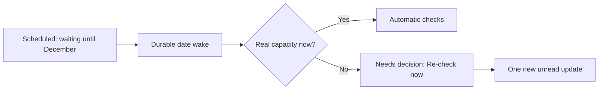

# FLO-1355 — v13 review disposition and v14 corrections

18 September 2026 · Documentation only · Implementation paused

The v13 review accepts M6 and L7, confirms most of M5, and identifies M7 plus L8. The [v14 design](Fload-Inbox-Revised-Design-v14.md) corrects both; the [visual summary](summary.html) explains the result.

| Finding | Applied correction |
|---|---|
| M7 · Already-expired edit reduces six recovery reads to one | Keep all N ordinary starts when expiry fits inside the window. Only the Nth start has an expiry lower bound. Use a separate reserved tail only when expiry reaches/exceeds the ordinary deadline. |
| L8 · December work asks for Re-check now in September | Add a closed derived Scheduled presentation for the genuine future release gate. Retain factual capacity separately. Persist the date wake; when due, show actual checks or one actionable recheck transition. |

## Cleanup recovery keeps its retry allowance

Use the same immutable original DELETE finish F, exact inspection-create receipt expiry E and pinned N=6, O=168h, B=1h, G=24h. Define R=E+B and D=F+O.

| Case | Ordinary starts | Protected final opportunity | Fixed end |
|---|---|---|---|
| R < D | Up to N starts, including multiple starts after expiry | Nth start no earlier than R, still subject to backoff | D |
| R >= D | Up to N−1 starts before D | One start in [R,R+G), still subject to backoff | R+G |

Equality takes the extended branch because D is an exclusive ordinary deadline. Within the ordinary window, crossing R does not forfeit remaining slots. Every failed, cancelled or expired original start still counts. No seventh attempt, new grant, resend or moving deadline is added. Independent Reconcile grants keep separate accounting; count exhaustion is handled at finalization.

A documentation arithmetic check reproduced the v13 defect and checked these v14 examples. These times assume immediate failed read completion, zero worker delay and continued eligibility; they do not predict provider success or validate platform code.

| Expiry E relative to F | Permitted start times after F (hours) | Final start deadline |
|---|---|---|
| Already expired (−24h) | 1, 3, 7, 15, 31, 55 | 168h |
| Just after F (+0.5h) | 1, 3, 7, 15, 31, 55 | 168h |
| Inside window (+100h) | 1, 3, 7, 15, 31, 101 | 168h |
| R exactly D (E=+167h) | 1, 3, 7, 15, 31, 168 | 192h |
| Beyond window (+200h) | 1, 3, 7, 15, 31, 201 | 225h |

A sixth case just below the boundary also passes. SQL/Core must additionally prove equality ± one microsecond using exact timestamp arithmetic, delayed reads, concurrent admission, late evidence and independent grant accounting. A narrow remaining interval can be missed; it is never extended from a worker wake.

The original uncertain DELETE remains uncertain until valid evidence resolves it. Google supplies an edit ID, expiry and exact GET representation; those facts support scheduling, not automatic proof of cleanup or a universal validity duration. An edit still returned as present remains mismatch/FALSE after expiry. [AppEdit resource](https://developers.google.com/android-publisher/api-ref/rest/v3/edits), [GET edit](https://developers.google.com/android-publisher/api-ref/rest/v3/edits/get).

One precision correction to the review: v13 already normalized consumed-count exhaustion in finalization. Its defect was losing the remaining starts, not a required wait until the deadline after that loss.

## A future date is a real wait, not an imaginary grant

| Closed waitRecoveryMode | Placement | Action | Progress exhaustion tuple |
|---|---|---|---|
| scheduled | in_progress, future month | Waiting until date; no early Re-check | NULL / NULL / NULL |
| automatic | in_progress | Existing bounded checks | NULL / NULL / NULL |
| recheck_required | needs_decision | Re-check now | Exact budget reason / step / applicable subject |

Scheduled applies only to the current approved awaiting_release execution before any write/generation admission, with a future date and no independent stronger blocker. It cannot postpone publication checks, uncertain-write recovery, permission/conflict decisions or another child's work. Parent, list, count and row controls use the same scoped projection and database snapshot.

The existing next_run_at stores a state-only gate wake even when there is no grant. Earlier required normalization can run first, then the gate remains; an already-processed expired deadline does not create a busy loop. No provider event is presumed. Without an offer at the gate, required-recheck progress is durably recorded once and the work becomes unread once.

Scheduled uses the existing NULL progress-cause tuple. Moving an exhausted wait into the future appends a narrow attention-neutral clearing snapshot in the scheduling transaction; moving automatic to scheduled with an already-NULL tuple needs only the recorded date command. Passing the gate without capacity then creates the budget tuple and a distinct attention transition. Schedule/unschedule itself remains attention-neutral. Pre-existing actionable unrecorded exhaustion is recorded first and cannot be hidden by scheduling or a newly accepted grant.

A new Reconcile for only this parked binding obligation is refused with existing invalid_transition before creating a grant. Replay still returns its original command outcome; already-issued-effect recovery is unaffected. No new stored field or relation is added; scheduled is a new closed value in the derived waiting wire union.

## Personal read state stays conservative

The review's optional watermark relaxation is deferred. A user's command can discover system progress they have not seen; transaction membership alone does not establish that they read it. Keep the existing actor-only compare-and-set and force_unread behavior. Explicitly marking the presented version read remains available. This is a UX choice, not an unresolved lifecycle defect.

## What still needs implementation proof

V13's accepted immutable history, exact approvals, guard release and strict native finality rules remain. Required work includes the exact same-transaction proof for silent progress, SQL/Core projection and selector parity, native decoder fixtures, deferred constraint/migration activation checks, crash/concurrency/read-state/gate tests, representative migration rehearsal and full producer cutover.

Artifact and arithmetic checks are not application tests. The preserved prototype and its migration catalog remain unchanged; no platform implementation, migration, provider write or production deployment occurred. Revised scope remains 28 Actions relations + two new Usage relations + one modified Usage log = 31 touched relations, not 31 new tables.

## Final consistency pass

The independent M7 pass found the branch, general grant, normalization and acceptance-case rules consistent. The L8 pass found three older restatements in the binding table, deadline normalizer and scheduling walkthrough; these now preserve the future gate wake instead of clearing it on exhaustion. The normalizer also explicitly distinguishes a changed progress-cause signature from scheduled-to-automatic presentation with an unchanged NULL tuple, which creates no extra history/attention. No platform tests or edits were performed by either reviewer.
