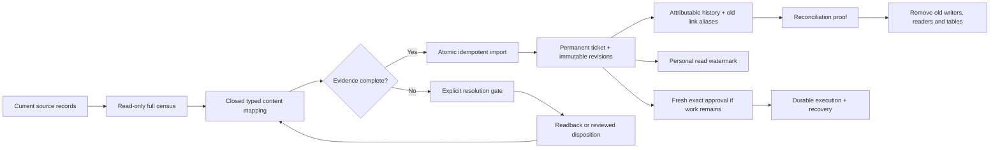

# Fload inbox — clean migration and data plan

**Status: design and evidence handoff, 16 September 2026.** Source review is grounded in `f0b1af5fc` plus an uncommitted, paused implementation prototype. Nothing described here has been deployed. Passing a prototype test does not mean the complete cutover is ready. This document contains no customer data or production counts.

The migration must preserve what can be proved, make uncertainty explicit, and finish by removing the old workflow authority. Copying an old status into a new approval is not a migration proof. An approval requires a known actor, the exact reviewed revision, and exact selected membership. A receipt proves only the provider fact it actually contains.

## The destination, in one picture

Every source row receives a finite disposition: **imported**, **already mapped**, **covered by a persisted parent**, **needs recovery**, **needs historical evidence mapping**, **needs explicit workflow resolution**, or **unsupported current capability**. There is no default-to-approved branch, silent row skip, arbitrary first-N cutoff, or opaque JSON archive inside the new runtime.

## Source ownership and destination

| Source | What it actually owns | Destination and preservation rule |
|---|---|---|
| `pending_action` | Old action identity, mutable proposal, approval/lifecycle fields, source-run links, execution/check-back pointers | Permanent `action`; immutable `action_revision` and typed content; namespaced `action_alias`; source FK/provenance. Mutable JSON content is parsed into a closed operation-specific shape. Approval/delivery fields require separate evidence resolution. |
| `review_draft_reply` | Current reply bytes, original AI reply, delivery scheduling/attempt hints | One review child ticket with exact reply and review snapshot. Preserve differing AI/user versions as separate revisions only when the revision facts can be proved. Pending-send/error/readback hints are recovery inputs, not completed delivery. |
| Derived review batch IDs and old `post_batch` | Previously assembled membership, sometimes draft-ID/digest evidence | Persist one parent and exact child revision membership. Preserve every old batch link; explicitly mark whether historical membership is known. Current unapproved membership can be reviewed anew; old approved membership cannot be guessed. |
| `review_draft_rejection` | Human rejection attribution, reason, source draft ID, review fingerprint, immutable draft snapshot | Preserve the exact rejected content, original attribution and suppression identity. A rejection must continue preventing automatic reproposal for the same review snapshot. Importer is still required; deleting this source/read now would lose human intent. |
| `review_history` | Review text/rating/version/edit snapshots, developer-response snapshots, draft snapshots and capture times | Typed review content/observations, ordered by recorded evidence. Preserve response/draft distinctions and original timestamps; capture time is not approval time. The complete historical importer is unresolved. |
| `agent_request` | Actionable generation/request proposal, approval policy, context, parent source and linked work | Durable request/collection/child tickets. Persist every locale/store child. Keep generation authorization separate from authorization to publish generated content. |
| `agent_request_event` | Created/approved/rejected/blocked/retried/superseded/completed/failed source events, actor and source run | Attributable immutable history facts only where exact meaning is known. An old event message is not a content pin. Event import remains a gate. |
| `inbox_item_state` | A mixture of personal read state and personal workflow overlays | Read/unread → `action_read`. Snooze/dismiss/archive/iteration → explicit shared-workflow resolution; never use last-user-wins. Preserve notes/attribution when resolving. |
| `capability_execution` and existing recovery evidence | Provider execution/verification audit, including source or synthetic correlation IDs | Preserve receipt IDs and links. Verify exact target/operation/outcome before adopting evidence. A source-less receipt cannot be assigned by proximity in time. Full evidence import is still required. |
| Recommendations, variants, experiments, agent runs, report versions, backlog items | Existing business-domain objects and provenance | Retain their domain ownership. Reference them through typed source relations. Actions must not become a second experiment lifecycle or a second agent runtime. |
| BullMQ jobs and old delivery schedules | Existing queued/in-flight work; possible external effects | Inspect and resolve before enabling new delivery. Queues transport execution IDs and schedule generations; they never become a second approval or workflow database. |

## Exact source/status decision matrix

The prototype currently admits only provably unapproved current work. The following distinguishes that working subset from the final migration requirements.

| Source condition | Prototype behavior | Required final disposition |
|---|---|---|
| Pending action `pending_approval`, no approval/delivery/history markers, supported closed payload | Typed import after target/baseline capture and fingerprint check | Open ticket, exact revision, old ID alias; no inherited authorization. |
| Pending action `approved` | Blocks `requires_recovery` | Prove actor, reviewed bytes and membership. If any pin is missing, require fresh approval for remaining work after provider reconciliation. Never create a perform grant from status alone. |
| Pending action `executed` or `completed` | Blocks `requires_recovery` | Verify what the receipt proves: accepted write, editable state, live state or measured outcome. Preserve those as distinct facts. A provider readback may show external completion without proving historical Fload authorship. |
| Pending action `failed` | Blocks `requires_recovery` | Determine known-not-applied versus uncertain application. Retry only the former; reconcile the latter first. Failure text alone is not proof of non-application. |
| Pending action `rejected`, `expired`, `superseded`, deletion/rejection/successor markers | Blocks recovery/history import | Preserve actor/reason/timestamps and successor identity where known. Retired work is not revived as an open proposal. Tombstones remain explicit; old URLs resolve to their history. |
| Any unknown status | Blocks `unknown_status` / `unrecognized_status` | Classify explicitly from source evidence or keep migration blocked. It can never become approved or successful by default. |
| Draft reply: unsent, no pending send, no attempts/error/readback schedule, unchanged original/current draft | Typed import, or consolidation into parent | Exact review snapshot and reply bytes; send/update intent backed by observed provider state. |
| Draft reply has `pendingSendAt`, `sentAt`, attempts, send error, or scheduled readback | Blocks `requires_recovery` | Check queue and provider. Persist an uncertain/known outcome before deciding whether any new send is safe. |
| Draft reply differs from `originalAiReply` | Blocks `requires_history_import` | Preserve both revisions and known provenance; do not label the edited text as the original model output. |
| Review pending action overlaps an identical current draft | Consolidated by batch importer | One child identity, aliases for both sources, no duplicate independently executable reply. |
| Overlapping reply sources disagree on bytes, intent, digest or target | Blocks source/content mismatch | Reviewed reconciliation; never choose whichever row was read last. |
| Unapproved old batch has no draft digests | May import current exact child revisions as newly reviewable work | Preserve old link and `historicalMembershipKnown=false`; new approval must review new frozen membership. This does not reconstruct historical approval. |
| Previously approved batch has missing digests or changed membership | Blocks recovery/history import | Reconstruct only from immutable evidence. Otherwise preserve uncertainty and require fresh approval for unresolved children. Do not infer membership from today's pending rows. |
| Agent request `open`, supported current kind, no approval/history-linked markers | Typed import | Request or parent/children with source provenance; exact generation scope. |
| Agent request `blocked`, supported current prerequisite shape | Typed advisory/prerequisite import where fully mapped | Shared actionable blocker with exact guide and source; it is not an approved publish operation. |
| Agent request `approved`, `rejected`, `failed`, `superseded`, `completed`, or approval markers | Blocks `requires_recovery` | Resolve history and execution links; no status-only approval conversion. |
| Request references another pending action, experiment, scenario or successor | Blocks `requires_history_import` | Reconstruct the actual relationship and preserve domain ownership. Do not duplicate the linked work. |
| Restore/revert proposal lacks the frozen original listing | Blocks `requires_restore_snapshot` | Recover exact prior content and provider target; otherwise produce an explicit review decision, not an invented rollback. |
| Provider mutation source already has a capability receipt, even if status still says pending | Blocks recovery in direct reply/pending importers | Treat write-before-confirmation as possible external effect. Check all overlapping batch paths too; do not resubmit. |
| Retired/unsupported operation or unrecognized payload keys | Blocks `unmapped_content` | Inventory and explicitly retire or map evidence. Do not add speculative runtime capabilities or an open payload escape hatch merely to make import pass. |

A missing source row, wrong organization/app/provider target, changed source fingerprint, or baseline mismatch is a separate hard refusal. These are not harmless warnings.

## Personal overlays: there is no automatic shared winner

| Old state | Clean mapping | Resolution needed |
|---|---|---|
| `read` | Personal `seen_attention_version` at the imported ticket's attention version | Map every old source alias to the same permanent ticket before importing watermarks. |
| `unread` or no row | Unseen watermark/no read row | Never alter the shared decision. |
| `snoozed` | Attributable organization-shared snooze command | Multiple personal deadlines conflict. Require a reviewed shared disposition; do not silently select latest/longest. |
| `dismissed` | Explicit shared decline or acknowledgement, according to the item's meaning | A personal dismissal cannot be silently promoted to the whole organization's decision. |
| `archived` | Explicit shared archive command | Preserve the original note and actor; confirm how conflicting personal views are resolved. |
| `iterating` | Inspect durable job/run and exact input revision | Adopt a valid output only against its original revision/membership pin; otherwise reopen or record failed/stale generation. Do not migrate an orphan spinner as active work. |
| Unknown value, contradictory notes or multiple workflow overlays | Block automatic import | Capture a finite reviewed disposition before final cutover. |

The current importer intentionally blocks every non-read overlay. A reviewed resolution format, precedence policy and tests are still required. This is a product decision with data consequences, not an implementation detail to hide in a migration script.

## Unknown approvals and historical evidence

Four facts must remain separate:

1. **A source says somebody approved something.** Preserve that fact and its actual actor/time if present.
2. **We can prove the exact content and selected membership approved.** Only this can support an exact historical approval pin.
3. **A provider accepted or may have accepted a write.** Preserve the receipt/uncertainty and original correlation identity.
4. **A later observation proves a current state.** It may prove externally handled work; it does not retroactively prove who caused it.

If the actor is missing, the UI must say attribution is unavailable. If content pins are missing, it must say the authorized revision cannot be proved. The migration actor records the import; it is never presented as the historical approver. No invented user, timestamp, source revision, provider response or selected child is permitted.

**Important unresolved model boundary:** the current 31-table prototype only has proposal/baseline/observation revisions and execution attempts that descend from an exact approval. It does not yet implement a complete import contract for a historical receipt whose approval cannot be proved. Creating a fake approval/execution to satisfy those foreign keys would be wrong. Before deleting the old source, the final design must support these factual audit records through a closed, explicitly non-authorizing evidence import, or through an existing separately owned audit record with preserved immutable identity. Any such change must document its precise grain and fields; adding a generic legacy payload table is not an acceptable resolution.

The clean end state is one runtime workflow model. Keeping old source rows temporarily while a validated migration is incomplete protects evidence; it is not the target architecture. Retirement is blocked until every preserved receipt/link has a durable, tested destination and the old source is no longer read as workflow authority.

## Stable IDs and relationship rules

- New ticket IDs are deterministic for the organization/source creation key. Source namespaces prevent collisions between a draft ID, request ID and old pending-action ID.
- `action_alias` preserves old URLs and references. Aliases resolve to a permanent ticket; they do not define workflow state.
- A structural `parent_action_id` makes a child a normal ticket with its own lifecycle and history. A separate membership row pins which child revision a particular parent revision included.
- Current unapproved review drafts may be consolidated into one explicit package. Multiple old batch URLs can point to that package while retaining the fact that earlier membership is unproved.
- A new review or newly discovered locale creates new work. It never silently joins an already approved membership revision.
- Partial outcomes remain attached to the same parent. A retry selects unresolved children only, after readback for uncertain effects.
- Original receipts and source IDs are never reassigned to unrelated work to make foreign-key counts match. Dangling references must be individually resolved or retained as explicitly unlinked evidence.

## Migration gates and order

| Gate | Required evidence | Prototype status |
|---|---|---|
| 1. Complete source census | Every source/status/type/key combination, aliases, conflicting overlays, historical evidence and all queue states; no list caps | Full organization pending/request/draft/receipt/overlay census exists. It is not yet a complete historical-event/rejection importer. |
| 2. Source mapping complete | Closed parsers, exact target fields, typed baseline capture, explicit unsupported disposition | Current unapproved replies, review packages, listing proposals, ASA operations, locale/listing requests and selected advisories mapped. Historical/restore cases remain blocked. |
| 3. All producers/readers switched | Current entry points use Actions; no old direct inserts, approvals or browser timers remain authoritative | Partial prototype only. Orchestrator direct `pending_action` inserts and check-back lifecycle remain. Generic legacy staging helpers remain and need final caller census/removal. |
| 4. Old queues quiescent | Running, waiting, paused, delayed, prioritized and waiting-child jobs reconciled; late workers fenced | CLI checks those Redis states for the identified legacy queues. A zero count alone does not prove all replicas are compatible or every provider effect is known. |
| 5. Reviewed plan and capture manifest | Organization, source fingerprints, captured observations, canonical digest and one disposition per row | Strict private manifest/plan contracts and read-only preflight implemented. Some preflight paths still defer target/evidence validation to apply; make those agree before declaring readiness. |
| 6. Apply idempotently | Atomic graph import, exact fingerprint recheck, stable aliases, no provider I/O in a DB transaction | Implemented for the supported subset; repeat/concurrent import and migration-chain tests exist. Apply is gated on quiescent queues and explicit compatible-writer acknowledgement. |
| 7. Evidence/link reconciliation | Source and target census match by disposition; all historical links resolve; no fabricated authority; same-content digests match | Not complete. Receipt/history/rejection mapping is an explicit blocker. |
| 8. Product parity | Exact list/count predicate, all pages reachable, old URLs resolve, personal read state independent, shared history attributed | Requires integrated end-to-end acceptance across every entry point. A schema proof cannot establish UI parity. |
| 9. Contract cleanup | Remove superseded writes/reads/types/jobs/flags, then destructive source-table migration with rehearsal and rollback evidence | Not implemented. Do not drop evidence now. |

The prototype CLI emits `fullCutoverReady=false` while blocked sources, historical drafts, capability receipts, dangling receipt links or queued old work remain. This is deliberately conservative. The finalized readiness calculation must track **mapped receipt/evidence identities**, rather than requiring all historically legitimate audit records to disappear. It must not be weakened to ignore them.

Apply is resumable per atomic source graph. A crash after one graph commits must replay its exact creation receipt and aliases, then continue with the next graph. A source edited after preflight must refuse rather than import a stale plan. Provider captures happen before the database transaction; they are immutable evidence, not instructions to read mutable provider state again during approval.

## What gets retired, what remains

**Retire as workflow authorities:** `pending_action` and its JSON proposal/before/after/check-back lifecycle; `agent_request`/request-event lifecycle once preserved; mutable review draft delivery timers/state once migrated; mixed `inbox_item_state`; batch identity reconstructed on every read; browser-only acceptance; duplicated legacy inbox approval/iteration/dispatch paths.

**Retain by domain ownership:** organization/user/asset/connectors; agent/run/runtime; review source facts; ASO recommendations, variants and experiments; report/backlog domains; media/storage infrastructure; existing BullMQ transport. Their relevant links become typed references. These are not legacy simply because Actions refers to them.

**Preserve before retirement:** review rejections and their suppression fingerprints; review-history snapshots; capability/recovery receipts, including uncertain and unlinked ones; old URLs, successor chains, approval attribution where provable, original content and dates. Do not delete a business-domain audit ledger just to advertise a smaller Actions table count.

## Why 31 tables, and where that is a choice

The actual applied 0146 + 0147 prototype has **31 physical tables and 497 physical columns**, plus three relational views. The 0147 progress amendment adds four columns and no tables. These counts describe a paused draft, not a promise that the cutover schema is complete.

| Group | Tables | Grain |
|---|---:|---|
| Shared workflow and delivery | 13 | Ticket; revision; command; command target; approval; policy revision; execution; step; attempt; resource guard; parent membership; dependency; personal read. |
| Typed Fload content | 9 | Listing, review, request and advisory content; ordered notes; content terms; media slots; market countries; market competitors. |
| Source links | 2 | Revision sources and existing identity aliases. |
| Provider-specific contract/evidence | 7 | ASC listing contract, ASC step contract, ASC receipt; Play listing contract and receipt; Apple Ads content and receipt. |

The prior design had 25 tables. The physical provider-boundary amendment adds exactly **six**: two listing-contract extensions, one ASC upload-step extension, and three provider receipt extensions. Moving the existing Ads content table into `apple_ads` adds zero. PostgreSQL schemas are namespaces in the same database, not separate services or databases.

Normalization does **not** require every provider extension or one-to-one content subtype to have its own table. The six-table split buys explicit provider ownership, provider-specific constraints and fewer irrelevant fields in shared protocol rows. It also costs joins, deferred cross-table invariants and a larger migration surface. A 25-table variant with strict closed provider subtypes and well-enforced module ownership is a legitimate alternative if physical separation does not deliver a concrete maintenance benefit. The diagram must show that choice honestly.

Several separate grains are substantially harder to merge safely:

- Ticket versus revision: one mutable pointer versus many immutable content versions.
- Structural parent versus membership: permanent relationship versus the exact children/revisions seen in a particular package.
- Command versus target: one attributable batch action versus many per-ticket preimages/results.
- Approval versus execution: immutable reviewed authority versus mutable delivery progress and retries.
- Step versus attempt: one intended provider effect versus repeated/late writes and observations of that effect.
- Shared ticket versus personal read: organization decision versus one user's attention watermark.
- Notes/terms/countries/competitors/media: multiple independently keyed values; flattening them into JSON/arrays or repeating the whole ticket creates update anomalies.

Some deliberate consolidations reduce unnecessary structure: all seven active ASA operations share one closed content table; current advisory variants share one closed content table; baseline and observation snapshots reuse their concrete content family; there is no duplicate generic event log, no provider-specific approval lifecycle, and no generic job-payload table. Timeline views combine immutable facts already owned by commands, revisions, approvals and attempts.

## Tested prototype versus unfinished work

Completed evidence in the paused prototype includes full migration-chain setup, idempotent/concurrent materialization, exact baseline and stale approval protections, review-batch consolidation, source fingerprint refusal, cross-tenant refusal, per-user read preservation, and scoped organization/user erasure. Relevant completed runs include 18 materialization/observation/reply/batch integration cases, 10 source-migration/erasure cases, and a later 8-case ASA/advisory producer run. These are separate focused runs, not a claim that the entire repository suite passed.

The latest ASA acceptance suite passed 45 unit cases covering the seven HTTP operations, chat scope/intent, retained bid/currency safeguards, strict proposal parsing and complete provider baseline capture. ASA creation/approval tests prove no provider write occurs during acceptance and retries return the original durable result.

The last complete storage harness passed 87 assertions plus its concurrency and migration rerun checks. Four subsequently added App Clip absent/incomplete-header fixtures initially failed because the test attempted to edit immutable revision metadata; that fixture was corrected, but the corrected run was **not completed before implementation paused**. Later additive progress work and the latest full-worktree typecheck remain outside that validated baseline. Do not describe the entire new schema as fully validated yet.

Required remaining work before a real cutover:

1. Resolve the closed historical-evidence import contract, rejection suppression, request events, edited original drafts, tombstones and successor chains.
2. Close preflight/apply parity gaps, including overlapping batch receipts and full target/capture validation.
3. Complete or explicitly retire every current producer, old reader, check-back path and transport callback; orchestrator direct writes remain a known example.
4. Recover restore snapshots and App Clip source/media pins for applicable existing work; do not silently omit old effects.
5. Rehearse a full migration on representative isolated data, kill/restart at each commit boundary, and prove all links/evidence are retained.
6. Complete integrated list/count/pagination/history and concurrency/retry/crash tests, full typecheck/lint/repository-required suites, and UI walkthroughs.
7. Only then generate and validate the destructive contract cleanup. No production deployment is part of this work.

## Source pointers

- [Source schema at the audited main commit](https://github.com/fload-ai/fload-platform/blob/f0b1af5fc/packages/database/src/schema.ts)
- [Current orchestrator source at the audited main commit](https://github.com/fload-ai/fload-platform/blob/f0b1af5fc/apps/api/src/agents/implementations/orchestrator-agent.ts)
- [Generic agent staging at the audited main commit](https://github.com/fload-ai/fload-platform/blob/f0b1af5fc/apps/api/src/services/agents/stage-agent-pending-actions.ts)
- [Registered-work staging at the audited main commit](https://github.com/fload-ai/fload-platform/blob/f0b1af5fc/apps/api/src/services/inbox-work/stage-registered-work.ts)

The new migration, typed importers, provider modules and tests are uncommitted prototype work. They are deliberately not linked as though they exist on that main commit. The artifact’s actual schema catalog should identify its own generated version separately from these source references.
