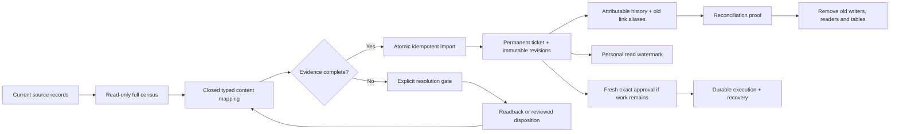

# Fload inbox — clean migration and data plan

> **18 September update:** [Corrected design v15](Fload-Inbox-Revised-Design-v15.md) now defines the reviewed execution, command-history and Usage contracts. Start with the [simple visual summary](summary.html). This supporting document preserves the wider inventory and earlier review evidence; v15 takes precedence where its contracts change these proposals. Implementation and migration validation remain open.

**Status: design revision required; implementation remains paused, 16 September 2026.** Source review is grounded in `f0b1af5fc` plus an uncommitted prototype. The current **31-table, 497-column draft is unchanged**, not the approved destination schema. Independent review verified migration, retention, tenant-reference and content-constraint gaps. Nothing described here has been deployed; a passing prototype test does not establish complete cutover readiness. This document contains no customer data or production counts. See the [review resolution](Fload-Review-Resolution.md) for the full disposition and corrections to the external review.

The migration must preserve what can be proved, make uncertainty explicit, and finish by removing the old workflow authority. Copying an old status into a new approval is not a migration proof. An approval requires a known actor, the exact reviewed revision, and exact selected membership. A receipt proves only the provider fact it actually contains.

## The destination, in one picture

Every source row receives a finite disposition: **imported**, **already mapped**, **covered by a persisted parent**, **needs recovery**, **needs historical evidence mapping**, **needs explicit workflow resolution**, or **unsupported current capability**. There is no default-to-approved branch, silent row skip, arbitrary first-N cutoff, or opaque JSON archive inside the new runtime.

## Source ownership and destination

| Source | What it actually owns | Destination and preservation rule |
|---|---|---|
| `pending_action` | Old action identity, mutable proposal, approval/lifecycle fields, source-run links, execution/check-back pointers | Permanent `action`; immutable `action_revision` and typed content; namespaced `action_alias`; source FK/provenance. Mutable JSON content is parsed into a closed operation-specific shape. Approval/delivery fields require separate evidence resolution. |
| `review_draft_reply` | Current reply bytes, original AI reply, delivery scheduling/attempt hints | One review child ticket with exact reply and review snapshot. Preserve differing AI/user versions as separate revisions only when the revision facts can be proved. Pending-send/error/readback hints are recovery inputs, not completed delivery. |
| Derived review batch IDs and old `post_batch` | Previously assembled membership, sometimes draft-ID/digest evidence | Persist one parent and exact child revision membership. Preserve every old batch link; explicitly mark whether historical membership is known. Current unapproved membership can be reviewed anew; old approved membership cannot be guessed. |
| `review_draft_rejection` | Human rejection attribution, reason, source draft ID, review fingerprint, immutable draft snapshot | Preserve the exact rejected content, original attribution and suppression identity. A rejection must continue preventing automatic reproposal for the same review snapshot. Importer is still required; deleting this source/read now would lose human intent. |
| `review_history` | Review text/rating/version/edit snapshots, developer-response snapshots, draft snapshots and capture times | Typed review content/observations, ordered by recorded evidence. Preserve response/draft distinctions and original timestamps; capture time is not approval time. The complete historical importer is unresolved. |
| `agent_request` | Actionable generation/request proposal, approval policy, context, parent source and linked work | Durable request/collection/child tickets. Persist every locale/store child. Keep generation authorization separate from authorization to publish generated content. |
| `agent_request_event` | Created/approved/rejected/blocked/retried/superseded/completed/failed source events, actor and source run | Attributable immutable history facts only where exact meaning is known. An old event message is not a content pin. Event import remains a gate. |
| `inbox_item_state` | A mixture of personal read state and personal workflow overlays | Read/unread → `action_read`. Snooze/dismiss/archive/iteration → explicit shared-workflow resolution; never use last-user-wins. Preserve notes/attribution when resolving. |
| `capability_execution` and existing recovery evidence | Provider execution/verification audit, including source or synthetic correlation IDs | Preserve receipt IDs and links. Verify exact target/operation/outcome before adopting evidence. A source-less receipt cannot be assigned by proximity in time. Full evidence import is still required. |
| Recommendations, variants, experiments, agent runs, report versions, backlog items | Existing business-domain objects and provenance | Retain their domain ownership. Reference them through typed source relations. Actions must not become a second experiment lifecycle or a second agent runtime. |
| BullMQ jobs and old delivery schedules | Existing queued/in-flight work; possible external effects | Inspect and resolve before enabling new delivery. Queues transport execution IDs and schedule generations; they never become a second approval or workflow database. |

## Exact source/status decision matrix

The prototype importer is intended to admit only provably unapproved current work. Its supported subset still has preflight/apply parity and overlapping-evidence gaps, so it is not ready for use as a complete migration. The following distinguishes existing behavior from the final requirements.

| Source condition | Prototype behavior | Required final disposition |
|---|---|---|
| Pending action `pending_approval`, no approval/delivery/history markers, supported closed payload | Typed import after target/baseline capture and fingerprint check | Open ticket, exact revision, old ID alias; no inherited authorization. |
| Pending action `approved` | Blocks `requires_recovery` | Prove actor, reviewed bytes and membership. If any pin is missing, require fresh approval for remaining work after provider reconciliation. Never create a perform grant from status alone. |
| Pending action `executed` or `completed` | Blocks `requires_recovery` | Verify what the receipt proves: accepted write, editable state, live state or measured outcome. Preserve those as distinct facts. A provider readback may show external completion without proving historical Fload authorship. |
| Pending action `failed` | Blocks `requires_recovery` | Distinguish conclusive non-application from uncertainty. A retry still requires valid authorization and provider retry policy. Permanent rejection can reopen editable work on the same ticket only after all effects are resolved; approve the new revision separately. Failure text, timeouts and exhausted readback budgets do not prove non-application. |
| Pending action `rejected`, `expired`, `superseded`, deletion/rejection/successor markers | Blocks recovery/history import | Preserve actor/reason/timestamps and successor identity where known. Retired work is not revived as an open proposal. Tombstones remain explicit; old URLs resolve to their history. |
| Any unknown status | Blocks `unknown_status` / `unrecognized_status` | Classify explicitly from source evidence or keep migration blocked. It can never become approved or successful by default. |
| Draft reply: unsent, no pending send, no attempts/error/readback schedule, unchanged original/current draft | Typed import, or consolidation into parent | Exact review snapshot and reply bytes; send/update intent backed by observed provider state. |
| Draft reply has `pendingSendAt`, `sentAt`, attempts, send error, or scheduled readback | Blocks `requires_recovery` | Check queue and provider. Persist an uncertain/known outcome before deciding whether any new send is safe. |
| Draft reply differs from `originalAiReply` | Blocks `requires_history_import` | Preserve both revisions and known provenance; do not label the edited text as the original model output. |
| Review pending action overlaps an identical current draft | Consolidated by batch importer | One child identity, aliases for both sources, no duplicate independently executable reply. |
| Overlapping reply sources disagree on bytes, intent, digest or target | Blocks source/content mismatch | Reviewed reconciliation; never choose whichever row was read last. |
| Unapproved old batch has no draft digests | May import current exact child revisions as newly reviewable work | Preserve old link and `historicalMembershipKnown=false`; new approval must review new frozen membership. This does not reconstruct historical approval. |
| Previously approved batch has missing digests or changed membership | Blocks recovery/history import | Reconstruct only from immutable evidence. Otherwise preserve uncertainty and require fresh approval for unresolved children. Do not infer membership from today's pending rows. |
| Agent request `open`, supported current kind, no approval/history-linked markers | Typed import | Request or parent/children with source provenance; exact generation scope. |
| Agent request `blocked`, supported current prerequisite shape | Typed advisory/prerequisite import where fully mapped | Shared actionable blocker with exact guide and source; it is not an approved publish operation. |
| Agent request `approved`, `rejected`, `failed`, `superseded`, `completed`, or approval markers | Blocks `requires_recovery` | Resolve history and execution links; no status-only approval conversion. |
| Request references another pending action, experiment, scenario or successor | Blocks `requires_history_import` | Reconstruct the actual relationship and preserve domain ownership. Do not duplicate the linked work. |
| Restore/revert proposal lacks the frozen original listing | Blocks `requires_restore_snapshot` | Recover exact prior content and provider target; otherwise produce an explicit review decision, not an invented rollback. |
| Provider mutation source already has a capability receipt, even if status still says pending | Blocks recovery in direct reply/pending importers | Treat write-before-confirmation as possible external effect. Check all overlapping batch paths too; do not resubmit. |
| Retired/unsupported operation or unrecognized payload keys | Blocks `unmapped_content` | Inventory and explicitly retire or map evidence. Do not add speculative runtime capabilities or an open payload escape hatch merely to make import pass. |

A missing source row, wrong organization/app/provider target, changed source fingerprint, or baseline mismatch is a separate hard refusal. These are not harmless warnings.

## Personal overlays: there is no automatic shared winner

| Old state | Clean mapping | Resolution needed |
|---|---|---|
| `read` | Personal `seen_attention_version` at the imported ticket's attention version | Map every old source alias to the same permanent ticket before importing watermarks. |
| `unread` or no row | Unseen watermark/no read row | Never alter the shared decision. |
| `snoozed` | Attributable organization-shared snooze command | Multiple personal deadlines conflict. Require a reviewed shared disposition; do not silently select latest/longest. |
| `dismissed` | Explicit shared decline or acknowledgement, according to the item's meaning | A personal dismissal cannot be silently promoted to the whole organization's decision. |
| `archived` | Explicit shared archive command | Preserve the original note and actor; confirm how conflicting personal views are resolved. |
| `iterating` | Inspect durable job/run and exact input revision | Adopt a valid output only against its original revision/membership pin; otherwise reopen or record failed/stale generation. Do not migrate an orphan spinner as active work. |
| Unknown value, contradictory notes or multiple workflow overlays | Block automatic import | Capture a finite reviewed disposition before final cutover. |

The current importer intentionally blocks every non-read overlay. A reviewed resolution format, precedence policy and tests are still required. This is a product decision with data consequences, not an implementation detail to hide in a migration script.

## Unknown approvals and historical evidence

Four facts must remain separate:

1. **A source says somebody approved something.** Preserve that fact and its actual actor/time if present.
2. **We can prove the exact content and selected membership approved.** Only this can support an exact historical approval pin.
3. **A provider accepted or may have accepted a write.** Preserve the receipt/uncertainty and original correlation identity.
4. **A later observation proves a current state.** It may prove externally handled work; it does not retroactively prove who caused it.

If the actor is missing, the UI must say attribution is unavailable. If content pins are missing, it must say the authorized revision cannot be proved. The migration actor records the import; it is never presented as the historical approver. No invented user, timestamp, source revision, provider response or selected child is permitted.

**Important unresolved model boundary:** the current 31-table prototype only has proposal/baseline/observation revisions and execution attempts that descend from an exact approval. It does not yet implement a complete import contract for a historical receipt whose approval cannot be proved. Creating a fake approval/execution to satisfy those foreign keys would be wrong. Before deleting the old source, the final design must support these factual audit records through a closed, explicitly non-authorizing evidence import, or through an existing separately owned audit record with preserved immutable identity. Any such change must document its precise grain and fields; adding a generic legacy payload table is not an acceptable resolution.

The clean end state is one runtime workflow model. Keeping old source rows temporarily while a validated migration is incomplete protects evidence; it is not the target architecture. Retirement is blocked until every preserved receipt/link has a durable, tested destination and the old source is no longer read as workflow authority.

## Stable IDs and relationship rules

- New ticket IDs are deterministic for the organization/source creation key. Source namespaces prevent collisions between a draft ID, request ID and old pending-action ID.
- `action_alias` preserves old URLs and references. Aliases resolve to a permanent ticket; they do not define workflow state.
- A structural `parent_action_id` makes a child a normal ticket with its own lifecycle and history. A separate membership row pins which child revision a particular parent revision included.
- Current unapproved review drafts may be consolidated into one explicit package. Multiple old batch URLs can point to that package while retaining the fact that earlier membership is unproved.
- A new review or newly discovered locale creates new work. It never silently joins an already approved membership revision. All producers must share one identity rule: catch-up and ordinary review discovery cannot create independently executable tickets for the same reply work. Changed-source reopening and rejection suppression require an explicit common rule.
- Partial outcomes remain attached to the same parent. A retry selects unresolved children only, after readback for uncertain effects.
- Original receipts and source IDs are never reassigned to unrelated work to make foreign-key counts match. Dangling references must be individually resolved or retained as explicitly unlinked evidence.

## Retention and erasure are migration contracts

The current draft has deferred NO ACTION references to rows that the existing product hard-deletes. Connector removal, integration uninstall and agent/source cleanup can therefore fail after an Actions record refers to them. This is distinct from organization/user erasure: the prototype contains narrow exceptions for those cases, not a general solution for independently deleted resources.

| Reference family | Required decision before final DDL | Evidence and deletion gate |
|---|---|---|
| Attempt → connector; command → Slack/Discord integration | Preserve immutable remote target/account and attributable origin. Choose nullable live lookup plus stable identity snapshot, or an explicit retired connector/integration identity. | Uninstall succeeds without deleting or rewriting the approved target, receipt or outcome; reconnection cannot silently redirect old authorization. |
| Command/source/attempt → agent run; request → agent | Separate historical attribution from a live executable target. Define which identity survives cleanup and which capability becomes unavailable. | Agent/run cleanup retains truthful history; an unavailable requested agent is not silently replaced. |
| Revision source → recommendation, variant, experiment, report or backlog | Keep domain ownership; specify a stable retained source identity or an exact, bounded provenance snapshot. | Domain reset/deletion does not orphan history or fabricate a replacement source. |
| Ticket/policy → asset | Decide whether app identity is tombstoned or represented by a retained identity snapshot; define asset removal separately from organization erasure. | Removing a dummy or real asset cannot erase approvals accidentally or make a ticket refer to a different app. |
| Command/ownership → user or API key | Preserve the distinction between actual actor, delegated subject and unavailable attribution while applying the approved erasure policy. | User/key deletion allows only the intended reference/snapshot changes; retained personal data follows the erasure policy. |
| Organization → owned Actions graph | Scoped organization erasure removes the graph and releases only that organization's resource ownership. | Test cycles, deferred guards and provider extensions under the actual runtime roles; never bypass all triggers. |

For each field, the revised schema must state **retain, snapshot, nullify, tombstone or erase**, its exact FK action, allowed guard transition, and user-visible history. These are unresolved design choices, not permission to apply SET NULL everywhere. Nullification alone can violate immutable-row and actor-shape guards. Allow only the precise parent-deletion transition; normal updates must remain forbidden. Cascading deletion of approval/receipt evidence during connector or source cleanup is not acceptable. Broad trigger disabling and generic bypass flags are excluded.

## Migration gates and order

| Gate | Required evidence | Current status |
|---|---|---|
| 1. Revised schema contract | Required/optional/forbidden field matrix for each closed variant; justified physical boundaries; complete tenant references and retention rules | Redesign required. The existing catalog remains a record of the paused draft. |
| 2. Migration isolation | Fully qualified DDL; no leaked session search path; correct behavior of later pending migrations, seeds and cleanup | Confirmed 0146 search-path defect remains in the unchanged draft. |
| 3. Real access roles | Application tenant transactions; explicit cross-organization worker/resource boundary; non-owner role tests for reads, writes and erasure | Local owner-role tests bypass RLS. Production role/bypass behavior has not been established; policies alone are not proof. |
| 4. Complete source census | Every source/status/type/key combination, aliases, conflicting overlays, historical evidence and all queue states; no list caps or locking preflight | Current census covers substantial current-work data, but historical import and complete queue/group coverage remain gaps. |
| 5. Source mapping complete | Closed parsers, exact target fields, typed baseline capture, deleted-asset policy and explicit unsupported disposition | Current unapproved replies, review packages, listing proposals, ASA operations, locale/listing requests and selected advisories have prototype mappings. Historical/restore cases remain blocked. |
| 6. Coordinated producer/reader switch | Every entry point uses Actions; no direct legacy writer, approval path or browser timer remains authoritative | Partial only. New readers and old writers must not be released independently. Orchestrator inserts, staging and check-back paths still require convergence. |
| 7. Old delivery quiescent | Running, waiting, paused, delayed, prioritized, waiting-child and grouped jobs reconciled; agent execution included; old replicas and late callbacks fenced | Current CLI coverage is incomplete. A zero count from selected queues does not prove compatibility or absence of an external effect. |
| 8. Reviewed plan and capture manifest | One disposition per source; exact organization/asset/target; fingerprints, captured observations and canonical digest; preflight/apply parity | Contracts exist, but preflight must become read-only and non-locking. Some target/evidence checks remain deferred to apply. |
| 9. Idempotent apply | Atomic graph import; lock/recheck source fingerprint; stable aliases; exact replay; no provider I/O in a DB transaction | Prototype subset exists with focused tests; complete import and final evidence remain unfinished. |
| 10. Evidence/link reconciliation | All preserved identities mapped by disposition; historical links resolve; no fabricated authority; overlapping sources and receipts reconciled | Receipt/history/rejection mapping remains a blocker. One in-flight draft must be reported explicitly rather than hide other eligible work. |
| 11. Product and recovery parity | Explicit counting unit and attention rules; all pages reachable; separate personal read; useful bounded recovery; attributable history | End-to-end acceptance required. Shared SQL predicates alone do not decide whether parents, children or both belong in the main count. |
| 12. Contract cleanup | Remove old authority only after all previous gates pass; rehearse destructive migration, restore and rollback boundaries | Not implemented. Do not drop evidence now. |

### Search-path proof must use the real migration boundary

Migration 0146 sets a session search path and never restores it. The migrator executes pending files on one connection inside one transaction, so subsequent unqualified DDL may land in the Actions namespace. The redesign must qualify DDL and remove the leaked setting, preserving the original session path if a change is necessary. SET LOCAL alone does not isolate migration files in the same transaction.

Append a sentinel migration in the same run and verify its unqualified public table lands in `public`. A probe on a new connection misses this bug. Static checks should reject unintended standalone session changes while allowing legitimate function-local search-path attributes. Re-run the full chain and its idempotent second pass after the fix; an earlier clean replay without a later sentinel does not prove this property.

### Tenant constraints and RLS must describe actual access

The draft already validates many revision-source tenants. It still lacks complete API-key attribution, actor-agent-run and attempt-connector tenancy checks. Close those specific gaps with composite references or explicit validation, including the relationship between a key, its actor and its organization.

Use actual database-role evidence to decide access policy. The application role must not rely unknowingly on table-owner bypass. Tenant queries, cross-organization due scans, global resource guards and deletion routines need an explicit, narrowly scoped access design. Blindly enabling FORCE RLS can disable recovery or locking; removing policies abandons protection. Non-owner tests must exercise both legitimate access and cross-tenant refusal, including operations outside the ordinary HTTP request transaction.

### Apply, reconcile and recover

The prototype CLI emits `fullCutoverReady=false` for named blocked-source conditions, but its incomplete census means that boolean is **not yet a complete release gate**. The final calculation must track mapped receipt/evidence identities and every relevant writer/queue, rather than require legitimate historical audit records to disappear or simply ignore them.

Apply is resumable per atomic source graph. A crash after commit must replay the exact creation receipt and aliases, then continue. A source edited after preflight must refuse instead of importing a stale plan. Provider captures happen before the transaction and retain their capture time; no mutable provider lookup may change the approved target inside the transaction.

Recovery must have explicit attempt/time budgets, backoff and an actionable hold. An exhausted observation budget preserves uncertainty and resource exclusion where unresolved effects require it; it does not authorize a blind retry. Pending external publication remains a durable waiting state when approval requires verified live content. Persisting captured provider evidence must itself be idempotent: after an ambiguous database commit, recognize the same evidence before attempting another provider call.

## What gets retired, what remains

**Retire as workflow authorities:** `pending_action` and its JSON proposal/before/after/check-back lifecycle; `agent_request`/request-event lifecycle once preserved; mutable review draft delivery timers/state once migrated; mixed `inbox_item_state`; batch identity reconstructed on every read; browser-only acceptance; duplicated legacy inbox approval/iteration/dispatch paths.

**Retain by domain ownership:** organization/user/asset/connectors; agent/run/runtime; review source facts; ASO recommendations, variants and experiments; report/backlog domains; media/storage infrastructure; existing BullMQ transport. Their relevant links become typed references. These are not legacy simply because Actions refers to them.

**Preserve before retirement:** review rejections and their suppression fingerprints; review-history snapshots; capability/recovery receipts, including uncertain and unlinked ones; old URLs, successor chains, approval attribution where provable, original content and dates. Do not delete a business-domain audit ledger just to advertise a smaller Actions table count.

## What the 31-table draft means, and what remains a choice

The unchanged 0146 + 0147 prototype contains **31 physical tables and 497 physical columns**, plus three relational views. The progress amendment adds four columns and no tables. These counts describe the paused implementation, which requires redesign; they are neither a target count nor a claim of complete validation.

| Group | Tables | Grain |
|---|---:|---|
| Shared workflow and delivery | 13 | Ticket; revision; command; command target; approval; policy revision; execution; step; attempt; resource guard; parent membership; dependency; personal read. |
| Typed Fload content | 9 | Listing, review, request and advisory content; ordered notes; content terms; media slots; market countries; market competitors. |
| Source links | 2 | Revision sources and existing identity aliases. |
| Provider-specific contract/evidence | 7 | ASC listing contract, ASC step contract, ASC receipt; Play listing contract and receipt; Apple Ads content and receipt. |

The preceding design had 25 tables. The provider-boundary amendment added six: two listing-contract extensions, one ASC upload-step extension and three receipt extensions. Moving existing Ads content into `apple_ads` added none. That historical explanation is not an argument for preserving every split.

Normalization does **not** require every one-to-one subtype to have a separate table or every provider to have a PostgreSQL namespace. Evaluate these concrete alternatives without choosing an arbitrary smaller count:

- Consolidate provider receipts if exactly-one, transport compatibility, finalization, tenant scope and immutability remain enforceable. A normal CHECK cannot inspect the parent attempt's transport; consolidation does not eliminate all cross-row validation.
- Fold the small Play listing contract into listing content if store-specific required and forbidden fields remain strict.
- Consider a closed ordered-item relation only after preserving subtype ownership, value semantics and keys. Countries/competitors currently reference request content; notes/terms reference revisions. A generic extensible property/value bag is not acceptable.
- Defer dependency behavior only as an explicit scope decision. A reader already exists, despite the missing producer; removing the table is not behavior-neutral.
- Separate independently owned generation telemetry from reviewed proposal rationale where their meaning and lifetime differ. A new one-to-one research table does not inherently improve normalization.

Distinct identities and lifetimes still matter: ticket versus revision; structural parent versus approved membership; command versus multiple targets; approval versus delivery; intended step versus repeated attempts; shared workflow versus personal read. Repeated typed facts cannot be flattened into JSON/arrays or duplicated across whole ticket rows merely to reduce table count.

The advisory and request tables need complete subtype field matrices. Named columns alone do not prevent an advisory from carrying unrelated audit data or a request from mixing intents. Enforce required, optional and forbidden fields at both wire and database boundaries. An enum and text with an enforced finite CHECK can both represent closed storage; neither excuses missing shape constraints.

Provider namespaces can make ownership and privileges visible, but are optional and do not automatically isolate tenants. A single Actions schema with strong module boundaries is a valid alternative. Joins, cross-table invariants, migration tooling and operational grants must inform that decision. See the [provider-boundary review](Fload-Provider-Boundary-Review.md) for the alternatives; the field explorer remains unchanged until revised DDL has its own evidence.

## Evidence checkpoint and unfinished work

The prototype includes focused tests for migration setup, materialization, observations, replies, batches, source fingerprints, read state and erasure. Those files and historical successes do not certify the final paused source. Independent assessment found both passing and failing retained runs; some previously reported totals, including a combined ASA/advisory pass, could not be reconstructed from the available retained evidence. Those totals have therefore been removed as readiness claims.

Later retained passing examples cover dispatch/listing integration (9 cases), generation baselines (3) and read/filter behavior (5). These are separate scoped runs, not a complete branch pass. The microsecond cursor regression is valid: its fixture seeds distinct database microseconds and the cursor preserves them. Neither that result nor a schema replay establishes performance at production scale or full cutover safety.

The standalone storage proof is not yet wired into CI. Repository unit/integration suites are already discovered by the existing pipeline; it would be inaccurate to say no CI test discovery exists. When implementation resumes, retain a ledger containing **suite, exact command, timestamp, base commit plus source fingerprint, result and output**. Rerun the required suites against the actual revised source; do not infer success from a log filename or aggregate runs across changing code.

Required remaining work before a real cutover:

1. Finalize subtype constraints, justified table/module boundaries, reference retention, real database roles and migration search-path isolation.
2. Resolve non-authorizing historical evidence import, rejection suppression, request events, edited original drafts, tombstones and successor chains.
3. Close preflight/apply parity, non-locking census, deleted-asset disposition, grouped/agent queue coverage, overlapping batches and exact capture validation.
4. Converge every producer, reader, check-back path and transport callback behind one release gate. Unify review identity and changed-source reopening; do not discard generated output while charging for it.
5. Complete bounded recovery and safe reopening after conclusive non-application, recover exact App Clip reservation/media evidence, and validate provider authentication contracts. Google's documented review-conflict commit policy must not be removed because of the review's incorrect claim that it is undocumented.
6. Meter worker generation with attributable, idempotent charging and crash-aware consumption accounting. Define attention changes and list/count units explicitly.
7. Rehearse the full migration on representative isolated data, inject crashes at commit boundaries, and prove links, history, tenant isolation and authorized deletion behavior.
8. Complete repository-required checks, precise SQL-conflict mapping, provider contract tests, integrated pagination/history/concurrency/recovery tests and UI walkthroughs. Retain reproducible evidence for the final source.
9. Only then generate and validate destructive cleanup, including restoration and rollback boundaries. No production deployment is part of this work.

The [review resolution](Fload-Review-Resolution.md) distinguishes confirmed defects, qualified claims and design alternatives. This documentation update changes the plan and readiness claims only; platform code, DDL and the catalog remain paused and unchanged.

## Source pointers

- [Source schema at the audited main commit](https://github.com/fload-ai/fload-platform/blob/f0b1af5fc/packages/database/src/schema.ts)
- [Current orchestrator source at the audited main commit](https://github.com/fload-ai/fload-platform/blob/f0b1af5fc/apps/api/src/agents/implementations/orchestrator-agent.ts)
- [Generic agent staging at the audited main commit](https://github.com/fload-ai/fload-platform/blob/f0b1af5fc/apps/api/src/services/agents/stage-agent-pending-actions.ts)
- [Registered-work staging at the audited main commit](https://github.com/fload-ai/fload-platform/blob/f0b1af5fc/apps/api/src/services/inbox-work/stage-registered-work.ts)

The new migration, typed importers, provider modules and tests are uncommitted prototype work. They are deliberately not linked as though they exist on that main commit. The artifact’s actual schema catalog should identify its own generated version separately from these source references.
