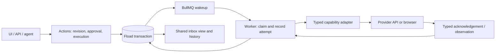

# Provider boundary: what Fload controls, and what it observes

Investigated 16 September 2026 against remote-main baseline `63275b2f51ac5b5a151a9a6683c813423e682785`. The feature worktree remains on that commit; another local checkout is not the remote baseline. This is a bounded architecture review, not a schema change, implementation, deployment or new provider capability.

**Recommendation: keep one Actions execution protocol and put provider-specific behavior behind small, typed capability adapters.** Fload owns authorization, durable intent, scheduling and evidence retention. A provider owns whether a request takes effect, what is currently visible and whether an ad is serving. An adapter reports evidence; it never declares an inbox ticket approved or complete by itself.

## Draw the boundary here

The commit before provider I/O is the last point at which Fload can atomically guarantee what it is about to attempt. The acknowledgement and subsequent observations are separate facts after that boundary. Browser automation crosses exactly the same boundary as an official API.

| Fact or outcome | Who controls it? | Honest guarantee |
| --- | --- | --- |
| Permanent identity, parent/child links, frozen batch membership | Fload | Keep the same object and retain its relationships |
| Exact approved revision, actor, permission/policy, Undo deadline | Fload | Authorize only those bytes; atomically reject stale or conflicting commands |
| Accepted command and next due execution | Fload | Persist immediately; reconstruct wakeups if BullMQ delivery is lost |
| Which physical request may start next | Fload | One claimed attempt; current authorization; canonical resource exclusion; no blind retry after uncertainty |
| Generated revision, review analysis or agent-run result | Fload's application domain | Reference the concrete persisted output and prove ownership/completion; an external LLM or storage service can still fail before that commit |
| Provider accepted the request | Provider, recorded by Fload | Retain the exact acknowledgement; do not infer final publication |
| Remote setting/listing/reply currently matches | Provider, observed by Fload | Report which revision, resource, surface and time were checked |
| App review accepted, public release completed, campaign serving | Provider and sometimes an external human | Observe and explain; Fload cannot manufacture these transitions |
| Increased installs, revenue or conversion | External behavior plus measurement | Measure separately from delivery; a successfully applied change is not proof of business impact |

“Fload owns the state” means it owns the record and interpretation of evidence. It does not mean it owns the external fact that the record describes.

## What exists today

| Boundary | Current source evidence | Consequence |
| --- | --- | --- |
| Actions persistence | Core defines a repository and `PendingActionUnitOfWork`; API supplies the database implementation. [Core ports](https://github.com/fload-ai/fload-platform/blob/63275b2f51ac5b5a151a9a6683c813423e682785/packages/core/src/actions/pending-action-repository.ts#L48) | Extend this separation. Core decides state transitions; database adapters make them atomic |
| Work definitions/readback | `WorkDefinition` declares parsing and optional `verifyApplied`; implementation stays in the API app. Current capability/evidence names still include open strings and the generic parameter defaults to `unknown`. [Definition](https://github.com/fload-ai/fload-platform/blob/63275b2f51ac5b5a151a9a6683c813423e682785/packages/core/src/inbox-work/index.ts#L157) | Preserve the port concept, replace open behavioral selectors with a closed typed map. Merely adding more optional properties does not create a strict boundary |
| Apple Search Ads provider package | `@packages/apple/apple-ads-api` is behind a Fload gateway, credential adapter and reporting adapter. A repository test restricts provider imports to four adapter files. [Gateway](https://github.com/fload-ai/fload-platform/blob/63275b2f51ac5b5a151a9a6683c813423e682785/apps/api/src/services/apple-search-ads/apple-api-gateway.ts#L1), [boundary test](https://github.com/fload-ai/fload-platform/blob/63275b2f51ac5b5a151a9a6683c813423e682785/apps/api/src/__tests__/unit/apple-search-ads-package-boundaries.test.ts#L12) | Useful existing foundation. A provider SDK change should be absorbed here, not throughout Actions and the UI |
| ASA write/read separation | `AsaWriteClient` contains only the seven sanctioned mutation methods; `AsaReadClient` contains only query methods. [Narrow surfaces](https://github.com/fload-ai/fload-platform/blob/63275b2f51ac5b5a151a9a6683c813423e682785/apps/api/src/services/work-execution/guarded-asa-gateway.ts#L73) | Keep readback unable to call publication methods. Do not expose the full native SDK to an execution handler |
| ASA current execution semantics | Platform writes run synchronously in the API process; the guarded path records a thrown transport call as failed. The executor subsequently returns its receipt to the approval flow. [Executor](https://github.com/fload-ai/fload-platform/blob/63275b2f51ac5b5a151a9a6683c813423e682785/apps/api/src/services/work-execution/platform-executor.ts#L52), [guard](https://github.com/fload-ai/fload-platform/blob/63275b2f51ac5b5a151a9a6683c813423e682785/apps/api/src/services/work-execution/guarded-write.ts#L449) | The new durable protocol is still needed. Low latency does not eliminate the provider-success/database-failure window; a thrown timeout is not proof of non-application |
| ASC listing transport | One transport handles app-info and version-localization resources, official API writes and fallback classification. Its outcome can include `liveApplied` alongside a later fallback/error. [Transport](https://github.com/fload-ai/fload-platform/blob/63275b2f51ac5b5a151a9a6683c813423e682785/apps/api/src/connectors/app-store-connect/aso-write-transport.ts#L15) | Keep target/version and partial-effect knowledge in the adapter's typed plan. Do not flatten this into a universal `success: boolean` |
| Play SDK/browser package | `@packages/google` provides separate developer-API, Console and public-store modules. Console listing helpers contain edit creation, listing changes and commit; retries/fallback live below their callers. [Console client](https://github.com/fload-ai/fload-platform/blob/63275b2f51ac5b5a151a9a6683c813423e682785/packages/google/src/play-console-web/client.ts#L835) | A durable adapter must expose each consequential request, not hide an entire multi-request workflow in `apply()` |
| Meta current integration | OAuth requests `ads_read` and `business_management`. The client has campaign-status and daily-budget write methods, but a repository search found no callers of those methods, and the current Actions registry has no Meta write capability. [OAuth](https://github.com/fload-ai/fload-platform/blob/63275b2f51ac5b5a151a9a6683c813423e682785/apps/api/src/connectors/meta-ads/client.ts#L93), [unused native writes](https://github.com/fload-ai/fload-platform/blob/63275b2f51ac5b5a151a9a6683c813423e682785/apps/api/src/connectors/meta-ads/client.ts#L698) | **Connected/readable does not mean writable through Actions.** Do not advertise these methods as supported inbox actions or assume existing credentials authorize them |

Meta is also less isolated than Apple today: its client imports API application configuration, its private POST helper accepts an open parameter map and casts the response, and its mutation methods discard the returned body. These are concrete adapter-hardening tasks if a Meta write capability is introduced; they are not reasons to pretend Meta writes already exist.

## Provider differences that must remain explicit

**Apple Ads:** the provider separates a user-controlled campaign `status` (`ENABLED`/`PAUSED`) from read-only `servingStatus`, display status and serving reasons. Therefore a verified enable operation can mean “the configured status is enabled,” while the campaign still cannot serve. The current Fload ASA verifier compares the configured status; it should not relabel that as proof of serving or spend. [Apple Campaign contract](https://developer.apple.com/documentation/apple_ads/campaign), [current verifier](https://github.com/fload-ai/fload-platform/blob/63275b2f51ac5b5a151a9a6683c813423e682785/apps/api/src/services/inbox-work/asa-applied-readback.ts#L377).

**Meta:** the official SDK exposes separate configured and effective campaign status enums; effective status additionally includes processing/issues states. The common domain may share an intent such as “pause campaign,” but its adapter must retain Meta's configured/effective distinction. Do not copy Apple's status enum or currency representation into a Meta request. The direct Meta documentation endpoint was rate-limited during this review, so the verified official SDK is the primary reference here. [Meta-maintained campaign SDK](https://github.com/facebook/facebook-python-business-sdk/blob/main/facebook_business/adobjects/campaign.py).

**Store publishing:** a saved draft, a committed Play edit, a release waiting for review and public live content are separate facts. Play explicitly documents edit lifetime/conflicts and commit behavior when changes are already in review; the draft requires `ERROR_IF_IN_REVIEW` rather than silently accepting the provider's cancellation default. Those are adapter-specific semantics, not new global inbox lifecycle states for every provider. [Play edit workflow](https://developers.google.com/android-publisher/edits), [commit contract](https://developers.google.com/android-publisher/api-ref/rest/v3/edits/commit).

**A method named “read” can still have provider effects.** Current `getStoreListingMetadata` creates an edit, reads within it and deletes it; `getDefaultLanguage` also creates an edit. The adapter must declare these provider-session effects and coordinate them with the same canonical app exclusion rules. A readback must not silently create a competing edit merely because it was given a TypeScript interface containing only methods named `get...`. Prefer an existing owned edit or an actually non-mutating observation surface when the contract supports it. [Listing read helper](https://github.com/fload-ai/fload-platform/blob/63275b2f51ac5b5a151a9a6683c813423e682785/packages/google/src/play-console-web/client.ts#L9081), [default-language helper](https://github.com/fload-ai/fload-platform/blob/63275b2f51ac5b5a151a9a6683c813423e682785/packages/google/src/play-console-web/client.ts#L9447).

## The stable typed capability port

The port should be a **closed compile-time map**, implemented by small capability-specific adapters. Each supported key names its exact request, target, intermediate outputs and observation types. There is no `execute(provider, operation: string, params: object)` escape hatch, arbitrary URL, field-name map or persisted JSON payload.

| Boundary operation | Receives | Returns; authority stays outside the adapter |
| --- | --- | --- |
| `plan` | Proposed revision and exact target facts before approval | Freeze material target/content/effect scope and semantics version for review. After approval, only mechanical expansion of that frozen plan is allowed; no unseen targets or content |
| `sendOnce` | One persisted step, its typed prior result, and a grant for the current attempt | Exact typed acknowledgement, definitive rejection/non-dispatch, or uncertainty. It does not retry, switch transports, mark the ticket complete or update workflow state |
| `observe` | Exact step/attempt subject and authorized observation scope | Typed provider facts, target identity, surface, timestamp and completeness. It does not manufacture missing fields or absence from a partial page |
| `compare` | Approved typed content plus typed observed facts | Pure, versioned comparison: matched, differs, or unverifiable; exact field/target interpretation belongs to the capability |

Native HTTP/browser code belongs under the provider adapter. Credential resolution, account membership, quota/admission and business target binding belong in Fload's application adapter around it. Actions retains command/approval checks, claim fencing, due scheduling, Undo, receipt persistence, uncertainty and retry eligibility. BullMQ retains transport and capacity scheduling. A provider package imports neither the inbox database nor its workflow state machine.

The capability's native step plan may differ: ASA can need one campaign-setting request; Play listing publication needs an edit sequence; App Clip upload needs reservation, byte chunks and commit. One execution protocol handles all three without asserting they have one native transaction.

The current candidate SQL intentionally names current provider step/transport variants and concrete facts. It proves integrity for today's capabilities; it is not yet proof that every provider has been abstracted away. Keep those closed checks in capability-owned schema/adapter modules composed into the application. Do not scatter new provider branches through the shared transition engine. No SQL refactor was made in this review.

## Adding a provider: bounded change, not zero change

For a first Meta campaign-pause capability, the required changes should be:

1. Add one explicit capability and target/content contract, with supported account/campaign scope and exact permission/readiness checks. Current read OAuth is insufficient evidence of write readiness.
2. Add a Meta adapter for the one mutation, strict response/error decoding, configured/effective readback and the documented recovery behavior. No queue-level retry can resend an ambiguous mutation.
3. Register its typed native step, observation comparator, transport/admission path and canonical resource scope. Reuse existing BullMQ lanes where their capacity/isolation semantics fit; a provider name alone does not require another queue.
4. Extend the closed database/wire variants and add only the concrete relational facts the capability truly needs. Reuse an ads-domain fact only when its semantics match; do not stuff ad-set IDs into ASA keyword columns or create an open “provider payload.”
5. Add adapter contract fixtures and run the shared reliability tests: stale approval, double delivery, lost acknowledgement, crash after write, partial/unknown readback, outside-provider edits and unsupported credentials. Add import/write-boundary enforcement for the new writer.

**The action identity, revision/approval history, command idempotency, parent/batch rules, claim protocol, Undo semantics, pagination/counts and core UI lifecycle should not need a redesign.** A new provider does not automatically need new action, approval, job or history tables.

Closed typing means a new capability intentionally changes its registry/union and sometimes a migration. That small, reviewable change is the point. “No code or schema changes to add any provider” would require precisely the open behavior/configuration model the user rejected.

A different API version or browser fallback for an existing capability is usually an adapter and version-policy change. A genuinely new domain—such as ad-set targeting rather than campaign status—deserves explicit domain modeling. Neither case should create a second inbox execution engine.

## Recommendation to take into implementation

Keep the shared lifecycle small and stable. Treat “approved,” “request acknowledged,” “configured state verified,” “publicly live,” and “business impact measured” as distinct claims with distinct evidence. Make adapters narrow enough that the caller cannot bypass authorization or hide extra writes, and make their observations rich enough that Core does not have to learn every provider's status vocabulary. Retain uncertainty whenever external evidence is insufficient.

No source code, schema or public artifact was changed or published in this follow-up; only this review document was added.
