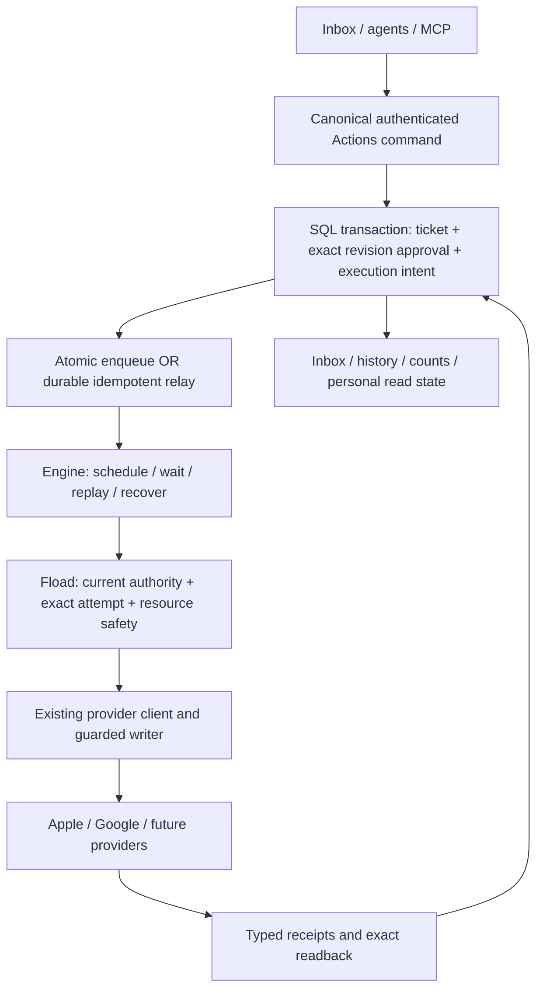

# Durable workflow engines for Fload

Research checked **21 September 2026** for FLO-1355. Baseline: `d84893a6326286131f392f4a60d19706b46355cd`. This is an architecture assessment from current Fload code, official documentation and upstream source. **No comparative engine benchmark or DBOS implementation has run.**

## Recommendation

Evaluate **DBOS first, with Restate and Temporal as serious alternatives**. DBOS has a particularly useful fit with our existing PostgreSQL acceptance transaction. Restate deserves consideration for entity coordination. Temporal deserves consideration for its deployment, history and testing facilities. These are engineering judgments about Fload's integration costs, not measured reliability or throughput rankings.

The separate `codex/flo-1355-dbos` branch starts at the baseline above. It preserves the current implementation. The official DBOS TypeScript skill is installed for guidance; no engine package or schema has been installed. Continue with a replacement prototype once the pending engine-storage policy is resolved. Do not build three production integrations to make this decision.

There was no documented DBOS evaluation in the inspected implementation and dependency records. Our custom code includes genuine workflow-runtime responsibilities; product-specific approvals do not justify owning all that infrastructure ourselves.

## The ownership boundary



The engine's operational status is not the ticket lifecycle. A sleeping workflow can correspond to approved work awaiting a release; a completed workflow can leave a ticket uncertain and needing investigation. Neither implies provider success.

| Owner                  | Responsibilities                                                                                                                                                                                                       |
| ---------------------- | ---------------------------------------------------------------------------------------------------------------------------------------------------------------------------------------------------------------------- |
| Fload Actions          | Permanent ticket identity, shared lifecycle, immutable revisions, approval actor/pins, command replay receipts, Undo deadline, stable parent/child membership, personal read state, pagination and count predicates.   |
| Domain/provider owners | Exact native targets and fields, current permissions, existing credentials/transports, one unresolved writer per actual provider resource, immutable attempts/captures, readback and rules for another physical write. |
| Workflow engine        | Durable execution progress, scheduling, waits, safe retry dispatch, worker recovery, execution observability and supported deployment/version mechanics.                                                               |
| Integration boundary   | Transactional delivery into the engine, typed IDs/results, worker lifecycle, version routing, and migration from the old runtime.                                                                                      |

Core stays provider-neutral. Engine checkpoints must not become an alternate content store, approval authority, credential cache or inbox database. Keep the existing review/ASO/Ads clients and unrelated BullMQ jobs.

## Comparison

| Candidate                          | Why it fits                                                                                                      | Principal cost or qualification                                                                                                                                        | Assessment for Fload                                                                        |
| ---------------------------------- | ---------------------------------------------------------------------------------------------------------------- | ---------------------------------------------------------------------------------------------------------------------------------------------------------------------- | ------------------------------------------------------------------------------------------- |
| **DBOS**                           | TypeScript orchestration backed by PostgreSQL; documented transactional enqueue can join application acceptance. | Prove actual driver integration, recovery across replacement replicas, waiting-work capacity and old-version execution. Optional self-hosted Conductor is proprietary. | First prototype: potentially the least integration machinery.                               |
| **Restate**                        | Durable services/workflows and exclusive Virtual Object handlers keyed by an entity.                             | Separate durable store, SQL-to-engine handoff, deployment retention and stateful operations. Server uses BSL.                                                          | Strong alternative where app/entity coordination dominates.                                 |
| **Temporal**                       | Durable workflows/activities, messages, worker versioning, replay and time-skipping tests.                       | Separate coordinator, SQL handoff and replay-compatible code/old-worker management.                                                                                    | Strong alternative when operating and evolving long-lived workflows is the priority.        |
| **Hatchet**                        | PostgreSQL-backed engine, durable tasks, waits and worker eviction; MIT repository.                              | SQL handoff, deterministic orchestration and draining incompatible task versions still required.                                                                       | Worth a focused fallback assessment if the first shortlist fails its gates.                 |
| **Inngest**                        | Event-oriented steps, waits and concurrency without keeping sleeping application workers busy.                   | Event-registration races, step-based versioning, SQL handoff and managed usage costs. Server license differs from SDK assumptions.                                     | Credible managed event option, less direct fit to our SQL acceptance boundary.              |
| **Trigger.dev**                    | Managed task compute, isolation and Cloud checkpoints; versioned runs.                                           | Current self-host feature matrix excludes checkpoints. Native HTTP effects can still repeat within a retried task.                                                     | Cloud may suit compute-heavy jobs; self-hosted is not the first fit for long release waits. |
| **Current SQL + BullMQ Pro/Redis** | Already installed; custom obligations remain discoverable through SQL.                                           | We maintain the state machine, due scans, recovery traversal, claims and SQL-to-Redis coordination.                                                                    | Baseline to beat, not automatically the cheapest because code exists.                       |

Primary sources: [DBOS queues](https://docs.dbos.dev/typescript/tutorials/queue-tutorial), [Restate service types](https://docs.restate.dev/concepts/services/), [Temporal versioning](https://docs.temporal.io/production-deployment/worker-deployments/worker-versioning), [Hatchet guarantees](https://docs.hatchet.run/v1/architecture-and-guarantees), [Inngest execution](https://www.inngest.com/docs/learn/how-functions-are-executed), [Trigger self-host feature matrix](https://trigger.dev/docs/self-hosting/overview), [BullMQ idempotency](https://docs.bullmq.io/patterns/idempotent-jobs).

## The failure none of them eliminates

```text
1. Fload retains the original attempt.
2. Apple accepts the exact POST/PATCH.
3. Worker dies before retaining the response or checkpoint.
4. Engine retries the unfinished operation.
5. Fload finds the issued attempt: uncertain → exact readback, no blind resend.
```

DBOS steps, Restate external operations, Temporal activities and Hatchet ordinary tasks can repeat across this gap. Inngest step persistence and Trigger task/run idempotency do not make Apple's HTTP server part of their commit. Disabling configured retries alone does not prove nonapplication. [DBOS guarantees](https://docs.dbos.dev/typescript/tutorials/workflow-tutorial), [Restate SDK failure boundary](https://github.com/restatedev/sdk-typescript/blob/734ab9cea65fe0efec7bc507c22f7ec8980bf737/packages/libs/restate-sdk/src/context.ts#L371-L387), [Temporal activities](https://docs.temporal.io/activity-definition), [Hatchet guarantees](https://docs.hatchet.run/v1/architecture-and-guarantees), [Inngest error handling](https://www.inngest.com/docs/guides/error-handling), [Trigger retries](https://trigger.dev/docs/errors-retrying).

Use the provider's idempotency mechanism where its contract supports it. Otherwise retain the existing attempt/evidence owner. A replay after SQL capture returns that capture; a replay before trustworthy capture enters uncertainty. Readback establishes only what its evidence supports: matching current content does not automatically establish which request caused it. An expired engine lease or cancellation must not authorize a second physical sender while an old request may still be executing.

Likewise, a journaled `authorized: true` from last week is not current permission. Revalidate current authority inside the live send boundary. Engine admin replay, fork, cancel and resume must pass the same domain checks.

## Commit approval and make execution inevitable

### DBOS: a promising same-database seam

The inspected release is SDK **5.0.2**, npm gitHead `1cf44a1dacc359316f75898ae7ed7a65302f4919`. The official Drizzle datasource and `DBOSClient.enqueueInTransaction` use **node-postgres**. Fload's Drizzle connection uses **Postgres.js**. They are not interchangeable transaction objects. [Pinned datasource](https://github.com/dbos-inc/dbos-transact-ts/blob/1cf44a1dacc359316f75898ae7ed7a65302f4919/packages/drizzle-datasource/index.ts), [client contract](https://docs.dbos.dev/typescript/reference/client).

DBOS also exposes the supported SQL function `dbos.enqueue_workflow`. A parameterized call through the existing Drizzle transaction is the narrowest seam to investigate: approval and workflow insertion share one commit when both schemas use the same database. Keep Fload's command-content digest checks; workflow-ID collision does not compare approval semantics. This calls a vendor API, not direct edits to engine tables. The repository's general no-raw-SQL convention means any such adapter must be explicitly documented as an infrastructure exception; do not silently swap drivers or fake `pg.ClientBase`. [SQL interface and queues](https://docs.dbos.dev/typescript/tutorials/queue-tutorial), [pinned implementation](https://github.com/dbos-inc/dbos-transact-ts/blob/1cf44a1dacc359316f75898ae7ed7a65302f4919/src/sysdb_migrations/internal/migrations.ts#L978).

Ordinary Fload transactions inside a DBOS step remain domain-idempotent operations; they do not acquire DBOS's atomic transaction-checkpoint guarantee merely by being called there. The API should enqueue only; runtime launch belongs in the worker. Engine schema migrations must be an explicit deployment step with the required privileges, preserving Fload’s rule that API startup performs no DDL.

### Separate engines: a small delivery relay remains

Restate and Temporal have a separate coordinator. The triggering APIs inspected for Hatchet, Inngest and Trigger did not expose an equivalent caller-owned Fload transaction. That is a documentation finding, not proof that no other integration exists. A successful SQL commit followed by one best-effort trigger has a crash gap; triggering before commit can execute rolled-back approval. [Restate/database integration](https://docs.restate.dev/guides/databases), [Temporal service](https://docs.temporal.io/self-hosted-guide), [Hatchet architecture](https://docs.hatchet.run/v1/architecture-and-guarantees), [Inngest submission](https://www.inngest.com/docs/getting-started/nodejs-quick-start), [Trigger execution](https://trigger.dev/docs/how-it-works).

Our proposed integration uses the existing committed execution intent as a discoverable, idempotently delivered obligation. That may avoid adding an outbox table. Retain a bounded relay until engine acceptance is durable; remove the full custom scheduler once the engine owns progression. Engine idempotency/history retention is not a substitute for permanent SQL command receipts.

## Waits, concurrency and deployments

| Engine      | Important behavior to test                                                                                                                                                                                                                                                                                                                    |
| ----------- | --------------------------------------------------------------------------------------------------------------------------------------------------------------------------------------------------------------------------------------------------------------------------------------------------------------------------------------------- |
| DBOS        | In pinned 5.0.2 source, sleeping workflows remain `PENDING` and count toward workflow concurrency. They release the DB connection but await in-process timers. Compare a waiting coordinator with short delayed executions so months-long waits cannot fill a provider queue. Pin recipe/application versions and retain executable old work. |
| Restate     | Durable timers/signals and Virtual Objects provide useful coordination. A long wait in an exclusive handler blocks other exclusive handlers for that key. In-flight invocations are deployment-pinned; object-state compatibility persists across deployments.                                                                                |
| Temporal    | Durable waits do not occupy an executing activity. Worker versioning supports pinning and compatible upgrades; Continue-As-New bounds history while keeping workflow identity. Old approvals remain Fload records independent of run IDs.                                                                                                     |
| Hatchet     | Durable-task eviction releases waiting worker capacity. Configure timeouts for the full wait. The current migration guide has no Temporal-style patch/version branch equivalent: use a new definition and drain old work for breaking changes.                                                                                                |
| Inngest     | Sleeping runs release concurrency. Event waits can miss events emitted before registration; SQL facts and a tested registration/recheck path must close the race. Stable step identifiers and explicit function versions matter during changes.                                                                                               |
| Trigger.dev | Cloud checkpoints release compute/concurrency while waiting. Started runs are version-pinned, but delayed starts and dashboard replay can use newer code; approval semantics need an explicit operation version.                                                                                                                              |

Sources: [DBOS sleep](https://github.com/dbos-inc/dbos-transact-ts/blob/1cf44a1dacc359316f75898ae7ed7a65302f4919/src/system_database.ts#L2871), [DBOS admission](https://github.com/dbos-inc/dbos-transact-ts/blob/1cf44a1dacc359316f75898ae7ed7a65302f4919/src/system_database.ts#L3659), [DBOS upgrades](https://docs.dbos.dev/typescript/tutorials/upgrading-workflows), [Restate timers](https://docs.restate.dev/develop/ts/durable-timers), [Restate versioning](https://docs.restate.dev/services/versioning), [Temporal Continue-As-New](https://docs.temporal.io/develop/typescript/workflows/continue-as-new), [Hatchet eviction](https://docs.hatchet.run/v1/task-eviction), [Hatchet versioning comparison](https://docs.hatchet.run/v1/from-temporal-to-hatchet), [Inngest event waits](https://www.inngest.com/docs/features/inngest-functions/steps-workflows/wait-for-event), [Inngest versioning](https://www.inngest.com/docs/learn/versioning), [Trigger versioning](https://trigger.dev/docs/versioning).

A queue key is not automatically our resource guard. For the current ASC integration, the conflict boundary is the actual provider application, potentially shared across organizations. Other providers must define their own resource boundary. An exclusive object only coordinates participating callers; an unresolved effect must still block later unsafe writes after the handler returns. Existing writers and external human edits remain part of the integration problem.

## Operations, storage and cost

| Engine      | Deployment/license facts checked                                                                                                                                                                                                                                                           | Cost drivers to measure                                                                                                                  |
| ----------- | ------------------------------------------------------------------------------------------------------------------------------------------------------------------------------------------------------------------------------------------------------------------------------------------ | ---------------------------------------------------------------------------------------------------------------------------------------- |
| DBOS        | SDK MIT. SDK-only restart recovery is executor/application/version scoped; arbitrary replacement replicas need a supported recovery arrangement. Optional self-hosted Conductor/Console require proprietary licensing. Production connection/pooling and migration privileges need review. | PostgreSQL writes, retention and connections, worker memory during waits, supported recovery management and any managed service charges. |
| Restate     | TS SDK MIT; server BSL 1.1, with a grant for licensee-written workflows and Apache conversion after four years. Own durable store/log, replication and backups. Current docs flag multi-node restore limitations.                                                                          | Stateful coordinator/storage, replicas, backup/restore work, retained deployments; managed option separately.                            |
| Temporal    | Server and TS SDK MIT. Self-hosted coordinator needs persistence, upgrades, security and monitoring; Kubernetes and Elasticsearch are not universally required. Cloud still leaves Fload owning workers.                                                                                   | Coordinator or Cloud consumption, workers, history storage, retention and version overlap.                                               |
| Hatchet     | MIT repository. Engine/API/dashboard, PostgreSQL and workers; PostgreSQL broker supported, RabbitMQ optional.                                                                                                                                                                              | Self-hosted capacity/operations or Cloud task-run usage plus our worker compute.                                                         |
| Inngest     | Current server license is SSPL-1.0 with an Apache grant three years after the software version is made available. Scalable self-hosting uses Redis/PostgreSQL plus app workers; simple mode differs.                                                                                       | Cloud function runs plus steps and plan dimensions; application compute remains ours.                                                    |
| Trigger.dev | Apache-2.0 repository. Self-hosted control plane, Postgres/Redis and supervisors/runners. Current self-hosting lacks Cloud checkpoints.                                                                                                                                                    | Cloud run invocations plus active compute by machine; self-hosted platform operations otherwise.                                         |

Sources: [DBOS license](https://github.com/dbos-inc/dbos-transact-ts/blob/1cf44a1dacc359316f75898ae7ed7a65302f4919/LICENSE), [DBOS recovery](https://docs.dbos.dev/production/workflow-recovery), [Conductor hosting/license](https://docs.dbos.dev/production/hosting-conductor), [DBOS production checklist](https://docs.dbos.dev/production/checklist), [Restate license](https://github.com/restatedev/restate/blob/1f6d9c63dba12cc1cc9fcaae05e3495d2c924124/LICENSE), [Restate backups](https://docs.restate.dev/server/snapshots), [Temporal server license](https://github.com/temporalio/temporal/blob/main/LICENSE), [Temporal SDK license](https://github.com/temporalio/sdk-typescript/blob/main/LICENSE), [Temporal hosting](https://docs.temporal.io/self-hosted-guide/deployment), [Hatchet license](https://github.com/hatchet-dev/hatchet/blob/main/LICENSE), [Hatchet hosting](https://docs.hatchet.run/self-hosting/docker-compose), [Hatchet pricing](https://hatchet.run/pricing), [Inngest license](https://github.com/inngest/inngest/blob/main/LICENSE.md), [Inngest hosting](https://www.inngest.com/docs/self-hosting), [Inngest pricing](https://www.inngest.com/pricing), [Trigger license](https://github.com/triggerdotdev/trigger.dev/blob/main/LICENSE), [Trigger hosting](https://trigger.dev/docs/self-hosting/docker), [Trigger pricing](https://trigger.dev/pricing).

No monthly price or throughput estimate is justified yet. Measure accepted executions, steps/attempts per execution, peak arrivals, active compute, wait population, readback frequency and history retention. Include on-call and upgrade work; no additional license invoice does not mean no operating cost.

**Pending policy decision:** the user requires strict, closed Fload schemas. Stock DBOS stores serialized payloads and JSONB attributes internally. Other engines likewise journal generic inputs/results. A custom serializer or JSON hidden in TEXT does not make these normalized domain records. Approval is pending for engine-owned internal storage while Fload schemas remain strict. Do not silently relax that requirement or fork the engine storage to recreate our own engine. [DBOS actual schema](https://github.com/dbos-inc/dbos-transact-ts/blob/1cf44a1dacc359316f75898ae7ed7a65302f4919/src/sysdb_migrations/internal/migrations.ts#L674), [Restate serialization](https://docs.restate.dev/develop/ts/serialization), [Temporal payload codecs](https://docs.temporal.io/production-deployment/data-encryption).

## What a successful replacement removes

Current baseline source under `apps/api/src/services/actions/`:

| File                    | Lines at baseline | Replacement candidate                                                     |
| ----------------------- | ----------------: | ------------------------------------------------------------------------- |
| `execution-worker.ts`   |               155 | Actions-specific hints, local capacity and dispatch lifecycle.            |
| `recovery-worker.ts`    |               176 | Periodic Actions traversal and singleton sweep lifecycle.                 |
| `recovery-position.ts`  |               146 | Durable traversal position coordination.                                  |
| `recovery-scan.ts`      |               326 | Routine due/expired-work scanning replaced by engine ownership.           |
| `recovery-traversal.ts` |               318 | Sweep paging/fairness machinery for execution recovery.                   |
| **Candidate subset**    |         **1,121** | Not all automatically deletable; adapters and operational setup add code. |

Split mixed files such as `execution-delivery.ts`: scheduling can move; uncertainty interpretation, exact attempt correspondence and physical safety must remain with their owner. Claim generations currently participate in evidence and exclusion, so deleting them requires an explicit equivalent contract and migration. Do not promise a table-count reduction before establishing this mapping.

Keep ticket/revision/approval/history tables, typed provider evidence, current-authority checks, the existing guarded write kernel, inbox pagination and source conservation. Remove the second lifecycle and old writers through the existing cutover work. Engine adoption does not complete that migration for us.

## Acceptance evidence required before choosing

Use the same real Fload command/provider composition with a synthetic provider, not toy email workflows or mocked checkpoint storage.

| Scenario                                                 | Required observable result                                                                            |
| -------------------------------------------------------- | ----------------------------------------------------------------------------------------------------- |
| Approval commit/rollback/lost reply                      | One canonical receipt and execution obligation; rollback causes no provider call.                     |
| Duplicate delivery or engine history expires             | Permanent command/attempt records prevent reapproval and repeat effects.                              |
| Stale approval, iteration and Undo race                  | Exact revision is checked atomically; SQL deadline remains authoritative.                             |
| Kill before/after provider acceptance and checkpoint     | No blind resend; immutable evidence is recovered or uncertainty stays visible.                        |
| Old callback remains live while another replica recovers | No unsafe second resource writer; late evidence attaches to the original attempt.                     |
| Weeks-long editable-release wait and code upgrade        | Same approval resumes with its original semantics; waits do not starve unrelated work.                |
| Revoke user/key/consent during wait                      | Current authority refuses the native write despite historical checkpoints.                            |
| Localization/review batch partial completion             | Stable parent/membership; only eligible unresolved children resume; unseen children are not approved. |
| Large backlog and hot/cold tenants                       | No unreachable tail; list/count predicates remain equal; runtime fairness is measured.                |
| Engine outage, replacement worker, backup restore        | Committed obligations recover through the supported operational arrangement.                          |
| Engine administrative retry/fork/cancel                  | Domain effect authority and evidence remain intact.                                                   |
| Migration and old/new workers overlap                    | Conserved receipts/links, one owner per obligation, no dual sending or fabricated approvals.          |

Record recovery latency, DB connections/writes, memory/storage, throughput at representative concurrency, retained deployment count, and **actual code removed**. Temporal's time-skipping test server is useful for waits; every finalist still needs real process death and SQL/provider-boundary tests. [Temporal testing](https://docs.temporal.io/develop/typescript/best-practices/testing-suite), [DBOS testing](https://docs.dbos.dev/typescript/tutorials/testing).

DBOS should advance only if the same-transaction seam, replacement-replica recovery, long-wait behavior and current provider safety all pass. If meeting those conditions requires rebuilding a failure detector or retaining the whole custom runtime, compare Restate/Temporal before further investment. This assessment is complete as research; engine selection and end-to-end migration remain open.
